# Activity Diagrams - Kho thành phẩm sản xuất

**Dự án:** Hệ thống quản lý kho thành phẩm WMS  
**Nhóm tài liệu:** 02_Process_UseCase  
**File:** Activity_Diagrams.md  
**Phiên bản:** 5.0  
**Ngày cập nhật:** 2026-07-07

---

## 1. Activity - Nhập kho tạm và xác nhận chính thức

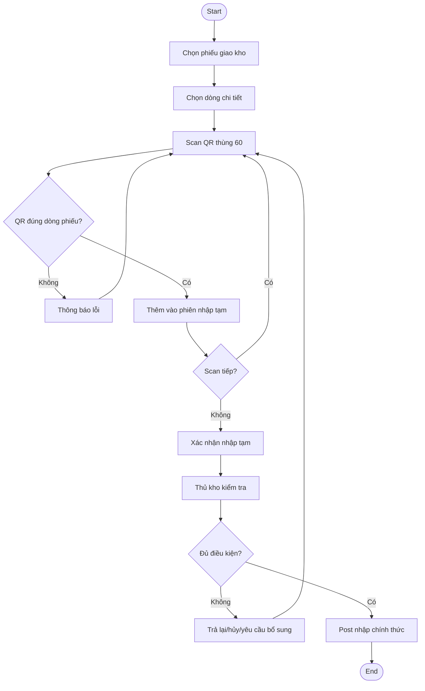

---

## 2. Activity - Gán pallet / lưu kho

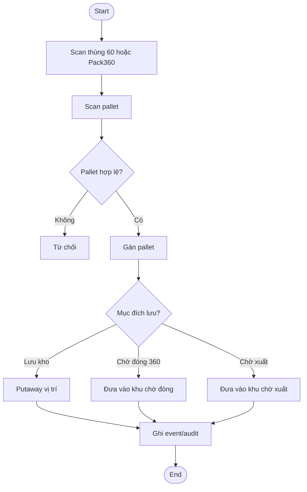

---

## 3. Activity - Đóng Pack360 hàng truyền thống

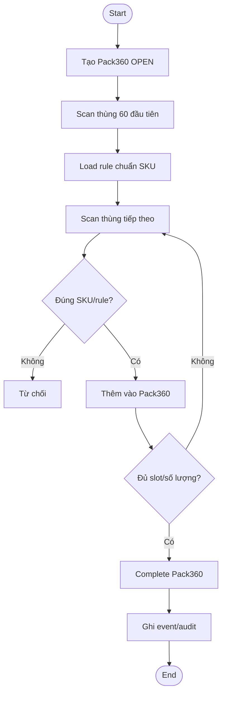

---

## 4. Activity - Đóng Pack360 hàng OEM

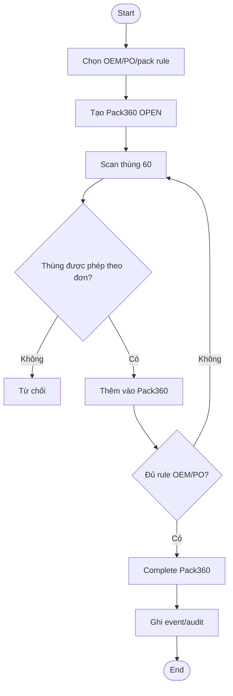

---

## 5. Activity - Giải phóng / tách Pack360

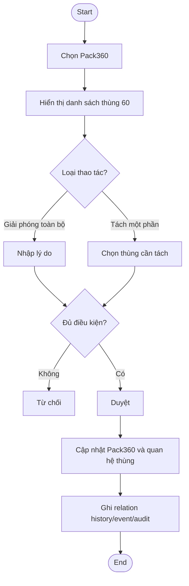

---

## 6. Activity - Chuyển đơn OEM

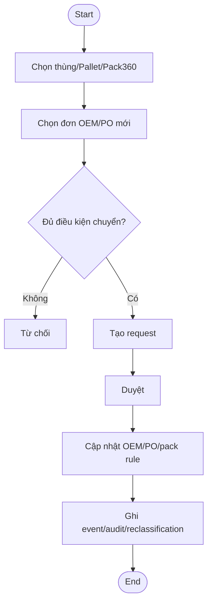

---

## 7. Activity - Khóa tồn / chuyển stock type

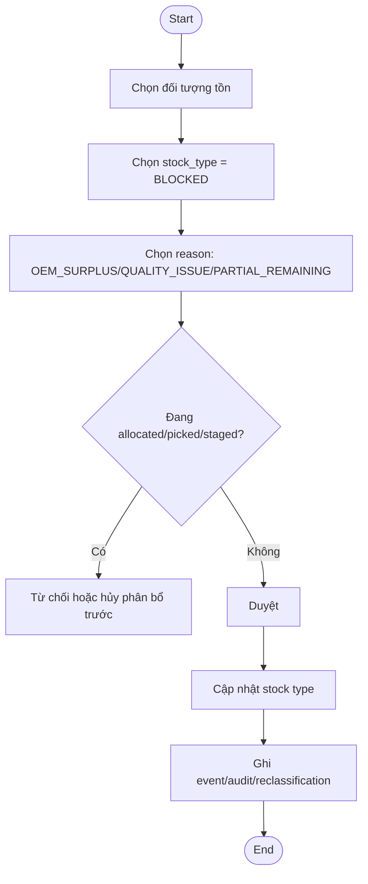

---

## 8. Activity - Release tồn bị khóa

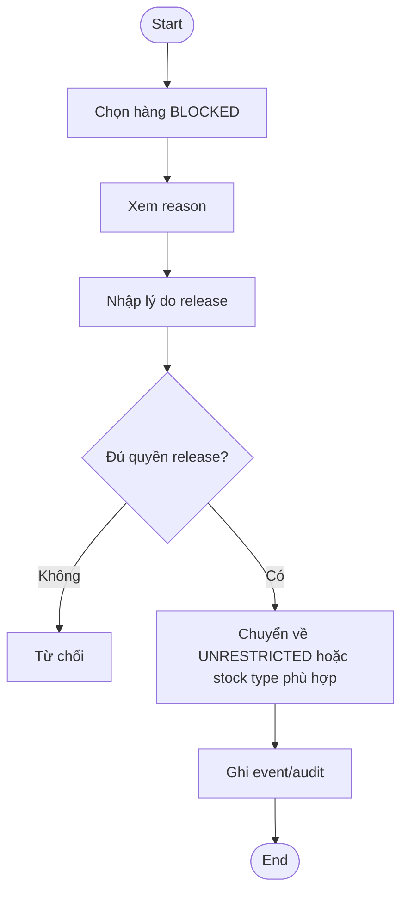

---

## 9. Activity - Xuất nguyên thùng / Pack360

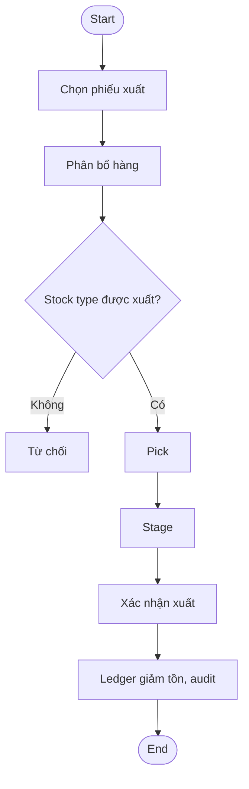

---

## 10. Activity - Xuất lẻ từ thùng 60

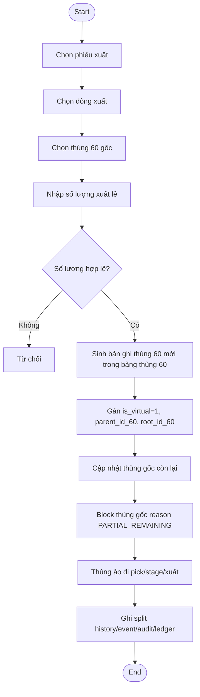

---

## 11. Activity - Xuất tạm và hoàn nhập

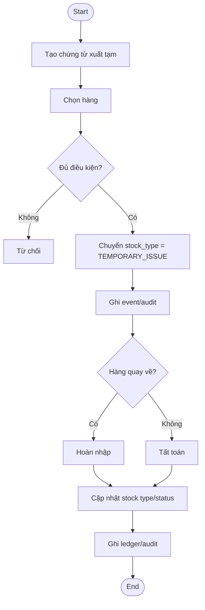

---

## 12. Activity - Xử lý ngoại lệ / adjustment / reversal

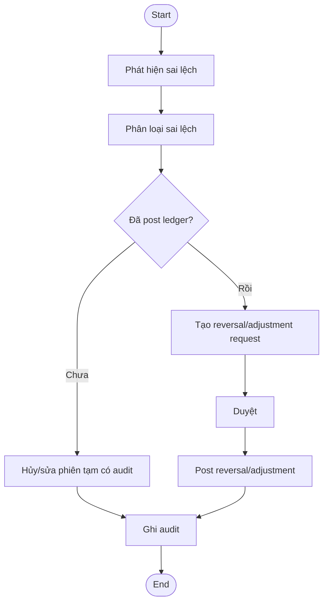
