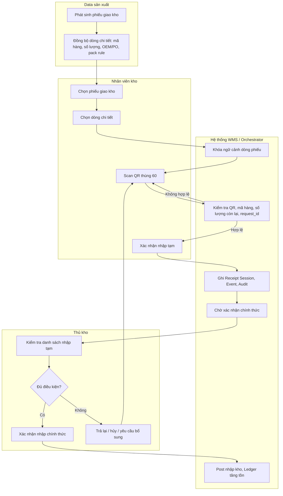
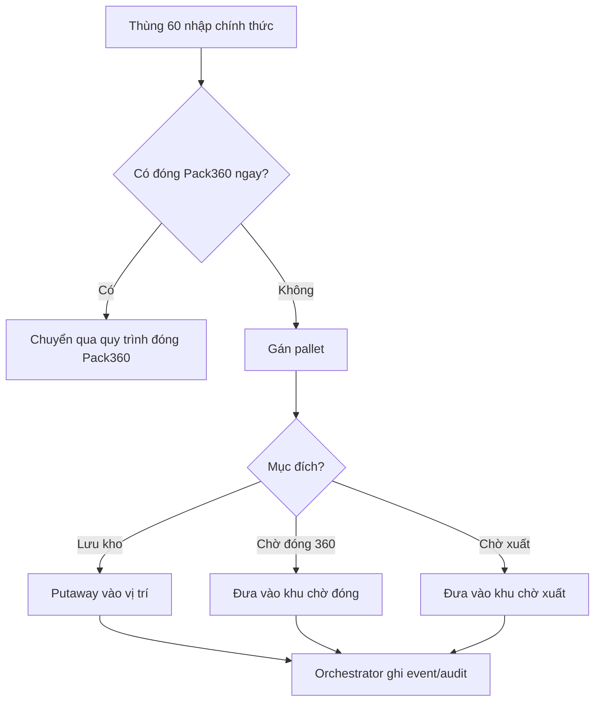
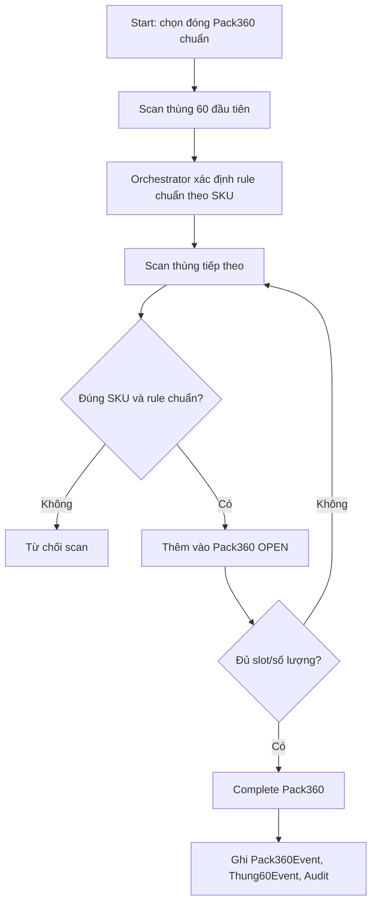
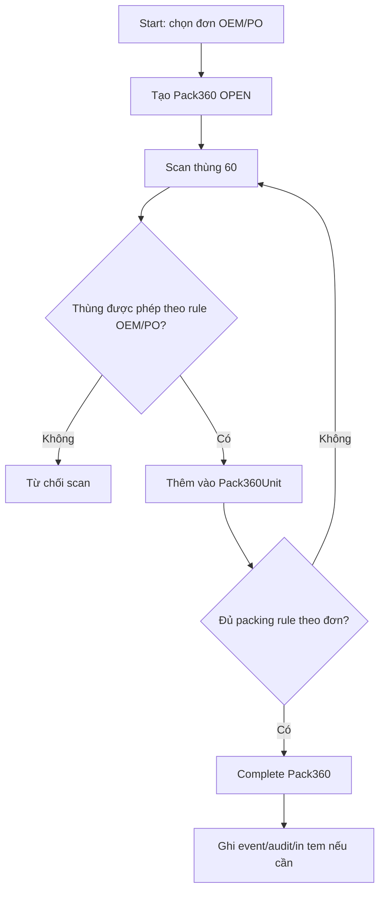
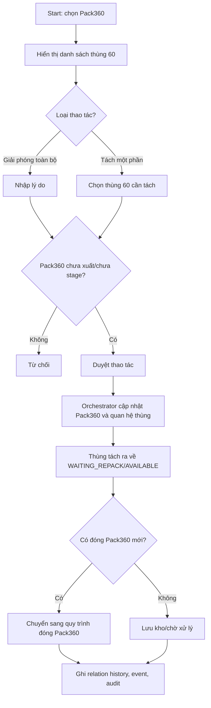
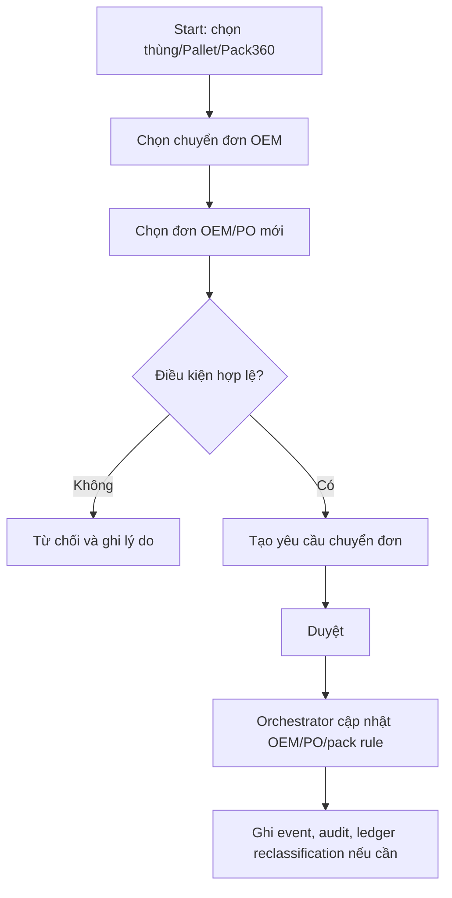
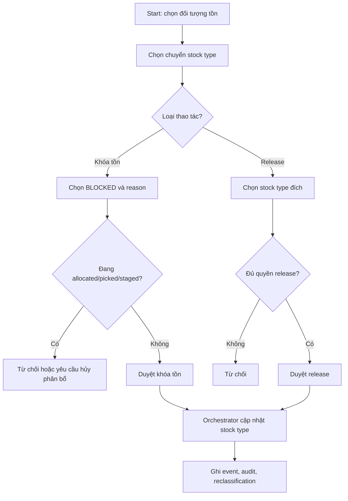
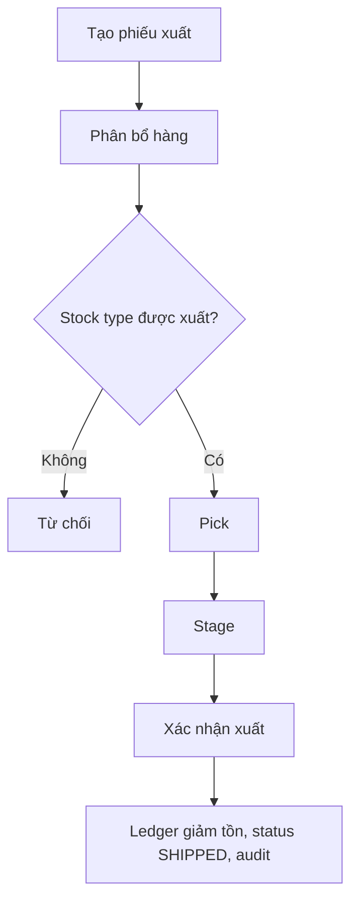
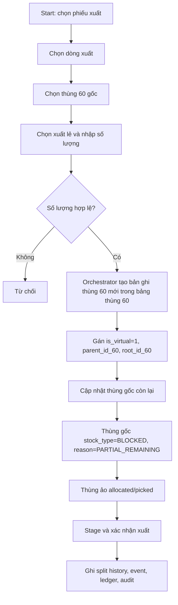
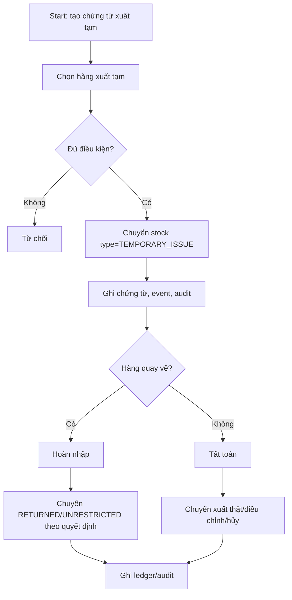

# BPMN Process - Kho thành phẩm sản xuất

**Dự án:** Hệ thống quản lý kho thành phẩm WMS  
**Nhóm tài liệu:** 02_Process_UseCase  
**File:** BPMN_Process.md  
**Phiên bản:** 5.0  
**Ngày cập nhật:** 2026-07-07

---

## 1. Mục đích

Tài liệu này mô tả các quy trình nghiệp vụ chính theo tư duy BPMN: tác nhân, sự kiện bắt đầu, hoạt động, gateway quyết định, kết quả và ngoại lệ.

Quy tắc nền:

- UI/thiết bị scan chỉ gửi command.
- Orchestrator kiểm tra rule và cập nhật dữ liệu.
- Mọi nghiệp vụ quan trọng ghi event, audit và ledger khi cần.
- Kho không làm QC đầu vào; nếu phát hiện vấn đề trong lưu kho thì chuyển `stock_type = BLOCKED`.

---

## 2. Lane nghiệp vụ

| Lane | Vai trò |
|---|---|
| Data sản xuất | Cung cấp phiếu giao kho và dòng chi tiết. |
| Nhân viên kho | Scan, nhập tạm, pallet, Pack360, pick, stage. |
| Thủ kho / Quản lý kho | Xác nhận nhập chính thức, duyệt chuyển đơn, duyệt stock type, duyệt xuất, xử lý sai lệch. |
| Hệ thống WMS / Orchestrator | Kiểm tra rule, cập nhật current state, event, ledger, audit. |
| ERP/Kế toán | Đối chiếu chứng từ và tồn chính thức. |
| Vận chuyển / Khách hàng | Nhận hàng ở stage/xuất. |

---

## 3. BPMN - Nhập kho tạm và nhập kho chính thức

### 3.1. Sự kiện bắt đầu

Có phiếu giao kho từ sản xuất đã được đồng bộ vào WMS.

### 3.2. Sơ đồ BPMN dạng Mermaid

### 3.3. Gateway chính

| Gateway | Điều kiện |
|---|---|
| QR hợp lệ? | QR tồn tại, đúng dòng phiếu, không trùng phiên, chưa bị nhập chính thức. |
| Đủ điều kiện nhập chính thức? | Số lượng hợp lệ, danh sách thùng rõ, không có lỗi treo, thủ kho xác nhận. |

### 3.4. Kết quả

- Nhập tạm: có receipt session, event và audit; chưa post ledger.
- Nhập chính thức: cập nhật current state, ledger tăng tồn, audit.

---

## 4. BPMN - Gán pallet / lưu kho / chờ đóng Pack360

---

## 5. BPMN - Đóng Pack360

### 5.1. Hàng truyền thống

### 5.2. Hàng OEM

---

## 6. BPMN - Giải phóng / tách / đóng lại Pack360

---

## 7. BPMN - Chuyển đơn OEM

---

## 8. BPMN - Chuyển stock type / khóa tồn / release tồn

---

## 9. BPMN - Xuất nguyên thùng/Pack360

---

## 10. BPMN - Xuất lẻ từ thùng 60

---

## 11. BPMN - Xuất tạm / hoàn nhập / tất toán

