# Process Map - Kho thành phẩm sản xuất

**Dự án:** Hệ thống quản lý kho thành phẩm WMS  
**Nhóm tài liệu:** 02_Process_UseCase  
**File:** Process_Map.md  
**Phiên bản:** 5.0  
**Ngày cập nhật:** 2026-07-07

---

## 1. Phạm vi quy trình

Tài liệu mô tả quy trình end-to-end của kho thành phẩm xoay quanh đối tượng **thùng 60** và **Pack360**. Quy trình bao gồm:

- Nhận data phiếu giao kho từ sản xuất.
- Chọn phiếu giao kho và dòng chi tiết.
- Quét nhập tạm thùng 60.
- Thủ kho xác nhận nhập chính thức.
- Gán pallet / lưu kho / lên kệ / chờ đóng Pack360 / chờ xuất.
- Đóng Pack360 theo rule truyền thống hoặc rule OEM/PO.
- Giải phóng Pack360, tách một/vài thùng 60 khỏi Pack360, đóng lại Pack360 mới.
- Chuyển đơn OEM trong quá trình lưu kho.
- Chuyển stock type, khóa tồn, release tồn.
- Xuất nguyên thùng, xuất Pack360, xuất lẻ từ thùng 60.
- Xuất tạm, hoàn nhập, tất toán.
- Điều chỉnh, reversal và xử lý ngoại lệ.
- Truy vết vòng đời thùng 60 từ nhập kho đến xuất kho.

---

## 2. Nguyên tắc tổng thể

| Nguyên tắc | Mô tả |
|---|---|
| Không update trực tiếp | UI và thiết bị không cập nhật trực tiếp trạng thái thùng, Pack360, pallet, vị trí hoặc tồn kho. |
| Orchestrator là cổng nghiệp vụ | Mọi nghiệp vụ ghi nhận qua command/orchestrator. |
| Current state + event | Thùng 60 có trạng thái hiện tại và lịch sử sự kiện đầy đủ. |
| Ledger rõ ràng | Nghiệp vụ tăng/giảm tồn hoặc đổi phân loại tồn phải ghi ledger hoặc reclassification ledger nếu cần. |
| Audit bắt buộc | Nghiệp vụ quan trọng phải ghi ai làm, lúc nào, trước/sau ra sao. |
| Stock type tách khỏi status | `status` mô tả bước vận hành; `stock_type` quyết định hàng có được dùng/xuất hay không. |
| Kho không QC đầu vào | Chất lượng đã được kiểm soát tại chuyền sản xuất trước khi giao kho. Kho chỉ xử lý khóa tồn nếu phát hiện vấn đề sau khi lưu kho. |
| BLOCKED cho hàng bị giữ | Dư đơn OEM hoặc phát hiện vấn đề chất lượng trong kho chuyển `stock_type = BLOCKED`. |
| TEMPORARY_ISSUE chỉ cho xuất tạm | Không dùng `TEMPORARY_ISSUE` cho dư đơn hoặc lỗi chất lượng. |
| Thùng 60 ảo không có bảng riêng | Thùng 60 ảo sinh ra từ xuất lẻ là bản ghi mới trong bảng thùng 60 hiện có. |

---

## 3. Quy trình end-to-end tổng quát

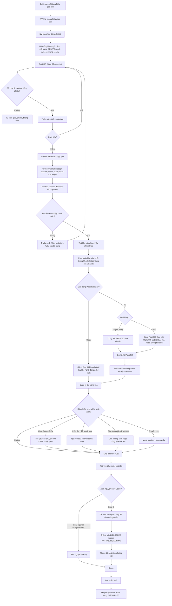

---

## 4. Luồng nhập kho theo phiếu giao kho sản xuất

### 4.1. Mục tiêu

Ghi nhận vật lý thùng 60 từ sản xuất vào kho theo phiếu giao kho. Hàng chỉ trở thành tồn chính thức sau khi **thủ kho xác nhận nhập chính thức**.

### 4.2. Lưu đồ con

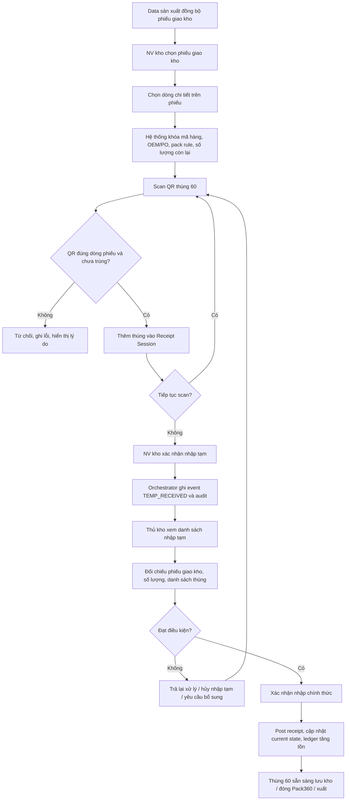

### 4.3. Bảng bước nghiệp vụ

| Bước | Tác nhân | Thao tác | Hệ thống xử lý | Kết quả |
|---:|---|---|---|---|
| 1 | Data sản xuất | Cung cấp phiếu giao kho và dòng chi tiết | Đồng bộ vào WMS | Có dữ liệu nguồn |
| 2 | Nhân viên kho | Chọn phiếu giao kho | Hiển thị các dòng chi tiết | Chọn đúng phiếu |
| 3 | Nhân viên kho | Chọn dòng chi tiết | Khóa mã hàng, OEM/PO, pack rule, số lượng còn lại | Có ngữ cảnh scan |
| 4 | Nhân viên kho | Scan thùng 60 cùng mã | Kiểm tra QR, mã hàng, trùng phiên, trạng thái | Thêm vào phiên nhập tạm |
| 5 | Nhân viên kho | Xác nhận nhập tạm | Ghi event/audit, chưa post ledger | Chờ thủ kho xác nhận |
| 6 | Thủ kho | Kiểm tra phiên nhập tạm | Đối chiếu phiếu, dòng, số lượng, danh sách thùng | Kết quả đạt/không đạt |
| 7 | Thủ kho | Xác nhận nhập chính thức | Post receipt, ledger tăng tồn, cập nhật current state | Tồn chính thức |

### 4.4. Quy tắc chính

- Một phiên nhập tạm chỉ áp dụng cho **một dòng chi tiết** phiếu giao kho.
- Nhân viên chỉ quét thùng 60 **cùng mã hàng** với dòng chi tiết.
- OEM/PO/pack rule lấy tự động từ dòng phiếu, không nhập tay.
- Nhập tạm chưa được xem là tồn chính thức và chưa được xuất.
- Chỉ thủ kho hoặc người được phân quyền mới xác nhận nhập chính thức.
- Kho không thực hiện QC đầu vào. Nếu trong quá trình lưu kho phát hiện vấn đề chất lượng, dùng nghiệp vụ chuyển stock type sang `BLOCKED`.

---

## 5. Luồng gán pallet / lưu kho / chờ đóng Pack360 / chờ xuất

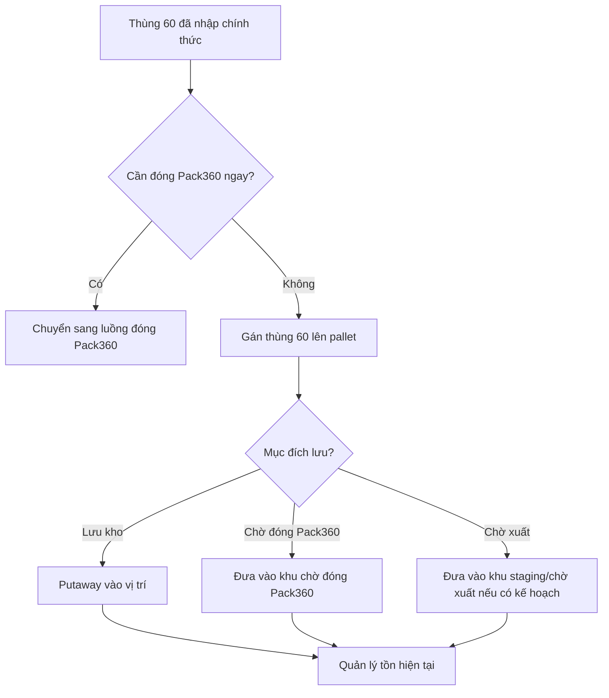

| Điểm kiểm soát | Mô tả |
|---|---|
| Pallet hợp lệ | Pallet phải tồn tại, active và không bị khóa. |
| Vị trí hợp lệ | Vị trí/kệ phải đúng loại, còn hiệu lực, không khóa. |
| Không mất dấu vật lý | Hàng vật lý di chuyển thì hệ thống phải ghi event. |
| Chờ đóng Pack360 | Thùng 60 chờ đóng vẫn phải có pallet/vị trí rõ ràng. |

---

## 6. Luồng đóng Pack360

### 6.1. Hàng truyền thống

Hàng truyền thống đóng Pack360 theo rule chuẩn của mã hàng.

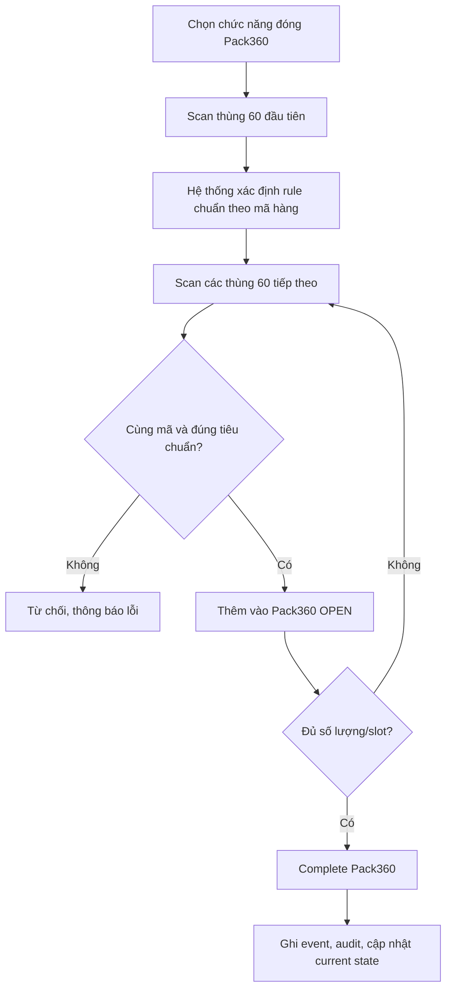

### 6.2. Hàng OEM

Hàng OEM đóng Pack360 theo rule của đơn OEM/PO. Rule có thể cho phép:

- Khác mã hàng trong cùng Pack360.
- Số lượng thùng 60 linh hoạt theo đơn.
- Khác slot chuẩn của hàng truyền thống.
- Kiểm theo danh sách BOM, packing list hoặc PO line.

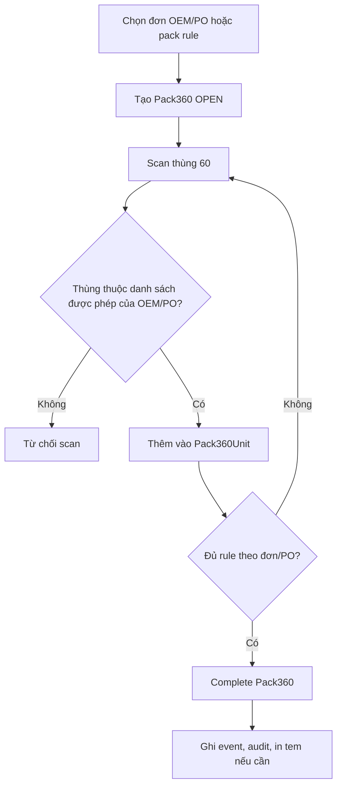

### 6.3. Quy tắc chung Pack360

| Rule | Nội dung |
|---|---|
| P360-001 | Pack360 phải có QR duy nhất. |
| P360-002 | Chỉ Pack360 `OPEN` mới được thêm thùng. |
| P360-003 | Một thùng 60 chỉ thuộc một Pack360 active tại một thời điểm. |
| P360-004 | Thùng đã `SHIPPED` hoặc `SCRAPPED` không được ghép. |
| P360-005 | Hàng truyền thống kiểm theo rule chuẩn; hàng OEM kiểm theo rule đơn/PO. |
| P360-006 | Complete Pack360 phải ghi event và audit. |

---

## 7. Luồng giải phóng, tách và đóng lại Pack360

### 7.1. Mục tiêu

Cho phép kho giải phóng Pack360 cũ, hoặc lấy một/vài thùng 60 bên trong để đóng lại Pack360 mới, nhưng vẫn giữ đầy đủ lịch sử quan hệ.

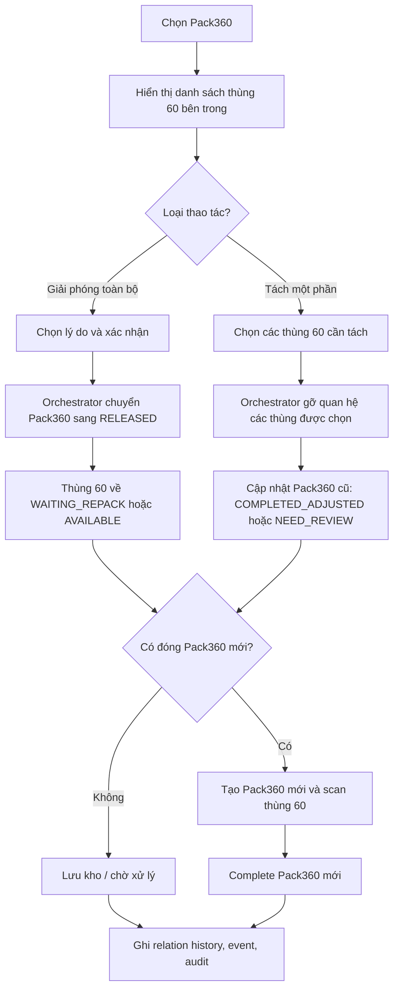

### 7.2. Quy tắc chính

- Không xóa vật lý Pack360 đã tạo; chỉ đổi trạng thái và ghi lịch sử.
- Chỉ được giải phóng/tách Pack360 khi chưa xuất, chưa stage, chưa thuộc phiếu xuất active.
- Nếu tách một phần làm Pack360 cũ không còn đạt rule, chuyển `NEED_REVIEW`.
- Thùng 60 tách ra phải có trạng thái phù hợp trước khi đóng lại Pack360 mới.

---

## 8. Luồng lưu kho và quản trị tồn

Trong quá trình lưu kho, hàng có thể phát sinh nghiệp vụ không làm xuất hàng ngay nhưng ảnh hưởng quyền sử dụng tồn.

### 8.1. Chuyển đơn OEM

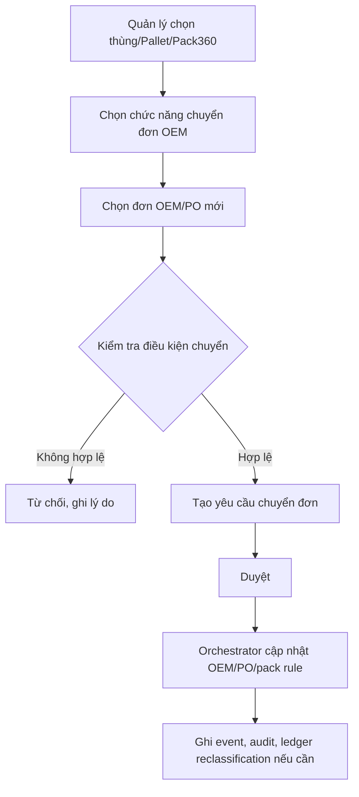

### 8.2. Chuyển stock type / khóa tồn

Dùng khi hàng dư đơn cần giữ lại, hoặc phát hiện vấn đề chất lượng sau khi đã nhập kho.

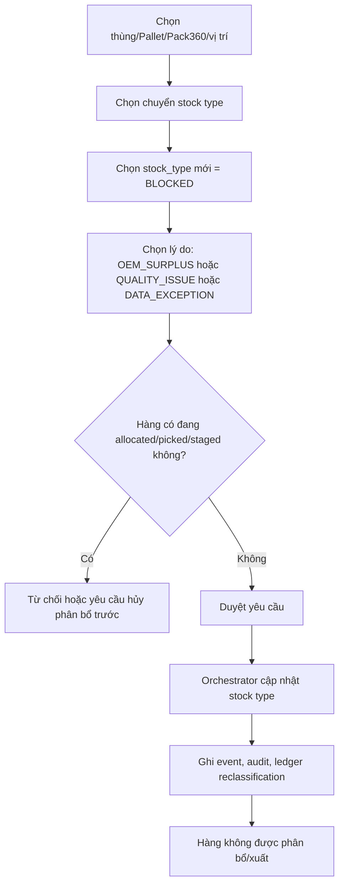

### 8.3. Release tồn bị khóa

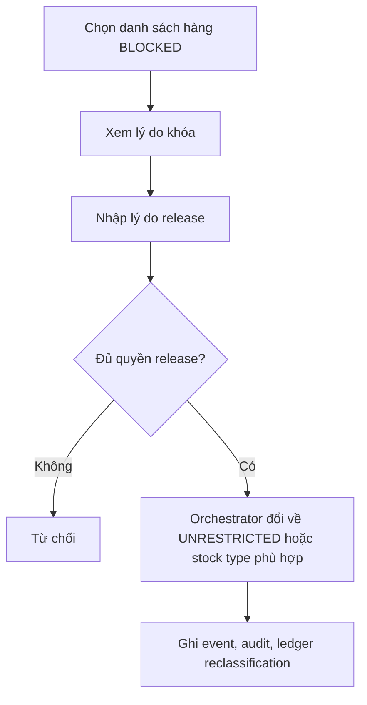

---

## 9. Luồng xuất kho

### 9.1. Xuất nguyên thùng / Pack360

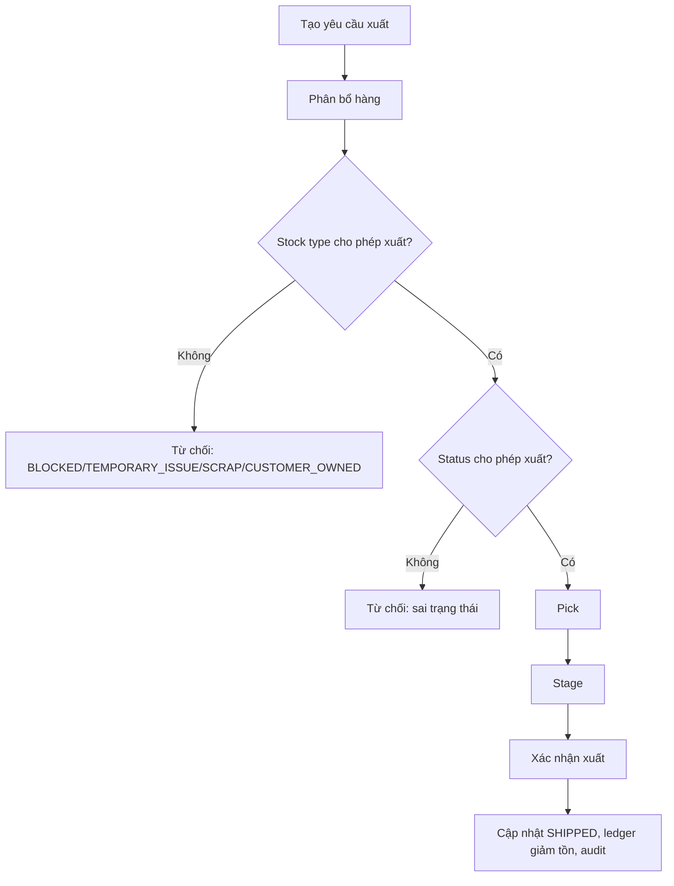

### 9.2. Xuất lẻ từ thùng 60

Khi chỉ cần lấy một phần số lượng từ thùng 60, hệ thống tạo **một bản ghi thùng 60 mới trong bảng thùng 60 hiện có**. Bản ghi này đại diện cho phần số lượng được lấy ra và có thể đi theo luồng xuất như thùng 60 bình thường.

Ví dụ: lấy 3 cây từ thùng gốc 60 cây.

- Thùng gốc còn 57 cây.
- Hệ thống sinh thùng 60 mới số lượng 3 cây.
- Thùng mới có `is_virtual = 1`, `parent_id_60 = thùng gốc`, `root_id_60 = thùng gốc`.
- Thùng gốc chuyển `stock_type = BLOCKED`, `block_reason_code = PARTIAL_REMAINING`.

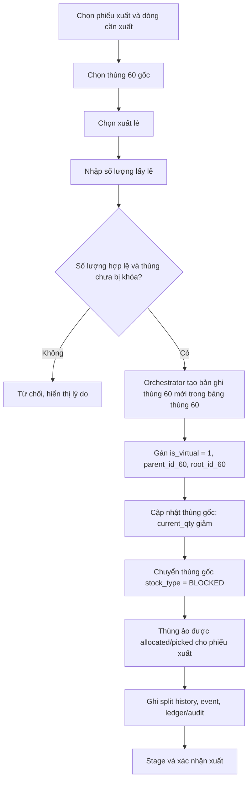

### 9.3. Quy tắc xuất lẻ

| Rule | Nội dung |
|---|---|
| PI-001 | Xuất lẻ chỉ được thực hiện với thùng 60 còn trong kho và chưa bị khóa. |
| PI-002 | Số lượng xuất lẻ phải nhỏ hơn số lượng hiện có của thùng gốc. |
| PI-003 | Nếu lấy toàn bộ số lượng thì xử lý như xuất nguyên thùng, không sinh thùng ảo. |
| PI-004 | Thùng ảo là bản ghi mới trong bảng thùng 60 hiện có, không có bảng riêng. |
| PI-005 | Thùng ảo phải có `is_virtual = 1`, `parent_id_60`, `root_id_60`. |
| PI-006 | Thùng gốc sau khi bị lấy lẻ phải cập nhật `current_qty` và bị `BLOCKED` nếu không còn đủ số lượng chuẩn. |
| PI-007 | Thùng gốc bị lấy lẻ không được xuất tiếp nếu chưa có nghiệp vụ xử lý/release riêng. |
| PI-008 | Mọi nghiệp vụ split phải ghi event, split history, audit và ledger nếu ảnh hưởng tồn. |

---

## 10. Luồng xuất tạm, hoàn nhập và tất toán

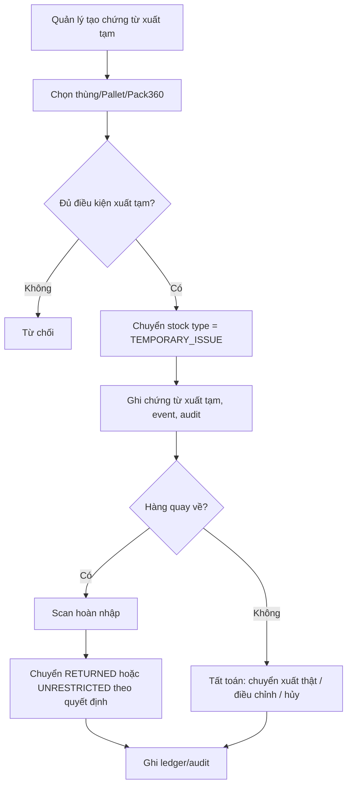

---

## 11. Luồng điều chỉnh, reversal và xử lý ngoại lệ

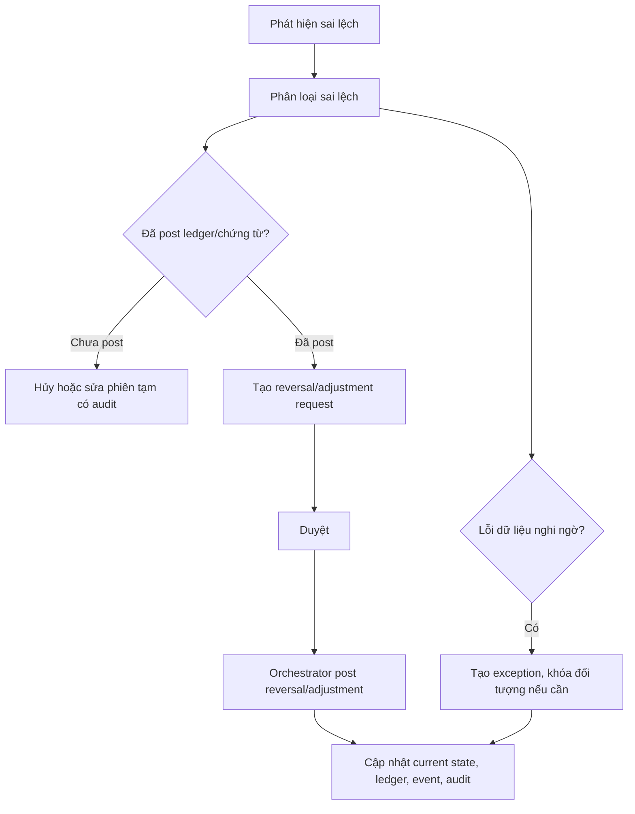

---

## 12. Quy ước stock type

| Stock Type | Khi dùng | Có được xuất mặc định? |
|---|---|---|
| `UNRESTRICTED` | Tồn tự do, được sử dụng | Có |
| `BLOCKED` | Dư đơn, vấn đề chất lượng phát hiện trong kho, chờ quyết định, sai lệch dữ liệu, thùng gốc bị lấy lẻ | Không |
| `RETURNED` | Hàng trả về | Tùy phê duyệt |
| `TEMPORARY_ISSUE` | Hàng đã xuất tạm ra khỏi kho, cần hoàn trả/tất toán | Không |
| `CUSTOMER_OWNED` | Hàng thuộc khách/bên ngoài | Không |
| `SCRAP` | Hàng hủy/phế | Không |

---

## 13. Điểm kiểm soát quản lý

- Danh sách phiên nhập tạm chờ thủ kho xác nhận.
- Danh sách thùng 60 thuộc `stock_type = BLOCKED` theo lý do: dư đơn, chất lượng, partial remaining, chờ xử lý.
- Danh sách thùng 60 ảo sinh ra từ xuất lẻ và quan hệ với thùng gốc.
- Danh sách Pack360 OPEN quá lâu.
- Danh sách Pack360 NEED_REVIEW sau khi tách thùng.
- Danh sách xuất tạm còn mở/quá hạn.
- Báo cáo vòng đời thùng 60 từ nhập, pallet, Pack360, chuyển đơn, khóa tồn, release, split, xuất.
- Báo cáo ledger nhập - xuất - reclassification - adjustment.
