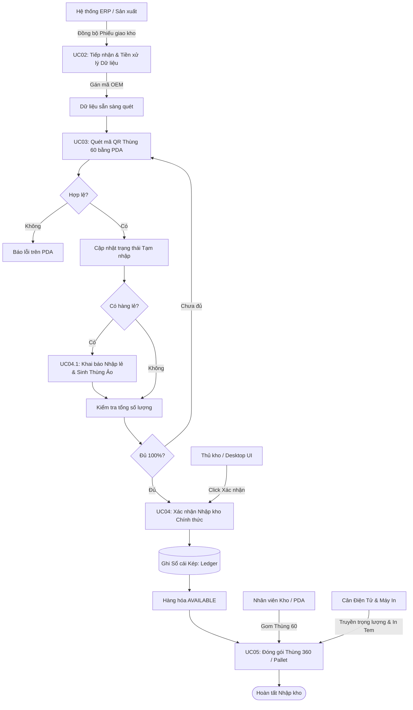

# Lưu đồ Quy trình (BPMN Process)

Dưới đây là lưu đồ thể hiện Luồng Nhập kho Thành phẩm (Inbound Flow) theo tiêu chuẩn BPMN (được render bằng Mermaid).

```mermaid
graph TD
    %% Define Actors
    ERP[Hệ thống ERP / Sản xuất]
    NV[Nhân viên Kho / PDA]
    TK[Thủ kho / Desktop UI]
    IOT[Cân Điện Tử & Máy In]

    %% Process Steps
    ERP -->|Đồng bộ Phiếu giao kho| UC02[UC02: Tiếp nhận & Tiền xử lý Dữ liệu]
    UC02 -->|Gán mã OEM| Ready[Dữ liệu sẵn sàng quét]
    
    Ready --> UC03[UC03: Quét mã QR Thùng 60 bằng PDA]
    UC03 --> FailFast{Hợp lệ?}
    FailFast -->|Không| Reject[Báo lỗi trên PDA]
    FailFast -->|Có| Temp[Cập nhật trạng thái Tạm nhập]
    
    Temp --> MissingQty{Có hàng lẻ?}
    MissingQty -->|Có| UC041[UC04.1: Khai báo Nhập lẻ & Sinh Thùng Ảo]
    UC041 --> CheckSum[Kiểm tra tổng số lượng]
    MissingQty -->|Không| CheckSum
    
    CheckSum --> Match{Đủ 100%?}
    Match -->|Chưa đủ| UC03
    Match -->|Đủ| UC04[UC04: Xác nhận Nhập kho Chính thức]
    
    TK -->|Click Xác nhận| UC04
    UC04 --> Ledger[(Ghi Sổ cái Kép: Ledger)]
    Ledger --> Available[Hàng hóa AVAILABLE]
    
    Available --> UC05[UC05: Đóng gói Thùng 360 / Pallet]
    NV -->|Gom Thùng 60| UC05
    IOT -->|Truyền trọng lượng & In Tem| UC05
    UC05 --> Done([Hoàn tất Nhập kho])
```
