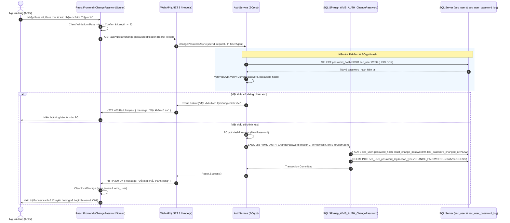
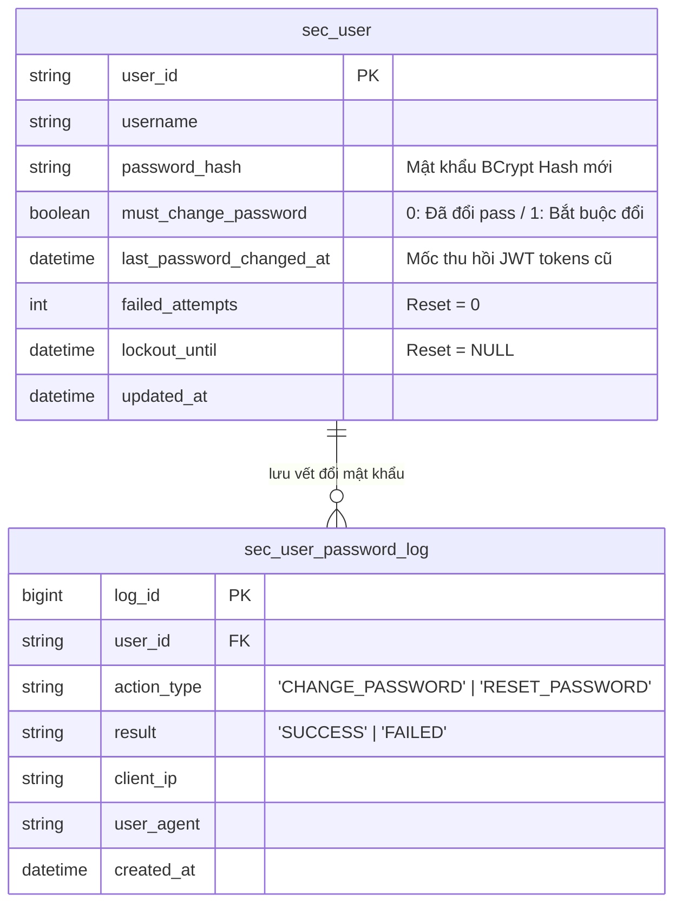

# Phân tích Thiết kế Logic UC01.1 - Đổi Mật Khẩu & Bảo Mật Phiên Làm Việc

Tài liệu này đi sâu vào phân tích và thiết kế hệ thống ở 5 khía cạnh bắt buộc: **Business Logic**, **UI/UX Guidelines**, **Programming Logic**, **Data Logic**, và **Diagrams (Mermaid)** dành cho chức năng Đổi Mật Khẩu người dùng của Hệ thống Quản lý Kho Thành Phẩm WMS.

---

## 1. Business Logic (Logic Nghiệp Vụ)

- **Mục tiêu cốt lõi:** Cho phép người dùng chủ động thay đổi mật khẩu định kỳ hoặc bắt buộc người dùng đổi mật khẩu khi đăng nhập lần đầu/sau khi Admin khôi phục mật khẩu (`must_change_password = 1`), nhằm đảm bảo an toàn thông tin và thu hồi triệt để tất cả các phiên làm việc (JWT Tokens) cũ.

- **Các quy tắc nghiệp vụ (Business Rules):**
  - `BR-UC01.1-01` **Ràng buộc đầu vào (Mandatory Input):** Mật khẩu hiện tại, Mật khẩu mới, và Xác nhận mật khẩu mới là các trường bắt buộc, không được để trống hoặc chứa khoảng trắng ở hai đầu.
  - `BR-UC01.1-02` **Xác thực danh tính (Current Password Verification):** Phải nhập chính xác 100% mật khẩu hiện tại trước khi hệ thống chấp nhận mã hóa mật khẩu mới.
  - `BR-UC01.1-03` **Phức tạp mật khẩu (Password Complexity):** Mật khẩu mới phải đáp ứng độ dài tối thiểu 8 ký tự, khuyến khích chứa kết hợp chữ hoa, chữ thường và chữ số, và không chứa từ khóa trùng tên đăng nhập.
  - `BR-UC01.1-04` **Chống trùng mật khẩu cũ (Non-Reuse Protection):** Mật khẩu mới tuyệt đối không được trùng khớp với mật khẩu hiện tại.
  - `BR-UC01.1-05` **Khớp chuỗi xác nhận:** Chuỗi "Mật khẩu mới" và "Xác nhận mật khẩu mới" phải trùng khớp hoàn toàn từng ký tự.
  - `BR-UC01.1-06` **Thu hồi toàn bộ Token cũ (Session Revocation):** Khi đổi mật khẩu thành công, hệ thống cập nhật mốc thời gian `last_password_changed_at = GETDATE()` và gỡ cờ `must_change_password = 0`. Middleware Backend tự động chặn (Return 401) tất cả các Token JWT được phát hành trước mốc thời gian này.
  - `BR-UC01.1-07` **Lưu nhật ký bảo mật (Audit Trail):** Mọi hành vi cố gắng đổi mật khẩu (thành công hoặc thất bại) đều phải ghi vết tự động vào bảng `sec_user_password_log` kèm theo thông tin `ClientIP` và `UserAgent`.

- **Quy trình tương tác 5 bước (Interaction Flow):**
  - **Bước 1:** Người dùng bấm "Đổi mật khẩu" trên Menu (hoặc bị chuyển hướng tự động từ UC01 nếu `must_change_password = 1`). Màn hình hiển thị `ChangePasswordScreen.jsx`.
  - **Bước 2:** Người dùng nhập Mật khẩu hiện tại, Mật khẩu mới, Xác nhận mật khẩu mới và bấm **"Cập nhật mật khẩu"**.
  - **Bước 3:** Frontend validate khớp chuỗi tại chỗ, sau đó gửi request `POST /api/v1/auth/change-password` kèm Token xác thực Bearer.
  - **Bước 4:** Backend kiểm tra Fail-fast (Verify JWT -> Fetch `password_hash` -> Bcrypt compare pass cũ -> Check trùng pass mới -> Hash pass mới -> Execute SP `usp_WMS_AUTH_ChangePassword`).
  - **Bước 5:** Backend cập nhật CSDL và ghi log audit. Trả về `SUCCESS`. Frontend xóa `localStorage`, hiển thị thông báo thành công và chuyển hướng về màn hình **Đăng Nhập (UC01)** yêu cầu đăng nhập lại.

---

## 2. Tiêu chuẩn Thiết kế Giao diện (UI/UX Guidelines)

- **Thiết bị đích:** Máy tính để bàn (Desktop Web UI) và Thiết bị di động / Máy kiểm kê kho cầm tay (RF Scanner / Tablet).
- **Yêu cầu trải nghiệm (UX Principles):**
  - **Khóa chuyển hướng khi bắt buộc đổi mật khẩu:** Nếu người dùng bị ép buộc đổi mật khẩu (`must_change_password = 1`), tất cả các menu điều hướng khác, nút "Quay lại" hoặc "Hủy bỏ" đều bị vô hiệu hóa. Người dùng chỉ có 1 lựa chọn duy nhất là hoàn thành đổi mật khẩu.
  - **Phản hồi lỗi thời gian thực (Real-time Validation):** Hiển thị ô viền Đỏ và thông báo bên dưới trường nhập nếu mật khẩu mới < 8 ký tự hoặc chuỗi xác nhận không trùng khớp trước khi cho phép bấm nút Submit.
  - **Bảo mật nhập liệu:** Tất cả 3 trường mật khẩu đều mặc định ẩn ký tự dạng `password` (`••••••••`), hỗ trợ biểu tượng Mắt (`Eye / EyeOff icon`) để người dùng bật/tắt hiển thị khi gõ.
  - **Thông báo hoàn tất:** Hiển thị Modal/Banner thành công màu Xanh Emerald (`#10B981`) thông báo *"Đổi mật khẩu thành công! Tất cả phiên đăng nhập khác đã bị đăng xuất. Vui lòng đăng nhập lại"*.

---

## 3. Programming Logic (Logic Lập Trình)

### 3.1. Frontend Component (`ChangePasswordScreen.jsx` & `AuthContext.jsx`)
- **State Management:**
  - `currentPassword`, `newPassword`, `confirmPassword`.
  - `loading`: Trạng thái spinner khi gửi request.
- **Handling Submission:**
  ```javascript
  const handleSubmit = async (e) => {
    e.preventDefault();
    if (newPassword !== confirmPassword) {
      setError("Mật khẩu xác nhận không trùng khớp.");
      return;
    }
    try {
      setLoading(true);
      await httpClient.post('/auth/change-password', {
        currentPassword,
        newPassword,
        confirmNewPassword: confirmPassword
      });
      logout(); // Clear LocalStorage & Token
      navigate('/login', { state: { message: 'Đổi mật khẩu thành công. Vui lòng đăng nhập lại.' } });
    } catch (err) {
      setError(err.message || 'Không thể đổi mật khẩu.');
    } finally {
      setLoading(false);
    }
  };
  ```

### 3.2. Backend API (.NET 8 C# & Stored Procedure)

#### A. C# .NET 8 Web API (`AuthController.cs` & `AuthService.cs`)
- **Endpoint:** `POST /api/v1/auth/change-password` (`[Authorize]`)
- **Controller Implementation (`AuthController.cs`):**
```csharp
[HttpPost("change-password")]
[Authorize]
public async Task<IActionResult> ChangePassword([FromBody] ChangePasswordRequestDto request, CancellationToken cancellationToken)
{
    var currentUserId = _currentUserService.UserId;
    if (string.IsNullOrEmpty(currentUserId)) return Unauthorized();

    var clientIp = HttpContext.Connection.RemoteIpAddress?.ToString();
    var userAgent = Request.Headers["User-Agent"].ToString();

    var result = await _authService.ChangePasswordAsync(currentUserId, request, clientIp, userAgent, cancellationToken);
    if (!result.IsSuccess)
    {
        return BadRequest(ApiResponse<object>.Error(result.ErrorCode, result.Message));
    }
    return Ok(ApiResponse<object>.Success(new object(), "Đổi mật khẩu thành công. Vui lòng đăng nhập lại."));
}
```

- **Service Core Logic (`AuthService.cs`):**
```csharp
public async Task<Result> ChangePasswordAsync(string currentUserId, ChangePasswordRequestDto request, string? clientIp = null, string? userAgent = null, CancellationToken cancellationToken = default)
{
    if (request.NewPassword != request.ConfirmNewPassword)
        return Result.Failure(WmsErrorCodes.ValidationFailed, "Mật khẩu xác nhận không khớp.");

    if (request.NewPassword == request.CurrentPassword)
        return Result.Failure(WmsErrorCodes.ValidationFailed, "Mật khẩu mới không được trùng mật khẩu hiện tại.");

    if (request.NewPassword.Length < 8)
        return Result.Failure(WmsErrorCodes.ValidationFailed, "Mật khẩu mới phải có ít nhất 8 ký tự.");

    using var connection = await _connectionFactory.CreateConnectionAsync(cancellationToken);
    var passwordHash = await connection.QueryFirstOrDefaultAsync<string>(
        "SELECT password_hash FROM sec_user WITH (UPDLOCK) WHERE user_id = @UserId", new { UserId = currentUserId });

    if (string.IsNullOrEmpty(passwordHash) || !BCrypt.Net.BCrypt.Verify(request.CurrentPassword, passwordHash))
        return Result.Failure(WmsErrorCodes.Unauthorized, "Mật khẩu hiện tại không chính xác.");

    string newPasswordHash = BCrypt.Net.BCrypt.HashPassword(request.NewPassword);

    await _spExecutor.ExecuteAsync("usp_WMS_AUTH_ChangePassword", new
    {
        UserID = currentUserId,
        NewPasswordHash = newPasswordHash,
        ClientIP = clientIp,
        UserAgent = userAgent
    }, cancellationToken);

    return Result.Success();
}
```

#### B. SQL Stored Procedure (`dbo.usp_WMS_AUTH_ChangePassword`)
```sql
USE WMS1;
GO
SET QUOTED_IDENTIFIER ON;
SET ANSI_NULLS ON;
GO

CREATE OR ALTER PROCEDURE dbo.usp_WMS_AUTH_ChangePassword
    @UserID NVARCHAR(50),
    @NewPasswordHash NVARCHAR(255),
    @ClientIP NVARCHAR(50) = NULL,
    @UserAgent NVARCHAR(500) = NULL
AS
BEGIN
    SET NOCOUNT ON;
    SET XACT_ABORT ON;

    BEGIN TRY
        BEGIN TRANSACTION;

        -- 1. Fail-fast Check: Tài khoản tồn tại và Active
        IF NOT EXISTS (SELECT 1 FROM dbo.sec_user WITH (UPDLOCK) WHERE user_id = @UserID AND is_active = 1)
        BEGIN
            RAISERROR(N'ERR_USER_NOT_ACTIVE: Tài khoản không tồn tại hoặc đã bị vô hiệu hóa.', 16, 1);
            ROLLBACK TRANSACTION;
            RETURN;
        END;

        -- 2. Cập nhật mật khẩu mới & reset cờ ép buộc & mốc revoked token
        UPDATE dbo.sec_user
        SET password_hash = @NewPasswordHash,
            must_change_password = 0,
            last_password_changed_at = GETDATE(),
            failed_attempts = 0,
            lockout_until = NULL,
            updated_at = GETDATE()
        WHERE user_id = @UserID;

        -- 3. Ghi vết Audit Log bảo mật
        INSERT INTO dbo.sec_user_password_log
        (user_id, action_type, result, client_ip, user_agent, created_at)
        VALUES
        (@UserID, 'CHANGE_PASSWORD', 'SUCCESS', ISNULL(@ClientIP, '127.0.0.1'), ISNULL(@UserAgent, 'UNKNOWN'), GETDATE());

        COMMIT TRANSACTION;
    END TRY
    BEGIN CATCH
        IF @@TRANCOUNT > 0 ROLLBACK TRANSACTION;
        THROW;
    END CATCH;
END;
GO
```

---

## 4. Data Logic (Thiết kế Dữ Liệu)

### 4.1. Ma trận phân quyền CRUD

| Bảng / Thực thể Dữ Liệu | Create (Tạo) | Read (Đọc) | Update (Cập nhật) | Delete (Xóa) | Ý nghĩa nghiệp vụ trong UC01.1 |
| :--- | :---: | :---: | :---: | :---: | :--- |
| `sec_user` | - | **X** | **X** | - | Cập nhật `password_hash`, `must_change_password = 0`, `last_password_changed_at` |
| `sec_user_password_log` | **X** | **X** | - | - | Ghi vết nhật ký Audit Log bảo mật (Insert-only, không bao giờ xóa) |

### 4.2. Định nghĩa Trạng thái (Conceptual State Model)

| Cột / Biến | Kiểu Dữ Liệu | Giá Trị Sau Đổi Pass | Ý nghĩa Nghiệp vụ |
| :--- | :--- | :--- | :--- |
| `password_hash` | `NVARCHAR(255)` | Chuỗi BCrypt Hash mới | Mật khẩu mới được bảo mật bằng mã hóa 1 chiều BCrypt |
| `must_change_password` | `BIT` | `0` (False) | Gỡ cờ bắt buộc đổi mật khẩu, cho phép truy cập đầy đủ WMS |
| `last_password_changed_at` | `DATETIME` | `GETDATE()` | Mốc thời gian vô hiệu hóa (Revoke) tất cả JWT Tokens phát hành trước thời điểm này |

### 4.3. Cập nhật Sổ Cái Kép (Dual Ledger Analysis)
- **Ảnh hưởng hạch toán:** Thao tác Đổi mật khẩu (UC01.1) **chưa tác động trực tiếp** đến các bảng Sổ Cái Kép (`stock_transaction_book`, `inventory_ledger`, `item_ledger`).
- **Ý nghĩa với Sổ Cái Kép:** Đổi mật khẩu thành công giúp bảo vệ toàn vẹn danh tính người vận hành (`UserId`), ngăn chặn hành vi mạo danh tài khoản thủ kho/nhân viên để tạo phiếu xuất nhập hoặc hạch toán gian lận vào Sổ Cái Kép.

---

## 5. Biểu Đồ Thiết Kế (Diagrams)

### 5.1. Sequence Diagram (Luồng Đổi Mật Khẩu & Revoke Session)



---

### 5.2. Data Layer Architecture (Data Flow & Transaction Locking)

```mermaid
flowchart TD
    Start([Client Request: POST /api/v1/auth/change-password]) --> AuthCheck{JWT Bearer Valid?}
    AuthCheck -- Không --> ERR_AUTH[Return 401 Unauthorized]
    
    AuthCheck -- Hợp lệ --> Step1{1. NewPass == ConfirmPass?}
    Step1 -- Không --> ERR1[Return 400: Mật khẩu xác nhận không khớp]
    Step1 -- Có --> Step2{2. NewPass != CurrentPass?}
    
    Step2 -- Trùng pass cũ --> ERR2[Return 400: Không được trùng mật khẩu cũ]
    Step2 -- Khác pass cũ --> Step3{3. NewPass Length >= 8?}
    
    Step3 -- Ngắn --> ERR3[Return 400: Mật khẩu mới tối thiểu 8 ký tự]
    Step3 -- Hợp lệ --> LockDB[Open SQL Connection & Query User WITH UPDLOCK]
    
    LockDB --> VerifyOld{4. BCrypt.Verify CurrentPass?}
    VerifyOld -- Sai --> LogFail[INSERT sec_user_password_log RESULT='FAILED']
    LogFail --> ERR4[Return 400: Mật khẩu hiện tại không chính xác]
    
    VerifyOld -- Đúng --> BeginTx[BEGIN SQL TRANSACTION]
    BeginTx --> UpdateUser[UPDATE sec_user:<br/>password_hash = NewHash<br/>must_change_password = 0<br/>last_password_changed_at = GETDATE()]
    UpdateUser --> InsertAudit[INSERT sec_user_password_log RESULT='SUCCESS']
    InsertAudit --> CommitTx[COMMIT TRANSACTION]
    CommitTx --> End([Return HTTP 200 OK & Clear Client LocalStorage])

    classDef valid fill:#d4edda,stroke:#28a745,stroke-width:2px;
    classDef invalid fill:#f8d7da,stroke:#dc3545,stroke-width:2px;
    
    class End valid;
    class ERR_AUTH,ERR1,ERR2,ERR3,ERR4 invalid;
```

---

### 5.3. Entity Relationship & State Logic Map (ERD Map UC01.1)


