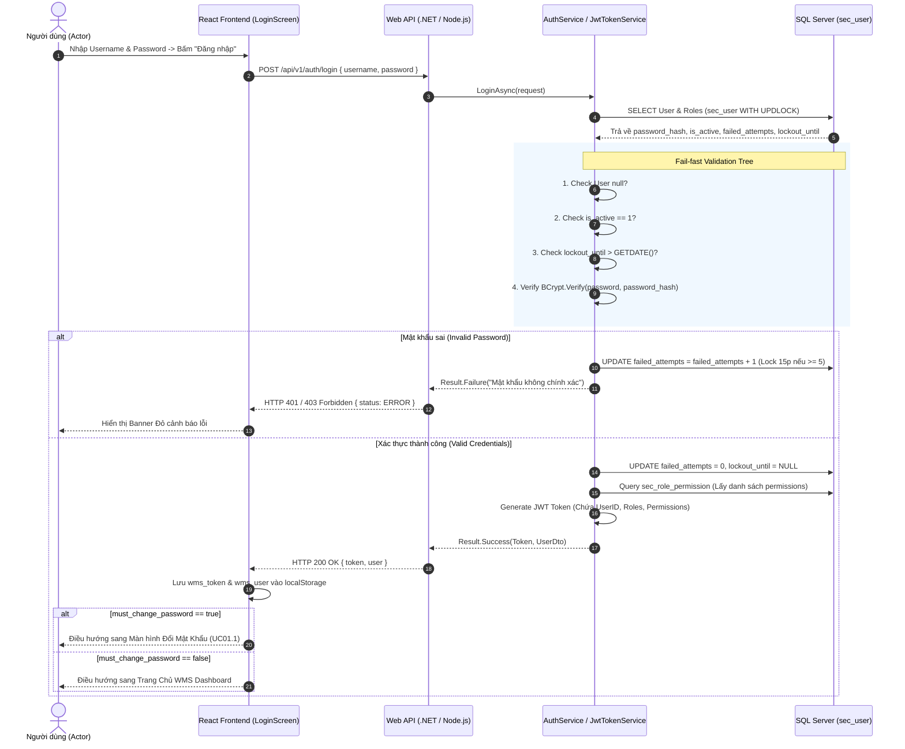
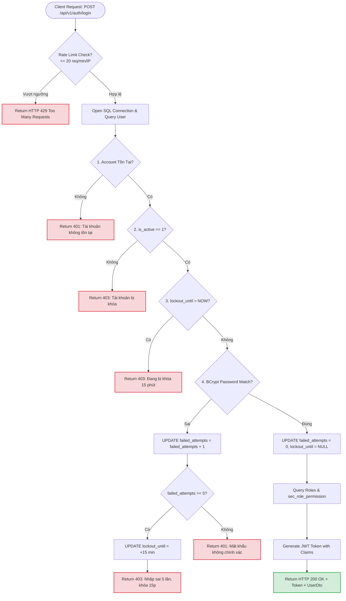
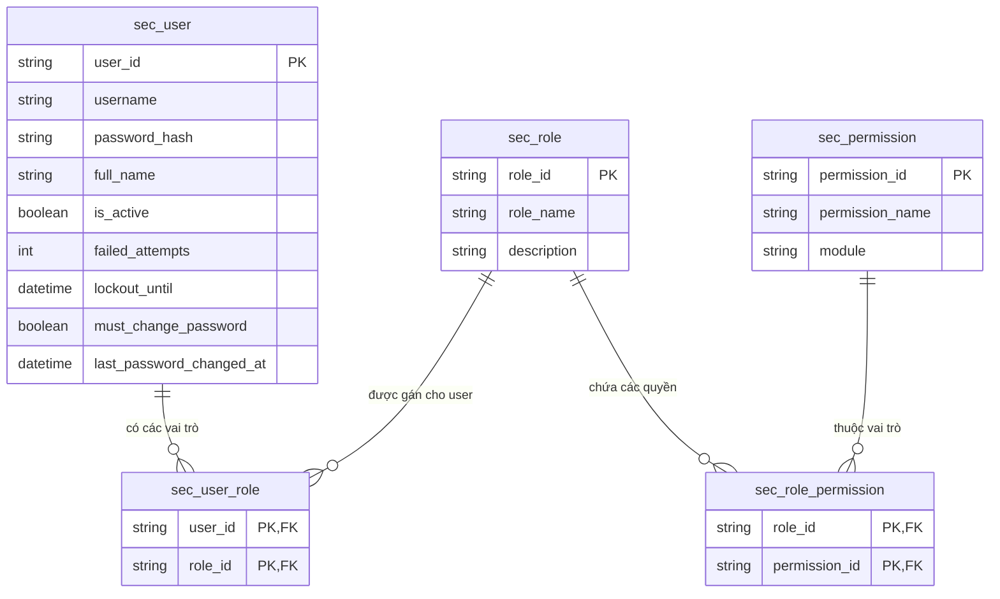

# Phân tích Thiết kế Logic UC01 - Đăng Nhập & Xác Thực Hệ Thống

Tài liệu này đi sâu vào phân tích và thiết kế toàn diện ở 5 khía cạnh bắt buộc: **Business Logic**, **UI/UX Guidelines**, **Programming Logic**, **Data Logic**, và **Diagrams (Mermaid)** dành cho chức năng xác thực người dùng (Đăng nhập) của Hệ thống Quản lý Kho Thành Phẩm WMS.

---

## 1. Business Logic (Logic Nghiệp Vụ)

- **Mục tiêu cốt lõi:** Xác thực chính xác danh tính người dùng trước khi cấp quyền truy cập vào hệ thống WMS, nạp danh sách quyền hạn (Permissions) và vai trò (Roles), ép buộc đổi mật khẩu lần đầu nếu có yêu cầu, và bảo vệ hệ thống khỏi các cuộc tấn công dò quét mật khẩu (Brute-force/DDoS).

- **Các quy tắc nghiệp vụ (Business Rules):**
  - `BR-UC01-01` **Trạng thái tài khoản (Account Status):** Tài khoản chỉ được phép đăng nhập nếu cờ trạng thái `is_active = 1` (Active). Ngược lại, hệ thống từ chối xác thực và trả về thông báo lỗi.
  - `BR-UC01-02` **Khóa tạm thời (Temporary Lockout):** Nếu người dùng nhập sai mật khẩu 5 lần liên tiếp, hệ thống tự động khóa tài khoản trong 15 phút (`lockout_until = DATEADD(MINUTE, 15, GETDATE())`). Trong thời gian này, mọi yêu cầu đăng nhập từ tài khoản đều bị từ chối dù nhập đúng mật khẩu. Nếu đăng nhập thành công trước khi chạm mốc 5 lần, bộ đếm `failed_attempts` tự động reset về 0.
  - `BR-UC01-03` **Chống Dò Quét IP (Rate Limiting):** Hệ thống giới hạn mỗi địa chỉ IP chỉ được phép gửi tối đa 20 yêu cầu đăng nhập mỗi phút để phòng chống tấn công Brute-force & DDoS.
  - `BR-UC01-04` **Bắt buộc đổi mật khẩu (Force Password Change):** Khi tài khoản mới tạo hoặc vừa được khôi phục mật khẩu có cờ `must_change_password = 1`, ngay sau khi đăng nhập thành công, hệ thống ép buộc chuyển hướng sang màn hình **Đổi Mật Khẩu (UC01.1)** và chặn hoàn toàn truy cập vào các tính năng kho cho đến khi đổi mật khẩu thành công.
  - `BR-UC01-05` **Phiên làm việc Stateless JWT & Revocation:** Token JWT cấp phát có thời hạn 8 giờ. Trong Token chứa thông tin `user_id`, `username`, `roles` và mảng quyền `permissions`. Khi người dùng đổi mật khẩu hoặc bị khóa tài khoản, Token cũ sẽ bị vô hiệu hóa triệt để.

- **Quy trình tương tác 5 bước (Interaction Flow):**
  - **Bước 1:** Người dùng mở ứng dụng Web/PDA, màn hình hiển thị form Đăng Nhập (`LoginScreen.jsx`).
  - **Bước 2:** Người dùng nhập Tên đăng nhập (`username`) và Mật khẩu (`password`), sau đó bấm **"Đăng nhập"**.
  - **Bước 3:** Frontend mã hóa/validate form và gửi request `POST /api/v1/auth/login` tới Backend Web API.
  - **Bước 4:** Backend thực hiện chuỗi kiểm tra Fail-fast (Rate limit -> Tồn tại tài khoản -> Trạng thái active -> Lockout 15p -> Verify Bcrypt Hash -> Query Roles & Permissions).
  - **Bước 5:** Nếu hợp lệ, Backend ký mã Token JWT 8h và trả về `UserDto`. Frontend lưu Token vào `localStorage`, cập nhật `AuthContext` và điều hướng sang **Trang chủ WMS** (hoặc màn hình Đổi Mật Khẩu nếu `must_change_password = 1`).

---

## 2. Tiêu chuẩn Thiết kế Giao diện (UI/UX Guidelines)

- **Thiết bị đích:** Máy tính để bàn (Desktop Web UI) cho Quản trị viên/Thủ kho và Máy quét RF / Mobile Tablet (Android/Windows CE) cho Nhân viên kho.
- **Yêu cầu trải nghiệm (UX Principles):**
  - **Tự động Focus:** Trường `username` tự động nhận focus khi tải trang. Khi gõ xong bấm `Enter`, con trỏ tự chuyển sang trường `password`. Bấm `Enter` lần 2 để trigger gửi form.
  - **Trạng thái Nút bấm (Loading State):** Khi đang gửi request xác thực, nút "Đăng nhập" chuyển sang trạng thái `disabled` kèm icon xoay spinner để ngăn chặn double-click.
  - **Phản hồi Lỗi Trực quan:** Thông báo lỗi hiển thị bằng Banner màu Đỏ Ruby (`#EF4444`) phía trên form, ghi rõ nguyên nhân (VD: *"Tài khoản bị khóa 15 phút do nhập sai 5 lần"*, *"Mật khẩu không chính xác"*).
  - **Giữ Session An toàn:** Hỗ trợ tính năng tự động đăng xuất và xóa Token khi phát sinh lỗi `401 Unauthorized` từ bất kỳ request nào.

---

## 3. Programming Logic (Logic Lập Trình)

### 3.1. Frontend Component (`LoginScreen.jsx` & `AuthContext.jsx`)
- **State Management:**
  - `user`: Thông tin người dùng hiện tại (`userId`, `username`, `fullName`, `roles`, `permissions`).
  - `token`: Chuỗi JWT Token lưu tại `localStorage.getItem('wms_token')`.
  - `mustChangePassword`: Cờ boolean ép đổi mật khẩu.
- **Handling Login:**
  ```javascript
  const login = async (username, password) => {
    const response = await httpClient.post('/auth/login', { username, password });
    const data = response.data || response;
    const jwtToken = data.token;
    const userData = data.user;

    setToken(jwtToken);
    setUser(userData);
    setMustChangePassword(!!userData.must_change_password);

    localStorage.setItem('wms_token', jwtToken);
    localStorage.setItem('wms_user', JSON.stringify(userData));
    return response;
  };
  ```

### 3.2. Backend API (.NET 8 C# & Node.js Dual Engine)

#### A. C# .NET 8 Web API (`AuthController.cs` & `AuthService.cs`)
- **Endpoint:** `POST /api/v1/auth/login` (`[AllowAnonymous]`)
- **Controller Implementation (`AuthController.cs`):**
```csharp
[ApiController]
[Route("api/v1/auth")]
public class AuthController : ControllerBase
{
    private readonly IAuthService _authService;

    public AuthController(IAuthService authService)
    {
        _authService = authService;
    }

    [HttpPost("login")]
    [AllowAnonymous]
    public async Task<IActionResult> Login([FromBody] LoginRequestDto request, CancellationToken cancellationToken)
    {
        var result = await _authService.LoginAsync(request, cancellationToken);
        if (!result.IsSuccess)
        {
            return StatusCode(result.ErrorCode == WmsErrorCodes.Forbidden ? 403 : 401, 
                ApiResponse<object>.Error(result.ErrorCode, result.Message));
        }
        return Ok(ApiResponse<LoginResponseDto>.Success(result.Value, "Đăng nhập thành công."));
    }
}
```

- **Service Core Logic (`AuthService.cs`):**
```csharp
public async Task<Result<LoginResponseDto>> LoginAsync(LoginRequestDto request, CancellationToken cancellationToken = default)
{
    using var connection = await _connectionFactory.CreateConnectionAsync(cancellationToken);

    const string sql = @"
        SELECT u.user_id, u.username, u.password_hash, u.full_name, u.is_active, u.failed_attempts, u.lockout_until, u.must_change_password,
               STRING_AGG(r.role_id, ',') AS roles
        FROM sec_user u WITH (UPDLOCK)
        LEFT JOIN sec_user_role ur ON u.user_id = ur.user_id
        LEFT JOIN sec_role r ON ur.role_id = r.role_id
        WHERE u.username = @Username
        GROUP BY u.user_id, u.username, u.password_hash, u.full_name, u.is_active, u.failed_attempts, u.lockout_until, u.must_change_password;";

    var user = await connection.QueryFirstOrDefaultAsync<dynamic>(sql, new { Username = request.Username });
    if (user == null)
        return Result<LoginResponseDto>.Failure(WmsErrorCodes.Unauthorized, "Tài khoản không tồn tại.");

    if (!Convert.ToBoolean(user.is_active ?? true))
        return Result<LoginResponseDto>.Failure(WmsErrorCodes.Forbidden, "Tài khoản đã bị khóa.");

    DateTime? lockoutUntil = user.lockout_until != null ? Convert.ToDateTime(user.lockout_until) : null;
    if (lockoutUntil.HasValue && lockoutUntil.Value > DateTime.UtcNow)
        return Result<LoginResponseDto>.Failure(WmsErrorCodes.Forbidden, "Tài khoản đang bị khóa tạm thời 15 phút.");

    string passwordHash = (string)user.password_hash;
    bool validPassword = BCrypt.Net.BCrypt.Verify(request.Password, passwordHash);
    string userId = (string)user.user_id;

    if (!validPassword)
    {
        int newFailCount = Convert.ToInt32(user.failed_attempts ?? 0) + 1;
        if (newFailCount >= 5)
        {
            await connection.ExecuteAsync(
                "UPDATE sec_user SET failed_attempts = @FailCount, lockout_until = DATEADD(MINUTE, 15, GETDATE()) WHERE user_id = @UserId",
                new { FailCount = newFailCount, UserId = userId });
            return Result<LoginResponseDto>.Failure(WmsErrorCodes.Forbidden, "Nhập sai quá 5 lần. Tài khoản bị khóa 15 phút.");
        }

        await connection.ExecuteAsync(
            "UPDATE sec_user SET failed_attempts = @FailCount WHERE user_id = @UserId",
            new { FailCount = newFailCount, UserId = userId });
        return Result<LoginResponseDto>.Failure(WmsErrorCodes.Unauthorized, "Mật khẩu không chính xác.");
    }

    // Reset failed attempts
    await connection.ExecuteAsync("UPDATE sec_user SET failed_attempts = 0, lockout_until = NULL WHERE user_id = @UserId", new { UserId = userId });

    string[] roleList = string.IsNullOrWhiteSpace((string)(user.roles ?? "")) ? Array.Empty<string>() : ((string)user.roles).Split(',');

    // Load permissions & grant full policies for ADMIN/STOREKEEPER/OPERATOR
    const string permSql = "SELECT DISTINCT rp.permission_id FROM sec_role_permission rp WHERE rp.role_id IN @Roles";
    var dbPerms = await connection.QueryAsync<string>(permSql, new { Roles = roleList });
    var permissionList = dbPerms ?? Array.Empty<string>();

    var allPolicies = typeof(PolicyNames).GetFields(System.Reflection.BindingFlags.Public | System.Reflection.BindingFlags.Static)
        .Select(f => f.GetValue(null)?.ToString()).Where(p => !string.IsNullOrEmpty(p)).Cast<string>();

    if (!permissionList.Any() || roleList.Any(r => r.Equals("ADMIN", StringComparison.OrdinalIgnoreCase) || r.Equals("STOREKEEPER", StringComparison.OrdinalIgnoreCase) || r.Equals("OPERATOR", StringComparison.OrdinalIgnoreCase)))
    {
        permissionList = permissionList.Concat(allPolicies).Distinct();
    }

    string token = _jwtTokenService.GenerateToken(userId, (string)user.username, roleList, permissionList);
    var userDto = new UserDto(userId, (string)user.username, (string)(user.full_name ?? ""), roleList, Convert.ToBoolean(user.must_change_password ?? false), true, 0, null, permissionList);

    return Result<LoginResponseDto>.Success(new LoginResponseDto(token, userDto));
}
```

---

## 4. Data Logic (Thiết kế Dữ Liệu)

### 4.1. Ma trận phân quyền CRUD

| Thực thể / Bảng Dữ Liệu | Create (Tạo) | Read (Đọc) | Update (Cập nhật) | Delete (Xóa) | Ý nghĩa nghiệp vụ trong UC01 |
| :--- | :---: | :---: | :---: | :---: | :--- |
| `sec_user` | - | **X** | **X** | - | Truy vấn thông tin tài khoản & Cập nhật `failed_attempts`, `lockout_until` |
| `sec_role` | - | **X** | - | - | Đọc danh mục vai trò người dùng |
| `sec_user_role` | - | **X** | - | - | Đọc bảng liên kết User-Role |
| `sec_role_permission` | - | **X** | - | - | Đọc bảng liên kết Role-Permission để nhúng vào JWT |

### 4.2. Định nghĩa Trạng thái (Conceptual State Model)

| Cột / Biến | Kiểu Dữ Liệu | Giá Trị Mặc Định | Ý nghĩa Nghiệp vụ |
| :--- | :--- | :--- | :--- |
| `is_active` | `BIT` / `BOOLEAN` | `1` (Active) | `1`: Cho phép đăng nhập, `0`: Tài khoản bị khóa vĩnh viễn |
| `failed_attempts` | `INT` | `0` | Số lần nhập sai mật khẩu liên tiếp (Chạm `5` sẽ khóa 15p) |
| `lockout_until` | `DATETIME` | `NULL` | Mốc thời gian mở khóa tự động. Nếu `GETDATE() < lockout_until` $\rightarrow$ Block |
| `must_change_password` | `BIT` | `0` | `1`: Ép buộc đổi mật khẩu ngay sau khi đăng nhập |

### 4.3. Cập nhật Sổ Cái Kép (Dual Ledger Analysis)
- **Ảnh hưởng hạch toán:** Thao tác Đăng nhập (UC01) **không phát sinh bất kỳ bút toán hạch toán Nợ/Có** vào các bảng Sổ Cái Kép (`stock_transaction_book`, `inventory_ledger`, `item_ledger`).
- **Ý nghĩa với Sổ Cái Kép:** UC01 đóng vai trò **xác định bối cảnh người thực hiện (Audit Context)**. Thông tin `userId` và `username` từ JWT Token được giải mã và ghi nhận vào trường `created_by` / `posted_by` của tất cả các giao dịch hạch toán kho tại **UC03, UC04, UC06, UC16, UC18**.

---

## 5. Biểu Đồ Thiết Kế (Diagrams)

### 5.1. Sequence Diagram (Luồng Xác Thực & Đăng Nhập)



---

### 5.2. Data Layer Architecture (Cấu trúc Phân tầng & Fail-fast Lockout)



---

### 5.3. Entity Relationship & State Logic Map (ERD Map UC01)


