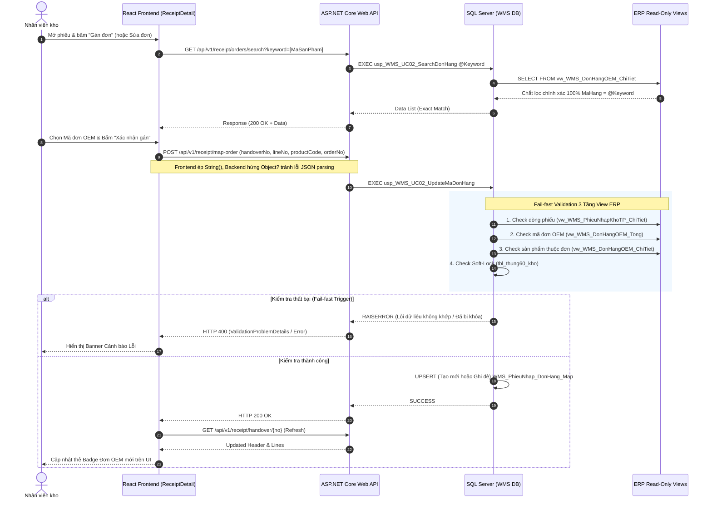
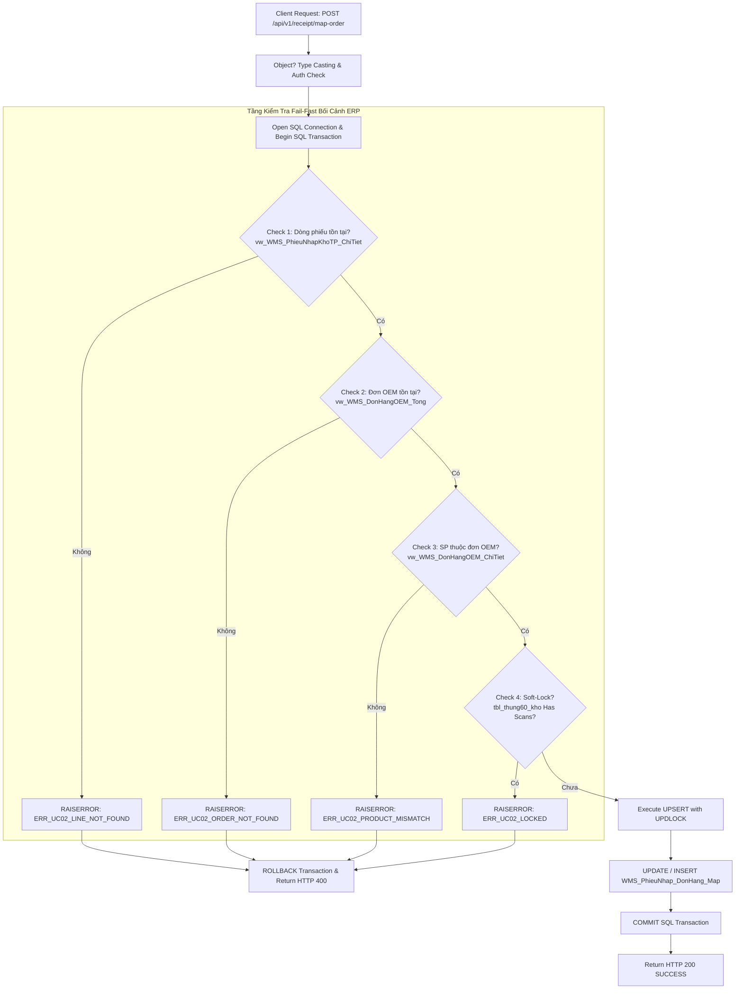
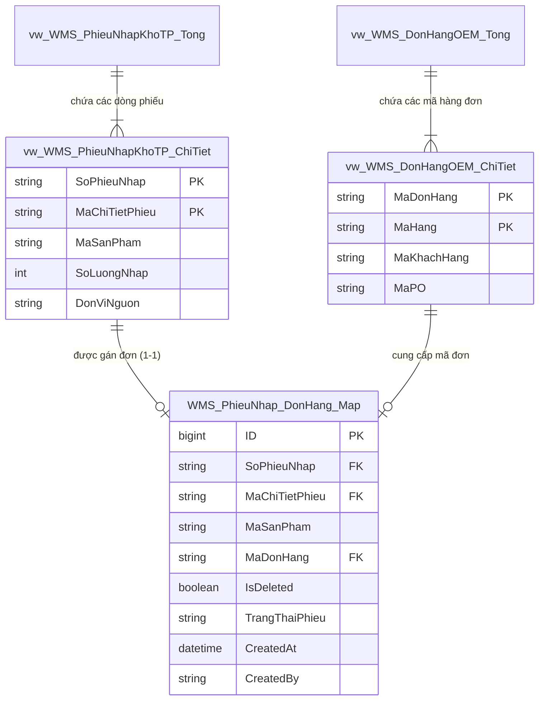

# Phân tích Thiết kế Logic UC02 - Nhận dữ liệu phiếu giao kho từ sản xuất & Gán đơn OEM

Tài liệu này đi sâu vào phân tích hệ thống ở 5 khía cạnh bắt buộc: **Business Logic**, **UI/UX Guidelines**, **Programming Logic**, **Data Logic**, và **Diagrams (Mermaid)** dành cho chức năng nhận và tiền xử lý phiếu giao kho từ sản xuất, với trọng tâm đối chiếu dữ liệu gốc ERP và gán mã đơn hàng OEM.

---

## 1. Business Logic (Logic Nghiệp Vụ)

- **Mục tiêu cốt lõi:** Tiếp nhận chính xác dữ liệu phiếu giao kho thành phẩm từ phân hệ sản xuất (thông qua hệ thống ERP), thực hiện đối chiếu chéo (Cross-check) thông tin bối cảnh với nguồn dữ liệu gốc ERP để xác thực tính toàn vẹn, và thiết lập liên kết giữa dòng phiếu nhập với mã đơn hàng OEM trước khi quét mã vạch nhập kho. Quá trình gán đơn hoàn toàn tự động, trực quan và an toàn dữ liệu.

- **Các quy tắc nghiệp vụ (Business Rules):**
  - `BR-UC02-01` **Tiền xử lý độc lập (Decoupled Pre-processing):** Việc gán mã đơn hàng OEM được thực hiện trực tiếp trong WMS thay vì bắt buộc phải có sẵn từ ERP. Giúp bộ phận kho chủ động điều phối theo thực tế xuất hàng.
  - `BR-UC02-02` **Ràng buộc toàn vẹn & Khớp mã tuyệt đối (Absolute Product Integrity):** Khi tìm kiếm và hiển thị đơn hàng OEM trên Modal, hệ thống lọc và chỉ trả về danh sách các Đơn hàng OEM thuộc **chính xác 100%** mã sản phẩm (`MaSanPham = MaHang`). Ngăn chặn hoàn toàn việc nhân viên gán nhầm đơn hàng của mã biến thể tương tự (VD: chặn hiển thị đơn của sản phẩm `D.501-5MM` khi đang gán cho `D.501`).
  - `BR-UC02-03` **Tính linh hoạt cập nhật & Khóa dữ liệu (Flexible Update & Soft-Lock):** 
    - (A) **Linh hoạt Cập nhật:** Các dòng phiếu đã gán đơn OEM có thể được chỉnh sửa / đổi sang đơn khác bất kỳ lúc nào nếu phát hiện thao tác nhầm lẫn.
    - (B) **Khóa Cứng (Soft-Lock):** Ngay khi một dòng phiếu phát sinh bất kỳ thao tác quét tem nhập kho nào (tức là đã nhập hàng vật lý - `scannedQty > 0`), hệ thống sẽ khóa cứng toàn bộ quyền sửa/đổi mã đơn OEM để bảo vệ tính toàn vẹn hạch toán Sổ Cái.
  - `BR-UC02-04` **Phạm vi gán đơn (Line-level Granularity):** Mã đơn hàng được gán chi tiết ở cấp **dòng phiếu** (`MaChiTietPhieu`), không gán ở cấp tổng phiếu.
  - `BR-UC02-05` **Cách ly dữ liệu ERP (Data Isolation & Non-intrusive):** WMS không ghi ngược (`UPDATE`/`INSERT`) vào bất kỳ bảng hoặc view nào của hệ thống ERP. Tất cả dữ liệu mapping được lưu trữ độc lập tại bảng `WMS_PhieuNhap_DonHang_Map` trong CSDL WMS. Không quản lý "Đợt giao" (`BatchNo`) ở cấp độ nhận phiếu WMS vì dữ liệu Đợt Giao do hệ thống ERP tự quản lý và truy xuất qua View tĩnh.
  - `BR-UC02-06` **Hủy gán đơn OEM (Unmap):** Nếu nhân viên gán sai, hệ thống cho phép hủy gán (Unmap) trả dòng phiếu về trạng thái ban đầu bằng cách Soft-delete (`IsDeleted = 1`) trong `WMS_PhieuNhap_DonHang_Map`. Việc hủy gán cũng tuân thủ nguyên tắc Khóa Cứng (Soft-Lock) tại `BR-UC02-03(B)`.
- **Quy trình tương tác (Interaction Flow):**
  - **Bước 1:** Nhân viên kho mở danh sách phiếu giao kho (gọi dữ liệu từ `vw_WMS_PhieuNhapKhoTP_Tong`).
  - **Bước 2:** Nhấp chọn một phiếu nhập để xem danh sách chi tiết các dòng hàng (gọi dữ liệu từ `vw_WMS_PhieuNhapKhoTP_ChiTiet` kết hợp `WMS_PhieuNhap_DonHang_Map`).
  - **Bước 3:** 
    - Nếu dòng chưa gán đơn: Bấm **"Gán đơn OEM"**.
    - Nếu dòng đã gán đơn (và `scannedQty == 0`): Bấm icon **Edit (Cây bút)** bên cạnh mã đơn để tiến hành đổi mã.
  - **Bước 4:** Màn hình Modal xuất hiện, tự động query danh sách tất cả các Đơn hàng OEM thuộc chính xác 100% Mã sản phẩm (`MaSanPham`) đang chọn. 
  - **Bước 5:** Nhân viên nhấp chọn Đơn OEM (hiển thị nền xanh highlight) và bấm **"✓ Xác Nhận Gán Đơn OEM"**.
  - **Bước 6:** Backend kiểm tra an toàn dữ liệu, tự động tự động xử lý chuyển đổi Type, và UPSERT lưu bền vững vào `WMS_PhieuNhap_DonHang_Map`. Giao diện cập nhật sang trạng thái Đơn OEM mới kèm nút quét kho.

---

## 2. Tiêu chuẩn Thiết kế Giao diện (UI/UX Guidelines)

- **Thiết bị đích:** Máy tính để bàn (Desktop Web UI) cho Thủ kho và Máy kiểm kê cầm tay (RF Scanner / Mobile Tablet) cho Nhân viên kho.
- **Yêu cầu trải nghiệm (UX Principles):**
  - **Phân biệt trực quan trạng thái:** Sử dụng Badge màu nổi bật:
    - 🟡 *Chưa gán đơn OEM:* Nút bấm màu cam nhấp nháy/khuyến khích gán ngay (`LinkIcon`).
    - 🔵 *Đã gán đơn OEM (Chưa quét):* Hiển thị Badge màu xanh (`#e0e7ff`) chứa thông tin Đơn hàng OEM. Bên phải hiển thị **Icon Sửa (Edit2)** để cập nhật và **Icon Thùng rác đỏ (Trash2)** để Hủy gán (Unmap).
    - 🟢 *Đã gán đơn OEM & Đã phát sinh quét kho:* Badge Đơn OEM hiển thị độc lập, ẩn hoàn toàn cả nút Edit và nút Hủy (Khóa Soft-lock chống sửa sai luồng kho).
  - **Sắp xếp hiển thị Modal (CTE Sort):** Khi tìm kiếm Đơn hàng OEM trên Modal, hệ thống ưu tiên đẩy các Đơn OEM khớp chính xác 100% mã sản phẩm lên **đầu danh sách**. Các đơn khác chứa từ khóa được đẩy xuống dưới.
  - **Lựa chọn & Xác nhận an toàn:** Mỗi dòng Đơn OEM khi nhấp chọn sẽ highlight nền `#eff6ff` và viền xanh `#2563eb`. Nút **"✓ Xác Nhận Gán Đơn OEM"** thiết kế kích thước full-width dưới chân khối Modal. Khi Hủy Gán (Unmap), yêu cầu người dùng xác nhận qua hộp thoại (Confirm Dialog) để tránh thao tác nhầm.
  - **Phản hồi tức thì & Safe State:** Khi lưu mapping thành công, giao diện tự động refresh chi tiết dòng thông qua local state mà không làm tải lại toàn bộ trang, giữ nguyên vị trí cuộn cho trải nghiệm mượt mà.

---

## 3. Programming Logic (Logic Lập Trình)

### 3.1. Tính An Toàn Dữ Liệu Type-Casting (Phòng chống HTTP 400 Validation Error)
- Dữ liệu `MaChiTietPhieu` (`lineNo`) trong CSDL (ERP View) thường có kiểu dữ liệu là số nguyên. Khi đẩy JSON từ Client ReactJS qua .NET Core, hệ thống cần chặn trước khả năng lỗi `ValidationProblemDetails` (Cannot convert JSON Number to System.String).
- **Backend API (C#):** Định nghĩa Data Transfer Object (DTO) dùng kiểu biến `object?` linh hoạt để hứng Payload JSON ở đa định dạng (String/Number/Boolean).
  ```csharp
  public record MapOemOrderRequest(object? HandoverNo, object? LineNo, object? ProductCode, object? OrderNo);
  // Ép kiểu an toàn (Safe-Casting) trước khi đẩy vào SQL
  MaChiTietPhieu = request.LineNo?.ToString() ?? "",
  ```
- **Frontend (JavaScript):** Ép chuỗi (String casting) trước khi đẩy qua Axios.
  ```javascript
  receivingApi.mapOrder({
    handoverNo: String(handoverNo || ''),
    lineNo: String(activeLine.handover_line_no || activeLine.id || ''),
    // ...
  });
  ```

### 3.2. Truy vấn thông tin bối cảnh (Context Queries & ERP View Validation)
Hệ thống WMS **không tin tưởng mã quăng dữ liệu trực tiếp từ Backend/Client**, mà bắt buộc Stored Procedure tại CSDL thực hiện đối chiếu chéo (Cross-check) với các nguồn dữ liệu gốc ERP để bảo vệ tính toàn vẹn hệ thống:

1. **Xác thực dòng phiếu nhập tồn tại:** `SELECT 1 FROM dbo.vw_WMS_PhieuNhapKhoTP_ChiTiet ...`
2. **Xác thực mã đơn hàng OEM tồn tại:** `SELECT 1 FROM dbo.vw_WMS_DonHangOEM_Tong ...`
3. **Xác thực khớp Mã sản phẩm và Đơn hàng OEM:** `SELECT 1 FROM dbo.vw_WMS_DonHangOEM_ChiTiet ...`

### 3.3. Backend API & Stored Procedure Execution
- **Endpoints:**
  - ASP.NET Core Web API: `POST /api/v1/receipt/map-order` 
  - .NET Core Controller: `POST /api/v1/receipt/handover/map-order` (`ReceiptController.cs`).
- **Stored Procedure Core Logic (`usp_WMS_UC02_UpdateMaDonHang`):**
```sql
CREATE OR ALTER PROCEDURE dbo.usp_WMS_UC02_UpdateMaDonHang
    @SoPhieuNhap NVARCHAR(50),
    @MaChiTietPhieu NVARCHAR(50),
    @MaSanPham NVARCHAR(50),
    @MaDonHang NVARCHAR(50),
    @UserId NVARCHAR(50) = 'SYSTEM'
AS
BEGIN
    SET NOCOUNT ON;
    BEGIN TRY
        BEGIN TRANSACTION;

        -- Fail-fast Check: Ràng buộc tuyệt đối - Mã sản phẩm phải thuộc Đơn OEM ERP
        IF EXISTS (SELECT 1 FROM dbo.vw_WMS_DonHangOEM_ChiTiet WHERE MaDonHang = @MaDonHang)
           AND NOT EXISTS (SELECT 1 FROM dbo.vw_WMS_DonHangOEM_ChiTiet WHERE MaDonHang = @MaDonHang AND MaHang = @MaSanPham)
        BEGIN
            RAISERROR(N'ERR_UC02_PRODUCT_MISMATCH: Mã sản phẩm [%s] không thuộc Đơn hàng OEM [%s] trên hệ thống ERP.', 16, 1, @MaSanPham, @MaDonHang);
            ROLLBACK TRANSACTION;
            RETURN;
        END;

        -- Hỗ trợ Update Ghi đè (UPSERT)
        IF EXISTS (SELECT 1 FROM dbo.WMS_PhieuNhap_DonHang_Map WHERE SoPhieuNhap = @SoPhieuNhap AND MaChiTietPhieu = @MaChiTietPhieu AND IsDeleted = 0)
        BEGIN
            UPDATE dbo.WMS_PhieuNhap_DonHang_Map
            SET MaSanPham = @MaSanPham, MaDonHang = @MaDonHang, UpdatedAt = GETDATE(), UpdatedBy = @UserId
            WHERE SoPhieuNhap = @SoPhieuNhap AND MaChiTietPhieu = @MaChiTietPhieu AND IsDeleted = 0;
        END
        ELSE
        BEGIN
            INSERT INTO dbo.WMS_PhieuNhap_DonHang_Map (SoPhieuNhap, MaChiTietPhieu, MaSanPham, MaDonHang, CreatedBy)
            VALUES (@SoPhieuNhap, @MaChiTietPhieu, @MaSanPham, @MaDonHang, @UserId);
        END;

        COMMIT TRANSACTION;
    END TRY
    BEGIN CATCH
        IF @@TRANCOUNT > 0 ROLLBACK TRANSACTION;
        THROW;
    END CATCH;
END;
```

---

## 4. Data Logic (Thiết kế Dữ Liệu)

### 4.1. Ma trận phân quyền CRUD

| Thực thể / Bảng Dữ Liệu | Create (Tạo) | Read (Đọc) | Update (Cập nhật) | Delete (Xóa) | Ý nghĩa nghiệp vụ trong UC02 |
| :--- | :---: | :---: | :---: | :---: | :--- |
| `vw_WMS_PhieuNhapKhoTP_Tong` | - | **X** | - | - | ERP View: Đọc danh sách tổng quan phiếu nhập kho |
| `vw_WMS_PhieuNhapKhoTP_ChiTiet` | - | **X** | - | - | ERP View: Đọc chi tiết từng dòng mặt hàng trong phiếu |
| `vw_WMS_DonHangOEM_Tong` | - | **X** | - | - | ERP View: Tra cứu danh mục mã đơn hàng OEM |
| `vw_WMS_DonHangOEM_ChiTiet` | - | **X** | - | - | ERP View: Xác thực mã sản phẩm thuộc đơn OEM |
| `WMS_PhieuNhap_DonHang_Map` | **X** | **X** | **X** | - | WMS Table: Lưu bản ghi mapping mã đơn OEM cho từng dòng phiếu |

### 4.2. Định nghĩa Trạng thái (Conceptual Model & Status Flags)

| Biến / Flag | Giá trị | Ý nghĩa Nghiệp vụ |
| :--- | :--- | :--- |
| `TrangThaiPhieu` | `NEW` / `IN_PROGRESS` / `COMPLETED` | Trạng thái vòng đời của phiếu giao kho |
| `IsDeleted` | `0` (Active) / `1` (Disabled) | Cờ trạng thái bản ghi mapping tại `WMS_PhieuNhap_DonHang_Map` |
| `SoftLockStatus` | `UNLOCKED` / `LOCKED` | Trạng thái cho phép gán/sửa đơn OEM (Khóa khi `scannedQty > 0`) |

### 4.3. Cập nhật Sổ Cái Kép (Dual Ledger Logic)
- **Đánh giá ảnh hưởng hạch toán:** Ở bước UC02 (Tiền xử lý & gán mã đơn OEM), hệ thống **chưa phát sinh hạch toán ghi tăng/giảm tồn kho** vào các bảng Sổ cái Kép (`stock_transaction_book`, `inventory_ledger`, `item_ledger`).
- **Ý nghĩa với Sổ cái Kép:** Việc gán thành công `MaDonHang` tại `WMS_PhieuNhap_DonHang_Map` tạo tiền đề dữ liệu bắt buộc (Data Requirement) để ở bước **UC03 (Quét tem nhập kho)** và **UC04 (Thủ kho xác nhận)**, hệ thống có đủ thông tin mã đơn OEM để kế thừa và hạch toán chính xác dòng ghi Nợ/Có vào Sổ cái Kép theo đúng cấu trúc `(HandoverNo, OrderNo, ProductCode, Qty)`.

---

## 5. Biểu Đồ Thiết Kế (Diagrams)

### 5.1. Sequence Diagram (Luồng tương tác & Đối chiếu View ERP)



### 5.2. Data Layer Architecture (Data Flow & Transaction Locking)



### 5.3. Entity Relationship & State Logic Map (ERD Map UC02)


