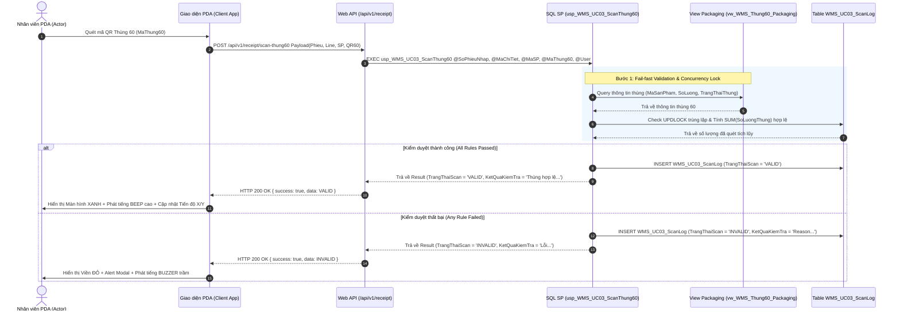
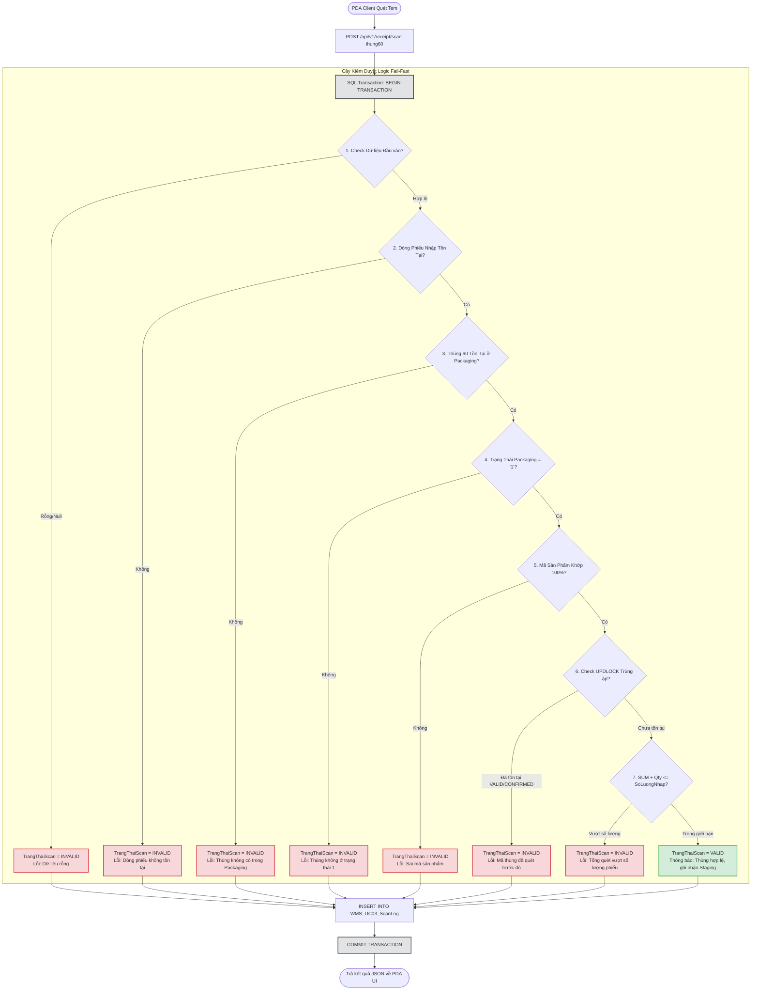
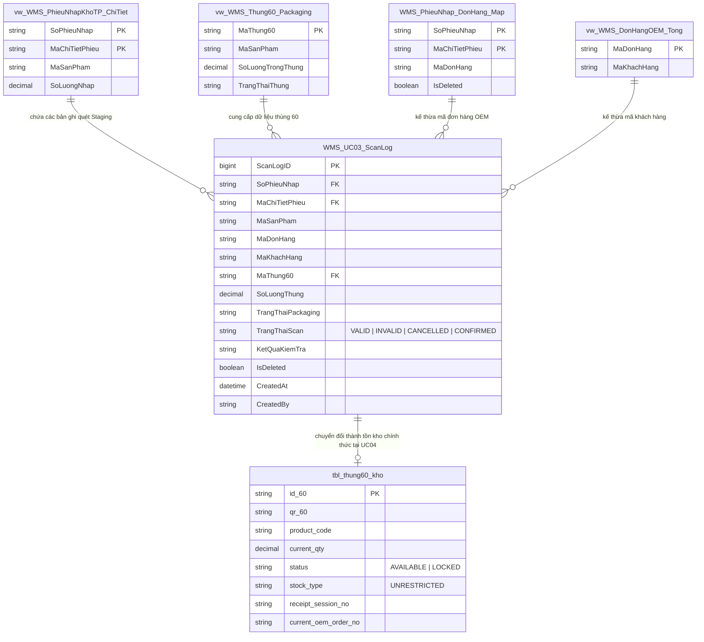

# Phân tích Thiết kế Logic UC03 - Quét nhập tạm thùng 60

Tài liệu này đi sâu vào phân tích và thiết kế toàn diện hệ thống ở 5 khía cạnh cốt lõi: **Business Logic**, **UI/UX Guidelines**, **Programming Logic**, **Data Logic** và **Diagrams (Biểu đồ Mermaid)** cho chức năng **Quét nhập tạm thùng 60 (Staging Inbound)** trong hệ thống Quản lý Kho (WMS).

---

## 1. Business Logic (Logic Nghiệp Vụ)

### 1.1. Mục tiêu cốt lõi
- **Tạm thu & Kiểm đối kho tạm (Staging):** Đảm bảo hàng hóa vật lý từ phân xưởng đóng gói khi chuyển sang kho thành phẩm được đối chiếu chính xác 100% với chứng từ phiếu nhập kho (`vw_WMS_PhieuNhapKhoTP_ChiTiet`).
- **Ngăn ngừa sai sót vận hành:** Loại bỏ hoàn toàn rủi ro nhập sai mã sản phẩm, nhập dư vượt số lượng yêu cầu, hoặc quét trùng lặp mã thùng 60.
- **Cách ly sổ cái (Ledger Isolation):** Quá trình quét tem mang tính chất tạm thu (Staging log). Dữ liệu chỉ ghi nhận vào bảng log trung gian `WMS_UC03_ScanLog` và **tuyệt đối chưa ghi nợ/có** vào Sổ Cái Kép (Dual Ledger) chính thức cho đến khi thủ kho bấm Xác nhận nhập kho tại **UC04**.

---

### 1.2. Các quy tắc nghiệp vụ (Business Rules)

- **`[BR-UC03-01]` Kiểm tra trạng thái vật lý Packaging:**
  - Mã thùng 60 (`MaThung60`) chỉ được phép chấp nhận nếu trạng thái đóng gói tại hệ thống Packaging (`vw_WMS_Thung60_Packaging.TrangThaiThung`) đang là `'1'` (Đã đóng gói hoàn tất, sẵn sàng nhập kho, chưa gán phiếu nhập trước đó).

- **`[BR-UC03-02]` Nguyên tắc Nhập tạm (Staging Inbound):**
  - Quét mã QR thùng 60 chỉ tạo bản ghi kiểm kê tạm thời với cờ trạng thái `VALID` trong bảng `WMS_UC03_ScanLog`.
  - Không ghi nhận tăng tồn kho khả dụng (`AVAILABLE`), không tạo giao dịch trong `stock_transaction_book`, `inventory_ledger` hay `item_ledger`.

- **`[BR-UC03-03]` Ràng buộc ngưỡng số lượng (Quantity Boundary Check):**
  - Tổng số lượng của các thùng đã quét hợp lệ (`VALID` / `CONFIRMED`) cộng với số lượng của thùng đang quét **không được phép vượt quá** số lượng yêu cầu nhập (`SoLuongNhap`) trên dòng phiếu (`vw_WMS_PhieuNhapKhoTP_ChiTiet`).
  - Cho phép quét từng phần (partial scanning) theo tiến độ, nhưng nếu số lượng thùng mới khiến tổng vượt ngưỡng, hệ thống sẽ từ chối và gắn cờ `INVALID`.

- **`[BR-UC03-04]` Đối chiếu chéo Mã sản phẩm (Cross-Product Validation):**
  - Mã sản phẩm lưu trên tem thùng (`vw_WMS_Thung60_Packaging.MaSanPham`) phải trùng khớp chính xác 100% với mã sản phẩm trên dòng phiếu nhập kho (`vw_WMS_PhieuNhapKhoTP_ChiTiet.MaSanPham`).

- **`[BR-UC03-05]` Chống quét trùng lặp (Anti-Duplication Protection):**
  - Một thùng 60 (`MaThung60`) không được phép quét lại nếu đã tồn tại trong `WMS_UC03_ScanLog` (với `IsDeleted = 0`) ở trạng thái `VALID` (đang chờ xác nhận) hoặc `CONFIRMED` (đã xác nhận nhập kho).

- **`[BR-UC03-06]` Tự động gán Đơn hàng OEM & Khách hàng:**
  - Khi quét thùng hợp lệ, Staging Log tự động liên kết và kế thừa thông tin `MaDonHang` và `MaKhachHang` từ bảng ánh xạ đơn hàng `WMS_PhieuNhap_DonHang_Map` và view `vw_WMS_DonHangOEM_Tong`.

---

### 1.3. Quy trình tương tác 5 bước (Interaction Flow)

```
[Nhân viên PDA]                    [Màn hình UI PDA]                   [Backend API / SP]
       |                                   |                                    |
       |--- 1. Chọn dòng phiếu nhập ------>|                                    |
       |                                   |--- Hiển thị thông tin dòng & progress ->|
       |--- 2. Quét tem QR Thùng 60 ------>|                                    |
       |                                   |--- 3. Gửi payload POST scan-thung60->|
       |                                   |                                    |--- Thực thi SP Fail-fast
       |                                   |<-- 4. Trả về kết quả VALID/INVALID-|
       |<-- Phản hồi Màu sắc/Âm thanh -----|                                    |
       |--- 5. Lặp lại quét thùng tiếp --->|                                    |
```

1. **Bước 1 (Khởi tạo):** Nhân viên kho chọn dòng phiếu nhập kho cần nhập trên màn hình PDA/Desktop (Xác định `SoPhieuNhap`, `MaChiTietPhieu`, `MaSanPham`).
2. **Bước 2 (Thao tác quét):** Nhân viên dùng máy quét RF / PDA quét mã QR trên thùng 60 (`MaThung60`).
3. **Bước 3 (Kiểm duyệt Fail-fast):** Hệ thống API nhận request và gọi Stored Procedure `usp_WMS_UC03_ScanThung60`. Database thực thi chuỗi kiểm tra fail-fast (Trạng thái Packaging, Mã SP, Trùng lặp, Số lượng tích lũy).
4. **Bước 4 (Phản hồi & Ghi Log):** Hệ thống ghi nhận kết quả vào `WMS_UC03_ScanLog` và trả về kết quả cho UI. Màn hình PDA lập tức phát ra âm thanh và đổi màu phản hồi (Xanh cho `VALID`, Đỏ cho `INVALID`).
5. **Bước 5 (Tích lũy & Hoàn tất Staging):** Nhân viên tiếp tục quét các thùng tiếp theo cho đến khi thanh tiến độ đạt 100% (`SoLuongDaQuet == SoLuongNhap`).

---

## 2. Tiêu chuẩn Thiết kế Giao diện (UI/UX Guidelines)

### 2.1. Thiết bị đích & Môi trường vận hành
- **Chính:** Máy quét cầm tay RF / PDA chuyên dụng (HĐH Android / Windows CE, có đầu đọc mã vạch phần cứng).
- **Phụ:** Giao diện Web Desktop Admin Portal dành cho thủ kho giám sát tiến độ nhập tạm từ xa.

---

### 2.2. Quy tắc Trải nghiệm Người dùng (UX Requirements)

1. **Tự động Focus & Debounce Ô nhập:**
   - Trường nhập mã QR (`txtBarCode`) luôn giữ trạng thái `autofocus`. Ngay sau khi xử lý xong một mã quét (dù thành công hay thất bại), hệ thống tự động xóa trắng text và lấy lại focus để sẵn sàng cho lần quét tiếp theo mà người dùng không cần chạm tay vào màn hình.
   - Hỗ trợ xử lý ký tự xuống dòng (`Enter` key code 13) từ phần cứng súng quét mã vạch hoặc cơ chế `debounce` 300ms.

2. **Phản hồi Thị giác & Thính giác (Visual & Audio Feedback):**
   - **Thành công (`VALID`):**
     - Màn hình lóe sáng hiệu ứng màu Xanh Emerald (`#10B981`).
     - Loa PDA phát âm thanh *Beep-Beep* âm điệu cao (High-pitch chime: 1200Hz, 150ms).
     - Đưa dòng log mới nhất lên đầu danh sách với badge Xanh **[VALID]**.
   - **Thất bại (`INVALID`):**
     - Màn hình hiển thị viền/modal cảnh báo màu Đỏ Ruby (`#EF4444`).
     - PDA rung báo hiệu và phát tiếng *Buzzer* âm điệu trầm (Low-pitch beep: 300Hz, 500ms).
     - Rõ ràng thông điệp nguyên nhân lỗi (VD: *"Mã thùng đã được quét trước đó"*, *"Sai mã sản phẩm"*).

3. **Chỉ số Tiến độ Thời gian thực (Real-time Progress Bar):**
   - Hiển thị thanh tiến trình trực quan dạng phần trăm (`%`) và tỉ số thùng: `Đã quét: X / Y Thùng` (Ví dụ: `45 / 50 Thùng (90%)`).
   - Cập nhật số lượng còn thiếu `SoLuongConThieu = SoLuongNhap - SoLuongDaQuet` tức thì sau mỗi lần quét.

4. **Danh sách Log Quét & Chức năng Hủy Quét (Cancel Scan):**
   - Danh sách hiển thị lịch sử các lượt quét trong phiên làm việc current session (Thời gian, Mã thùng, Số lượng, Trạng thái, Thông điệp).
   - Mỗi dòng quét trạng thái `VALID` đều có nút **[Hủy Quét]** (Cancel Scan).
   - Khi bấm **[Hủy Quét]**, xuất hiện Modal xác nhận lý do hủy. Nếu xác nhận, hệ thống gọi API `/api/v1/receipt/cancel-scan` chuyển trạng thái log thành `CANCELLED` và tự động trừ số lượng tích lũy trên UI.

---

## 3. Programming Logic (Logic Lập Trình)

Hệ thống tuân thủ nghiêm ngặt mô hình **Thin-Backend, Fat-Database**: Toàn bộ quy tắc kiểm duyệt logic, quản lý giao dịch, chống race condition bằng locking `UPDLOCK` được thực hiện trực tiếp tại SQL Stored Procedures. Backend Web API đóng vai trò Router, Authentication, và Format Response.

---

### 3.1. Frontend Logic (React Component State)

```typescript
// Các State chính cần quản lý trong Component InboundScanner.jsx / ScanScreen.jsx
interface ScanLogItem {
  scanLogId: number;
  maThung60: string;
  soLuongThung: number;
  trangThaiScan: 'VALID' | 'INVALID' | 'CANCELLED' | 'CONFIRMED';
  ketQuaKiemTra: string;
  createdAt: string;
}

interface InboundProgress {
  soPhieuNhap: string;
  maChiTietPhieu: string;
  maSanPham: string;
  soLuongCanNhap: number;
  soLuongDaQuet: number;
  soLuongConThieu: number;
  tyLeHoanThanh: number;
}
```

> **[LƯU Ý QUAN TRỌNG VỀ VALIDATION]**
> Khi gọi API `scan-thung60`, payload gửi lên bắt buộc phải khớp 100% kiểu dữ liệu (Data Type) với `record ScanThung60Request` bên C#.
> Vì `LineNo` bên C# khai báo là `string`, nếu Frontend gửi lên dạng số (`integer`), ASP.NET Core sẽ tự động reject request bằng lỗi **HTTP 400 Bad Request (One or more validation errors occurred)** trước khi chạm tới Controller.
> **Cách xử lý:** Luôn ép kiểu `String(lineNo)` trước khi gửi payload.

---

### 3.2. Backend API Implementations

#### A. C# ASP.NET Core Controller (`ReceiptController.cs`)

```csharp
using Dapper;
using Microsoft.AspNetCore.Authorization;
using Microsoft.AspNetCore.Mvc;
using Wms.Application.Common.Interfaces;
using Wms.Application.Common.Models;

namespace Wms.Api.Controllers;

[ApiController]
[Route("api/v1/receipt")]
[Authorize]
public class ReceiptController : ControllerBase
{
    private readonly IStoredProcedureExecutor _spExecutor;
    private readonly ICurrentUserService _currentUserService;

    public ReceiptController(
        IStoredProcedureExecutor spExecutor,
        ICurrentUserService currentUserService)
    {
        _spExecutor = spExecutor;
        _currentUserService = currentUserService;
    }

    /// <summary>
    /// UC03: Quét nhập tạm thùng 60 vào kho Staging
    /// </summary>
    [HttpPost("scan-thung60")]
    public async Task<IActionResult> ScanThung60([FromBody] ScanThung60Request request)
    {
        if (string.IsNullOrWhiteSpace(request.HandoverNo) ||
            string.IsNullOrWhiteSpace(request.LineNo) ||
            string.IsNullOrWhiteSpace(request.Qr60))
        {
            return BadRequest(ApiResponse<object>.Error(
                "INVALID_INPUT", 
                "Mã phiếu nhập, mã dòng phiếu và mã QR thùng 60 không được để trống."));
        }

        var parameters = new
        {
            SoPhieuNhap = request.HandoverNo,
            MaChiTietPhieu = request.LineNo,
            MaSanPham = request.ProductCode,
            MaThung60 = request.Qr60,
            UserName = _currentUserService.Username ?? "SYSTEM_PDA"
        };

        try
        {
            var result = await _spExecutor.QueryFirstOrDefaultAsync<dynamic>(
                "dbo.usp_WMS_UC03_ScanThung60", 
                parameters);

            return Ok(ApiResponse<object>.Success(result));
        }
        catch (Exception ex)
        {
            return StatusCode(500, ApiResponse<object>.Error(
                "SP_EXECUTION_ERROR", 
                $"Lỗi thực thi Stored Procedure: {ex.Message}"));
        }
    }

    /// <summary>
    /// UC03: Hủy dòng quét nhập tạm (Cancel Scan Log)
    /// </summary>
    [HttpPost("cancel-scan")]
    public async Task<IActionResult> CancelScan([FromBody] CancelScanRequest request)
    {
        if (request.ScanLogId <= 0)
        {
            return BadRequest(ApiResponse<object>.Error(
                "INVALID_ID", 
                "ID dòng quét không hợp lệ."));
        }

        var parameters = new
        {
            ScanLogID = request.ScanLogId,
            UserName = _currentUserService.Username ?? "SYSTEM_PDA",
            CancelReason = string.IsNullOrWhiteSpace(request.Reason) 
                ? "Hủy thao tác quét từ giao diện PDA/Desktop" 
                : request.Reason
        };

        try
        {
            var result = await _spExecutor.QueryFirstOrDefaultAsync<dynamic>(
                "dbo.usp_WMS_UC03_CancelScan", 
                parameters);

            return Ok(ApiResponse<object>.Success(result));
        }
        catch (Exception ex)
        {
            return StatusCode(500, ApiResponse<object>.Error(
                "CANCEL_FAILED", 
                $"Không thể hủy dòng quét: {ex.Message}"));
        }
    }
}

public record ScanThung60Request(string HandoverNo, string LineNo, string ProductCode, string Qr60);
public record CancelScanRequest(long ScanLogId, string? Reason);
```

#### B. ASP.NET Core Web API Route (`/api/v1/receipt`)

```javascript
const express = require('express');
const router = express.Router();
const sql = require('mssql');
const { poolPromise } = require('../db');

/**
 * POST /api/v1/receipt/scan-thung60
 * Realtime scan validation & staging log creation
 */
router.post('/scan-thung60', async (req, res) => {
  const { handoverNo, lineNo, productCode, qr60 } = req.body;
  const username = req.user?.username || 'SYSTEM_PDA';

  if (!handoverNo || !lineNo || !qr60) {
    return res.status(400).json({
      success: false,
      errorCode: 'INVALID_INPUT',
      message: 'Thiếu thông tin chứng từ hoặc mã thùng 60.'
    });
  }

  try {
    const pool = await poolPromise;
    const result = await pool.request()
      .input('SoPhieuNhap', sql.NVarChar(50), handoverNo)
      .input('MaChiTietPhieu', sql.NVarChar(50), lineNo)
      .input('MaSanPham', sql.NVarChar(50), productCode)
      .input('MaThung60', sql.NVarChar(100), qr60)
      .input('UserName', sql.NVarChar(100), username)
      .execute('dbo.usp_WMS_UC03_ScanThung60');

    const scanData = result.recordset[0];
    return res.status(200).json({
      success: true,
      data: scanData
    });
  } catch (err) {
    console.error('[UC03_SCAN_ERROR]', err);
    return res.status(500).json({
      success: false,
      errorCode: 'DATABASE_ERROR',
      message: err.message || 'Lỗi xử lý cơ sở dữ liệu khi quét tem thùng 60.'
    });
  }
});

/**
 * POST /api/v1/receipt/cancel-scan
 * Soft-delete staging scan log
 */
router.post('/cancel-scan', async (req, res) => {
  const { scanLogId, reason } = req.body;
  const username = req.user?.username || 'SYSTEM_PDA';

  if (!scanLogId) {
    return res.status(400).json({
      success: false,
      errorCode: 'INVALID_ID',
      message: 'Thiếu ScanLogID cần hủy.'
    });
  }

  try {
    const pool = await poolPromise;
    const result = await pool.request()
      .input('ScanLogID', sql.BigInt, scanLogId)
      .input('UserName', sql.NVarChar(100), username)
      .input('CancelReason', sql.NVarChar(500), reason || 'Hủy từ PDA UI')
      .execute('dbo.usp_WMS_UC03_CancelScan');

    return res.status(200).json({
      success: true,
      data: result.recordset[0]
    });
  } catch (err) {
    console.error('[UC03_CANCEL_ERROR]', err);
    return res.status(500).json({
      success: false,
      errorCode: 'CANCEL_ERROR',
      message: err.message || 'Không thể thực thi hủy dòng quét.'
    });
  }
});

module.exports = router;
```

---

### 3.3. SQL Source Code của các Stored Procedures chính

#### A. Stored Procedure quét kiểm đối `dbo.usp_WMS_UC03_ScanThung60`

```sql
USE WMS1;
GO
SET QUOTED_IDENTIFIER ON;
SET ANSI_NULLS ON;
GO

CREATE OR ALTER PROCEDURE dbo.usp_WMS_UC03_ScanThung60
    @SoPhieuNhap NVARCHAR(50),
    @MaChiTietPhieu NVARCHAR(50),
    @MaSanPham NVARCHAR(50),
    @MaThung60 NVARCHAR(100),
    @UserName NVARCHAR(100)
AS
BEGIN
    SET NOCOUNT ON;
    SET XACT_ABORT ON;

    DECLARE 
        @SoLuongThung DECIMAL(18,2),
        @MaSanPhamThung NVARCHAR(50),
        @TrangThaiThung NVARCHAR(10),
        @SoLuongPhieu DECIMAL(18,2),
        @SoLuongDaQuet DECIMAL(18,2),
        @MaDonHang NVARCHAR(50),
        @MaKhachHang NVARCHAR(50),
        @TrangThaiScan NVARCHAR(30),
        @KetQua NVARCHAR(500);

    BEGIN TRY
        BEGIN TRANSACTION;

        -- 1. Lấy thông tin phiếu nhập yêu cầu (Line Level)
        SELECT 
            @SoLuongPhieu = SoLuongNhap
        FROM dbo.vw_WMS_PhieuNhapKhoTP_ChiTiet WITH (NOLOCK)
        WHERE SoPhieuNhap = @SoPhieuNhap
          AND MaChiTietPhieu = @MaChiTietPhieu
          AND MaSanPham = @MaSanPham;

        -- 2. Lấy đơn hàng & khách hàng tương ứng (Mapping Level)
        SELECT 
            @MaDonHang = MaDonHang
        FROM dbo.WMS_PhieuNhap_DonHang_Map WITH (NOLOCK)
        WHERE SoPhieuNhap = @SoPhieuNhap
          AND MaChiTietPhieu = @MaChiTietPhieu
          AND IsDeleted = 0;

        SELECT 
            @MaKhachHang = MaKhachHang
        FROM dbo.vw_WMS_DonHangOEM_Tong WITH (NOLOCK)
        WHERE MaDonHang = @MaDonHang;

        -- 3. Query view Packaging hệ thống đóng gói
        SELECT
            @MaSanPhamThung = MaSanPham,
            @SoLuongThung = SoLuongTrongThung,
            @TrangThaiThung = TrangThaiThung
        FROM dbo.vw_WMS_Thung60_Packaging WITH (NOLOCK)
        WHERE MaThung60 = @MaThung60;

        -- 4. Trình tự kiểm duyệt Logic (Fail-fast validation)
        IF @SoPhieuNhap IS NULL OR @MaChiTietPhieu IS NULL OR @MaThung60 IS NULL
        BEGIN
            SET @TrangThaiScan = N'INVALID';
            SET @KetQua = N'Dữ liệu đầu vào không hợp lệ (mã phiếu, dòng phiếu hoặc mã thùng bị rỗng).';
        END
        ELSE IF @SoLuongPhieu IS NULL
        BEGIN
            SET @TrangThaiScan = N'INVALID';
            SET @KetQua = N'Dòng phiếu nhập không tồn tại hoặc mã sản phẩm không khớp với chứng từ.';
        END
        ELSE IF @MaSanPhamThung IS NULL
        BEGIN
            SET @TrangThaiScan = N'INVALID';
            SET @KetQua = N'Mã thùng 60 không tồn tại trong hệ thống Packaging.';
        END
        ELSE IF @TrangThaiThung <> '1'
        BEGIN
            SET @TrangThaiScan = N'INVALID';
            SET @KetQua = N'Mã thùng không ở trạng thái chờ nhập kho (Trạng thái vật lý Packaging khác 1).';
        END
        ELSE IF @MaSanPhamThung <> @MaSanPham
        BEGIN
            SET @TrangThaiScan = N'INVALID';
            SET @KetQua = N'Mã sản phẩm trên thùng (' + ISNULL(@MaSanPhamThung, N'N/A') + N') không khớp với dòng phiếu nhập (' + @MaSanPham + N').';
        END
        ELSE IF EXISTS (
            SELECT 1
            FROM dbo.WMS_UC03_ScanLog WITH (UPDLOCK, HOLDLOCK)
            WHERE MaThung60 = @MaThung60
              AND IsDeleted = 0
              AND TrangThaiScan IN (N'VALID', N'CONFIRMED')
        )
        BEGIN
            SET @TrangThaiScan = N'INVALID';
            SET @KetQua = N'Mã thùng ' + @MaThung60 + N' đã được quét hợp lệ hoặc đã nhập kho trước đó (Chống quét trùng).';
        END
        ELSE
        BEGIN
            -- Khóa dòng dữ liệu ScanLog để tính tổng chính xác trong môi trường nhiều máy quét đồng thời (Concurrency Control)
            SELECT 
                @SoLuongDaQuet = ISNULL(SUM(SoLuongThung), 0)
            FROM dbo.WMS_UC03_ScanLog WITH (UPDLOCK, HOLDLOCK)
            WHERE SoPhieuNhap = @SoPhieuNhap
              AND MaChiTietPhieu = @MaChiTietPhieu
              AND MaSanPham = @MaSanPham
              AND IsDeleted = 0
              AND TrangThaiScan IN (N'VALID', N'CONFIRMED');

            IF ISNULL(@SoLuongDaQuet, 0) + ISNULL(@SoLuongThung, 0) > @SoLuongPhieu
            BEGIN
                SET @TrangThaiScan = N'INVALID';
                SET @KetQua = N'Tổng số lượng quét (' + CAST(ISNULL(@SoLuongDaQuet, 0) + ISNULL(@SoLuongThung, 0) AS NVARCHAR) + N') vượt số lượng yêu cầu trên phiếu (' + CAST(@SoLuongPhieu AS NVARCHAR) + N').';
            END
            ELSE
            BEGIN
                SET @TrangThaiScan = N'VALID';
                SET @KetQua = N'Thùng hợp lệ, đã ghi nhận kho tạm Staging. Chờ thủ kho xác nhận.';
            END
        END;

        -- 5. Ghi log quét (Audit Log & Staging Log)
        INSERT INTO dbo.WMS_UC03_ScanLog
        (
            SoPhieuNhap,
            MaChiTietPhieu,
            MaSanPham,
            MaDonHang,
            MaKhachHang,
            MaThung60,
            SoLuongThung,
            TrangThaiPackaging,
            TrangThaiScan,
            KetQuaKiemTra,
            CreatedBy
        )
        VALUES
        (
            @SoPhieuNhap,
            @MaChiTietPhieu,
            @MaSanPham,
            ISNULL(@MaDonHang, N''),
            ISNULL(@MaKhachHang, N''),
            @MaThung60,
            ISNULL(@SoLuongThung, 0),
            ISNULL(@TrangThaiThung, N'0'),
            @TrangThaiScan,
            @KetQua,
            @UserName
        );

        COMMIT TRANSACTION;

        -- 6. Trả về kết quả cho API
        SELECT 
            @TrangThaiScan AS TrangThaiScan,
            @KetQua AS KetQuaKiemTra,
            @MaThung60 AS MaThung60,
            @MaSanPhamThung AS MaSanPhamThung,
            ISNULL(@SoLuongThung, 0) AS SoLuongThung,
            @TrangThaiThung AS TrangThaiPackaging,
            ISNULL(@MaDonHang, N'') AS MaDonHang,
            ISNULL(@MaKhachHang, N'') AS MaKhachHang;

    END TRY
    BEGIN CATCH
        IF @@TRANCOUNT > 0
            ROLLBACK TRANSACTION;

        DECLARE @ErrorMessage NVARCHAR(4000) = ERROR_MESSAGE();
        DECLARE @ErrorSeverity INT = ERROR_SEVERITY();
        DECLARE @ErrorState INT = ERROR_STATE();

        RAISERROR(@ErrorMessage, @ErrorSeverity, @ErrorState);
    END CATCH;
END;
GO
```

#### B. Stored Procedure hủy lượt quét `dbo.usp_WMS_UC03_CancelScan`

```sql
USE WMS1;
GO
SET QUOTED_IDENTIFIER ON;
SET ANSI_NULLS ON;
GO

CREATE OR ALTER PROCEDURE dbo.usp_WMS_UC03_CancelScan
    @ScanLogID BIGINT,
    @UserName NVARCHAR(100),
    @CancelReason NVARCHAR(500)
AS
BEGIN
    SET NOCOUNT ON;
    SET XACT_ABORT ON;

    BEGIN TRY
        BEGIN TRANSACTION;

        IF NOT EXISTS (
            SELECT 1
            FROM dbo.WMS_UC03_ScanLog WITH (UPDLOCK)
            WHERE ScanLogID = @ScanLogID
              AND IsDeleted = 0
        )
        BEGIN
            ROLLBACK TRANSACTION;
            RAISERROR(N'Dòng quét không tồn tại hoặc đã bị hủy trước đó.', 16, 1);
            RETURN;
        END;

        IF EXISTS (
            SELECT 1
            FROM dbo.WMS_UC03_ScanLog WITH (NOLOCK)
            WHERE ScanLogID = @ScanLogID
              AND TrangThaiScan = N'CONFIRMED'
              AND IsDeleted = 0
        )
        BEGIN
            ROLLBACK TRANSACTION;
            RAISERROR(N'Dòng quét đã được xác nhận nhập kho chính thức (CONFIRMED), không thể hủy trực tiếp.', 16, 1);
            RETURN;
        END;

        UPDATE dbo.WMS_UC03_ScanLog
        SET
            TrangThaiScan = N'CANCELLED',
            IsDeleted = 1,
            CancelledAt = GETDATE(),
            CancelledBy = @UserName,
            CancelReason = ISNULL(@CancelReason, N'Hủy thao tác quét từ giao diện PDA/Desktop')
        WHERE ScanLogID = @ScanLogID
          AND IsDeleted = 0;

        COMMIT TRANSACTION;

        SELECT N'OK' AS Result, N'Đã hủy dòng quét Staging thành công.' AS Message;
    END TRY
    BEGIN CATCH
        IF @@TRANCOUNT > 0
            ROLLBACK TRANSACTION;

        DECLARE @ErrorMessage NVARCHAR(4000) = ERROR_MESSAGE();
        DECLARE @ErrorSeverity INT = ERROR_SEVERITY();
        DECLARE @ErrorState INT = ERROR_STATE();

        RAISERROR(@ErrorMessage, @ErrorSeverity, @ErrorState);
    END CATCH;
END;
GO
```

---

## 4. Data Logic (Thiết kế Dữ Liệu)

### 4.1. Ma trận phân quyền CRUD

Bảng dưới đây tổng hợp quyền thao tác trên từng đối tượng dữ liệu trong phạm vi Use Case UC03:

| Bảng / View Dữ Liệu | Create (Tạo) | Read (Đọc) | Update (Sửa) | Delete (Xóa) | Ý nghĩa nghiệp vụ trong UC03 |
| :--- | :---: | :---: | :---: | :---: | :--- |
| `WMS_UC03_ScanLog` | **X** | **X** | **X** | - | Ghi vết nhật ký quét tem (Staging log). Cập nhật soft-delete `IsDeleted = 1` khi bấm Hủy quét. |
| `vw_WMS_PhieuNhapKhoTP_ChiTiet` | - | **X** | - | - | View dữ liệu ERP chứa danh sách dòng hàng và số lượng yêu cầu nhập `SoLuongNhap`. |
| `WMS_PhieuNhap_DonHang_Map` | - | **X** | - | - | Bảng ánh xạ giữa phiếu nhập kho và mã đơn hàng OEM tương ứng (`MaDonHang`). |
| `vw_WMS_Thung60_Packaging` | - | **X** | - | - | View đồng bộ dữ liệu từ hệ thống Đóng gói (Packaging), đọc `MaSanPham`, `SoLuongTrongThung`, `TrangThaiThung`. |
| `vw_WMS_DonHangOEM_Tong` | - | **X** | - | - | View thông tin tổng hợp đơn hàng OEM để lấy mã khách hàng `MaKhachHang`. |

---

### 4.2. Định nghĩa Trạng thái (Conceptual State Model)

Bảng mô tả các cờ trạng thái quét (`TrangThaiScan`) kiểm soát vòng đời dòng log tại `WMS_UC03_ScanLog`:

| Cờ Trạng Thái | Điều kiện gán | Ý nghĩa nghiệp vụ | Hành động cho phép tiếp theo |
| :--- | :--- | :--- | :--- |
| `VALID` | Vượt qua 100% các bước kiểm duyệt Fail-fast | Thùng 60 hợp lệ, đang nằm ở vùng Staging chờ thủ kho duyệt. | Được đếm vào tổng tiến độ. Cho phép Hủy (`CANCELLED`) hoặc Xác nhận nhập kho (`CONFIRMED` tại UC04). |
| `INVALID` | Vi phạm 1 trong các rule (Sai mã SP, Trùng tem, Vượt số lượng...) | Lượt quét bị từ chối do dữ liệu không hợp lệ. | Chỉ dùng mục đích Audit Trail. Không được tính vào tiến độ nhập kho. |
| `CANCELLED` | Người dùng bấm nút "Hủy Quét" khi log đang là `VALID` | Nhân viên kho hủy lượt quét tạm do quét nhầm hoặc muốn đổi thùng khác. | Đánh dấu `IsDeleted = 1`. Tự động khấu trừ số lượng khỏi tổng tích lũy. |
| `CONFIRMED` | Thủ kho bấm xác nhận nhập kho chính thức tại UC04 | Thùng đã được chuyển chính thức vào kho thành phẩm `tbl_thung60_kho`. | Khóa cứng vĩnh viễn. Không cho phép hủy trực tiếp từ UC03. |

---

### 4.3. Cập nhật Sổ Cái Kép (Dual Ledger Analysis for Staging Phase)

Một trong những nguyên tắc thiết kế cốt lõi của WMS là **Bảo vệ toàn vẹn Sổ Cái Kép (Dual Ledger Integrity)**:

1. **Giai đoạn Nhập tạm (UC03 - Staging Phase):**
   - **Tất cả giao dịch chỉ phát sinh trên `WMS_UC03_ScanLog`.**
   - **Không ghi Nợ / Có (Debit / Credit) vào các bảng Sổ Cái Kép:** `stock_transaction_book`, `item_ledger`, `inventory_ledger`.
   - **Không tạo bản ghi vật lý trong kho:** Bảng tồn kho chính thức `tbl_thung60_kho` **chưa bị tác động**.
   - **Không cập nhật trạng thái bên Packaging:** Bảng đóng gói `[Packaging].[dbo].[tbl_thung60]` vẫn giữ nguyên trạng thái `trangthai = '1'`.
   
   > **RATIONALE:** Thiết kế này giúp kho WMS có thể hủy lượt quét, sửa đổi danh sách quét Staging tùy ý mà không làm phát sinh sai lệch sổ cái kế toán hay gây rác lịch sử tồn kho.

2. **Giai đoạn Xác nhận Nhập kho Chính thức (Chỉ xảy ra tại UC04):**
   - Khi chuyển từ Staging sang Official Inbound (UC04), hệ thống mới quét các dòng log `TrangThaiScan = 'VALID'` để:
     - Thêm bản ghi tồn kho vật lý vào `tbl_thung60_kho` (Status: `AVAILABLE`, Stock Type: `UNRESTRICTED`).
     - Hạch toán bút toán giao dịch kho vào `stock_transaction_book` (`transaction_type = 'RECEIPT'`).
     - Ghi nhận biến động số lượng thùng vào `inventory_ledger` và tổng số lượng hàng hóa vào `item_ledger`.
     - Cập nhật trạng thái đóng gói bên hệ thống Packaging sang `'3'` (Đã nhập kho WMS).
     - Đổi trạng thái `WMS_UC03_ScanLog.TrangThaiScan` từ `VALID` sang `CONFIRMED`.

---

## 5. Biểu Đồ Thiết Kế (Diagrams)

### 5.1. Sequence Diagram (Luồng Quét Tem Thùng 60 Thời gian thực)



---

### 5.2. Data Layer Architecture (Cấu trúc Phân tầng & Locking Concurrency)



---

### 5.3. Entity Relationship & State Logic Map


