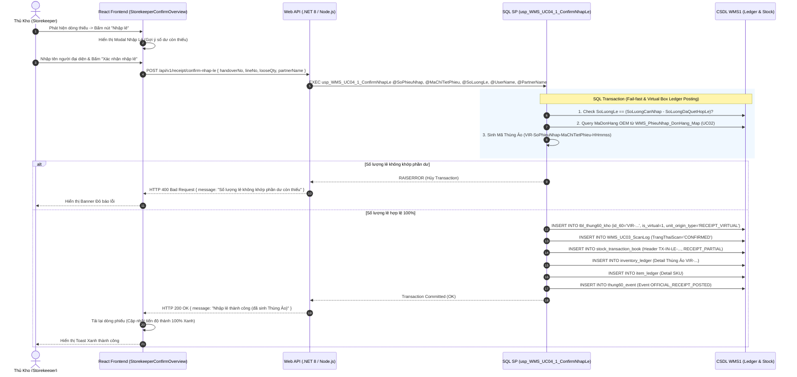
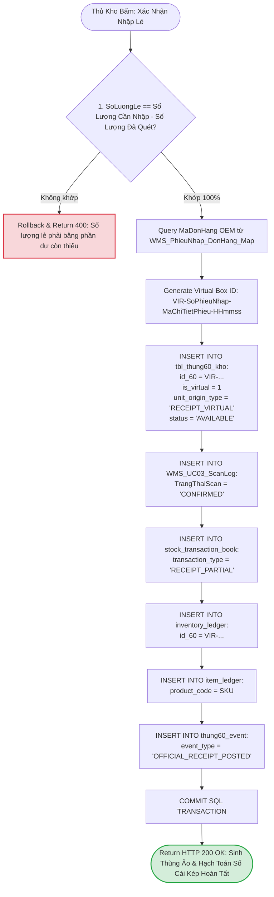
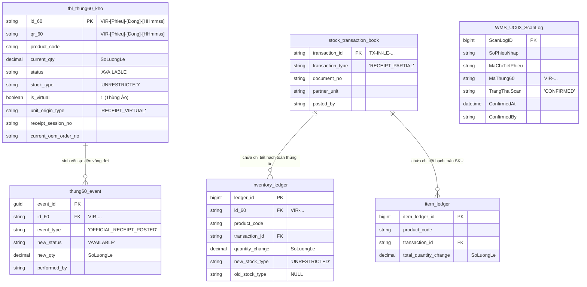

# Phân tích Thiết kế Logic UC04.1 - Nhập Lẻ & Sinh Thùng Ảo (Partial / Loose Receipt)

Tài liệu này đi sâu vào phân tích và thiết kế toàn diện hệ thống ở 5 khía cạnh bắt buộc: **Business Logic**, **UI/UX Guidelines**, **Programming Logic**, **Data Logic**, và **Diagrams (Mermaid)** dành cho chức năng **Nhập Lẻ & Sinh Thùng Ảo (UC04.1)** - giải pháp tiếp nhận hàng hóa lẻ không nguyên thùng 60 trong Hệ thống WMS.

---

## 1. Business Logic (Logic Nghiệp Vụ)

- **Mục tiêu cốt lõi:** Cung cấp công cụ cho Thủ kho để khai báo và tiếp nhận số lượng hàng lẻ chưa có tem QR thùng vật lý từ xưởng sản xuất. Hệ thống đóng gói số lượng lẻ đó vào một **"Thùng 60 Ảo" (Virtual Box)** có mã định danh bắt đầu bằng `VIR-`, quản trị đồng nhất với các thùng vật lý nguyên đai nguyên kiện, và kích hoạt bút toán hạch toán **Sổ Cái Kép (Dual Ledger)** với loại giao dịch `RECEIPT_PARTIAL`.

- **Các quy tắc nghiệp vụ (Business Rules):**
  - `BR-UC04.1-01` **Ràng buộc kiểm tra số lượng khớp 100% (Strict Loose Qty Match):** Số lượng nhập lẻ (`@SoLuongLe`) do Thủ kho nhập vào phải là **SỐ NGUYÊN** lớn hơn 0 và **bắt buộc phải BẰNG ĐÚNG** số lượng còn thiếu của dòng chứng từ (`SoLuongCanNhap - SoLuongDaQuetHopLe`). Nghiêm cấm nhập dư, nhập thiếu hoặc nhập số thập phân.
  - `BR-UC04.1-02` **Kế thừa thông tin Đơn hàng OEM (Order Inheritance):** Mặc dù hàng lẻ không có tem vạch đóng gói từ xưởng, hệ thống tự động truy xuất và kế thừa thông tin `MaDonHang` OEM và `MaKhachHang` từ bảng ánh xạ UC02 (`WMS_PhieuNhap_DonHang_Map`). Thùng ảo sinh ra vẫn thuộc về đúng đơn hàng OEM giống như thùng thật.
  - `BR-UC04.1-03` **Định danh & Thực thể Thùng Ảo (Virtual Box Entity):** Thùng ảo sinh ra có `is_virtual = 1`, `unit_origin_type = 'RECEIPT_VIRTUAL'`, mã `id_60` dạng `VIR-[SoPhieuNhap]-[MaChiTietPhieu]-[HHmmss]`. Thùng ảo không tồn tại bên CSDL Packaging nhưng "sống" trong WMS để phục vụ quản lý tồn kho và xuất hàng sau này.
  - `BR-UC04.1-04` **Hạch toán Sổ Cái Kép (Dual Ledger Posting):** Thùng ảo sinh ra được hạch toán chính thức vào `stock_transaction_book` (`transaction_type = 'RECEIPT_PARTIAL'`), `inventory_ledger` (chi tiết thùng ảo), `item_ledger` (chi tiết sản phẩm SKU) và `thung60_event` (`OFFICIAL_RECEIPT_POSTED`).
  - `BR-UC04.1-05` **Đồng bộ ScanLog & Hoàn tất Dòng phiếu:** Tự động chèn 1 bản ghi vào `WMS_UC03_ScanLog` với trạng thái `CONFIRMED` đại diện cho thùng ảo, giúp thanh tiến độ dòng phiếu ngay lập tức đạt 100% để mở khóa cho Thủ kho chốt tổng toàn phiếu (UC04).
  - `BR-UC04.1-06` **Ràng buộc quản lý theo Phiếu & Mã Sản Phẩm (Document & SKU Binding):** Mọi thao tác Nhập lẻ tuyệt đối không xử lý tự do trôi nổi mà **luôn luôn gắn liền và được quản lý theo đúng Mã Phiếu Nhập Kho (`SoPhieuNhap`) và Mã Sản Phẩm (`MaSanPham`)** của dòng chứng từ tương ứng. Mã Thùng Ảo sinh ra tuân thủ cấu trúc định danh `VIR-[SoPhieuNhap]-[MaChiTietPhieu]-[HHmmss]`, đồng thời lưu vết `receipt_session_no = SoPhieuNhap`, `product_code = MaSanPham`, `current_oem_order_no = MaDonHang` để phục vụ truy xuất nguồn gốc (Traceability) 100% tới từng chứng từ giao kho.

- **Quy trình tương tác 5 bước (Interaction Flow):**
  - **Bước 1:** Thủ kho mở màn hình chi tiết phiếu chờ (`StorekeeperConfirmOverview.jsx`), phát hiện dòng hàng bị thiếu hụt số lượng do hàng lẻ.
  - **Bước 2:** Thủ kho bấm nút **"Nhập lẻ"** trên dòng chưa đủ số lượng.
  - **Bước 3:** Giao diện Modal hiển thị số lượng lẻ gợi ý còn thiếu (`SoLuongCanNhap - SoLuongDaQuetHopLe`) và yêu cầu nhập tên người đại diện giao/nhận.
  - **Bước 4:** Thủ kho đối chiếu và bấm **"Xác nhận nhập lẻ"**. Backend tiếp nhận `POST /api/v1/receipt/confirm-nhap-le` và thực thi SP `usp_WMS_UC04_1_ConfirmNhapLe`.
  - **Bước 5:** Backend kiểm tra số lượng khớp 100%, sinh thùng ảo `VIR-...`, chèn vào `tbl_thung60_kho`, hạch toán Sổ Cái Kép và trả về `SUCCESS`. Giao diện tự động cập nhật tiến độ dòng thành 100% (Xanh).

---

## 2. Tiêu chuẩn Thiết kế Giao diện (UI/UX Guidelines)

- **Thiết bị đích:** Máy tính để bàn (Desktop Web UI) cho Thủ kho và Máy tính bảng Tablet.
- **Yêu cầu trải nghiệm (UX Principles):**
  - **Nút Nhập lẻ có điều kiện (Conditional Render):** Nút **"Nhập lẻ"** (Màu cam/tím) chỉ xuất hiện ở các dòng chứng từ có `SoLuongCanNhap > SoLuongDaQuetHopLe`. Nút ẩn khi dòng đã quét đủ 100%.
  - **Modal Khai Báo Số Lượng Lẻ:** Modal hiển thị rõ ràng:
    - *Số lượng yêu cầu (Requirement Qty).*
    - *Số lượng chẵn đã quét (Scanned Valid Qty).*
    - *Số lượng lẻ còn thiếu (Suggested Loose Qty)* $\rightarrow$ Ô nhập tự động điền sẵn con số này.
  - **Cảnh báo lỗi nhập sai:** Nếu nhập số lượng lẻ khác số dư còn thiếu hoặc gõ số âm/thập phân, ô nhập báo viền Đỏ kèm thông báo: *"Số lượng lẻ khai báo phải bằng đúng phần dư còn thiếu"*.
  - **Phản hồi hoàn tất:** Hiển thị Badge tag **[Thùng Ảo: VIR-...]** kèm Banner thông báo *"Nhập lẻ thành công! Đã tự động tạo Thùng Ảo và hạch toán Sổ Cái Kép"*.

---

## 3. Programming Logic (Logic Lập Trình)

### 3.1. Frontend Component (`StorekeeperConfirmOverview.jsx`)
- **Handling Partial Receipt Submission:**
  ```javascript
  const handlePartialReceiptSubmit = async () => {
    const parsedQty = parseInt(partialQty, 10);
    const expectedLoose = (partialLine.SoLuongCanNhap || 0) - (partialLine.SoLuongDaQuetHopLe || 0);

    if (isNaN(parsedQty) || parsedQty <= 0) {
      alert('Số lượng không hợp lệ! Vui lòng nhập số nguyên lớn hơn 0.');
      return;
    }
    if (parsedQty !== expectedLoose) {
      alert(`Số lượng lẻ phải bằng đúng phần còn thiếu (${expectedLoose} SP).`);
      return;
    }

    try {
      setLoading(true);
      await receivingApi.confirmNhapLe({
        handoverNo: selectedHandover.SoPhieuNhap,
        lineNo: partialLine.MaChiTietPhieu,
        looseQty: parsedQty,
        partnerName: partnerName
      });
      alert("Nhập lẻ thành công! Đã sinh Thùng Ảo và hạch toán Sổ Cái Kép.");
      setShowPartialModal(false);
      fetchLines();
    } catch (err) {
      alert(`Lỗi nhập lẻ: ${err.response?.data?.message || err.message}`);
    } finally {
      setLoading(false);
    }
  };
  ```

### 3.2. Backend API & Stored Procedure Execution

#### A. C# .NET 8 Web API (`ReceiptController.cs`)
- **Endpoints:** 
  - `POST /api/v1/receipt/confirm-nhap-le` (Nhập lẻ đơn dòng).
  - `POST /api/v1/receipt/confirm-nhap-le-batch` (Nhập lẻ hàng loạt).
```csharp
[HttpPost("confirm-nhap-le")]
[Authorize]
public async Task<IActionResult> ConfirmNhapLe([FromBody] ConfirmNhapLeRequest request)
{
    if (request.LooseQty <= 0)
    {
        return BadRequest(ApiResponse<object>.Error(WmsErrorCodes.ValidationFailed, "Số lượng lẻ phải lớn hơn 0."));
    }

    var parameters = new
    {
        SoPhieuNhap = request.HandoverNo,
        MaChiTietPhieu = request.LineNo,
        SoLuongLe = request.LooseQty,
        UserName = _currentUserService.Username ?? "SYSTEM_STOREKEEPER",
        PartnerName = request.PartnerName
    };

    await _spExecutor.ExecuteAsync("dbo.usp_WMS_UC04_1_ConfirmNhapLe", parameters);
    return Ok(ApiResponse<object>.Success(new object(), "Nhập lẻ thành công (đã tự động tạo thùng ảo)."));
}
```

#### B. SQL Stored Procedure (`dbo.usp_WMS_UC04_1_ConfirmNhapLe`)
```sql
USE WMS1;
GO
SET QUOTED_IDENTIFIER ON;
SET ANSI_NULLS ON;
GO

CREATE OR ALTER PROCEDURE dbo.usp_WMS_UC04_1_ConfirmNhapLe
    @SoPhieuNhap NVARCHAR(50),
    @MaChiTietPhieu NVARCHAR(50),
    @SoLuongLe DECIMAL(18,4),
    @UserName NVARCHAR(50),
    @PartnerName NVARCHAR(100) = NULL
AS
BEGIN
    SET NOCOUNT ON;
    SET XACT_ABORT ON;

    IF ISNULL(@SoLuongLe, 0) <= 0
    BEGIN
        RAISERROR(N'Số lượng lẻ phải lớn hơn 0.', 16, 1);
        RETURN;
    END;

    BEGIN TRY
        BEGIN TRANSACTION;

        -- 1. Fail-fast Check: Kiểm tra số lượng lẻ có khớp 100% với số lượng còn thiếu?
        DECLARE @SoLuongCanNhap DECIMAL(18,4);
        DECLARE @SoLuongDaQuetHopLe DECIMAL(18,4);
        DECLARE @MaSanPham NVARCHAR(50);
        DECLARE @MaDonHang NVARCHAR(50);
        DECLARE @MaKhachHang NVARCHAR(50);
        DECLARE @PartnerUnit NVARCHAR(100);

        SELECT 
            @SoLuongCanNhap = SoLuongCanNhap,
            @SoLuongDaQuetHopLe = SoLuongDaQuetHopLe,
            @MaSanPham = MaSanPham
        FROM dbo.vw_WMS_UC04_PhieuChoXacNhan
        WHERE SoPhieuNhap = @SoPhieuNhap AND MaChiTietPhieu = @MaChiTietPhieu;

        IF @SoLuongCanNhap IS NULL
        BEGIN
            RAISERROR(N'ERR_UC04.1_LINE_NOT_FOUND: Không tìm thấy dòng chi tiết phiếu nhập.', 16, 1);
            ROLLBACK TRANSACTION;
            RETURN;
        END;

        DECLARE @SoLuongThieu DECIMAL(18,4) = @SoLuongCanNhap - @SoLuongDaQuetHopLe;
        
        IF @SoLuongLe <> @SoLuongThieu
        BEGIN
            RAISERROR(N'ERR_UC04.1_QTY_MISMATCH: Số lượng lẻ khai báo (%s) không khớp với số dư còn thiếu (%s).', 16, 1, @SoLuongLe, @SoLuongThieu);
            ROLLBACK TRANSACTION;
            RETURN;
        END;

        -- 2. Truy xuất thông tin Đơn hàng OEM (kế thừa UC02)
        SELECT TOP 1 @MaDonHang = MaDonHang
        FROM dbo.WMS_PhieuNhap_DonHang_Map
        WHERE SoPhieuNhap = @SoPhieuNhap AND MaChiTietPhieu = @MaChiTietPhieu AND IsDeleted = 0;

        SELECT TOP 1 @MaKhachHang = MaKhachHang FROM dbo.vw_WMS_DonHangOEM_Tong WHERE MaDonHang = @MaDonHang;
        SELECT TOP 1 @PartnerUnit = DonviNguon FROM dbo.vw_WMS_PhieuNhapKhoTP_Tong WHERE SoPhieuNhap = @SoPhieuNhap;

        -- 3. Sinh Mã Thùng Ảo (VIR-SoPhieuNhap-MaChiTietPhieu-HHmmss)
        DECLARE @VirtualId60 NVARCHAR(50) = 'VIR-' + @SoPhieuNhap + '-' + @MaChiTietPhieu + '-' + RIGHT('0' + CAST(DATEPART(HOUR, GETDATE()) AS NVARCHAR), 2) + RIGHT('0' + CAST(DATEPART(MINUTE, GETDATE()) AS NVARCHAR), 2) + RIGHT('0' + CAST(DATEPART(SECOND, GETDATE()) AS NVARCHAR), 2);
        
        -- 4. Chèn bản ghi Thùng Ảo vào tbl_thung60_kho (is_virtual = 1)
        INSERT INTO dbo.tbl_thung60_kho (
            id_60, qr_60, product_code, original_qty, current_qty, 
            uom, status, stock_type, is_virtual, unit_origin_type, 
            receipt_session_no, current_oem_order_no, customer_code, gross_weight
        )
        VALUES (
            @VirtualId60, @VirtualId60, @MaSanPham, @SoLuongLe, @SoLuongLe,
            'PCS', 'AVAILABLE', 'UNRESTRICTED', 1, 'RECEIPT_VIRTUAL',
            @SoPhieuNhap, @MaDonHang, @MaKhachHang, 0
        );

        -- 5. Đồng bộ bản ghi vào WMS_UC03_ScanLog với cờ CONFIRMED
        INSERT INTO dbo.WMS_UC03_ScanLog (
            SoPhieuNhap, MaChiTietPhieu, MaSanPham, MaDonHang, MaKhachHang,
            MaThung60, SoLuongThung, TrangThaiPackaging, TrangThaiScan, 
            KetQuaKiemTra, CreatedBy, ConfirmedAt, ConfirmedBy
        )
        VALUES (
            @SoPhieuNhap, @MaChiTietPhieu, @MaSanPham, ISNULL(@MaDonHang, N''), ISNULL(@MaKhachHang, N''),
            @VirtualId60, @SoLuongLe, N'3', N'CONFIRMED', 
            N'Tạo thùng ảo do nhập lẻ', @UserName, GETDATE(), @UserName
        );

        -- 6. Hạch toán Sổ Cái Kép: Header (stock_transaction_book)
        DECLARE @TxId NVARCHAR(50) = 'TX-IN-LE-' + @SoPhieuNhap + '-' + RIGHT('0' + CAST(DATEPART(HOUR, GETDATE()) AS NVARCHAR), 2) + RIGHT('0' + CAST(DATEPART(MINUTE, GETDATE()) AS NVARCHAR), 2) + RIGHT('0' + CAST(DATEPART(SECOND, GETDATE()) AS NVARCHAR), 2) + RIGHT('00' + CAST(DATEPART(MILLISECOND, GETDATE()) AS NVARCHAR), 3);
        
        INSERT INTO dbo.stock_transaction_book (transaction_id, transaction_type, document_no, partner_unit, partner_name, posted_by)
        VALUES (@TxId, 'RECEIPT_PARTIAL', @SoPhieuNhap, @PartnerUnit, @PartnerName, @UserName);

        -- 7. Hạch toán Sổ Cái Kép: Detail cấp Thùng (inventory_ledger)
        INSERT INTO dbo.inventory_ledger (ledger_date, id_60, product_code, transaction_id, source_document_no, quantity_change, new_stock_type, old_stock_type)
        VALUES (CAST(GETDATE() AS DATE), @VirtualId60, @MaSanPham, @TxId, @SoPhieuNhap, @SoLuongLe, 'UNRESTRICTED', NULL);

        -- 8. Hạch toán Sổ Cái Kép: Detail cấp Hàng Hóa (item_ledger)
        INSERT INTO dbo.item_ledger (ledger_date, product_code, transaction_id, source_document_no, total_quantity_change)
        VALUES (CAST(GETDATE() AS DATE), @MaSanPham, @TxId, @SoPhieuNhap, @SoLuongLe);

        -- 9. Ghi vết Sự kiện Thùng (thung60_event) & Audit Log
        INSERT INTO dbo.thung60_event (event_id, id_60, event_type, new_status, new_stock_type, new_qty, source_document_no, request_id, performed_by)
        VALUES (NEWID(), @VirtualId60, 'OFFICIAL_RECEIPT_POSTED', 'AVAILABLE', 'UNRESTRICTED', @SoLuongLe, @SoPhieuNhap, @TxId, @UserName);

        INSERT INTO dbo.audit_log (object_type, object_id, action, new_value, performed_by, ip_address)
        VALUES ('RECEIPT_PARTIAL', @SoPhieuNhap, 'CONFIRM_NHAP_LE', CAST(@SoLuongLe AS NVARCHAR) + N' (Thùng ảo: ' + @VirtualId60 + N')', @UserName, '127.0.0.1');

        COMMIT TRANSACTION;
    END TRY
    BEGIN CATCH
        IF @@TRANCOUNT > 0 ROLLBACK TRANSACTION;
        THROW;
    END CATCH;
END;
GO
```

---

## 4. Data Logic (Thiết kế Dữ Liệu)

### 4.1. Ma trận phân quyền CRUD

| Bảng / Thực thể Dữ Liệu | Create (Tạo) | Read (Đọc) | Update (Cập nhật) | Delete (Xóa) | Ý nghĩa nghiệp vụ trong UC04.1 |
| :--- | :---: | :---: | :---: | :---: | :--- |
| `tbl_thung60_kho` | **X** | **X** | - | - | Khởi tạo bản ghi Thùng Ảo (`is_virtual = 1`, `unit_origin_type = 'RECEIPT_VIRTUAL'`) |
| `WMS_UC03_ScanLog` | **X** | **X** | - | - | Chèn bản ghi log `CONFIRMED` để đồng bộ tiến độ UI dòng phiếu |
| `WMS_PhieuNhap_DonHang_Map` | - | **X** | - | - | Đọc kế thừa `MaDonHang` OEM đã map ở UC02 |
| `stock_transaction_book` | **X** | **X** | - | - | Ghi Header chứng từ nhập lẻ (`transaction_type = 'RECEIPT_PARTIAL'`) |
| `inventory_ledger` | **X** | **X** | - | - | Ghi Detail hạch toán kho cấp Thùng Ảo (`VIR-...`) |
| `item_ledger` | **X** | **X** | - | - | Ghi Detail hạch toán kho cấp Mã hàng SKU |
| `thung60_event` | **X** | **X** | - | - | Ghi vết sự kiện vòng đời đầu tiên cho Thùng Ảo |

### 4.2. Định nghĩa Trạng thái (Conceptual State Model)

| Cột / Biến | Kiểu Dữ Liệu | Giá Trị Gán Cho Thùng Ảo | Ý nghĩa Nghiệp vụ |
| :--- | :--- | :--- | :--- |
| `id_60` / `qr_60` | `NVARCHAR(50)` | `VIR-[Phieu]-[Dong]-[HHmmss]` | Mã định danh thùng ảo bắt đầu bằng tiền tố `VIR-` |
| `is_virtual` | `BIT` / `BOOLEAN` | `1` (True) | Cờ xác nhận đây là Thùng Ảo do WMS tự sinh ra |
| `unit_origin_type` | `VARCHAR(30)` | `'RECEIPT_VIRTUAL'` | Loại nguồn gốc thùng: Sinh ra từ tiến trình Nhập Lẻ WMS |
| `status` | `VARCHAR(20)` | `'AVAILABLE'` | Trạng thái tồn kho khả dụng sẵn sàng xuất hàng |
| `stock_type` | `VARCHAR(20)` | `'UNRESTRICTED'` | Loại tồn kho tự do sử dụng không bị phong tỏa |

### 4.3. Phân tích Chi tiết Hạch Toán Sổ Cái Kép cho Thùng Ảo (Dual Ledger Virtual Box Analysis)
Khi thực hiện Nhập Lẻ tại UC04.1, thùng ảo được coi như một thực thể tồn kho đầy đủ tư cách trong Sổ Cái Kép:
1. **Header Transaction (`stock_transaction_book`):** Đánh dấu loại giao dịch riêng biệt `RECEIPT_PARTIAL` để phục vụ báo cáo kiểm toán và phân tách tỷ lệ hàng nguyên thùng vs hàng lẻ.
2. **Operational Detail (`inventory_ledger`):** Đổ dữ liệu biến động kho cấp thùng theo mã `VIR-...` giúp phân hệ Pick/Pack xuất hàng (UC16) sau này có thể chọn xuất chính xác thùng ảo chứa hàng lẻ mà không bị tắc nghẽn logic.
3. **Financial Accounting Detail (`item_ledger`):** Tăng tổng số lượng tồn kho kế toán cấp mã sản phẩm SKU tương ứng.

---

## 5. Biểu Đồ Thiết Kế (Diagrams)

### 5.1. Sequence Diagram (Luồng Nhập Lẻ & Sinh Thùng Ảo)



---

### 5.2. Data Layer Architecture (Data Flow & Virtual Box Posting)



---

### 5.3. Entity Relationship & State Logic Map (ERD Map UC04.1)


