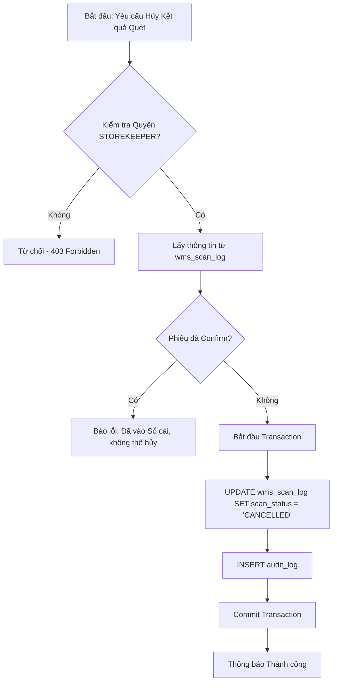
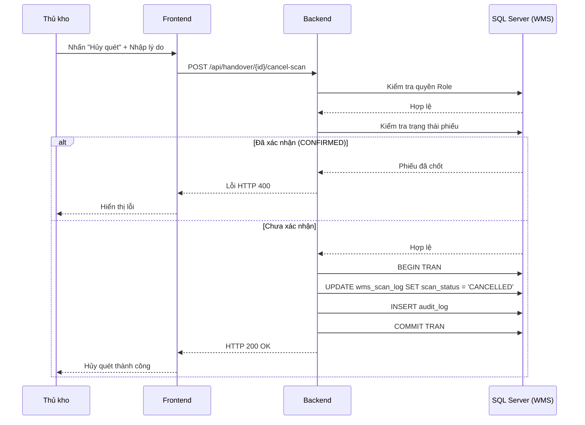

# Phân tích Thiết kế Logic UC04.2 - Hủy kết quả quét Nhập kho

Tài liệu này đi sâu vào phân tích hệ thống ở 4 khía cạnh: Business Logic (Nghiệp vụ), Programming Logic (Lập trình), Data Logic (Dữ liệu) và Diagrams (Biểu đồ).

## 1. Business Logic (Logic Nghiệp Vụ)
Mục tiêu: Cho phép Thủ kho xử lý sai sót bằng cách hủy kết quả quét nhập kho của nhân viên khi Phiếu nhập đang ở trạng thái **Chờ xác nhận** (Pending Handover). 

Quy tắc nghiệp vụ:
- **BR-UC04.2-01 - Xóa tạm thay vì Sổ cái kép:** Vì chưa vào sổ cái, hệ thống chỉ cần vô hiệu hóa bản ghi tạm trong `wms_scan_log` (ví dụ: gán `is_deleted = 1` hoặc `scan_status = 'CANCELLED'`).
- **BR-UC04.2-02 - Audit Trail:** Mọi thao tác hủy phải được lưu vết trong `audit_log`.
- **BR-UC04.2-03 - Fail-fast:** KHÔNG cho phép hủy nếu phiếu đã được xác nhận (Đã ghi vào sổ cái tồn kho).

## 2. Programming Logic (Logic Lập Trình)
- **Kiểm tra quyền:** Backend kiểm tra vai trò (Role) của user, chỉ Thủ kho (Storekeeper) hoặc Admin mới được phép thao tác (HTTP 403 nếu sai quyền).
- **Endpoint:** `POST /api/handover/:handover_no/cancel-scan` kèm theo payload `reason`.
- **Thực thi:** Gọi DB thực hiện vô hiệu hóa toàn bộ log của phiếu trong một Transaction.

## 3. Data Logic (Logic Dữ Liệu)
Không dính dáng đến sổ cái kép. Chỉ thay đổi trạng thái của Log.

### 3.1. Ma trận phân quyền CRUD
Các bảng tác động chính:

| Bảng dữ liệu | Create (Tạo) | Read (Đọc) | Update (Cập nhật) | Delete (Xóa) | Ý nghĩa nghiệp vụ |
| --- | --- | --- | --- | --- | --- |
| `wms_handover` | - | X | - | - | Kiểm tra trạng thái phiếu (Đã confirm chưa?) |
| `wms_scan_log` | - | X | X | - | Chuyển `is_deleted = 1` hoặc `scan_status = 'CANCELLED'` |
| `audit_log` | X | - | - | - | Ghi vết lý do hủy, người hủy |

- **Update:** `UPDATE wms_scan_log SET scan_status = 'CANCELLED', updated_at = GETDATE() WHERE handover_no = @handover_no`.
- **Create:** `INSERT INTO audit_log`.

## 4. Diagrams (Biểu đồ)

### 4.1. Activity Diagram (Lưu đồ thuật toán)

### 4.2. Sequence Diagram (Biểu đồ tuần tự)

