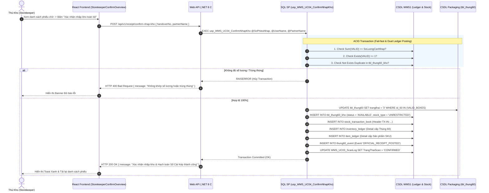
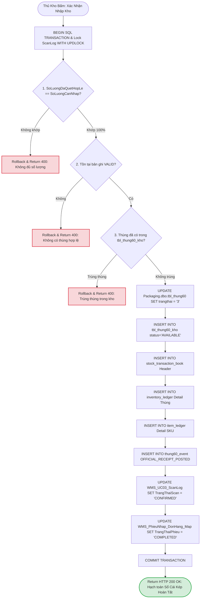
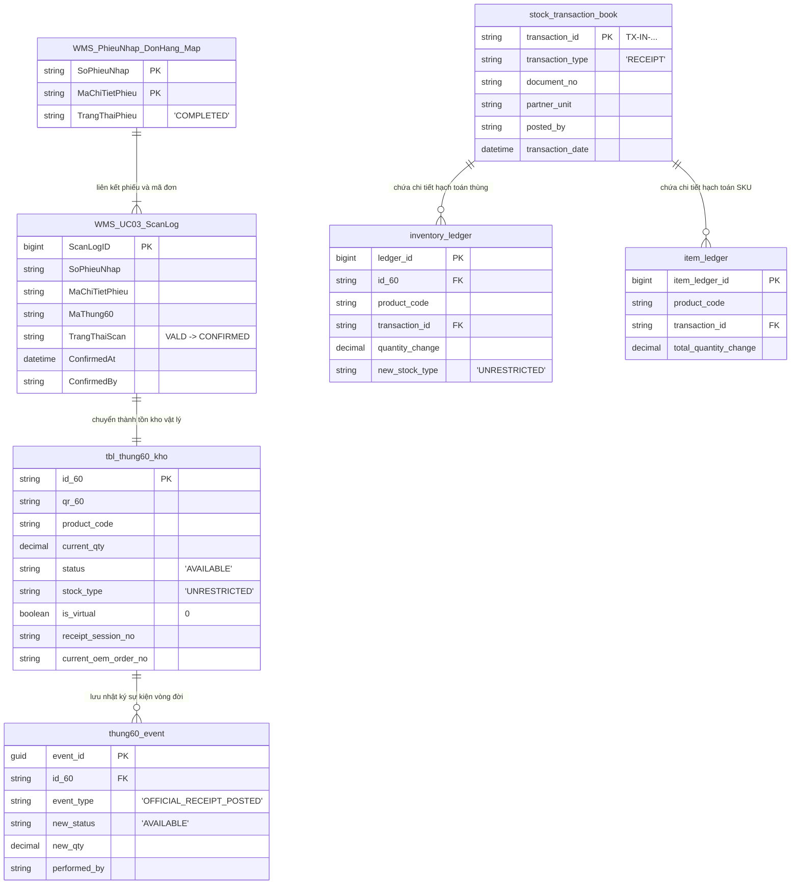

# Phân tích Thiết kế Logic UC04 - Xác Nhận Nhập Kho Chính Thức & Hạch Toán Sổ Cái Kép

Tài liệu này đi sâu vào phân tích và thiết kế hệ thống ở 5 khía cạnh bắt buộc: **Business Logic**, **UI/UX Guidelines**, **Programming Logic**, **Data Logic**, và **Diagrams (Mermaid)** dành cho chức năng **Xác nhận Nhập kho chính thức (UC04)** của Thủ kho.

---

## 1. Business Logic (Logic Nghiệp Vụ)

- **Mục tiêu cốt lõi:** Cung cấp bức tranh toàn cảnh tiến độ quét nhập hàng và cho phép Thủ kho duyệt xác nhận chính thức các thùng hàng hợp lệ (`VALID`) từ kho tạm Staging sang kho chính thức. Thao tác này kích hoạt giao dịch SQL khép kín (ACID Transaction) để sinh dữ liệu tồn kho vật lý `tbl_thung60_kho`, cập nhật trạng thái thùng bên hệ thống Packaging (thành `3`), và **hạch toán ghi Nợ/Có chính thức vào Sổ Cái Kép (Dual Ledger)**.

- **Các quy tắc nghiệp vụ (Business Rules):**
  - `BR-UC04-01` **Nguồn dữ liệu hợp lệ (Valid Staging Source):** Chỉ chấp nhận xác nhận đối với các thùng 60 có cờ `TrangThaiScan = 'VALID'` trong bảng `WMS_UC03_ScanLog` và cờ `IsDeleted = 0`.
  - `BR-UC04-02` **Kiểm tra khớp số lượng 100% (Strict Quantity Match):** Một dòng phiếu nhập kho (hoặc toàn bộ phiếu) chỉ được phép xác nhận khi tổng số lượng thùng hợp lệ ĐÚNG BẰNG số lượng yêu cầu của chứng từ phiếu nhập (`SoLuongCanNhap == SoLuongDaQuetHopLe`). Nếu quét thiếu hoặc vượt, hệ thống từ chối xác nhận và thông báo lỗi.
  - `BR-UC04-03` **Tạo Tồn kho Vật lý (Stock Initialization):** Khi xác nhận, hệ thống tự động chèn bản ghi vào bảng tồn kho chính thức `tbl_thung60_kho` với trạng thái `status = 'AVAILABLE'`, `stock_type = 'UNRESTRICTED'`, `is_virtual = 0`, `unit_origin_type = 'PHYSICAL'`, kế thừa đầy đủ `MaDonHang` OEM và `MaKhachHang`.
  - `BR-UC04-04` **Đồng bộ Hệ thống Đóng gói Packaging:** Hệ thống tự động cập nhật trường `trangthai = '3'` (Đã nhập kho WMS) cho các thùng tương ứng tại bảng `Packaging.dbo.tbl_thung60`, đồng thời gán mã lô `BatNbr = SoPhieuNhap` và `OEM_1 = MaDonHang`.
  - `BR-UC04-05` **Hạch toán Sổ Cái Kép (Dual Ledger Posting):** Kích hoạt bút toán hạch toán Nợ/Có chính thức:
    - Ghi Header chứng từ nhập vào `stock_transaction_book` (`transaction_type = 'RECEIPT'`).
    - Ghi Detail biến động kho cấp Thùng 60 vào `inventory_ledger`.
    - Ghi Detail biến động kế toán tổng hợp cấp Mã hàng SKU vào `item_ledger`.
    - Ghi vết sự kiện vòng đời thùng vào `thung60_event` (`event_type = 'OFFICIAL_RECEIPT_POSTED'`).
  - `BR-UC04-06` **Khóa trạng thái bản ghi ScanLog:** Sau khi hạch toán thành công, toàn bộ các bản ghi `VALID` trong `WMS_UC03_ScanLog` chuyển sang `TrangThaiScan = 'CONFIRMED'`, cập nhật `ConfirmedAt` và `ConfirmedBy`.
  - `BR-UC04-07` **Chống trùng lặp Thùng kho:** Nếu có bất kỳ mã thùng nào trong danh sách xác nhận đã tồn tại trước đó tại `tbl_thung60_kho`, giao dịch sẽ lập tức bị hủy bỏ (Rollback).

- **Quy trình tương tác 5 bước (Interaction Flow):**
  - **Bước 1:** Thủ kho mở giao diện Dashboard Quản lý Phiếu Chờ (`StorekeeperConfirmList.jsx`).
  - **Bước 2:** Thủ kho chọn một phiếu nhập để xem danh sách tiến độ quét các dòng sản phẩm (`StorekeeperConfirmOverview.jsx`).
  - **Bước 3:** Thủ kho nhập thông tin "Đơn vị/Người giao hàng" và bấm **"Xác nhận nhập kho toàn bộ"** (hoặc từng dòng).
  - **Bước 4:** Backend thực hiện chuỗi kiểm tra Fail-fast (Kiểm tra đủ số lượng -> Kiểm tra trùng thùng kho -> Kiểm tra trạng thái Packaging). Nếu hợp lệ, thực thi Transaction hạch toán Sổ Cái Kép và sinh tồn kho `tbl_thung60_kho`.
  - **Bước 5:** Hệ thống thông báo thành công, phiếu nhập chuyển trạng thái sang `COMPLETED`, giao diện tự động làm mới danh sách.

---

## 2. Tiêu chuẩn Thiết kế Giao diện (UI/UX Guidelines)

- **Thiết bị đích:** Máy tính để bàn (Desktop Web UI) cho Thủ kho / Quản lý kho và Tablet cho Tổ trưởng kho.
- **Yêu cầu trải nghiệm (UX Principles):**
  - **Bảng tổng quan tiến độ (Master-Detail Dashboard):** Danh sách phiếu chờ hiển thị rõ mã phiếu, ngày tạo, đơn vị giao, tổng số dòng và tỷ lệ hoàn thành quét (`%`).
  - **Chỉ báo điều kiện Xác nhận (Validation Status Indicator):**
    - 🟢 *Đã quét đủ 100%:* Nút **"Xác nhận nhập kho"** sáng màu xanh dương/xanh lá, cho phép bấm.
    - 🔴 *Chưa quét đủ số lượng:* Nút xác nhận bị mờ/disable, hiển thị dòng cảnh báo màu đỏ: *"Còn thiếu X thùng/SP. Chưa thể xác nhận"*.
  - **Modal Xác nhận An toàn:** Khi bấm xác nhận, xuất hiện Modal hộp thoại hiển thị danh sách tóm tắt các mã hàng, số lượng thùng sẽ nhập, và yêu cầu Thủ kho kiểm tra lần cuối trước khi bấm **"Đồng ý hạch toán"**.
  - **Phản hồi hoàn tất:** Hiển thị Banner màu xanh Emerald (`#10B981`) thông báo *"Hạch toán Sổ Cái Kép & Nhập kho thành công X thùng 60!"*.

---

## 3. Programming Logic (Logic Lập Trình)

### 3.1. Frontend Component (`StorekeeperConfirmList.jsx` & `StorekeeperConfirmOverview.jsx`)
- **State Management:**
  - `confirmList`: Danh sách phiếu chờ xác nhận từ `receivingApi.getConfirmList()`.
  - `handoverLines`: Chi tiết tiến độ các dòng từ `receivingApi.getConfirmHandoverLines(handoverNo)`.
  - `partnerName`: Tên người đại diện giao hàng.
- **Handling Confirmation:**
  ```javascript
  const handleConfirm = async (handoverNo, lineNo = null) => {
    try {
      setLoading(true);
      await receivingApi.confirmNhapKho({
        handoverNo,
        lineNo,
        partnerName
      });
      toast.success("Xác nhận nhập kho & Hạch toán Sổ Cái Kép thành công!");
      fetchConfirmList();
    } catch (err) {
      toast.error(err.message || "Không thể xác nhận nhập kho.");
    } finally {
      setLoading(false);
    }
  };
  ```

### 3.2. Backend API & Stored Procedure Execution

#### A. C# .NET 8 Web API (`ReceiptController.cs`)
- **Endpoint:** `POST /api/v1/receipt/confirm-nhap-kho` (`[Authorize]`)
```csharp
[HttpPost("confirm-nhap-kho")]
[Authorize]
public async Task<IActionResult> ConfirmNhapKho([FromBody] ConfirmNhapKhoRequest request)
{
    if (string.IsNullOrWhiteSpace(request.HandoverNo))
    {
        return BadRequest(ApiResponse<object>.Error(WmsErrorCodes.ValidationFailed, "Mã phiếu nhập không được để trống."));
    }

    var parameters = new
    {
        SoPhieuNhap = request.HandoverNo,
        MaChiTietPhieu = request.LineNo,
        UserName = _currentUserService.Username ?? "SYSTEM_STOREKEEPER",
        PartnerName = request.PartnerName
    };

    var result = await _spExecutor.QueryFirstOrDefaultAsync<dynamic>("dbo.usp_WMS_UC04_ConfirmNhapKho", parameters);
    return Ok(ApiResponse<object>.Success(result));
}
```

#### B. SQL Stored Procedure (`dbo.usp_WMS_UC04_ConfirmNhapKho`)
```sql
USE WMS1;
GO
SET QUOTED_IDENTIFIER ON;
SET ANSI_NULLS ON;
GO

CREATE OR ALTER PROCEDURE dbo.usp_WMS_UC04_ConfirmNhapKho
    @SoPhieuNhap NVARCHAR(50),
    @MaChiTietPhieu NVARCHAR(50) = NULL,
    @UserName NVARCHAR(50),
    @PartnerName NVARCHAR(100) = NULL
AS
BEGIN
    SET NOCOUNT ON;
    SET XACT_ABORT ON;

    BEGIN TRY
        BEGIN TRANSACTION;

        -- 1. Fail-fast Check: Số lượng quét hợp lệ phải khớp 100% số lượng yêu cầu (BR-UC04-02)
        DECLARE @TongCanNhap DECIMAL(18,4);
        DECLARE @TongDaQuet DECIMAL(18,4);

        IF @MaChiTietPhieu IS NOT NULL
        BEGIN
            SELECT 
                @TongCanNhap = SoLuongCanNhap,
                @TongDaQuet = SoLuongDaQuetHopLe
            FROM dbo.vw_WMS_UC04_PhieuChoXacNhan
            WHERE SoPhieuNhap = @SoPhieuNhap AND MaChiTietPhieu = @MaChiTietPhieu;
        END
        ELSE
        BEGIN
            SELECT 
                @TongCanNhap = TongSoLuongCanNhap,
                @TongDaQuet = TongSoLuongDaQuetHopLe
            FROM dbo.vw_WMS_UC04_TongHopPhieu
            WHERE SoPhieuNhap = @SoPhieuNhap;
        END

        IF (@TongCanNhap IS NULL OR @TongCanNhap <> @TongDaQuet)
        BEGIN
            RAISERROR(N'ERR_UC04_QTY_MISMATCH: Tổng số lượng quét hợp lệ (%s) không khớp với số lượng yêu cầu (%s) của phiếu.', 16, 1, @TongDaQuet, @TongCanNhap);
            ROLLBACK TRANSACTION;
            RETURN;
        END;

        -- 2. Fail-fast Check: Phải có ít nhất 1 thùng hợp lệ VALID
        IF NOT EXISTS (
            SELECT 1 FROM dbo.WMS_UC03_ScanLog
            WHERE SoPhieuNhap = @SoPhieuNhap
              AND (MaChiTietPhieu = @MaChiTietPhieu OR @MaChiTietPhieu IS NULL)
              AND TrangThaiScan = N'VALID' AND IsDeleted = 0
        )
        BEGIN
            RAISERROR(N'ERR_UC04_NO_VALID_BOXES: Không có thùng hợp lệ nào đang chờ xác nhận.', 16, 1);
            ROLLBACK TRANSACTION;
            RETURN;
        END;

        -- 3. Fail-fast Check: Chống trùng thùng trong kho physical (BR-UC04-07)
        IF EXISTS (
            SELECT 1 FROM dbo.WMS_UC03_ScanLog s
            INNER JOIN dbo.tbl_thung60_kho k ON s.MaThung60 = k.id_60
            WHERE s.SoPhieuNhap = @SoPhieuNhap
              AND (s.MaChiTietPhieu = @MaChiTietPhieu OR @MaChiTietPhieu IS NULL)
              AND s.TrangThaiScan = N'VALID' AND s.IsDeleted = 0
        )
        BEGIN
            RAISERROR(N'ERR_UC04_DUPLICATE_BOX_IN_STOCK: Một số mã thùng đã tồn tại trong kho physical (tbl_thung60_kho).', 16, 1);
            ROLLBACK TRANSACTION;
            RETURN;
        END;

        -- 4. Đồng bộ hệ thống Packaging (Cập nhật trangthai = '3')
        UPDATE p
        SET p.trangthai = '3',
            p.BatNbr = s.SoPhieuNhap,
            p.RecordID = s.MaChiTietPhieu,
            p.OEM_1 = s.MaDonHang
        FROM [Packaging].[dbo].[tbl_thung60] p
        INNER JOIN dbo.WMS_UC03_ScanLog s ON p.id_60 = s.MaThung60
        WHERE s.SoPhieuNhap = @SoPhieuNhap
          AND (s.MaChiTietPhieu = @MaChiTietPhieu OR @MaChiTietPhieu IS NULL)
          AND s.TrangThaiScan = N'VALID' AND s.IsDeleted = 0 AND p.trangthai = '1';

        -- 5. Sinh dữ liệu tồn kho vật lý chính thức (tbl_thung60_kho)
        INSERT INTO dbo.tbl_thung60_kho (
            id_60, qr_60, product_code, original_qty, current_qty, uom, 
            status, stock_type, is_virtual, unit_origin_type, receipt_session_no, 
            current_oem_order_no, customer_code, gross_weight
        )
        SELECT 
            s.MaThung60, s.MaThung60, s.MaSanPham, s.SoLuongThung, s.SoLuongThung, 'PCS', 
            'AVAILABLE', 'UNRESTRICTED', 0, 'PHYSICAL', s.SoPhieuNhap, 
            s.MaDonHang, s.MaKhachHang, ISNULL(CAST(pkg.trong_luong AS DECIMAL(18,2)), 0)
        FROM dbo.WMS_UC03_ScanLog s
        LEFT JOIN [Packaging].[dbo].[tbl_thung60] pkg ON s.MaThung60 = pkg.id_60
        WHERE s.SoPhieuNhap = @SoPhieuNhap
          AND (s.MaChiTietPhieu = @MaChiTietPhieu OR @MaChiTietPhieu IS NULL)
          AND s.TrangThaiScan = N'VALID' AND s.IsDeleted = 0;

        -- 6. Hạch toán Sổ Cái Kép: Header (stock_transaction_book)
        DECLARE @PartnerUnit NVARCHAR(100);
        SELECT TOP 1 @PartnerUnit = DonviNguon FROM dbo.vw_WMS_PhieuNhapKhoTP_Tong WHERE SoPhieuNhap = @SoPhieuNhap;
        DECLARE @TxId NVARCHAR(50) = 'TX-IN-' + @SoPhieuNhap + '-' + RIGHT('0' + CAST(DATEPART(HOUR, GETDATE()) AS NVARCHAR), 2) + RIGHT('0' + CAST(DATEPART(MINUTE, GETDATE()) AS NVARCHAR), 2) + RIGHT('0' + CAST(DATEPART(SECOND, GETDATE()) AS NVARCHAR), 2);

        INSERT INTO dbo.stock_transaction_book (transaction_id, transaction_type, document_no, partner_unit, partner_name, posted_by)
        VALUES (@TxId, 'RECEIPT', @SoPhieuNhap, @PartnerUnit, @PartnerName, @UserName);

        -- 7. Hạch toán Sổ Cái Kép: Detail cấp Thùng (inventory_ledger)
        INSERT INTO dbo.inventory_ledger (ledger_date, id_60, product_code, transaction_id, source_document_no, quantity_change, new_stock_type)
        SELECT CAST(GETDATE() AS DATE), MaThung60, MaSanPham, @TxId, SoPhieuNhap, SoLuongThung, 'UNRESTRICTED'
        FROM dbo.WMS_UC03_ScanLog
        WHERE SoPhieuNhap = @SoPhieuNhap AND (MaChiTietPhieu = @MaChiTietPhieu OR @MaChiTietPhieu IS NULL) AND TrangThaiScan = N'VALID' AND IsDeleted = 0;

        -- 8. Hạch toán Sổ Cái Kép: Detail cấp Hàng Hóa (item_ledger)
        INSERT INTO dbo.item_ledger (ledger_date, product_code, transaction_id, source_document_no, total_quantity_change)
        SELECT CAST(GETDATE() AS DATE), MaSanPham, @TxId, SoPhieuNhap, SUM(SoLuongThung)
        FROM dbo.WMS_UC03_ScanLog
        WHERE SoPhieuNhap = @SoPhieuNhap AND (MaChiTietPhieu = @MaChiTietPhieu OR @MaChiTietPhieu IS NULL) AND TrangThaiScan = N'VALID' AND IsDeleted = 0
        GROUP BY MaSanPham, SoPhieuNhap;

        -- 9. Ghi vết Sự kiện Thùng 60 (thung60_event) & Audit Log
        INSERT INTO dbo.thung60_event (event_id, id_60, event_type, new_status, new_stock_type, new_qty, source_document_no, request_id, performed_by)
        SELECT NEWID(), MaThung60, 'OFFICIAL_RECEIPT_POSTED', 'AVAILABLE', 'UNRESTRICTED', SoLuongThung, SoPhieuNhap, @TxId, @UserName
        FROM dbo.WMS_UC03_ScanLog
        WHERE SoPhieuNhap = @SoPhieuNhap AND (MaChiTietPhieu = @MaChiTietPhieu OR @MaChiTietPhieu IS NULL) AND TrangThaiScan = N'VALID' AND IsDeleted = 0;

        -- 10. Chuyển trạng thái ScanLog thành CONFIRMED
        UPDATE dbo.WMS_UC03_ScanLog
        SET TrangThaiScan = N'CONFIRMED', KetQuaKiemTra = N'Đã xác nhận nhập kho chính thức.', ConfirmedAt = GETDATE(), ConfirmedBy = @UserName
        WHERE SoPhieuNhap = @SoPhieuNhap AND (MaChiTietPhieu = @MaChiTietPhieu OR @MaChiTietPhieu IS NULL) AND TrangThaiScan = N'VALID' AND IsDeleted = 0;

        COMMIT TRANSACTION;
        SELECT N'OK' AS Result, N'Đã xác nhận nhập kho và hạch toán Sổ Cái Kép thành công.' AS Message;
    END TRY
    BEGIN CATCH
        IF @@TRANCOUNT > 0 ROLLBACK TRANSACTION;
        THROW;
    END CATCH;
END;
GO
```

---

## 4. Data Logic (Thiết kế Dữ Liệu)

### 4.1. Ma trận phân quyền CRUD

| Bảng / Thực thể Dữ Liệu | Create (Tạo) | Read (Đọc) | Update (Cập nhật) | Delete (Xóa) | Ý nghĩa nghiệp vụ trong UC04 |
| :--- | :---: | :---: | :---: | :---: | :--- |
| `WMS_UC03_ScanLog` | - | **X** | **X** | - | Đọc log `VALID`, Cập nhật `TrangThaiScan = 'CONFIRMED'` |
| `WMS_PhieuNhap_DonHang_Map` | - | **X** | **X** | - | Cập nhật `TrangThaiPhieu = 'COMPLETED'` để ẩn phiếu khỏi hàng chờ |
| `tbl_thung60_kho` | **X** | **X** | - | - | Sinh bản ghi tồn kho vật lý (`status = 'AVAILABLE'`) |
| `Packaging.dbo.tbl_thung60` | - | **X** | **X** | - | Cập nhật `trangthai = '3'` (Đã nhập WMS) |
| `stock_transaction_book` | **X** | **X** | - | - | Ghi Header chứng từ nhập kho Sổ Cái Kép |
| `inventory_ledger` | **X** | **X** | - | - | Ghi Detail hạch toán kho cấp Thùng 60 |
| `item_ledger` | **X** | **X** | - | - | Ghi Detail hạch toán kho cấp Mã hàng SKU |
| `thung60_event` | **X** | **X** | - | - | Ghi vết lịch sử vòng đời thùng `OFFICIAL_RECEIPT_POSTED` |
| `audit_log` | **X** | **X** | - | - | Ghi vết nhật ký truy cập kiểm toán hệ thống |

### 4.2. Định nghĩa Trạng thái (Conceptual State Model)

| Cột / Biến | Kiểu Dữ Liệu | Giá Trị Sau Confirm | Ý nghĩa Nghiệp vụ |
| :--- | :--- | :--- | :--- |
| `TrangThaiScan` (trong `WMS_UC03_ScanLog`) | `NVARCHAR(30)` | `'CONFIRMED'` | Khóa cứng bản ghi log, chuyển từ tạm thu sang chính thức |
| `TrangThaiPhieu` (trong `WMS_PhieuNhap_DonHang_Map`) | `NVARCHAR(50)` | `'COMPLETED'` | Đánh dấu hoàn tất dòng phiếu trên WMS, ẩn phiếu khỏi danh sách chờ duyệt |
| `status` (trong `tbl_thung60_kho`) | `VARCHAR(20)` | `'AVAILABLE'` | Tồn kho vật lý sẵn sàng cho xuất hàng / phân bổ |
| `stock_type` | `VARCHAR(20)` | `'UNRESTRICTED'` | Loại kho tự do sử dụng (không bị giữ quarantine/hỏng) |
| `trangthai` (bên Packaging) | `VARCHAR(10)` | `'3'` | Thùng 60 đã bản giao thành công cho kho WMS |

### 4.3. Phân tích Chi tiết Hạch Toán Sổ Cái Kép (Dual Ledger Deep Analysis)
Khi bấm Xác nhận nhập kho tại UC04, hệ thống thực hiện hạch toán Sổ Cái Kép đồng thời ở **2 cấp độ**:
1. **Cấp độ Vật lý Vận hành (Carton/LPN Level - `inventory_ledger`):**
   - **Bút toán:** Nợ Tồn kho Thùng 60 chính thức (`tbl_thung60_kho`) / Có Kho tạm Staging (`STAGING_INBOUND`).
   - Ghi chi tiết từng `id_60`, `product_code`, `quantity_change`, `source_document_no` để truy xuất nguồn gốc (Traceability) tới từng thùng vật lý.
2. **Cấp độ Kế toán Tổng hợp (SKU/Item Level - `item_ledger`):**
   - Ghi tổng số lượng sản phẩm nhập kho gom nhóm theo `product_code` và `source_document_no`.
   - Phục vụ báo cáo kế toán tồn kho tổng hợp và đối soát số liệu với hệ thống ERP cấp cao.

---

## 5. Biểu Đồ Thiết Kế (Diagrams)

### 5.1. Sequence Diagram (Luồng Xác Nhận & Hạch Toán Sổ Cái Kép)



---

### 5.2. Data Layer Architecture (Data Flow & Transaction Locking)



---

### 5.3. Entity Relationship & State Logic Map (ERD Map UC04)


