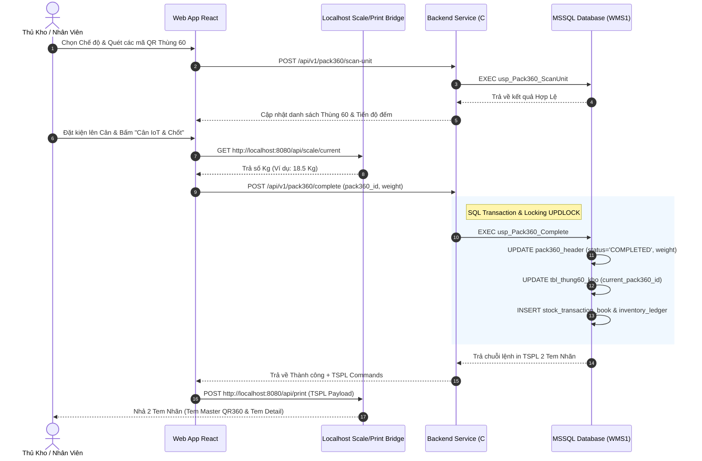
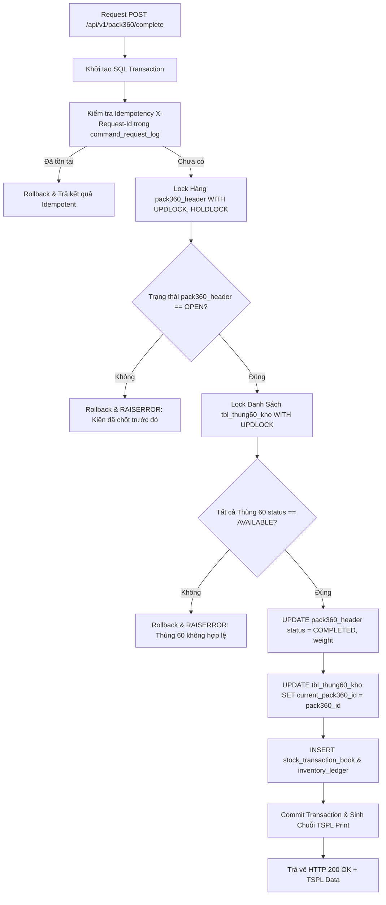
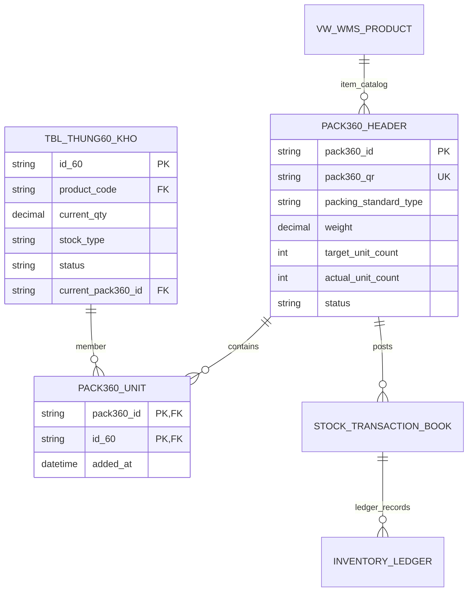

# Phân Tích & Thiết Kế Chuẩn Nghiệp Vụ UC05 - Đóng Gói Kiện 360 (Pack360 Master Carton Packing)

---

## 1. Business Logic (Logic Nghiệp Vụ)

### 1.1. Mục Tiêu Nghiệp Vụ
- Gộp nhiều Thùng 60 (thùng lẻ) thành một kiện lớn hơn (**Kiện 360 / Master Carton**) để tối ưu hóa lưu trữ vị trí trên kệ, đóng gói pallet, và tăng tốc độ xuất bến.
- Tự động đọc dữ liệu cân điện tử IoT (Local Scale Bridge), gán mã QR Pack360 duy nhất và in 2 tem nhãn nhiệt (Tem Master QR360 & Tem Detail chứa danh sách ID60).

### 1.2. Các Quy Tắc Nghiệp Vụ (Business Rules)
- `BR-UC05-01` **Nguồn Mã QR Pack360 Tự Động:** Mã QR Kiện 360 được hệ thống tự động sinh khi chốt hoàn tất theo định dạng `{Kênh}-{Mã_SP}-{DDMMYYYY}-{Sequence}`.
- `BR-UC05-02` **Điều Kiện Thùng 60 Quét Vào:** Thùng 60 phải tồn tại trong CSDL, có trạng thái `status = 'AVAILABLE'`, `stock_type = 'UNRESTRICTED'` và chưa nằm trong bất kỳ Kiện 360 nào.
- `BR-UC05-03` **Đóng Gói Chuẩn SKU (Standard Packing):** Các thùng 60 quét vào cùng một Kiện 360 bắt buộc phải có cùng mã mặt hàng/SKU (`product_code`).
- `BR-UC05-04` **Đóng Gói OEM (Kế Thừa Đơn Hàng OEM):** Các thùng 60 quét vào Kiện 360 phải có cùng mã đơn OEM (`current_oem_order_no`) và đợt giao (`current_oem_batch_no`).
- `BR-UC05-05` **Đóng Gói OEM Repack:** Cho phép gán cờ `is_repack = 1` và thực hiện gom nhóm thùng 60 theo quy tắc phân bổ đơn OEM mới.
- `BR-UC05-06` **Đo Lường Trọng Lượng IoT:** Bắt buộc ghi nhận thông tin trọng lượng `weight` (Kg) đọc từ cân điện tử kết nối qua Localhost Bridge `http://localhost:8080/api/scale/current` (có hỗ trợ nhập tay thủ công làm phương án dự phòng).
- `BR-UC05-07` **In Tem Tự Động TSPL:** Ngay khi chốt kiện thành công, hệ thống phát lệnh in TSPL tự động xuất 2 tem nhãn qua Local Printer Bridge.

---

## 2. UI/UX Guidelines (Hướng Dẫn Giao Diện)

### 2.1. Bố Cục Màn Hình (Screen Layout)
- **Thiết kế Chia 2 Cột (Desktop Split-Screen):**
  - **Cột Trái (Control & IoT Panel - 35% Width):**
    - Khối chọn Chế độ Đóng gói (Standard / OEM / Repack).
    - Khối đọc Cân Điện Tử IoT: Hiển thị chỉ số Kg thời gian thực từ Cân Serial COM. Nút `[ ⚖️ Lấy Số Kg từ Cân ]` và ô nhập tay dự phòng.
    - Nút bấm chính: `[ 📦 Cân IoT & Chốt Kiện 360 ]` (Primary Green Button).
  - **Cột Phải (Scan & Carton List Panel - 65% Width):**
    - Ô quét mã QR Thùng 60 (Auto-focus input).
    - Thanh tiến độ đếm số lượng thùng đã quét (`actual_unit_count` / `target_unit_count`).
    - Data Grid danh sách các Thùng 60 đã quét (Mã Thùng `id_60`, SKU `product_code`, Số lượng `current_qty`, Thao tác Xóa thùng khỏi phiên draft).

### 2.2. Phản Hồi Trải Nghiệm (UX Feedback & Toast Notifications)
- Khi quét đúng thùng hợp lệ: Phát tiếng kêu "Beep", tự động điền dòng mới vào bảng và xóa ô input để chờ quét tiếp.
- Khi quét trùng hoặc sai SKU/OEM: Hiển thị Toast cảnh báo Đỏ, rung nhẹ ô input và giữ nguyên không nạp dữ liệu.

---

## 3. Programming Logic (Logic Lập Trình)

### 3.1. Frontend React Component Workflow
- **File Component:** `frontend/src/components/Pack360Screen.jsx`
- **Quản lý Session Draft (`pack360_id`):**
  - Mã QR thùng 60 đầu tiên quét vào sẽ khởi tạo phiên làm việc draft (`status = 'OPEN'`).
  - Lưu trạng thái danh sách thùng `units[]` trong local state.
  - Khi người dùng bấm "Chốt Kiện", Frontend gửi request `POST /api/v1/pack360/complete` chứa `pack360_id`, `weight`, `units[]`.

### 3.2. Hardware Integration (Local Bridge API)
- Đọc Cân IoT: `GET http://localhost:8080/api/scale/current` $\rightarrow$ Trả về `{ weight: 15.45, status: 'STABLE' }`.
- Gửi Lệnh In Tem: `POST http://localhost:8080/api/print` $\rightarrow$ Payload chứa chuỗi TSPL lệnh in 2 tem.

### 3.3. Backend API Implementation (Express & C# .NET)
- Express Node.js Route: `backend/routes/pack360.js`
- C# .NET Controller: `src/Wms.Api/Controllers/Pack360Controller.cs`
- Gọi Stored Procedure transactional SQL Server: `usp_Pack360_ScanUnit` và `usp_Pack360_Complete`.

---

## 4. Data Logic (Logic Dữ Liệu)

### 4.1. Ma Trận Phân Quyền CRUD

| Bảng Dữ Liệu | Create (C) | Read (R) | Update (U) | Delete (D) | Trạng Thái Tác Động |
| :--- | :---: | :---: | :---: | :---: | :--- |
| `pack360_header` | X | X | X | | `OPEN` $\rightarrow$ `COMPLETED` |
| `pack360_unit` | X | X | | X | Thêm/Xóa thùng khỏi kiện draft |
| `tbl_thung60_kho` | | X | X | | Cập nhật `current_pack360_id` |
| `stock_transaction_book` | X | X | | | Bút toán hạch toán `PACK360_CREATE` |
| `inventory_ledger` | X | X | | | Ghi sổ cái biến động kiện |

### 4.2. Mô Hình Định Nghĩa Trạng Thái (State Transitions)
- Trạng thái Kiện 360 (`pack360_header.status`):
  `OPEN` (Đang quét) $\rightarrow$ `COMPLETED` (Đã chốt & Cân) $\rightarrow$ `PALLETIZED` (Đã lên pallet) $\rightarrow$ `SHIPPED` (Đã xuất kho).

### 4.3. Hạch Toán Sổ Cái Kép (Dual Ledger Posting)
- Khi chốt kiện 360 thành công, hệ thống ghi bút toán tổng `PACK360_CREATE` vào `stock_transaction_book` và cập nhật `current_pack360_id` cho toàn bộ danh sách các `tbl_thung60_kho` thuộc kiện.

---

## 5. Diagrams (Biểu Đồ Nghiệp Vụ)

### 5.1. Sequence Diagram (Luồng Thực Thi Chốt Kiện 360)

### 5.2. Data Layer Architecture (SQL Transaction & Lock UPDLOCK)

### 5.3. Entity Relationship & State Logic Map (ERD UC05)

