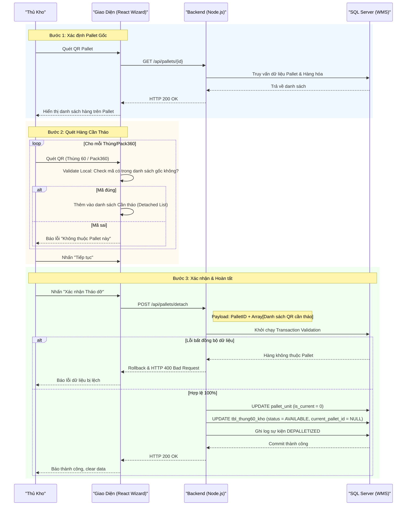

# Phân tích Thiết kế Logic UC06.1 - Tháo dỡ Pallet (Depalletizing)

Tài liệu này đi sâu vào phân tích hệ thống ở 3 khía cạnh: Business Logic (Nghiệp vụ), Programming Logic (Lập trình), và Data Logic (Dữ liệu) dành cho chức năng Tháo dỡ Pallet (UC06.1).

---

## 1. Business Logic (Logic Nghiệp Vụ)

**Mục tiêu cốt lõi:**
Hỗ trợ nhân viên kho bóc tách một phần hoặc toàn bộ hàng hóa (Thùng 60 hoặc Pack360) ra khỏi một Pallet hiện hành. Nghiệp vụ này thường được sử dụng khi cần tách lẻ hàng hóa để chuyển sang Pallet khác, soạn đơn hàng xuất (picking), hoặc xử lý hàng lỗi cần hạ xuống khỏi Pallet.

**Các quy tắc nghiệp vụ (Business Rules):**
- **[BR-UC06.1-01] Trạng thái Đơn vị (Unit Status):** Đơn vị hàng hóa muốn lấy ra (tháo dỡ) phải đang nằm trên một Pallet (tức là có `status` = `PALLETIZED` và `current_pallet_id` đang khác NULL).
- **[BR-UC06.1-02] Xử lý cấp độ (Granularity):** Khi ra lệnh tháo dỡ một kiện lớn (Pack360), toàn bộ các kiện nhỏ (Thùng 60) nằm bên trong Pack360 đó đều chịu chung tác động (đều bị gỡ khỏi Pallet gốc).
- **[BR-UC06.1-03] Đổi trạng thái hạt nhân:** Sau khi tháo dỡ thành công, trạng thái của hàng hóa sẽ được trả về `AVAILABLE` (rảnh rỗi) hoặc chuyển tiếp thành `PICKED` (nếu đang ở bước lấy hàng soạn đơn), đồng thời xóa sạch thông tin Pallet hiện hành (`current_pallet_id` = NULL).
- **[BR-UC06.1-04] Cập nhật Pallet rỗng:** Nếu sau khi tháo dỡ mà Pallet không còn chứa bất kỳ kiện hàng nào, hệ thống phải tự động chuyển trạng thái của Pallet về lại `CREATED` (Pallet trống).
- **[BR-UC06.1-05] Ghi vết Sự kiện (Event Logging):** Bất kỳ hành động tháo dỡ nào đều phải ghi nhận lịch sử thay đổi để đảm bảo truy xuất nguồn gốc.

**Quy trình tương tác (Interaction Flow) - Giao diện Wizard (Step-by-step):**
- **Bước 1 (Xác định Pallet Gốc):** 
  - **Nhân viên kho:** Quét mã QR của Pallet cần tháo dỡ.
  - **Hệ thống:** Tra cứu và hiển thị danh sách toàn bộ hàng hóa đang có trên Pallet này.
- **Bước 2 (Quét Hàng Cần Tháo):** 
  - **Nhân viên kho:** Quét lần lượt các mã QR của Thùng 60 hoặc Pack360 mà nhân viên vừa lấy ra khỏi Pallet.
  - **Hệ thống:** Đối chiếu mã quét với danh sách hàng trên Pallet. Nếu đúng, đánh dấu "Sẽ tháo dỡ" và lưu vào danh sách tạm.
- **Bước 3 (Xác nhận & Hoàn tất):**
  - **Nhân viên kho:** Xem lại số lượng hàng đã chọn tháo dỡ và nhấn "Xác nhận Tháo dỡ".
  - **Hệ thống:** Gọi API đồng loạt gỡ các đơn vị này khỏi Pallet, trả trạng thái hàng hóa về `AVAILABLE`.

---

## 2. Programming Logic (Logic Lập Trình)

Quy trình xử lý mã lệnh được chia thành 2 lớp: Frontend (React) và Backend (Node.js/Express). 

### 2.1. Frontend (React - `DetachCartonsScreen.jsx`)
- **Quản lý State:** 
  - Dùng state `scannedPallet` để lưu trữ thông tin Pallet gốc và toàn bộ danh sách hàng hóa thuộc Pallet đó (fetch từ API `GET /api/pallets/{id}`).
  - Dùng state mảng `detachedCartons` để chứa các mã hàng nhân viên đã quét và muốn gỡ ra.
- **Luồng bất đồng bộ (Async Flow):**
  - Tại Bước 2: Mỗi lần quét mã thùng, hàm JS cục bộ sẽ kiểm tra xem mã đó có nằm trong mảng hàng hóa gốc của Pallet hay không. Nếu không, báo lỗi "Thùng không thuộc Pallet này" ngay tại UI mà không cần gọi API.
  - Tại Bước 3: Bắn API `POST /api/pallets/detach` kèm payload chứa ID Pallet gốc và mảng các mã hàng hóa cần tháo. Nhận HTTP 200 để báo thành công.

### 2.2. Backend (Node.js - `pallet.js`)
- **API `POST /detach`:**
  - Mở một Transaction SQL ngay khi bắt đầu xử lý.
  - Cập nhật bảng `pallet_unit`: Đánh dấu vô hiệu hóa liên kết bằng câu lệnh `UPDATE pallet_unit SET is_current = 0 WHERE pallet_id = @OldPalletId AND unit_id IN (@UnitIds)`.
  - Cập nhật bảng `tbl_thung60_kho`: Gỡ bỏ Pallet ID và set lại trạng thái: `UPDATE tbl_thung60_kho SET current_pallet_id = NULL, status = 'AVAILABLE' WHERE current_pallet_id = @OldPalletId AND id_60 IN (...)`.
  - Kiểm tra số lượng hàng còn lại trên Pallet. Nếu = 0, chạy `UPDATE pallet SET status = 'CREATED' WHERE pallet_id = @OldPalletId`.
  - Nếu gặp lỗi (hàng hóa không thuộc Pallet), `throw Error` kích hoạt Rollback toàn bộ Transaction và trả về mã lỗi 400.

---

## 3. Data Logic (Logic Dữ Liệu)

### 3.1. Cây quyết định (Decision Tree - Validation)
Tại API tháo dỡ hàng, hệ thống kiểm duyệt theo các bước:
1. Payload gửi lên có rỗng không? -> Lỗi nếu danh sách hàng cần tháo rỗng.
2. Mã Pallet gốc có hợp lệ không? -> Lỗi nếu không tìm thấy Pallet.
3. Các kiện hàng gửi lên có thực sự đang nằm trên Pallet này không? -> Lỗi (Bảo mật/Toàn vẹn) nếu phát hiện kiện hàng có `current_pallet_id` khác với Pallet ID gửi lên.

### 3.2. Cấu trúc bảng & Ghi nhận dữ liệu
- **Bảng `pallet_unit`:** Dùng cơ chế Soft-delete bằng cách cập nhật cột `is_current = 0` thay vì `DELETE` record. Điều này giúp hệ thống vẫn truy vết được kiện hàng đó đã từng nằm trên Pallet này trong quá khứ.
- **Bảng `thung60_event`:** 
  - Khi Transaction commit thành công, sinh ra các dòng log `event_type = 'DEPALLETIZED'` cho từng `id_60` bị tác động.

### 3.3. Ma trận Phân quyền & CRUD (CRUD Matrix)
Bảng dưới đây mô tả quyền hạn tác động dữ liệu (Create, Read, Update, Delete) của các Roles trên hệ thống trong phạm vi UC06.1.

| Bảng (Table) | Worker (Nhân viên kho) | Storekeeper (Thủ kho) | System (Hệ thống tự động) |
| :--- | :---: | :---: | :---: |
| `pallet` | R / U | R / U | R / U |
| `pallet_unit` | R / U | R / U | C / R / U |
| `tbl_thung60_kho` | R | R | R / U |
| `thung60_event` | None | R | C |

*(Ghi chú: C = Create, R = Read, U = Update, D = Delete. `pallet_unit` được Update `is_current=0` chứ không bị Delete).*

---

## 4. Biểu Đồ Thiết Kế (Diagrams)

### 4.1. Sequence Diagram (Biểu đồ tuần tự)



### 4.2. Data Flow Diagram (Biểu đồ luồng dữ liệu)

```mermaid
flowchart TD
    A["Thủ kho Quét Mã Pallet"] -->|GET /pallets/id| B("Frontend UI (Load danh sách gốc)")
    
    A2["Thủ kho Quét Hàng Hóa Cần Tháo"] -->|Validate Local| B
    
    B -->|POST /detach (Array Items + PalletID)| C["API: Gỡ Hàng Khỏi Pallet"]
    
    C -->|1. Xác thực hàng thuộc Pallet| D[("[WMS1].[dbo].[tbl_thung60_kho]")]
    D -.->|Báo lỗi nếu sai lệch| C
    
    C -->|2. Cắt liên kết Hàng - Pallet (is_current = 0)| E[(Bảng: pallet_unit)]
    
    C -->|3. Gỡ ID Pallet & Trả Trạng thái về AVAILABLE| D
    
    C -->|4. Kiểm tra & Cập nhật Pallet (Nếu rỗng -> CREATED)| F[(Bảng: pallet)]
    
    C -->|5. Ghi nhận Audit Log| G[(Bảng: thung60_event)]
```
