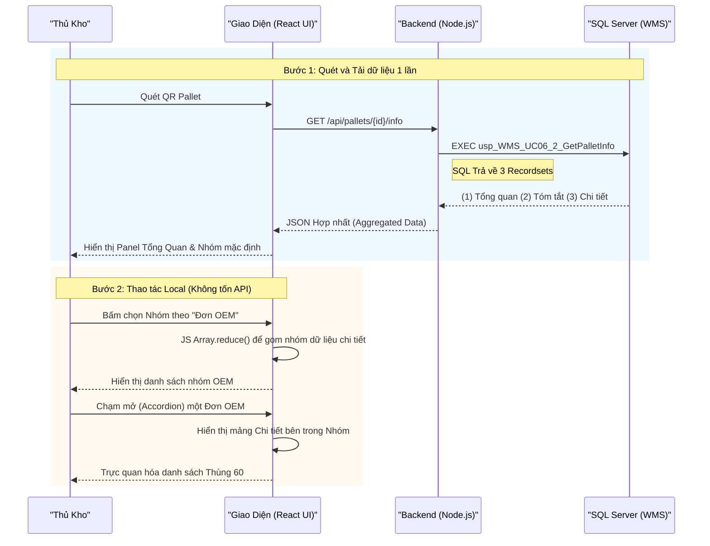

# Phân tích Thiết kế Logic UC06.2 - Tra cứu Pallet (Pallet Inquiry)

Tài liệu này đi sâu vào phân tích hệ thống ở 3 khía cạnh: Business Logic (Nghiệp vụ), Programming Logic (Lập trình), và Data Logic (Dữ liệu) dành cho chức năng Tra cứu thông tin Pallet (UC06.2).

---

## 1. Business Logic (Logic Nghiệp Vụ)

**Mục tiêu cốt lõi:**
Hỗ trợ nhân viên kho và quản lý (Storekeeper) quét mã Pallet để xem nhanh bức tranh toàn cảnh về Pallet đó. Chức năng không chỉ cung cấp thông tin tổng quan (vị trí, tổng trọng lượng) mà còn cho phép phân tích hàng hóa trên Pallet theo nhiều góc nhìn (theo Mã sản phẩm, theo Đơn hàng OEM, theo Kênh phân phối), giúp quá trình kiểm đếm và tìm hàng diễn ra chớp nhoáng.

**Các quy tắc nghiệp vụ (Business Rules):**
- **[BR-UC06.2-01] Tính hợp lệ của Hàng hóa:** Chỉ những Thùng 60 / Pack360 có liên kết vật lý hiện tại với Pallet (`is_current = 1` trong bảng Mapping) mới được thống kê vào số lượng hiển thị.
- **[BR-UC06.2-02] Đa chiều Phân tích (Multi-dimensional Grouping):** Hệ thống bắt buộc phải hỗ trợ gom nhóm (Group By) động trên giao diện theo 3 tiêu chí:
  - Bằng Mã Sản Phẩm (SKU).
  - Bằng Đơn hàng OEM (OEM Order).
  - Bằng Kênh Khách hàng (Channel).
- **[BR-UC06.2-03] Tính toán Trọng lượng (Weight Calculation):** Hệ thống tự động tính Tổng trọng lượng Pallet (Total Weight) bằng cách lấy Trọng lượng bì của bản thân Pallet (Tare Weight) cộng với tổng trọng lượng thực tế (Gross Weight) của tất cả Thùng 60 đang nằm trên Pallet.
- **[BR-UC06.2-04] Tính nguyên vẹn dữ liệu (Read-only):** Màn hình tra cứu tuyệt đối không làm thay đổi bất kỳ trạng thái nào của CSDL. 

**Quy trình tương tác (Interaction Flow) - Giao diện Drill-down:**
- **Bước 1 (Quét Pallet):** 
  - **Nhân viên kho:** Mở màn hình Tra Cứu, quét mã QR Pallet.
  - **Hệ thống:** Hiển thị Panel "Thông tin Tổng quan" (Vị trí, Trọng lượng, Tổng số kiện hàng) và danh sách các nhóm hàng mặc định theo "Mã Sản Phẩm".
- **Bước 2 (Phân tích Đa chiều):** 
  - **Nhân viên kho:** Bấm chọn chuyển đổi Tab/Nút để xem theo "Đơn OEM" hoặc "Kênh".
  - **Hệ thống:** Lập tức gom nhóm (Re-group) lại dữ liệu và hiển thị danh sách các nhóm mới.
- **Bước 3 (Drill-down Xem chi tiết):**
  - **Nhân viên kho:** Bấm chạm (Tap) vào một Nhóm cụ thể (Ví dụ: Đơn OEM 12345).
  - **Hệ thống:** Thả xuống dạng Accordion (ổ khóa mở ra), liệt kê chi tiết đích danh từng mã Thùng 60 / Pack360 nằm bên trong Nhóm đó để nhân viên đối chiếu trực quan.

---

## 2. Programming Logic (Logic Lập Trình)

Quy trình xử lý mã lệnh được chia thành 2 lớp: Frontend (React) và Backend (Node.js/Express kết hợp SQL Stored Procedure).

### 2.1. Frontend (React - `PalletScreen.jsx`)
- **State Management & Grouping:** 
  - Gọi API 1 lần duy nhất để kéo toàn bộ dữ liệu chi tiết. Lưu vào React State.
  - Sử dụng hàm JavaScript `Array.prototype.reduce()` cục bộ để gom nhóm dữ liệu (Group By) theo tiêu chí người dùng đang chọn (groupBy = 'product_code' | 'current_oem_order_no' | 'customer_code') thay vì gọi lại API nhiều lần để tiết kiệm băng thông và tạo trải nghiệm mượt mà không độ trễ.
- **Giao diện Accordion:**
  - Sử dụng cấu trúc Collapse/Accordion để ẩn/hiện danh sách chi tiết của từng Nhóm, tối ưu hóa không gian hiển thị hẹp trên màn hình máy quét cầm tay (HHT PDA).

### 2.2. Backend (Node.js - `pallet.js` & SQL)
- **API `GET /api/pallets/{id}/info`:**
  - Node.js không xử lý logic tính toán mà đẩy toàn bộ gánh nặng xuống SQL Server thông qua việc gọi Stored Procedure `usp_WMS_UC06_2_GetPalletInfo`.
  - SP này tận dụng tính năng Multi-Result Set của SQL Server để trả về cùng lúc 3 bộ dữ liệu (Recordsets) trong 1 lần Query duy nhất:
    1. **Result Set 1 (Pallet Info):** Cấu hình tổng quan (Status, Location, tính toán SUM Gross Weight).
    2. **Result Set 2 (Inventory Summary):** Báo cáo số lượng tổng hợp.
    3. **Result Set 3 (Unit Details):** Danh sách rã chi tiết từng `id_60` và `pack360_id`.

---

## 3. Data Logic (Logic Dữ Liệu)

### 3.1. Cây quyết định (Decision Tree - Validation)
Tại API Tra cứu, hệ thống xử lý nhanh theo các nhánh:
1. Mã Pallet gửi lên có tồn tại trong bảng `pallet` không? -> Nếu không, trả về lỗi 404 Not Found.
2. Pallet có đang trống không? (Count `pallet_unit` = 0) -> Trả về Thông tin tổng quan nhưng Bảng chi tiết rỗng, hiển thị cảnh báo "Pallet đang trống" trên UI.

### 3.2. Cấu trúc bảng & Nguồn dữ liệu
- **Bảng `pallet`:** Chứa `tare_weight` (Trọng lượng bì).
- **Bảng `tbl_thung60_kho`:** Chứa `gross_weight` (Trọng lượng hàng) và các thông tin phân loại (SKU, OEM, Channel).
- Khi tính toán tổng hàng hóa, hệ thống dùng thuật toán đệ quy hoặc `UNION ALL` để bóc tách cả những Thùng 60 đang nằm bên trong một kiện `PACK360` (Bảng `pack360_unit`).

### 3.3. Ma trận Phân quyền & CRUD (CRUD Matrix)
Đây là nghiệp vụ Read-only (Chỉ đọc) hoàn toàn.

| Bảng (Table) | Worker (Nhân viên kho) | Storekeeper (Thủ kho) | System (Hệ thống tự động) |
| :--- | :---: | :---: | :---: |
| `pallet` | R | R | R |
| `pallet_unit` | R | R | R |
| `tbl_thung60_kho` | R | R | R |
| `pack360_unit` | R | R | R |

*(Ghi chú: C = Create, R = Read, U = Update, D = Delete).*

---

## 4. Biểu Đồ Thiết Kế (Diagrams)

### 4.1. Sequence Diagram (Biểu đồ tuần tự)



### 4.2. Data Flow Diagram (Biểu đồ luồng dữ liệu)

```mermaid
flowchart TD
    A["Thủ kho Quét Mã Pallet"] -->|GET /info| B("API: Controller Node.js")
    
    B -->|EXEC SP GetPalletInfo| C{{"Stored Procedure (SQL)"}}
    
    C -->|Query SUM(gross_weight)| D[("[WMS1].[dbo].[tbl_thung60_kho]")]
    C -->|Join Liên kết| E[(Bảng: pallet_unit)]
    C -->|Bóc tách Pack360| F[(Bảng: pack360_unit)]
    
    C -->|Set 1: Pallet Info| B
    C -->|Set 2: Summary| B
    C -->|Set 3: Details| B
    
    B -->|Cấu trúc JSON JSON| G("Frontend UI")
    
    G -->|JS Group By (SKU)| H["Giao diện Accordion"]
    G -->|JS Group By (OEM)| H
    G -->|JS Group By (Channel)| H
```
