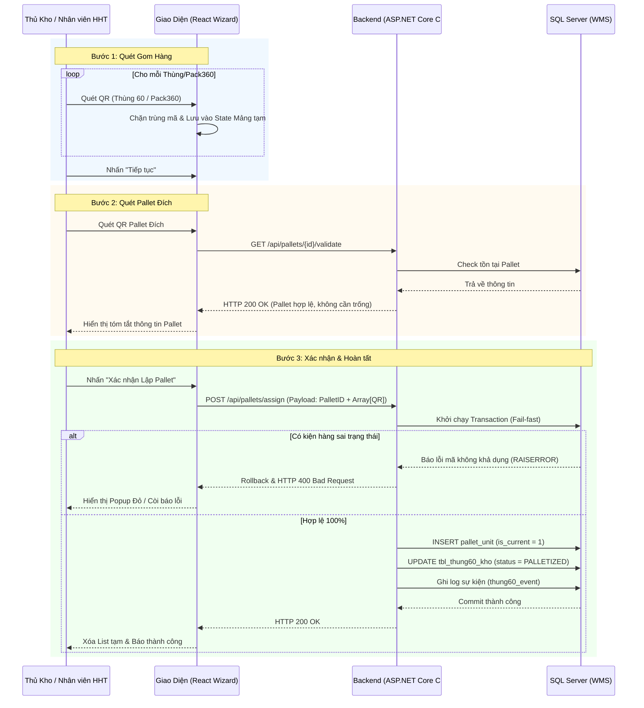
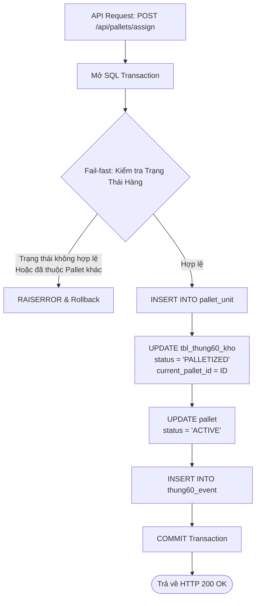
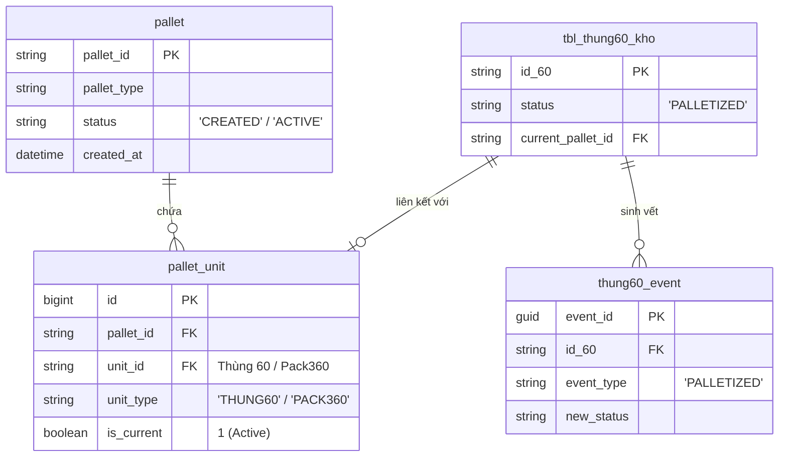

# Phân tích Thiết kế Logic UC06 - Lập Pallet (Palletizing)

Tài liệu này đi sâu vào phân tích hệ thống ở 5 khía cạnh bắt buộc: **Business Logic**, **UI/UX Guidelines**, **Programming Logic**, **Data Logic**, và **Diagrams (Mermaid)** dành cho chức năng Lập Pallet.

---

## 1. Business Logic (Logic Nghiệp Vụ)

**Mục tiêu cốt lõi:**
Nhân viên gom các Thùng 60 lẻ hoặc các Pack360 đã hoàn thành lên một Pallet. Mỗi Pallet đã được gắn sẵn một mã định danh cố định (QR Code) từ trước, nhân viên chỉ việc quét mã Pallet để gán hàng hóa đã gom vào Pallet đó nhằm phục vụ cho việc lưu kho hoặc xuất hàng khối lượng lớn.

**Các quy tắc nghiệp vụ (Business Rules):**
- **[BR-UC06-01] Trạng thái Đơn vị (Unit Status):** Thùng 60 hoặc Pack360 đưa lên Pallet không được có `status` là `SHIPPED`, `SCRAPPED`, `TEMP_ISSUED` hoặc đang thuộc 1 Pallet/phiếu xuất active khác (trừ khi thực hiện nghiệp vụ tháo dỡ tách pallet trước đó).
- **[BR-UC06-02] Ràng buộc Pack360:** Nếu đơn vị đưa lên Pallet là Pack360, thì kiện Pack360 đó bắt buộc phải ở trạng thái đã đóng gói xong (`status = 'COMPLETED'`).
- **[BR-UC06-03] Chấp nhận Pallet đang có hàng:** Hệ thống không bắt buộc Pallet đích phải là Pallet rỗng (Trống). Một Pallet đang có sẵn hàng hóa (`ACTIVE`) hoặc đã nằm trên kệ (`IN_STORAGE`) vẫn có thể tiếp nhận thêm hàng, miễn là thực tế vật lý trên Pallet còn chỗ chứa.
- **[BR-UC06-04] Đổi trạng thái hạt nhân:** Khi một đơn vị được gán vào Pallet thành công, `status` của Thùng 60 (trực tiếp hoặc nằm trong Pack360) sẽ chuyển sang `PALLETIZED` và hệ thống tự động cập nhật ID của Pallet vào tồn kho.
- **[BR-UC06-05] Ghi vết Sự kiện (Event Logging):** Mọi thay đổi gán (assign) hoặc tháo (remove) Unit khỏi Pallet phải sinh ra log trong `thung60_event` và `audit_log` để truy vết vòng đời của kiện hàng.

**Quy trình tương tác (Interaction Flow):**
- **Bước 1:** Nhân viên quét mã QR của các Thùng 60 hoặc Pack360. Các mã quét hợp lệ sẽ được lưu vào một danh sách tạm (List) trên giao diện HHT.
- **Bước 2:** Quét mã QR định danh được dán sẵn trên Pallet đích.
- **Bước 3:** Xem lại bảng tóm tắt và nhấn "Xác nhận Lập Pallet". Hệ thống gọi API đồng loạt ghi nhận toàn bộ đơn vị hàng hóa vào Pallet, cập nhật trạng thái.

---

## 2. Tiêu chuẩn Thiết kế Giao diện (UI/UX Guidelines)

- **Thiết bị đích:** Máy quét mã vạch cầm tay HHT (Zebra/Honeywell) hoặc Máy tính bảng Tablet gắn trên xe nâng.
- **Yêu cầu trải nghiệm (UX Principles):**
  - **Giao diện dạng Wizard (Step-by-step):** Tránh việc quét nhầm giữa mã Hàng và mã Pallet bằng cách tách biệt màn hình quét hàng hóa (Bước 1) và màn hình quét Pallet đích (Bước 2).
  - **Hiển thị tiến độ rõ ràng:** Ở bước 1, mỗi khi quét thành công một mã hàng, hệ thống phát ra âm thanh Beep ngắn, số đếm kiện hàng tăng lên và mã kiện hàng xuất hiện ở đầu danh sách.
  - **Cảnh báo lỗi dễ hiểu:** Nếu quét phải mã không khả dụng (đã bán, đang bị QC khóa), màn hình sẽ hiện popup đỏ toàn màn hình kèm âm Beep dài để nhân viên lập tức dừng thao tác.

---

## 3. Programming Logic (Logic Lập Trình)

### 3.1. Frontend Component (`PalletScreen.jsx`)
- Sử dụng Mảng (Array State) lưu trữ danh sách các mã QR hàng hóa quét được tại Bước 1. Mỗi lần quét sẽ gọi hàm chặn trùng lặp mã trong mảng cục bộ.
- Bắn API `GET /api/pallets/{id}/validate` để xác minh tính tồn tại của Pallet và hiển thị thông tin cảnh báo nếu cần.
- Bắn API `POST /api/pallets/assign` kèm payload chứa ID Pallet đích và mảng các mã QR hàng hóa. 

### 3.2. Backend API & Stored Procedure (`10_UC06_Palletizing_SPs.sql`)
- Mở một Transaction SQL ngay khi bắt đầu xử lý `usp_WMS_UC06_AddUnitToPallet`.
- **Fail-fast:** Duyệt qua mảng hàng hóa được gửi lên. Nếu gặp bất cứ mã hàng nào không hợp lệ (Đã bị xuất, đang khóa QC, đã nằm trên pallet khác), `RAISERROR` kích hoạt Rollback toàn bộ Transaction và trả về mã lỗi 400.
- Cập nhật bảng `pallet` chuyển status sang `ACTIVE` nếu Pallet đang là `CREATED`.
- Cập nhật bảng `tbl_thung60_kho` để set `status = 'PALLETIZED'` và `current_pallet_id = [Mã Pallet]`.

---

## 4. Data Logic (Thiết kế Dữ Liệu)

### 4.1. Ma trận phân quyền CRUD

| Bảng / Thực thể Dữ Liệu | Create (Tạo) | Read (Đọc) | Update (Cập nhật) | Delete (Xóa) | Ý nghĩa nghiệp vụ trong UC06 |
| :--- | :---: | :---: | :---: | :---: | :--- |
| `pallet` | **X** | **X** | **X** | - | Khởi tạo hoặc Cập nhật trạng thái tổng của Pallet. |
| `pallet_unit` | **X** | **X** | **X** | - | Bảng mapping nhiều-nhiều. Ghi nhận hàng hóa nằm trên Pallet (`is_current = 1`). |
| `tbl_thung60_kho` | - | **X** | **X** | - | Cập nhật `status = PALLETIZED` và gán `current_pallet_id`. |
| `thung60_event` | **X** | **X** | - | - | Ghi log sự kiện đổi trạng thái vòng đời. |

### 4.2. Phân tích Sổ cái Kép (Dual Ledger)

- **Nguyên tắc hạch toán:** Tác vụ Lập Pallet (Palletizing) bản chất là thao tác **Gom Hàng Vật Lý** (đưa các thùng lẻ lên một kệ gỗ/nhựa chung). Nó hoàn toàn không làm thay đổi số lượng tồn kho (Quantity), không thay đổi quyền sở hữu hàng hóa, và không làm thay đổi trạng thái tự do lưu thông của hàng hóa (UNRESTRICTED).
- **Kết luận Sổ cái:** Do đó, luồng UC06 **KHÔNG ghi nhận bất kỳ bút toán nào vào Sổ cái Kép** (`stock_transaction_book`, `inventory_ledger`, `item_ledger`). Mọi truy vết của kiện hàng ở cấp độ nội bộ kho được đáp ứng đủ thông qua bảng `thung60_event` và sự thay đổi trong `tbl_thung60_kho`.

---

## 5. Biểu Đồ Thiết Kế (Diagrams)

### 5.1. Sequence Diagram (Luồng Trạng thái Tương tác)

### 5.2. Data Layer Architecture (Data Flow & Validation)

### 5.3. Entity Relationship & State Logic Map (ERD Map UC06)

