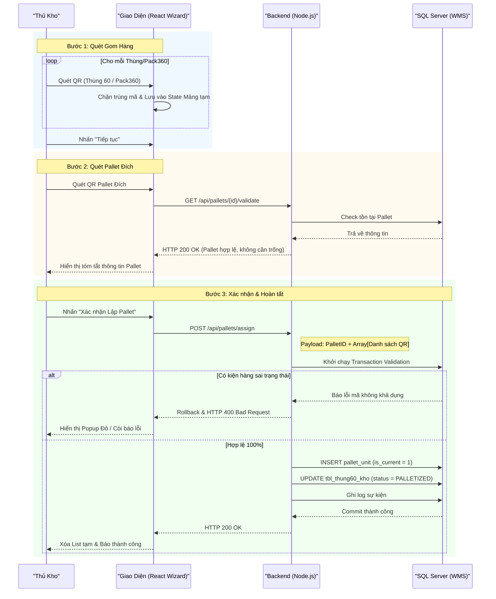

# Phân tích Thiết kế Logic UC06 - Lập Pallet (Palletizing)

Tài liệu này đi sâu vào phân tích hệ thống ở 3 khía cạnh: Business Logic (Nghiệp vụ), Programming Logic (Lập trình), và Data Logic (Dữ liệu) dành cho chức năng Lập Pallet.

---

## 1. Business Logic (Logic Nghiệp Vụ)

**Mục tiêu cốt lõi:**
Nhân viên gom các Thùng 60 lẻ hoặc các Pack360 đã hoàn thành lên một Pallet. Mỗi Pallet đã được gắn sẵn một mã định danh cố định (QR Code) từ trước, nhân viên chỉ việc quét mã Pallet để gán hàng hóa đã gom vào Pallet đó nhằm phục vụ cho việc lưu kho hoặc xuất hàng khối lượng lớn.

**Các quy tắc nghiệp vụ (Business Rules):**
- **[BR-UC06-01] Trạng thái Đơn vị (Unit Status):** Thùng 60 hoặc Pack360 đưa lên Pallet không được có `status` là `SHIPPED`, `SCRAPPED`, `TEMP_ISSUED` hoặc đang thuộc 1 Pallet/phiếu xuất active khác (trừ khi thực hiện nghiệp vụ tháo dỡ tách pallet trước đó).
- **[BR-UC06-02] Ràng buộc Pack360:** Nếu đơn vị đưa lên Pallet là Pack360, thì kiện Pack360 đó bắt buộc phải ở trạng thái đã đóng gói xong (`status = 'COMPLETED'`).
- **[BR-UC06-03] Chấp nhận Pallet đang có hàng:** Hệ thống không bắt buộc Pallet đích phải là Pallet rỗng (Trống). Một Pallet đang có sẵn hàng hóa (`ACTIVE`) hoặc đã nằm trên kệ (`IN_STORAGE`) vẫn có thể tiếp nhận thêm hàng, miễn là thực tế vật lý trên Pallet còn chỗ chứa.
- **[BR-UC06-04] Đổi trạng thái hạt nhân:** Khi một đơn vị được gán vào Pallet thành công, `status` của Thùng 60 (trực tiếp hoặc nằm trong Pack360) sẽ chuyển sang `PALLETIZED` và hệ thống tự động cập nhật ID của Pallet vào tồn kho.
- **[BR-UC06-05] Ghi vết Sự kiện (Event Logging):** Mọi thay đổi gán (assign) hoặc tháo (remove) Unit khỏi Pallet phải sinh ra log trong `thung60_event` và `audit_log` để truy vết vòng đời của kiện hàng.

**Quy trình tương tác (Interaction Flow) - Giao diện Wizard (Step-by-step):**
- **Bước 1 (Quét Gom Hàng):** 
  - **Nhân viên kho:** Quét mã QR của các Thùng 60 hoặc Pack360 cần đưa lên Pallet. 
  - **Hệ thống:** Các mã quét hợp lệ sẽ được lưu vào một danh sách tạm (List) trên giao diện thiết bị HHT. Nhân viên có thể nhấn xóa (Remove) nếu quét nhầm. Sau khi quét đủ số lượng cần thiết, nhân viên nhấn nút "Tiếp tục".
- **Bước 2 (Xác định Pallet Đích):** 
  - **Nhân viên kho:** Quét mã QR định danh được dán sẵn trên Pallet đích.
  - **Hệ thống:** Tra cứu thông tin Pallet. Báo lỗi nếu mã vạch không đúng chuẩn hoặc Pallet đang bị khóa. Nếu hợp lệ, chuyển sang bước cuối.
- **Bước 3 (Xác nhận & Hoàn tất):**
  - **Nhân viên kho:** Xem lại bảng tóm tắt tổng quan (Số lượng kiện hàng sẽ gán, Mã Pallet đích) và nhấn "Xác nhận Lập Pallet".
  - **Hệ thống:** Gọi API đồng loạt ghi nhận toàn bộ đơn vị hàng hóa vào Pallet, cập nhật trạng thái `status` thành `PALLETIZED`. Pallet tự động kích hoạt thành `ACTIVE` (hoặc giữ nguyên `IN_STORAGE` nếu đang ở trên kệ).

---

## 2. Programming Logic (Logic Lập Trình)

Quy trình xử lý mã lệnh được chia thành 2 lớp: Frontend (React) và Backend (Node.js/Express). 

### 2.1. Frontend (React - `PalletScreen.jsx`)
- **Quản lý State theo Wizard:** 
  - Giao diện (UI) sử dụng cơ chế Step (hoặc Tabs) để điều hướng người dùng tuần tự qua 3 bước, tránh việc quét nhầm lẫn giữa mã Hàng và mã Pallet.
  - Sử dụng một Mảng (Array State) lưu trữ danh sách các mã QR hàng hóa quét được tại Bước 1. Mỗi lần quét sẽ gọi hàm chặn trùng lặp mã trong mảng cục bộ.
- **Luồng bất đồng bộ (Async Flow):**
  - Tại Bước 2: Bắn API `GET /api/pallets/{id}/validate` (hoặc GetPalletInfo) để xác minh tính tồn tại của Pallet và hiển thị thông tin cảnh báo nếu cần.
  - Tại Bước 3: Bắn API `POST /api/pallets/assign` kèm payload chứa ID Pallet đích và mảng các mã QR hàng hóa. Nhận HTTP 200 để báo thành công (Hiển thị Tick xanh / Âm thanh).

### 2.2. Backend (Node.js - `pallet.js`)
- **API `POST /assign`:**
  - Mở một Transaction SQL ngay khi bắt đầu xử lý.
  - Duyệt qua mảng hàng hóa được gửi lên. Gọi Stored Procedure (hoặc chạy câu SQL hàng loạt) để đối chiếu tình trạng tồn kho của từng kiện hàng. 
  - Cập nhật bảng `pallet` chuyển status sang `ACTIVE` nếu Pallet đang là `CREATED`.
  - Cập nhật bảng `tbl_thung60_kho` để set `status = 'PALLETIZED'` và `current_pallet_id = [Mã Pallet]`.
  - Nếu gặp bất cứ mã hàng nào không hợp lệ (Đã bị xuất, đang khóa QC, ...), `throw Error` kích hoạt Rollback toàn bộ Transaction và trả về mã lỗi 400.

---

## 3. Data Logic (Logic Dữ Liệu)

### 3.1. Cây quyết định (Decision Tree - Validation)
Tại API gán hàng vào Pallet, hệ thống kiểm duyệt ngặt nghèo theo các bước:
1. Payload gửi lên có rỗng không? -> Lỗi nếu danh sách hàng hóa trống.
2. Mã Pallet đích có hợp lệ không? -> Lỗi nếu mã Pallet sai định dạng hoặc Pallet đang bị `LOCKED`.
3. Từng kiện hàng (Thùng 60 / Pack 360) có trạng thái khả dụng không? -> Lỗi nếu `status` nằm trong nhóm cấm (`SHIPPED`, `SCRAPPED`).
4. Xử lý đồng thời (Race Condition): Thùng 60 đã nằm trên Pallet khác chưa? -> Lỗi nếu `current_pallet_id` hiện tại đang khác `NULL`.

### 3.2. Cấu trúc bảng & Ghi nhận dữ liệu
- **Bảng `pallet`:** Nắm giữ thông tin định danh và trạng thái tổng. Nếu Pallet rỗng hoàn toàn, trạng thái là `CREATED`. Có hàng là `ACTIVE`.
- **Bảng `pallet_unit`:** Bảng mapping n-n (Nhiều-Nhiều). Đóng vai trò ghi nhận những hàng hóa nào đang nằm trên Pallet nào (`is_current = 1`).
- **Bảng `thung60_event`:** 
  - Khi Transaction commit thành công, hệ thống phải sinh ra các dòng log `event_type = 'PALLETIZED'` cho từng `id_60` bị tác động để lưu vết kiểm toán (Audit).

### 3.3. Ma trận Phân quyền & CRUD (CRUD Matrix)
Bảng dưới đây mô tả quyền hạn tác động dữ liệu (Create, Read, Update, Delete) của các Roles trên hệ thống trong phạm vi UC06.

| Bảng (Table) | Worker (Nhân viên kho) | Storekeeper (Thủ kho) | System (Hệ thống tự động) |
| :--- | :---: | :---: | :---: |
| `pallet` | R / U | R / U | C / R / U |
| `pallet_unit` | C / R / U | C / R / U | C / R / U |
| `tbl_thung60_kho` | R | R | R / U |
| `thung60_event` | None | R | C |

*(Ghi chú: C = Create, R = Read, U = Update, D = Delete. Hệ thống WMS áp dụng nguyên tắc không xóa cứng (No Delete) trên các bảng dữ liệu lõi, chỉ đổi trạng thái hoặc set `is_current = 0`).*

---

## 4. Biểu Đồ Thiết Kế (Diagrams)

### 4.1. Sequence Diagram (Biểu đồ tuần tự)



### 4.2. Data Flow Diagram (Biểu đồ luồng dữ liệu)

```mermaid
flowchart TD
    A["Thủ kho Quét Hàng Hóa"] -->|Lưu Local State| B("Frontend UI (Tab Lập Pallet)")
    A2["Thủ kho Quét Mã Pallet"] -->|Định danh Đích| B
    
    B -->|POST /assign (Array Items + PalletID)| C["API: Gán Hàng Lên Pallet"]
    
    C -->|1. Xác thực trạng thái Tồn kho| D[("[WMS1].[dbo].[tbl_thung60_kho]")]
    D -.->|Báo lỗi nếu hàng không rảnh| C
    
    C -->|2. Liên kết Hàng - Pallet| E[(Bảng: pallet_unit)]
    
    C -->|3. Cập nhật ID Pallet & Trạng thái| D
    
    C -->|4. Kích hoạt Pallet| F[(Bảng: pallet)]
    
    C -->|5. Ghi nhận Audit Log| G[(Bảng: thung60_event)]
```
