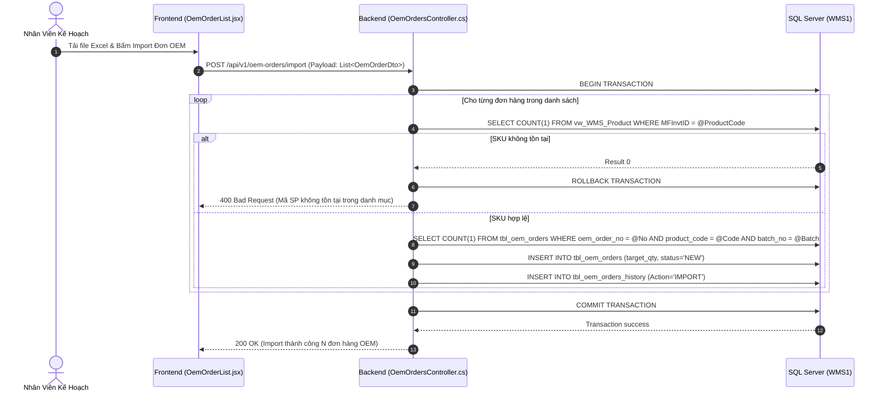
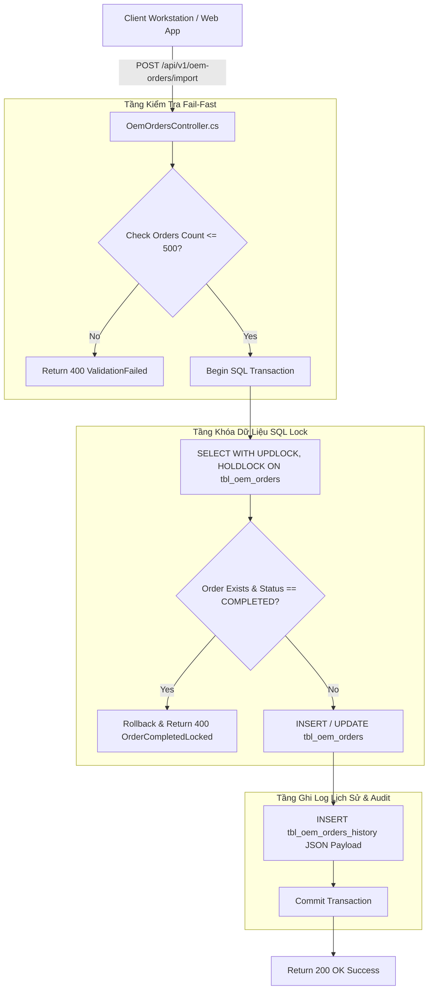
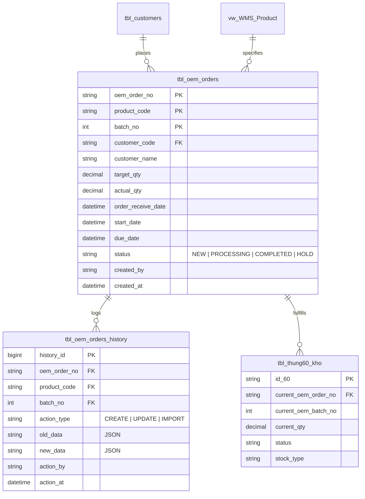

# Phân tích Thiết kế Logic UC07 - Khai Báo và Theo Dõi Đơn Hàng OEM

Tài liệu thiết kế chi tiết nghiệp vụ **UC07 - Khai Báo và Theo Dõi Đơn Hàng OEM (OEM Order Management)** thuộc hệ thống WMS Kho Thành Phẩm.

---

## 1. Business Logic (Logic Nghiệp Vụ)

### 1.1. Mục Tiêu Cốt Lõi
Cho phép bộ phận Kế hoạch (Planner) hoặc Quản lý kho (Manager) khai báo, import dữ liệu đơn hàng OEM (Original Equipment Manufacturer) từ file Excel hoặc API ERP, làm cơ sở gốc để:
1. Thực hiện gán/mapping mã đơn hàng OEM cho dòng hàng hóa khi quét nhập kho (UC02-UC04).
2. Theo dõi tiến độ sản xuất và tỷ lệ hoàn thành kế hoạch đơn hàng OEM theo thời gian thực.
3. Cảnh báo và tự động xử lý hàng sản xuất dư thừa so với chỉ tiêu đơn hàng (`stock_type = 'BLOCKED'`, `reason_code = 'OEM_SURPLUS'`).

### 1.2. Các Quy Tắc Nghiệp Vụ (Business Rules)

| Mã Rule | Quy Tắc Nghiệp Vụ | Mô Tả & Điều Kiện Áp Dụng |
| :--- | :--- | :--- |
| **BR-UC07-01** | **Khóa chính đơn hàng:** | Khóa chính của đơn hàng OEM bao gồm tổ hợp 3 trường: `(oem_order_no, product_code, batch_no)`. Tuyệt đối không để trùng lặp tổ hợp này. |
| **BR-UC07-02** | **Validation sản phẩm & KH:** | Mã sản phẩm (`product_code`) bắt buộc phải tồn tại trong danh mục `vw_WMS_Product`. Mã khách hàng (`customer_code`) nếu nhập phải tồn tại trong `tbl_customers`. |
| **BR-UC07-03** | **Cập nhật tiến độ tự động:** | Khi có phiên nhập kho chính thức (UC04) hoặc đóng gói Kiện 360 (UC05) gắn mã đơn OEM, hệ thống tự động cộng dồn `actual_qty = actual_qty + scanned_qty`. |
| **BR-UC07-04** | **Chuyển trạng thái tự động:** | - Khi `actual_qty == 0`: Trạng thái `NEW`. - Khi `0 < actual_qty < target_qty`: Trạng thái `PROCESSING`. - Khi `actual_qty >= target_qty`: Tự động chuyển `COMPLETED`. |
| **BR-UC07-05** | **Khóa chỉnh sửa khi COMPLETED:**| Đơn hàng OEM ở trạng thái `COMPLETED` tuyệt đối không được phép chỉnh sửa số lượng kế hoạch hoặc thông tin khách hàng nếu không có quyền Admin Re-open. |
| **BR-UC07-06** | **Xử lý số lượng sản xuất dư:**| Khi `actual_qty > target_qty`, phần số lượng dư ra sẽ được tự động/thủ công chuyển sang tồn kho bị khóa (`stock_type = 'BLOCKED'`, `block_reason_code = 'OEM_SURPLUS'`). |
| **BR-UC07-07** | **Lưu vết lịch sử thay đổi:** | Mọi thao tác Thêm mới (`CREATE`), Cập nhật (`UPDATE`), Import (`IMPORT`) đều phải chèn log JSON đầy đủ vào bảng `tbl_oem_orders_history`. |
| **BR-UC07-08** | **Giới hạn Import Excel:** | File Excel import mỗi lần tối đa 500 bản ghi. Nếu có 1 bản ghi lỗi dữ liệu, hệ thống áp dụng nguyên tắc **Fail-Fast (Rollback toàn bộ)**. |

### 1.3. Quy Trình Tương Tác (Interaction Flow)
- **Luồng 1: Import hàng loạt từ Excel**
  - **Bước 1 (User):** Planner tải file mẫu Excel, điền thông tin đơn hàng và bấm `[ + Import Excel ]`.
  - **Bước 2 (System):** Hệ thống hiển thị Modal Preview 10 dòng dữ liệu đầu tiên, tự động kiểm tra lỗi (SKU không tồn tại, TargetQty <= 0).
  - **Bước 3 (User):** Kiểm tra thông tin hợp lệ và bấm `[ Xác Nhận Import ]`.
  - **Bước 4 (System):** Mở SQL Transaction, chèn dữ liệu vào `tbl_oem_orders` và lưu log `tbl_oem_orders_history`.
- **Luồng 2: Cập nhật tiến độ từ Nhập Kho**
  - **Bước 1 (System - Trigger/Event):** Khi Nhập kho chính thức (UC04) hoàn tất với mã đơn OEM.
  - **Bước 2 (System):** Khóa dòng bằng `WITH (UPDLOCK, HOLDLOCK)`, cộng dồn `actual_qty` và tự động cập nhật trạng thái (`NEW` $\rightarrow$ `PROCESSING` $\rightarrow$ `COMPLETED`).

---

## 2. Tiêu Chuẩn Thiết Kế Giao Diện (UI/UX Guidelines)

- **Thiết bị đích:** Máy tính bàn (Desktop Workstation) và Máy tính bảng (Tablet).
- **Cấu trúc bố cục (Master-Detail Grid):**
  - Thanh công cụ Top Action Bar: Bộ lọc tìm kiếm theo `Mã Đơn / Mã SP`, Dropdown Trạng Thái (`NEW`, `PROCESSING`, `COMPLETED`, `HOLD`), Nút `[ + Tạo Đơn Mới ]`, `[ + Import Excel ]` và `[ Xuất Excel ]`.
  - Thanh tiến trình **Progress Bar**: Hiển thị trực quan tiến độ nhập kho (Ví dụ: `🟩🟩🟩⬜⬜ 60%`, kèm text `600 / 1.000 SP`).
  - Chip Badge trạng thái:
    - 🔵 `NEW` (Nền xanh biển nhạt `#dbeafe`, chữ xanh đậm `#1e40af`)
    - 🟡 `PROCESSING` (Nền vàng nhạt `#fef9c3`, chữ vàng đậm `#a16207`)
    - 🟢 `COMPLETED` (Nền xanh lá nhạt `#dcfce7`, chữ xanh lá đậm `#15803d`)
    - 🔘 `HOLD` (Nền xám nhạt `#f1f5f9`, chữ xám `#475569`)

---

## 3. Programming Logic (Logic Lập Trình)

### 3.1. Frontend Components & States
- **Components:** `OemOrderList.jsx`, `OemOrderImportModal.jsx`, `OemOrderFormModal.jsx`, `OemOrderHistoryModal.jsx`.
- **State quản lý:** `orders`, `loading`, `searchQuery`, `statusFilter`, `dateRange`, `selectedOrderForHistory`.
- **Luồng xử lý:** Validate client-side trước khi gửi payload, tự động format hiển thị ngày `dd/MM/yyyy` và phân trang 20 bản ghi/trang.

### 3.2. Backend Controller (`OemOrdersController.cs`)
- **Endpoints REST API:**
  - `GET /api/v1/oem-orders`: Lấy danh sách đơn OEM (Hỗ trợ tìm kiếm `search`, `status`, `startDate`, `endDate`).
  - `POST /api/v1/oem-orders/import`: Import danh sách đơn OEM hàng loạt từ Excel (Tối đa 500 bản ghi/lần).
  - `POST /api/v1/oem-orders`: Tạo mới 1 đơn OEM đơn lẻ.
  - `PUT /api/v1/oem-orders/{orderNo}/{productCode}/{batchNo}`: Cập nhật đơn OEM (Khóa `UPDLOCK`, lưu log `tbl_oem_orders_history`).
  - `GET /api/v1/oem-orders/{orderNo}/{productCode}/{batchNo}/history`: Tra cứu nhật ký lịch sử thay đổi đơn hàng.

---

## 4. Data Logic (Thiết Kế Dữ Liệu)

### 4.1. Ma Trận Phân Quyền CRUD

| Tên Bảng (Table) | Create | Read | Update | Delete | Mô Tả Ý Nghĩa Trong UC07 |
| :--- | :---: | :---: | :---: | :---: | :--- |
| `tbl_oem_orders` | **X** | **X** | **X** | - | Lưu giữ master data đơn hàng OEM, chỉ tiêu `target_qty` và tiến độ `actual_qty`. |
| `tbl_oem_orders_history` | **X** | **X** | - | - | Ghi vết nhật ký tạo mới/cập nhật đơn hàng (Lưu JSON `old_data`, `new_data`). |
| `vw_WMS_Product` | - | **X** | - | - | Truy vấn kiểm tra tính hợp lệ của mã sản phẩm `product_code`. |
| `tbl_customers` | - | **X** | - | - | Truy vấn kiểm tra tính hợp lệ của mã khách hàng `customer_code`. |
| `tbl_thung60_kho` | - | **X** | **X** | - | Liên kết mã đơn OEM với các thùng 60 nhập kho. |
| `inventory_ledger` | - | **X** | - | - | Hạch toán tồn kho thực tế theo từng mã đơn OEM. |

### 4.2. Định Nghĩa Trạng Thái (State Definitions)

| Trạng Thái | Điều Kiện Kích Hoạt | Quyền Nhập Kho | Thao Tác Cho Phép |
| :--- | :--- | :---: | :--- |
| `NEW` | `actual_qty == 0` | 🟢 Cho phép | Cho phép chỉnh sửa kế hoạch, cập nhật KH. |
| `PROCESSING` | `0 < actual_qty < target_qty` | 🟢 Cho phép | Cho phép điều chỉnh kế hoạch (nếu `target_qty >= actual_qty`). |
| `COMPLETED` | `actual_qty >= target_qty` | 🔴 Tự động khóa | Khóa chỉnh sửa, tự động cảnh báo số dư `OEM_SURPLUS`. |
| `HOLD` | Người dùng tạm dừng thủ công | 🔴 Tạm dừng | Tạm dừng gán đơn hàng khi quét nhập kho. |

### 4.3. Cập Nhật Sổ Cái Kép (Dual Ledger Logic)
Nghiệp vụ UC07 quản lý chỉ tiêu kế hoạch đơn OEM. Khi các thùng 60 thuộc đơn OEM được nhập kho chính thức (UC04) hoặc xuất bến (UC16):
- Hệ thống ghi nhận giao dịch nhập/xuất vào `stock_transaction_book`.
- Hạch toán tăng Nợ / giảm Có tồn kho tương ứng theo đúng mã đơn OEM `current_oem_order_no` trong `inventory_ledger`.

---

## 5. Biểu Đồ Thiết Kế (Diagrams)

### 5.1. Sequence Diagram (Luồng Import Đơn OEM & Cập Nhật Tiến Độ)

---

### 5.2. Cấu Trúc Phân Tầng Dữ Liệu (Data Layer Architecture)

---

### 5.3. Entity Relationship & State Logic Map (Mô Hình Thực Thể UC07)

