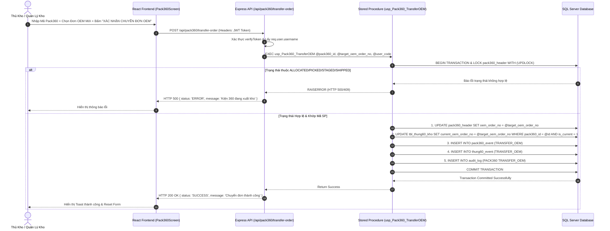
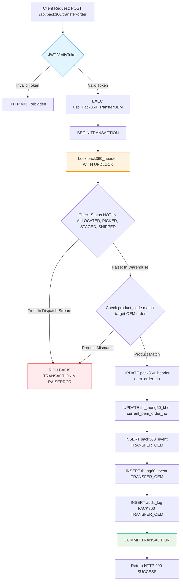
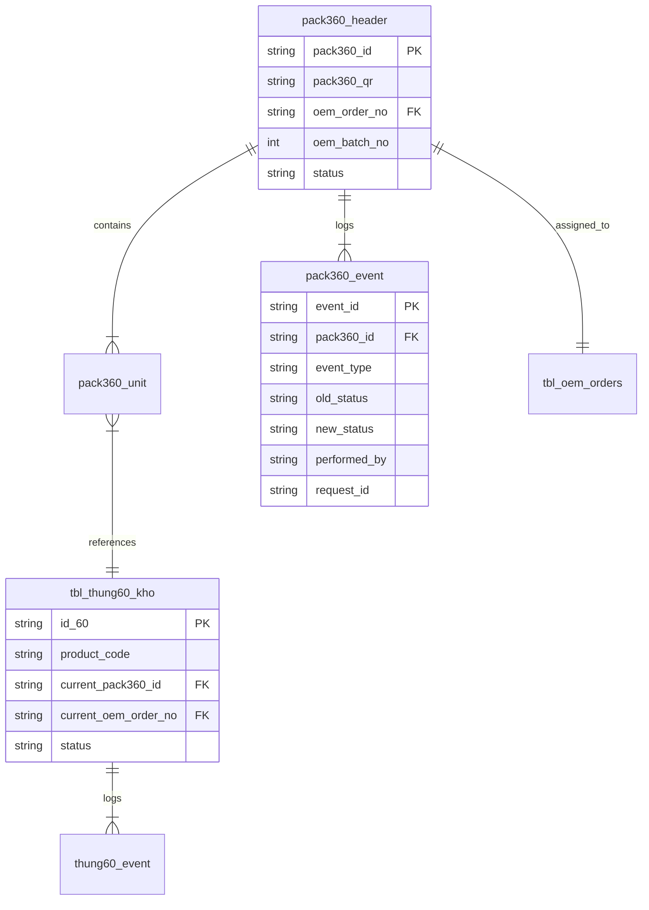

# Phân tích Thiết kế Logic UC08 - Chuyển Đơn OEM Cho Kiện Pack360 (Pack360 OEM Transfer)

## 1. Business Logic (Logic Nghiệp Vụ)
- **Mục tiêu cốt lõi:** Cho phép Quản lý Kho / Thủ Kho chuyển toàn bộ Kiện Pack360 và các Thùng 60 thành viên bên trong từ đơn hàng OEM hiện tại sang một Đơn hàng OEM mới khi cần thay đổi kế hoạch đóng gói hoặc xử lý hàng dư đợt trước.
- **Các quy tắc nghiệp vụ (Business Rules):**
  - `BR-OEM-TRF-001`: Chỉ được phép chuyển đơn OEM khi Kiện Pack360 còn nằm trong kho (không ở các trạng thái xuất kho: `ALLOCATED`, `PICKED`, `STAGED`, `SHIPPED`).
  - `BR-OEM-TRF-002`: Mã sản phẩm của Kiện Pack360 phải tương thích với mã sản phẩm của Đơn hàng OEM mới.
  - `BR-OEM-TRF-003`: Việc chuyển đơn phải cập nhật đồng bộ thông tin `oem_order_no` và `oem_batch_no` ở cả cấp Header (`pack360_header`) và cấp đơn vị thành viên (`tbl_thung60_kho`).
  - `BR-OEM-TRF-004`: Phải ghi nhận nhật ký sự kiện `pack360_event` (`TRANSFER_OEM`), `thung60_event` (`TRANSFER_OEM`) và `audit_log` phục vụ truy vết vệt lịch sử 100%.
- **Quy trình tương tác chi tiết (Detailed Interaction Flow):**

  - **Bước 1: Khởi tạo thao tác tại Trạm Pack360**
    - **Người dùng thao tác:** Thủ kho / Quản lý kho truy cập vào màn hình "Trạm Đóng Gói Pack360" và nhấn chọn Tab **"CHUYỂN ĐƠN OEM"**.
    - **Hệ thống xử lý:** Chuyển giao diện sang màu chủ đạo Xanh biển (`#0284c7`), kích hoạt con trỏ chuột tự động focus vào ô quét mã QR, đồng thời gọi API `GET /api/oem-orders` để tải trước danh sách các Đơn hàng OEM khả dụng.

  - **Bước 2: Quét / Tra cứu thông tin Kiện 360**
    - **Người dùng thao tác:** Thủ kho dùng máy quét barcode hoặc nhập tay Mã QR / ID Kiện Pack360 vào ô tìm kiếm, sau đó nhấn nút **"Kiểm Tra Kiện"**.
    - **Hệ thống xử lý:**
      1. Gửi request `GET /api/pack360/:pack360_id` lên máy chủ.
      2. Backend tra cứu bảng `pack360_header` và `pack360_unit` để lấy thông tin chi tiết: Đơn OEM hiện tại, Trạng thái vật lý, Mã sản phẩm và Số lượng thùng 60 thành phần.
      3. Kiểm tra trạng thái kiện: Nếu kiện đang thuộc luồng xuất kho (`ALLOCATED`, `PICKED`, `STAGED`, `SHIPPED`), hệ thống báo lỗi cảnh báo và ngăn không cho thực hiện chuyển đơn.
      4. Phản hồi dữ liệu lên Frontend, hiển thị thẻ thông tin tóm tắt về Kiện 360.

  - **Bước 3: Lựa chọn Đơn hàng OEM Mới & Nhập lý do**
    - **Người dùng thao tác:** Thủ kho chọn Đơn hàng OEM đích từ danh sách gợi ý (dropdown) hoặc nhập trực tiếp Mã đơn OEM mới vào ô thông tin, đồng thời nhập Lý do chuyển đơn (ví dụ: "Chuyển đơn theo yêu cầu Kế hoạch").
    - **Hệ thống xử lý:** Tự động lọc và hiển thị danh sách các Đơn hàng OEM có cùng Mã sản phẩm (`product_code`) với Kiện 360 để hỗ trợ người dùng chọn chính xác, tránh nhầm lẫn sản phẩm.

  - **Bước 4: Xác nhận và Thực thi Chuyển đơn (Submit)**
    - **Người dùng thao tác:** Thủ kho kiểm tra lại thông tin và bấm nút **"XÁC NHẬN CHUYỂN ĐƠN OEM"**.
    - **Hệ thống xử lý (Backend Atomic Transaction):**
      1. **Khóa bản ghi (Locking):** Khởi tạo SQL Transaction và thực thi lệnh khóa `UPDLOCK` trên bản ghi `pack360_header`.
      2. **Kiểm tra ràng buộc (Fail-Fast Validation):**
         - Xác nhận lại trạng thái Kiện 360 không nằm trong luồng xuất bến (`BR-ST-004`).
         - Xác nhận Đơn hàng OEM mới tồn tại trong bảng `tbl_oem_orders`.
         - Kiểm tra tính tương thích về Mã sản phẩm (`product_code`).
      3. **Cập nhật dữ liệu (Data Mutation):**
         - Update `pack360_header`: Gán `oem_order_no = @target_oem_order_no`, `oem_batch_no = @target_oem_batch_no`.
         - Update `tbl_thung60_kho`: Gán `current_oem_order_no = @target_oem_order_no`, `current_oem_batch_no = @target_oem_batch_no` cho toàn bộ Thùng 60 đang nằm trong Kiện 360 đó (`is_current = 1`).
      4. **Ghi nhật ký sự kiện & Audit Log:**
         - Ghi bản ghi `TRANSFER_OEM` vào bảng `pack360_event` kèm mã `request_id`.
         - Ghi bản ghi `TRANSFER_OEM` vào bảng `thung60_event` cho tất cả thùng 60 thành phần.
         - Ghi vết hành động vào `audit_log` với `object_type = 'PACK360'`, lưu thông tin đơn cũ và đơn mới.
      5. **Commit & Phản hồi:** Hoàn tất SQL Transaction (`COMMIT TRANSACTION`), trả về HTTP 200 SUCCESS.
      6. **Hiển thị giao diện:** Frontend nhận phản hồi, hiển thị Toast thông báo thành công chuẩn ARIA, xóa dữ liệu form nhập và làm mới trạng thái.

## 2. Tiêu chuẩn Thiết kế Giao diện (UI/UX Guidelines)
- **Thiết bị đích:** Máy tính Trạm PC Kho / Máy kiểm kê di động PDA.
- **Yêu cầu trải nghiệm:**
  - Tab "CHUYỂN ĐƠN OEM" nổi bật màu xanh biển (`#0284c7`) rõ ràng.
  - Tự động focus con trỏ vào ô nhập mã vạch khi chuyển Tab.
  - Hiển thị bảng tóm tắt thông tin kiện ngay khi quét thành công.
  - Chặn thao tác sai bằng Toast thông báo chuẩn ARIA (`role="status"`, `aria-live="polite"`).

## 3. Programming Logic (Logic Lập Trình)
### 3.1. Frontend (`Pack360Screen.jsx`)
- **State chính:** `transferPackId`, `transferTargetOemOrderNo`, `transferTargetBatchNo`, `transferReason`, `transferPackInfo`, `oemOrdersList`.
- **Luồng xử lý:** Gọi `axios.get('/api/oem-orders')` để nạp danh sách đơn OEM; Gọi `axios.post('/api/pack360/transfer-order')` với đính kèm JWT Authorization header.

### 3.2. Backend API & Stored Procedure
- **Endpoint:** `POST /api/pack360/transfer-order` (middleware `verifyToken`).
- **Stored Procedure:** `usp_Pack360_TransferOEM` trong [04_OEM_Transfer_SPs.sql](file:///home/knsg-s3/WMS/Stored_Procedures/04_OEM_Transfer_SPs.sql).
- **Trình tự Validation:** 
  1. Kiểm tra tồn tại Kiện 360 & Khóa bản ghi (`UPDLOCK`).
  2. Kiểm tra trạng thái không thuộc luồng xuất kho (`ALLOCATED`, `PICKED`, `STAGED`, `SHIPPED`).
  3. Kiểm tra sự tồn tại của Đơn hàng OEM mới và khớp Mã Sản Phẩm (`product_code`).
  4. Thực thi Update & Insert Event trong 1 Transaction nguyên tử.

## 4. Data Logic (Thiết kế Dữ Liệu)
### 4.1. Ma trận phân quyền CRUD
| Bảng dữ liệu | C | R | U | D | Mô tả ý nghĩa trong UC08 |
| :--- | :---: | :---: | :---: | :---: | :--- |
| `pack360_header` | | X | X | | Cập nhật `oem_order_no`, `oem_batch_no` cho Kiện 360 |
| `tbl_thung60_kho` | | X | X | | Cập nhật `current_oem_order_no`, `current_oem_batch_no` cho các thùng thành viên |
| `pack360_event` | X | X | | | Thêm bản ghi sự kiện `TRANSFER_OEM` cho Kiện 360 |
| `thung60_event` | X | X | | | Thêm bản ghi sự kiện `TRANSFER_OEM` cho các Thùng 60 |
| `audit_log` | X | X | | | Ghi vết chuyển đơn OEM cho đối tượng `PACK360` |

### 4.2. Định nghĩa Trạng thái (State Definitions)
- Trạng thái Kiện 360 trước và sau chuyển đơn giữ nguyên (`status = old_status`, ví dụ: `COMPLETED` hoặc `OPEN`).
- Đơn hàng OEM mới: Gán `oem_order_no = @target_oem_order_no`.

### 4.3. Cập nhật Sổ Cái Kép (Dual Ledger Logic)
- Nghiệp vụ Chuyển đơn OEM là chuyển đổi thuộc tính định danh đơn hàng lưu kho, **không làm thay đổi số lượng tổng khả dụng** của sản phẩm nên không ghi tăng/giảm số lượng trong `item_ledger`.
- Tất cả vệt chuyển đổi được lưu trữ chi tiết trong `pack360_event`, `thung60_event` và `audit_log`.

## 5. Biểu Đồ Thiết Kế (Diagrams)

### 5.1. Sequence Diagram (Luồng Chuyển Đơn OEM Pack360)

### 5.2. Cấu trúc Phân tầng Dữ liệu (Data Layer Architecture)

### 5.3. Entity Relationship & Logic Trạng thái (State Logic Map)

