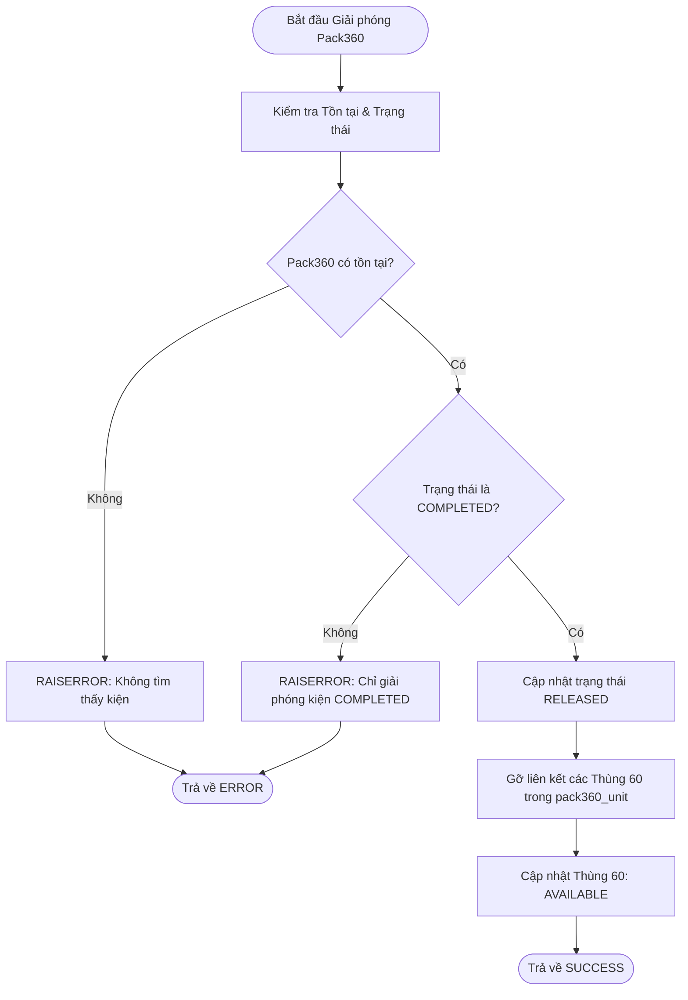
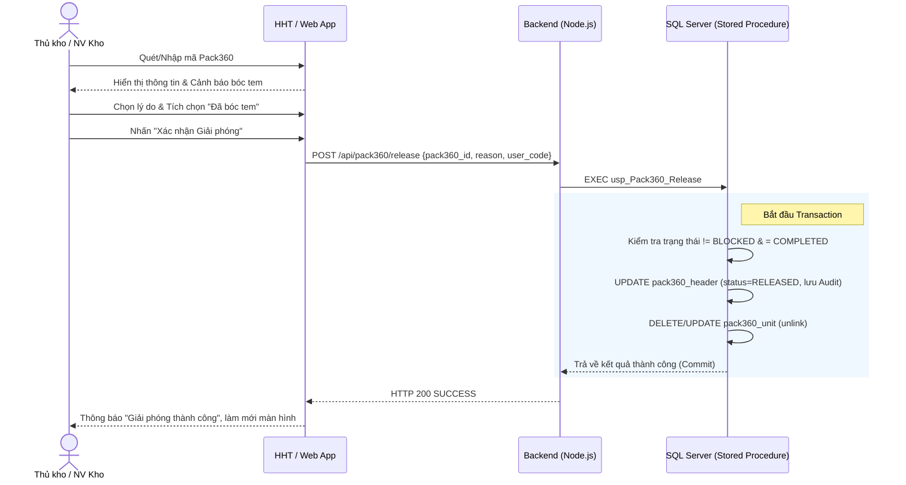

# Phân tích Thiết kế Logic UC08 - Giải phóng Pack360 (Release Pack360)

## 1. Business Logic (Logic Nghiệp Vụ)
Mục đích cốt lõi: Giải phóng một Pack360 đã đóng gói (`COMPLETED`), tách các thùng 60 bên trong ra để xử lý lại hoặc đóng gói lại, trả về trạng thái sẵn sàng.

Các quy tắc nghiệp vụ (Business Rules):
- `BR-UC08-01` **Điều kiện hợp lệ (Validation):** Chỉ được phép giải phóng Pack360 ở trạng thái `COMPLETED` và KHÔNG bị khóa chất lượng (`BLOCKED` hoặc `QC_HOLD`).
- `BR-UC08-02` **Cơ chế tức thời (Synchronous Action):** Quá trình giải phóng không cần luồng duyệt (Approval). Khi Thủ kho bấm giải phóng với lý do hợp lệ, hệ thống thực thi ngay lập tức.
- `BR-UC08-03` **Kiểm soát Tem nhãn (Physical Labeling):** Bắt buộc cảnh báo và yêu cầu nhân viên kho gạch bỏ/bóc tem mã vạch vật lý cũ trên Pack360 để tránh nhầm lẫn.
- `BR-UC08-04` **Truy vết Kiểm toán (Audit Trail):** Mọi hành động giải phóng phải ghi nhận lại lý do (`release_reason`) và người thực hiện (`released_by`) vào lịch sử của Pack360 đó tại Database.
- `BR-UC08-05` **Detach logic:** Khi giải phóng kiện, toàn bộ dữ liệu map thùng trong `pack360_unit` phải bị vô hiệu hoá (xóa hoặc cập nhật status) để thùng 60 trở về `AVAILABLE`.

**Quy trình tương tác (Interaction Flow):**
- **Bước 1:** Nhân viên kho quét hoặc nhập mã Pack360 trên thiết bị. Hệ thống kiểm tra điều kiện hợp lệ.
- **Bước 2:** Nhân viên kho chọn lý do giải phóng. Tích xác nhận "Tôi đã hủy tem" và bấm "Xác nhận Giải phóng".
- **Bước 3:** Hệ thống cập nhật trạng thái `pack360_header` thành `RELEASED`, cập nhật `pack360_unit` để gỡ bỏ thùng. Các thùng 60 trở về trạng thái `AVAILABLE`.

## 2. Programming Logic (Logic Lập Trình)
- **Màn hình Giải Phóng:** Có checkbox cảnh báo bóc tem.
- **Routing Cập nhật (POST):** Gọi `POST /api/pack360/release` với payload `{ pack360_id, release_reason, user_code }`.
- Giao tiếp với Stored Procedure `usp_Pack360_Release` để đảm bảo transaction DB an toàn.

## 3. Data Logic (Logic Dữ Liệu)
Cấu trúc xử lý dữ liệu tập trung vào việc Update trạng thái theo chuẩn Transaction.

### 3.1. Ma trận phân quyền CRUD
Dưới đây là ma trận CRUD cho các bảng dữ liệu bị tác động trong UC08:

| Bảng Dữ Liệu | Create (C) | Read (R) | Update (U) | Delete (D) | Trạng Thái Bị Tác Động |
|---|---|---|---|---|---|
| `pack360_header` | | X | X (Chuyển sang `RELEASED`, ghi lý do) | | `COMPLETED` -> `RELEASED` |
| `pack360_unit` | | X | X / D (Gỡ liên kết thùng 60) | X | Unlink thùng khỏi kiện |

### 3.2. Định nghĩa Trạng thái (State Definitions)
- `pack360_header.status`: `'RELEASED'`
- `pack360_header.released_by`: Ghi nhận người giải phóng.
- Các thùng 60 bên trong (sau khi unlink từ `pack360_unit`): Cập nhật trạng thái `'AVAILABLE'` (tại hệ thống tồn kho).

## 4. Diagrams (Biểu đồ)

### 4.1. Lưu đồ thuật toán (Activity Diagram)

### 4.2. Sequence Diagram (Biểu đồ tuần tự)

