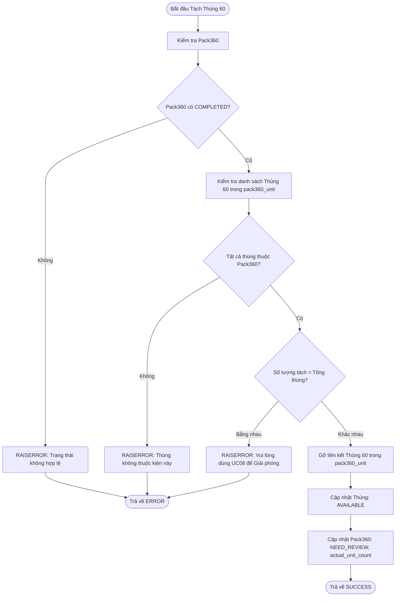
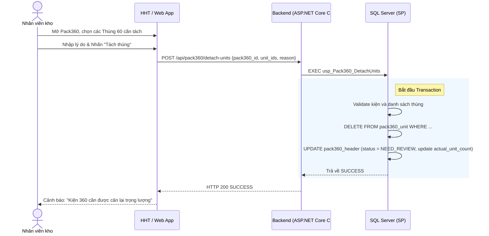

# Phân tích Thiết kế Logic UC09 - Tách Thùng 60 khỏi Pack360 (Detach Cartons)

## 1. Business Logic (Logic Nghiệp Vụ)
Mục đích cốt lõi: Rút một hoặc một vài Thùng 60 cụ thể ra khỏi kiện Pack360 đã đóng gói để kiểm tra, xử lý lại (Repack) hoặc loại bỏ, trong khi vẫn giữ nguyên các thùng hợp lệ còn lại trong kiện.

Các quy tắc nghiệp vụ (Business Rules):
- `BR-UC09-01` **Điều kiện hợp lệ (Validation):** Pack360 phải ở trạng thái `COMPLETED` và chưa được đưa vào luồng Xuất kho. Thùng 60 được chọn tách bắt buộc phải đang thuộc kiện Pack360 này (`pack360_unit`).
- `BR-UC09-02` **Xử lý Trọng lượng (Weight Invalidation):** Khi tách thùng ra, hệ thống tự động cập nhật lại `actual_unit_count` và kiện Pack360 chuyển sang trạng thái `NEED_REVIEW` để bắt buộc cân lại trọng lượng.
- `BR-UC09-03` **Logic Detach:** Các Thùng 60 bị tách ra sẽ bị xóa/vô hiệu hóa trong bảng `pack360_unit`, quay về trạng thái `AVAILABLE`.
- `BR-UC09-04` **Truy vết Kiểm toán (Audit Trail):** Bắt buộc nhập lý do tách thùng.

## 2. Programming Logic (Logic Lập Trình)
- **UI Lựa chọn:** Hiển thị danh sách Thùng 60 dạng Checkbox list. Người dùng có thể quét QR của Thùng 60 để tự động tick chọn nhanh.
- **API Call:** Gọi `POST /api/pack360/detach-units` với payload gồm mảng ID các thùng cần tách `[box_1, box_2...]` và lý do. Gọi SP `usp_Pack360_DetachUnits`.

## 3. Data Logic (Logic Dữ Liệu)
Quá trình tách thùng yêu cầu đảm bảo tính nguyên vẹn của Transaction.

### 3.1. Ma trận phân quyền CRUD
Dưới đây là ma trận CRUD cho các bảng dữ liệu bị tác động trong UC09:

| Bảng Dữ Liệu | Create (C) | Read (R) | Update (U) | Delete (D) | Trạng Thái Bị Tác Động |
|---|---|---|---|---|---|
| `pack360_header` | | X | X (Chuyển sang `NEED_REVIEW`, update `actual_unit_count`) | | `COMPLETED` -> `NEED_REVIEW` |
| `pack360_unit` | | X | X / D (Gỡ thùng bị tách) | X | Tách bớt bản ghi |

### 3.2. Stored Procedure (usp_Pack360_DetachUnits)
1. Parse danh sách Thùng 60 cần tách.
2. Kiểm tra `IF NOT EXISTS` Pack360 đang ở `COMPLETED` -> Báo lỗi.
3. Kiểm tra xem toàn bộ danh sách Thùng truyền vào có thuộc `pack360_unit` của kiện không.
4. Nếu số lượng tách = tổng số thùng trong kiện -> Yêu cầu dùng UC08 (Giải phóng toàn bộ).
5. Thực hiện DELETE/UPDATE `pack360_unit`, giảm `actual_unit_count` của `pack360_header`.

## 4. Diagrams (Biểu đồ)

### 4.1. Lưu đồ thuật toán (Activity Diagram)

### 4.2. Sequence Diagram (Biểu đồ tuần tự)

