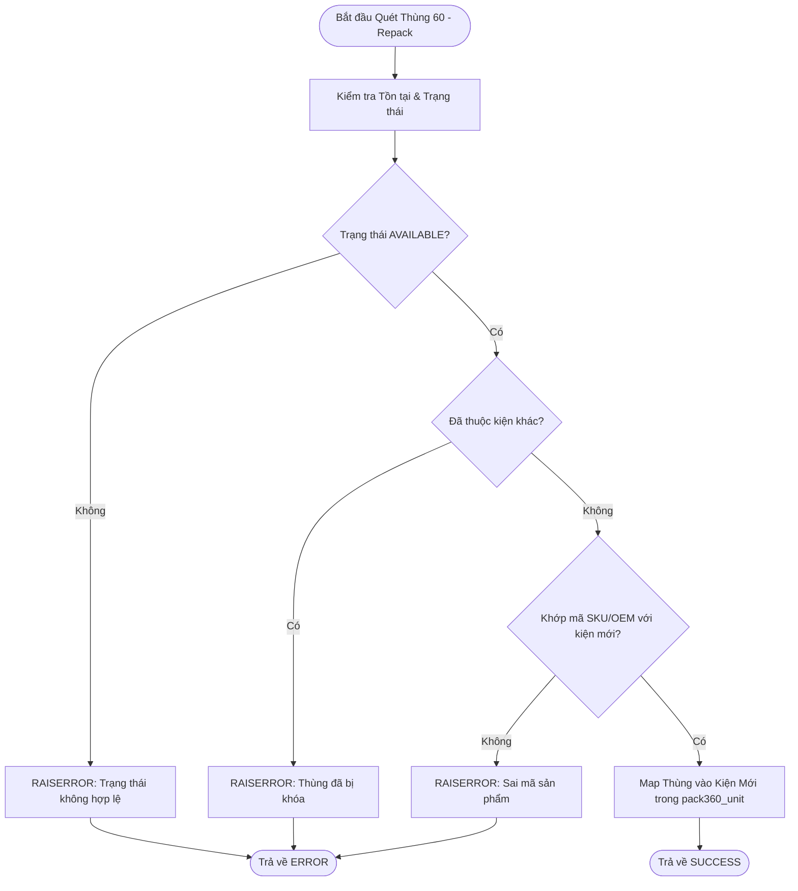
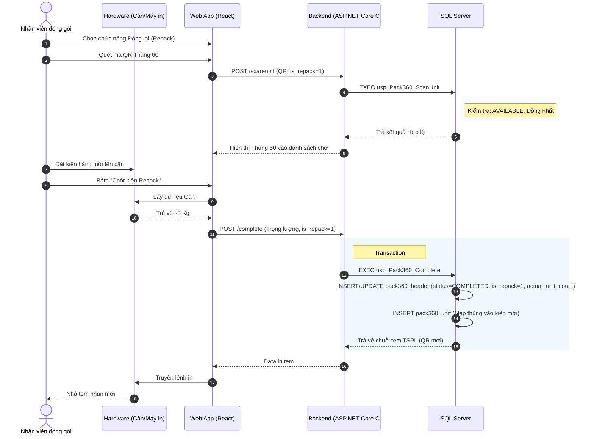

# Phân tích Thiết kế Logic UC10 - Đóng lại Pack360 mới (Repack into a new Pack360)

## 1. Business Logic (Logic Nghiệp Vụ)
Mục đích cốt lõi: Tái sử dụng/Đóng gói lại các Thùng 60 rời rạc đang nằm tại khu vực chờ xử lý thành kiện Pack360 hoàn toàn mới. Quá trình này đặc trưng bởi cờ `is_repack = 1`.

Các quy tắc nghiệp vụ (Business Rules):
- `BR-UC10-01` **Nguồn gốc Thùng 60 hợp lệ:** Thùng 60 quét vào phải tồn tại, đang ở trạng thái `AVAILABLE` và chưa gán vào kiện 360 nào khác (`pack360_unit`). 
- `BR-UC10-02` **Tính đồng nhất (Homogeneity):** Giống như UC05, các thùng đem đóng lại phải đồng nhất mã SKU hoặc mã Đơn OEM (trừ trường hợp cờ `is_repack` có ngoại lệ bỏ qua tính đồng nhất cho hàng trộn).
- `BR-UC10-03` **Đo lường trọng lượng (Weighting):** Bắt buộc phải thu thập trọng lượng thực tế cho kiện Pack360 mới này.
- `BR-UC10-04` **Định danh mới (New Identity):** Hệ thống sinh ra mã QR Pack360 hoàn toàn mới cho kiện đóng lại, đồng thời cập nhật `actual_unit_count` và lưu dữ liệu map vào bảng `pack360_unit`.

## 2. Programming Logic (Logic Lập Trình)
- **Giao diện Repack:** Dùng chung UI với UC05 hoặc module riêng cho Repack, hỗ trợ cờ `is_repack`.
- **Tương tác Thiết bị:** Kết nối Local Bridge để lấy thông số cân và in tem.
- **Backend API:** `POST /api/pack360/scan-unit` và `POST /api/pack360/complete-repack`. SP `usp_Pack360_ScanUnit` nhận thêm tham số `@is_repack = 1`.

## 3. Data Logic (Logic Dữ Liệu)

### 3.1. Ma trận phân quyền CRUD
Dưới đây là ma trận CRUD cho các bảng dữ liệu bị tác động trong UC10:

| Bảng Dữ Liệu | Create (C) | Read (R) | Update (U) | Delete (D) | Trạng Thái Bị Tác Động |
|---|---|---|---|---|---|
| `pack360_header` | X (Tạo kiện mới với `is_repack=1`) | X | X (Chốt kiện, update `actual_unit_count`, `weight`) | | `OPEN` -> `COMPLETED` |
| `pack360_unit` | X (Gán thùng 60 vào kiện mới) | X | | | |

### 3.2. Quản lý trạng thái
- `pack360_header`: Bắt đầu `OPEN`, kết thúc `COMPLETED`. Cột `is_repack` được set = 1. Cột `actual_unit_count` lưu số lượng thùng thực tế.
- `pack360_unit`: Sinh các bản ghi tương ứng map `pack360_id` và các `unit_id`.

## 4. Diagrams (Biểu đồ)

### 4.1. Lưu đồ thuật toán (Activity Diagram)

### 4.2. Sequence Diagram (Biểu đồ tuần tự)

