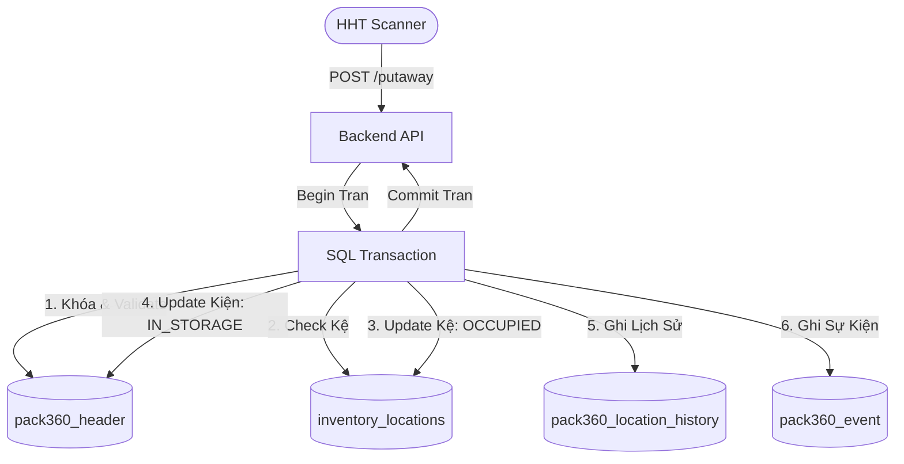
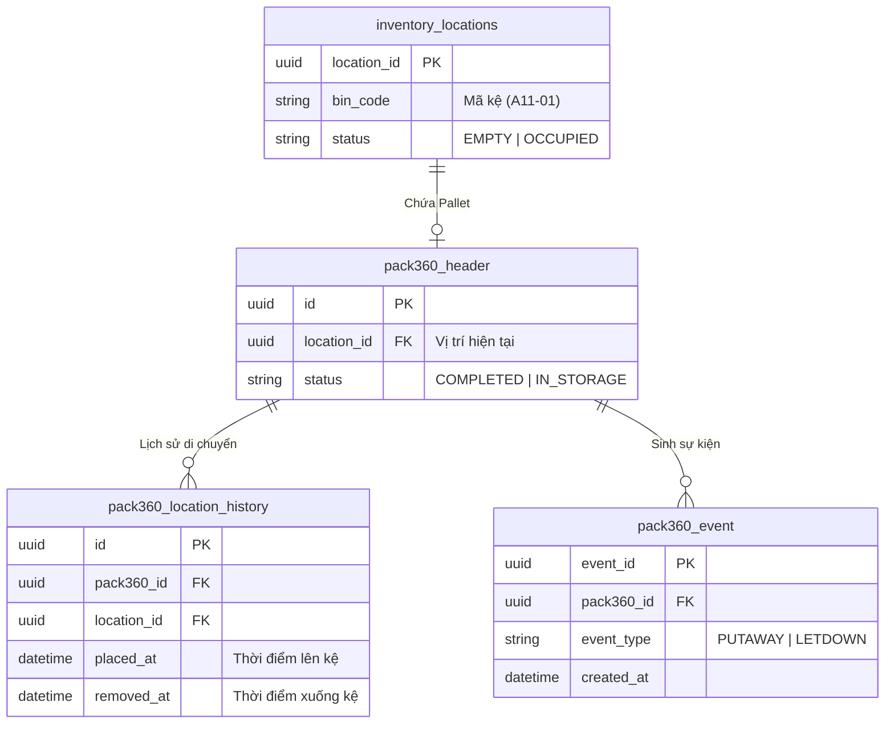

# Phân tích Thiết kế Logic UC11 - Đưa hàng lên kệ & Xuống kệ (Putaway & Letdown)

Tài liệu này chuẩn hóa quy trình **Đưa hàng lên kệ (Putaway)** và **Lấy hàng xuống kệ (Letdown)** dành cho các Kiện 360 / Pallet. Mục tiêu là ghi nhận vị trí không gian vật lý của Pallet trong kho, giúp nhân viên dễ dàng định vị khi cần lấy hàng (Picking).

## 1. Business Logic (Logic Nghiệp Vụ)

### 1.1 Mục đích
Cho phép nhân viên kho dùng súng quét mã vạch (RF Scanner) để khai báo việc di chuyển một Kiện 360 / Pallet từ khu vực chờ (Staging/Inbound) lên một Vị trí kệ (Bin/Location) cụ thể, hoặc ngược lại.

### 1.2 Các quy tắc nghiệp vụ (Business Rules)
- `BR-UC11-01` **Trạng thái Khả dụng:** Để được đưa lên kệ (Putaway), Kiện 360 phải đang ở trạng thái `COMPLETED` (Đã đóng gói xong). Để được lấy xuống kệ (Letdown), Kiện 360 phải đang ở trạng thái `IN_STORAGE` (Đang nằm trên kệ).
- `BR-UC11-02` **Tồn tại Vị trí (Location Validation):** Hệ thống cho phép tự động sinh mã Kệ mới nếu mã Vị trí (`bin_code`) được quét chưa từng tồn tại trên hệ thống (Hỗ trợ kho linh hoạt không cần khai báo trước danh mục kệ).
- `BR-UC11-03` **Độc quyền Vị trí (Location Exclusivity):** 1 Vị trí kệ (Location) chỉ được chứa tối đa 1 Pallet/Kiện 360 tại một thời điểm. Hệ thống chặn thao tác nếu cố tình đưa Pallet lên một kệ đang `OCCUPIED`.
- `BR-UC11-04` **Ghi vết Vòng đời:** Mọi thao tác Lên/Xuống kệ đều phải sinh ra một Event vòng đời vào bảng `pack360_event` để truy xuất nguồn gốc.

### 1.3 Quy trình tương tác (Interaction Flow)
**Luồng 1: Lên Kệ (Putaway)**
1. Nhân viên chọn chức năng "Lên Kệ".
2. Quét mã vạch của Kiện 360 / Pallet.
3. Quét mã vạch của Kệ đích (VD: `A11-01`).
4. Hệ thống kiểm tra hợp lệ, gán `location_id` vào Kiện 360, chuyển trạng thái kệ thành `OCCUPIED`. Báo thành công.

**Luồng 2: Xuống Kệ (Letdown)**
1. Nhân viên chọn chức năng "Xuống Kệ".
2. Quét mã vạch của Kiện 360 cần lấy.
3. Hệ thống xác nhận Kiện đang trên kệ, xóa `location_id` khỏi Kiện 360, chuyển trạng thái kệ cũ thành `EMPTY`. Báo thành công.

---

## 2. Tiêu chuẩn Thiết kế Giao diện (UI/UX Guidelines)
- **Thiết bị:** Máy quét RF hoặc Mobile App (Giao diện hẹp, to, rõ).
- **Trải nghiệm:** Tương tự UC16, ưu tiên thao tác quét liên tục. Focus sẵn vào ô nhập Textbox. Trả về âm thanh Bíp Xanh (Thành công) hoặc Bíp Đỏ (Lỗi).

---

## 3. Programming Logic (Logic Lập Trình)

### 3.1 API Routes (Backend)
- `POST /api/v1/shelving/putaway`: API Đưa lên kệ.
- `POST /api/v1/shelving/letdown`: API Lấy xuống kệ.

### 3.2 Luồng thực thi & Validate
**Putaway API:**
1. Nhận Payload: `pack360_id`, `bin_code`.
2. Khởi tạo **SQL Transaction** và khóa `UPDLOCK` trên bản ghi Kiện 360.
3. Kiểm tra `status` của Kiện trong `pack360_header`. Phải là `COMPLETED`. Nếu không -> Trả lỗi 400.
4. Truy vấn bảng `inventory_locations` bằng `bin_code`:
   - Nếu chưa có -> Tạo mới (`status = 'EMPTY'`).
   - Nếu có -> Kiểm tra `status == 'EMPTY'`. Nếu đang `OCCUPIED` -> Trả lỗi "Kệ đã có Pallet khác".
5. Thực thi Update:
   - `pack360_header`: Cập nhật `location_id`, `status = 'IN_STORAGE'`.
   - `inventory_locations`: Cập nhật `status = 'OCCUPIED'`.
6. Insert History & Event:
   - `pack360_location_history`: Ghi log Lên kệ.
   - `pack360_event`: Ghi sự kiện `PUTAWAY`.
7. `COMMIT` Transaction.

**Letdown API:**
1. Nhận Payload: `pack360_id`.
2. Khởi tạo **SQL Transaction** và khóa `UPDLOCK` trên bản ghi Kiện 360.
3. Kiểm tra `status == 'IN_STORAGE'`. Nếu sai -> Lỗi "Kiện không nằm trên kệ".
4. Thực thi Update:
   - Lấy `location_id` hiện tại để cập nhật bảng `inventory_locations`: `status = 'EMPTY'`.
   - `pack360_header`: Cập nhật `location_id = NULL`, `status = 'COMPLETED'`.
5. Insert History & Event:
   - `pack360_location_history`: Cập nhật giờ lấy xuống.
   - `pack360_event`: Ghi sự kiện `LETDOWN`.
6. `COMMIT` Transaction.

---

## 4. Data Logic (Thiết kế Dữ Liệu)

### 4.1 Ma trận phân quyền CRUD

| Bảng Dữ Liệu | Hành động (CRUD) | Mô tả trong bối cảnh UC11 |
| :--- | :---: | :--- |
| `pack360_header` | Read / Update | Xác thực trạng thái. Cập nhật `location_id` và `status`. |
| `inventory_locations` | Create / Read / Update | Tạo Kệ mới nếu chưa có. Cập nhật trạng thái `EMPTY`/`OCCUPIED`. |
| `pack360_location_history` | Create / Update | Lưu lịch sử chuyển động của Kiện (Vào kệ lúc nào, ra kệ lúc nào). |
| `pack360_event` | Create | Lưu dấu vết Vòng đời hệ thống (Audit log). |

### 4.2 Định nghĩa Trạng thái (Conceptual Model)
- Kiện 360 `COMPLETED`: Đã đóng gói xong, đang nằm chờ dưới đất.
- Kiện 360 `IN_STORAGE`: Đang nằm an toàn trên kệ.
- Vị trí `EMPTY`: Trống, sẵn sàng nhận hàng.
- Vị trí `OCCUPIED`: Đã chứa 1 Kiện, không nhận thêm.

---

## 5. Biểu Đồ Thiết Kế (Diagrams)

### 5.1 Cấu trúc Phân tầng Dữ liệu (Data Layer Architecture)

### 5.2 Entity Relationship & Logic Trạng thái (State Logic Map)

