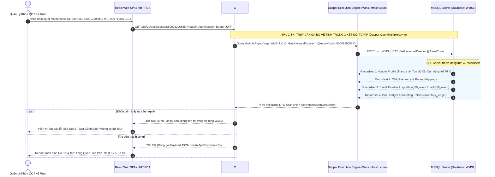
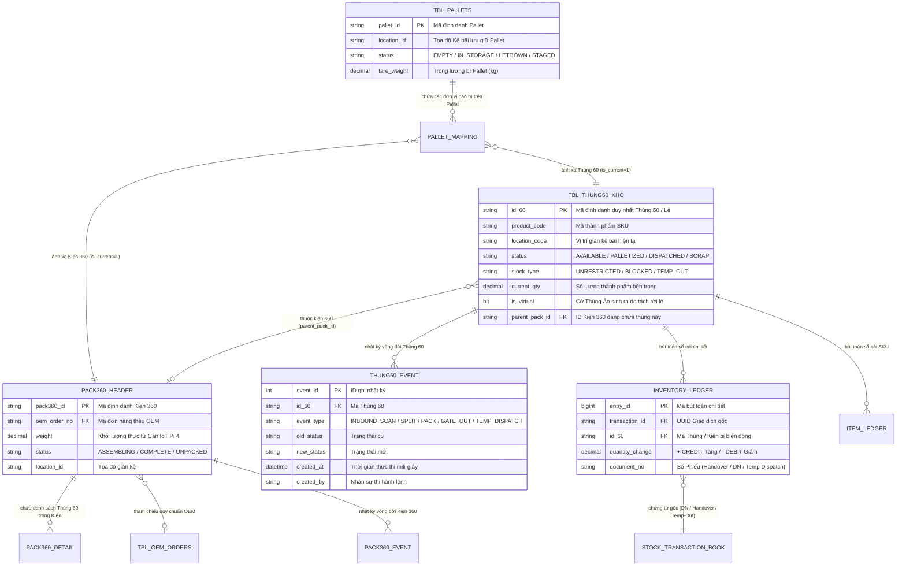

# Phân tích Thiết kế Logic UC12 - Tra Cứu Hồ Sơ Thùng 60 / Pack360 / Pallet (Comprehensive Asset Dossier & Traceability Inquiry)

Tài liệu đặc tả kiến trúc kỹ thuật và logic nghiệp vụ chuyên sâu đối với Use Case **UC12 - Tra Cứu Hồ Sơ Tài Sản (Thùng 60 / Kiện 360 / Pallet)** thuộc hệ thống WMS Kho Thành Phẩm, được vận hành trên nền tảng **C# .NET Core 8.0 Web API** và giao diện **React SPA (Vite)**.

---

## 1. Business Logic (Logic Nghiệp Vụ)

### 1.1. Mục Tiêu Cốt Lõi
Chức năng **Tra Cứu Hồ Sơ Tài Sản UC12** đóng vai trò là "Trung tâm Kiểm định & Truy xuất nguồn gốc 360°" (360-degree Asset Traceability Portal) cho toàn bộ tài sản lưu trữ trong nhà kho theo 3 cấp độ cấu trúc bao bì từ nhỏ đến lớn: **Thùng 60 (`id_60`)**, **Kiện 360 (`pack360_id`)**, và **Pallet (`pallet_id`)**.

```
              +-------------------------------------------------------------+
              |   TRUY XUẤT HỒ SƠ TÀI SẢN 3 CẤP ĐỘ (ASSET DOSSIER HIERARCHY)  |
              +-----------------------------+-------------------------------+
                                            |
              +-----------------------------+-------------------------------+
              | (Cấp 1: Binh Đoàn / bãi)    | (Cấp 2: Đơn Vị Gom)           | (Cấp 3: Cá Thể Gốc)
              v                             v                               v
    +-------------------+         +-------------------+           +-------------------+
    |      PALLET       |   --->  |     KIỆN 360      |    --->   |     THÙNG 60      |
    |  (Pallet Profile) |         | (Pack360 Profile) |           |  (Id_60 Dossier)  |
    +-------------------+         +-------------------+           +-------------------+
              |                             |                               |
              +-----------------------------+-------------------------------+
                                            |
                                            v
               +--------------------------------------------------------+
               |        ĐỐI VẾT TOÀN DIỆN TRONG HỆ THỐNG CSDL WMS1       |
               | - Vị trí kệ bãi vật lý (Location Code & Rack Coordinates)|
               | - Lịch sử sự kiện vòng đời (Event Trail & Timestamp)   |
               | - Trạng thái phong tỏa QMS & cờ Stock Type (UNRESTRICTED)|
               | - Hạch toán đối soát Sổ Cái Kép (Dual Ledger Auditing) |
               +--------------------------------------------------------+
```

Nghiệp vụ đảm bảo:
1. **Truy xuất gia phả linh hoạt (Parent-Child Traversal):** Quét mã ở bất kỳ cấp độ nào đều có thể xem toàn cảnh đơn vị cha đang chứa nó hoặc chi tiết từng cá thể con bên trong (Drill-down).
2. **Theo dõi dấu vết luân chuyển thời gian thực:** Trình chiếu dòng thời gian (Timeline) từ giây phút xuất xưởng sang WMS (UC02/UC03), quá trình cấm chốt lên Pallet (UC06), khóa kiểm tra chất lượng QMS (UC13/UC14), cho mượn xuất tạm linh hoạt 2 bước (UC18), cho tới lúc đóng cont rời bến Gate-Out (UC16).
3. **Minh bạch hóa Sổ Cái Kép (Ledger Correlation):** Tích hợp đối soát real-time giữa số liệu vật lý hiện hữu trên kệ kho với các bút toán Nợ/Có phát sinh trong Sổ cái Mặt hàng (`item_ledger`) và Sổ cái Đơn vị (`inventory_ledger`).

### 1.2. Các Quy Tắc Nghiệp Vụ (Business Rules)

| Mã Rule | Quy Tắc Nghiệp Vụ | Mô Tả & Điều Kiện Áp Dụng |
| :--- | :--- | :--- |
| **BR-UC12-01** | **Nhận diện đa lớp tự động (Auto-Recognition):** | Hệ thống tự động phân loại đối tượng tra cứu căn cứ theo cú pháp chuỗi QR hoặc tiền tố mã vạch (Ví dụ: Tiền tố `PAL-*` $\rightarrow$ Pallet; `P360-*` $\rightarrow$ Kiện 360; `600*`/`K07*` $\rightarrow$ Thùng 60). |
| **BR-UC12-02** | **Drill-down Phả Hệ Đa Chiều:** | - **Tra cứu Pallet:** Hiển thị vị trí tọa độ, tổng tải trọng cân IoT thực tế, và cho phép bấm bóc tách (Drill-down) xem từng Kiện 360 và Thùng 60 nằm trên Pallet.<br>- **Tra cứu Kiện 360:** Hiển thị thông số đợt thêu OEM, hợp đồng ràng buộc và danh bạ trọn vẹn Thùng 60 cấu thành.<br>- **Tra cứu Thùng 60:** Hiển thị phả hệ ngược (thuộc Kiện/Pallet nào), gốc gác Phiếu bàn giao sản xuất (Production Handover) và lịch sử từng bị tách thùng lẻ ảo (`split_box`). |
| **BR-UC12-03** | **Lịch sử Vòng Đời Bất Biến (Immutable Event Trail):** | Hồ sơ tài sản buộc phải tải trọn vẹn chuỗi sự kiện luân chuyển lưu tại các bảng nhật ký (`thung60_event`, `pack360_event`, `command_request_log`), hiển thị tường minh nhân sự thực hiện, thời gian mili-giây, và mã định danh giao dịch UUID. |
| **BR-UC12-04** | **Đối chứng Sổ Cái Kép:** | Bắt buộc liên kết hiển thị danh sách các bút toán trong Sổ Cái Kép (`inventory_ledger`, `stock_transaction_book`) có liên quan đến mã định danh tra cứu, phục vụ yêu cầu kiểm toán chéo (Cross-auditing). |
| **BR-UC12-05** | **Bảo mật và Nguyên lý Read-Only:** | Giao diện tra cứu tuyệt đối là màn hình Đọc (Read-only), không cho phép thực hiện thao tác sửa đổi trạng thái tài sản tại màn hình này. Mọi mã tra cứu sai định dạng hoặc không có thực đều bị từ chối với phản hồi Fail-fast HTTP `404 NotFound` rõ ràng. |

### 1.3. Quy Trình Tương Tác (Interaction Flow)
- **Bước 1 (Nhân viên Quản lý / QC / Thủ kho):** 
  - Sử dụng trình duyệt trên PC hoặc máy HHT PDA, mở chức năng "Tra Cứu Hồ Sơ Tài Sản".
  - Quét mã vạch QR hoặc nhập mã số Thùng 60 / Kiện 360 / Pallet vào ô Tìm kiếm đa năng (Universal Search Box).
- **Bước 2 (Hệ thống C# API Web Gateway):**
  - Thực hiện xác minh định danh từ CSDL WMS1 thông qua truy vấn tốc độ cao Dapper ORM.
  - Phân tích phả hệ tài sản, gom dữ liệu lịch sử sự kiện và đối soát bảng bút toán Sổ Cái Kép trong cùng một đợt truyền dẫn Multi-Result Set.
- **Bước 3 (Giao diện React SPA):**
  - Render màn hình Hồ Sơ Lý Lịch (Dossier Profile) phân tầng thành 4 thẻ thông tin: **1. Tổng Quan Tài Sản & Huy Hiệu Trạng Thái**, **2. Cây Gia Phả Cấu Trúc**, **3. Dòng Thời Gian Vòng Đời (Timeline)**, và **4. Đối Chứng Sổ Cái Kép**.

---

## 2. Tiêu Chuẩn Thiết Kế Giao Diện (UI/UX Guidelines)

- **Thiết bị đích:** PC Workstation (Desktop màn hình lớn) và Thiết bị di động kiểm kho PDA / Tablet.
- **Bố cục Giao diện (Responsive Master-Detail Dossier):**
  - **Thanh Tìm Kiếm Cố Định (Sticky Search Top Bar):** 
    - Khung nhập dữ liệu cỡ lớn kèm Biểu tượng máy quét QR, tự động khóa Focus ngay khi mở trang.
    - Hỗ trợ thao tác quét nháy liên tục từ đầu đọc mã vạch (Tự động kích hoạt tìm kiếm khi nhận ký tự ngắt dòng `\r\n`).
  - **Khu Vực 1: Thẻ Nhận Diện Trạng Thái & Sinh Trắc (Asset Bio & Status Cards):**
    - **Huy hiệu Màu Trạng Thái (Visual Color Badges):**
      - 🟢 `AVAILABLE / UNRESTRICTED` (Xanh lá sáng `#dcfce7`, chữ xanh đậm `#15803d`): Tồn kho khả dụng hoàn toàn.
      - 🔴 `BLOCKED` / `QMS_QUARANTINE` (Nền đỏ `#fee2e2`, chữ đỏ `#991b1b`): Bị phong tỏa QC / Lỗi chất lượng.
      - 🟠 `TEMP_OUT` / `TEMPORARY_ISSUE` (Nền cam `#fef3c7`, chữ cam `#92400e`): Đang xuất tạm kho (Mượn mẫu, đi gia công UC18).
      - ⚪ `DISPATCHED` / `SHIPPED` (Nền xám tro `#f3f4f6`, chữ xám `#374151`): Đã thanh toán xuất bến Gate-out.
    - Hiển thị tọa độ Vị trí giá kệ hiện tại (`current_location_code`: VD `KỆ A01-B2-04`), Trọng lượng kg xác thực thông qua Cân IoT Raspberry Pi 4.
  - **Khu Vực 2: Cây Gia Phả Tương Tác (Interactive Hierarchy Accordion Tree):**
    - Sử dụng mô hình Accordion mở rộng/thu gọn (Expand/Collapse) để tiết kiệm không gian trên máy cầm tay PDA: Bấm vào Pallet bung ra danh sách Kiện 360 $\to$ bấm vào Kiện bung ra danh sách Thùng 60 $\to$ bấm vào Thùng hiển thị lịch sử bị tách rác Thùng Ảo (`is_virtual=1`).
  - **Khu Vực 3: Dòng Thời Gian Lịch Sử (Vertical Timeline & Ledger Correlation):**
    - Trình bày chuỗi sự kiện theo trục thời gian dọc từ mới nhất đến cũ nhất. Kèm Link bấm nhảy nhanh (Clickable preview) tới Chi tiết phiếu giao kho gốc hoặc phiếu xuất kho.

---

## 3. Programming Logic (Logic Lập Trình Backend)

### 3.1. Frontend React Service (`traceApi.js` & `AssetDossierScreen.jsx`)
- **Quản lý State:** Quản lý trọn vẹn tập thuộc tính qua React State: `activeAssetType` (`CARTON_60` | `PACK_360` | `PALLET`), `dossierPayload`, `selectedTab`, và `isLoading`.
- **Đóng gói HTTP Request:** Axios Client truyền Bearer JWT Token, tự động chèn cờ chẩn đoán trace vào header. Trình duyệt không tải lại trang mà bổ sung dữ liệu động mượt mà.

### 3.2. Controller & REST Endpoints (`TraceController.cs` & `PalletController.cs`)
- **Danh sác Endpoints Chức Năng Tra Cứu UC12:**
  - `GET /api/v1/trace/units/{id60}`: Kéo toàn vẹn hồ sơ Thùng 60 (Lý lịch gốc, kiện chứa, sự kiện `thung60_event`, lịch sử lấy lẻ).
  - `GET /api/v1/trace/packs/{pack360Id}`: Tra cứu cấu trúc Kiện 360 cùng chuỗi định danh Thùng 60 con.
  - `GET /api/v1/pallet/{id}/info`: Hồ sơ Pallet và thông lượng kiện hàng cắm móc trên Pallet.
  - **`GET /api/v1/trace/dossier/{assetCode}` (Universal Dossier Endpoint):** Cổng tra cứu thông minh đa năng, tự động nhận dạng mã tài sản bất kỳ (`id_60`, `pack360_id`, hoặc `pallet_id`), thi hành truy vấn Dapper và kết xuất trọn gói hồ sơ 4 tầng trong 1 payload JSON duy nhất.

### 3.3. Tối Ưu Hóa Hiệu Năng Dapper ORM (Multi-Result Set Architecture)
Để đạt tốc độ phản hồi dưới **50 mili-giây (< 50ms)** dù hồ sơ tài sản chứa hàng trăm sự kiện lịch sử và hàng nghìn Thùng 60, C# API áp dụng tính năng **`Dapper.QueryMultipleAsync`**. Một lệnh TCP/IP duy nhất gửi xuống SQL Server sẽ thi hành Stored Procedure `usp_WMS_UC12_GetUniversalDossier` trả về cùng lúc 4 tập kết quả (Recordsets):
1. **Result Set 1 (`HeaderProfile`):** Thông số gốc, mã SP, trạng thái khả dụng, tọa độ kệ bãi, thông số cân nặng IoT.
2. **Result Set 2 (`ChildHierarchy`):** Cây cấu trúc bao bì con hoặc thực thể cha liên quan (Parent/Child Tree).
3. **Result Set 3 (`EventTimeline`):** Nhật ký chuỗi sự kiện `thung60_event` / `pack360_event` sắp xếp giảm dần theo thời gian.
4. **Result Set 4 (`LedgerAudITS`):** Các bút toán hạch toán trên Sổ Cái Kép (`inventory_ledger` & `item_ledger`).

---

## 4. Data Logic (Thiết Kế Dữ Liệu & Sổ Cái Kép)

### 4.1. Ma Trận Phân Quyền CRUD

| Tên Bảng Trong CSDL (MSSQL WMS1) | Create | Read | Update | Delete | Ý Nghĩa Trong Nghiệp Vụ Tra Cứu UC12 |
| :--- | :---: | :---: | :---: | :---: | :--- |
| `tbl_thung60_kho` | - | **X** | - | - | Tra cứu trạng thái cá thể Thùng 60, cờ `stock_type`, `status`, mã kệ `location_code`, và cờ hàng ảo `is_virtual`. |
| `pack360_header` & `pack360_detail` | - | **X** | - | - | Tra cứu cấu trúc Kiện 360, trọng lượng chốt trạm, và các mã thùng chi tiết bên trong. |
| `tbl_pallets` & `pallet_mapping` | - | **X** | - | - | Tra cứu cấu tạo Pallet, vị trí trên giàn kệ kho (`location_id`) và danh mục thành phần `is_current = 1`. |
| `thung60_event` & `pack360_event` | - | **X** | - | - | Truy cứu toàn cảnh Dòng Thời Gian Sự Kiện (Event Timeline) và lý do dịch chuyển trong suốt vòng đời. |
| `inventory_ledger` & `item_ledger` | - | **X** | - | - | Thẩm tra Bút toán Sổ Cái Kép (Dual Ledger Audits), đối khớp luân chuyển Nợ/Có. |
| `stock_transaction_book` | - | **X** | - | - | Tra soát số chứng từ gốc (Phiếu bàn giao xưởng, Phiếu xuất bến, Phiếu xuất tạm mượn mẫu). |

### 4.2. Mô Hình Trạng Thái Tài Sản (Conceptual Asset State Model)

| Nhóm Cờ Trạng Thái (Flags) | Các Giá Trị Hợp Lệ Trong Hệ Thống | Giải Nghĩa & Ngữ Cảnh Kiểm Soát Trong UC12 |
| :--- | :--- | :--- |
| `status` (Trạng thái vật lý) | `AVAILABLE`, `PALLETIZED`, `STAGED`, `DISPATCHED`, `TEMPORARY_ISSUE`, `REPLACED`, `SCRAP` | Thể hiện đúng vị trí và ngữ cảnh hiện tại của tài sản trong luồng chuỗi vận hành nhà xưởng. |
| `stock_type` (Quyền thanh toán) | `UNRESTRICTED`, `BLOCKED`, `QUALITY_INSPECTION`, `TEMP_OUT` | Quyết định tài sản có đủ điều kiện đem đi soạn hàng xuất bến (UC16) hay đang bị QMS/QC phong tỏa. |
| `is_virtual` (Cờ phân mảnh lẻ) | `0` (Thùng gốc nguyên vẹn) / `1` (Thùng ảo sinh ra do lấy lẻ) | Giám sát chặt chẽ tình huống lấy rời sản phẩm theo lệnh Soạn hàng lẻ hoặc Nhập trả lẻ. |

### 4.3. Logic Hạch Toán & Kiểm Kiểm Sổ Cái Kép (Dual Ledger Cross-Audit)
Mặc dù UC12 không trực tiếp thực thi thao tác Ghi (Insert/Update) vào Sổ cái, đây là **công cụ kiểm kê cốt lõi** giúp xác nhận tính toàn vẹn của cấu trúc Sổ Cái Kép (Dual Ledger Validation):
- Với mỗi tài sản `id_60` được khảo sát, hệ thống tự động đối chiếu: Tổng số lượng hiện tại trên bảng cá thể `tbl_thung60_kho` phải hoàn toàn trùng khớp tuyệt đối với lũy kế **(+ Nợ / - Có)** trong Sổ Cái Đơn Vị **`inventory_ledger`** gắn với ID tương ứng (Chữ ký hạch toán không độ lệch: $\sum \text{Credit} - \sum \text{Debit} \equiv \text{Current Qty}$).
- Bảng nhật ký chứng từ **`stock_transaction_book`** cung cấp liên kết khả kiểm định (Traceability Link) chỉ thẳng ra tên Khách Hàng, Biển Số Xe Tải chở hàng đi, hoặc Đối tác đang mượn hàng xuất tạm (UC18).

---

## 5. Biểu Đồ Thiết Kế (Diagrams)

### 5.1. Sequence Diagram (Luồng Tra Cứu Hồ Sơ & Đa Kết Quả Dapper ORM)



### 5.2. Data Layer Architecture (Kiến Trúc Tầng Xử Lý Dữ Liệu & Kháng Tắc Nghẽn)

```mermaid
flowchart TD
    A[HTTP GET /api/v1/trace/dossier/:assetCode] --> B[Xác Mệnh Danh Dáng Chuỗi QR & Validate Token]
    B -->|Mã rỗng hoặc sai cú pháp| C[Fail-fast HTTP 400 BadRequest]
    B -->|Hợp lệ| D[Mở kết nối SqlConnection từ Connection Pool]
    
    D --> E["Thực thi Dapper QueryMultipleAsync (Read-uncommitted / No Shared Lock)"]
    E --> F{Phân Loại Định Danh Tài Sản Trong CSDL}
    
    F -->|Thùng 60| G[SELECT tbl_thung60_kho + thung60_event + split_history]
    F -->|Kiện 360| H[SELECT pack360_header/detail + pack360_event + OEM mapping]
    F -->|Pallet| I[SELECT tbl_pallets + pallet_mapping (is_current=1)]
    
    G --> J[Đối Chiếu Sổ Cái Kép inventory_ledger & item_ledger]
    H --> J
    I --> J
    
    J --> K[Tổng hợp DTO & Trả về Client HTTP 200 OK (< 50ms)]
```

> [!TIP]
> **Tối Ưu Đọc Dữ Liệu (Read Optimization):** Vì UC12 là chức năng tra cứu thuần túy (Read-only Inquiry), engine Dapper được cấu hình thực thi với cơ chế **No-Lock / Snapshot Isolation** khi quét qua bảng lịch sử `thung60_event` và `inventory_ledger`. Nhờ vậy, ngay cả khi nhân viên kho đang quét hàng chục nghìn thùng nhập kho hay xuất bến cùng thời điểm (đang chiếm giữ `UPDLOCK, HOLDLOCK`), thao tác tra cứu lý lịch tài sản của Quản trị viên tại văn phòng vẫn diễn ra mượt mà tức khắc mà không bị chờ nghẽn (No Blocking & Zero Deadlock).

### 5.3. Entity Relationship Diagram (ERD UC12 - Hồ Sơ Phả Hệ & Sổ Cái Kép)


