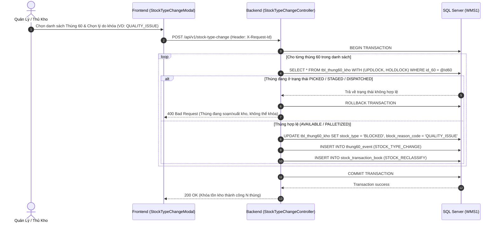
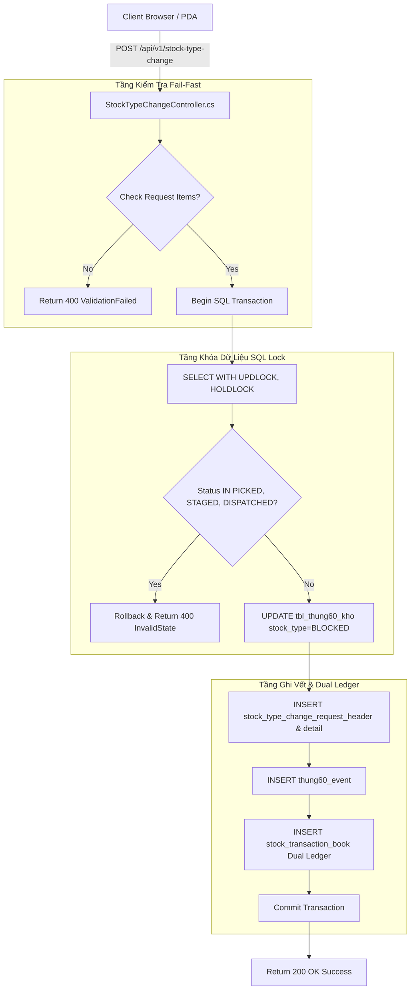
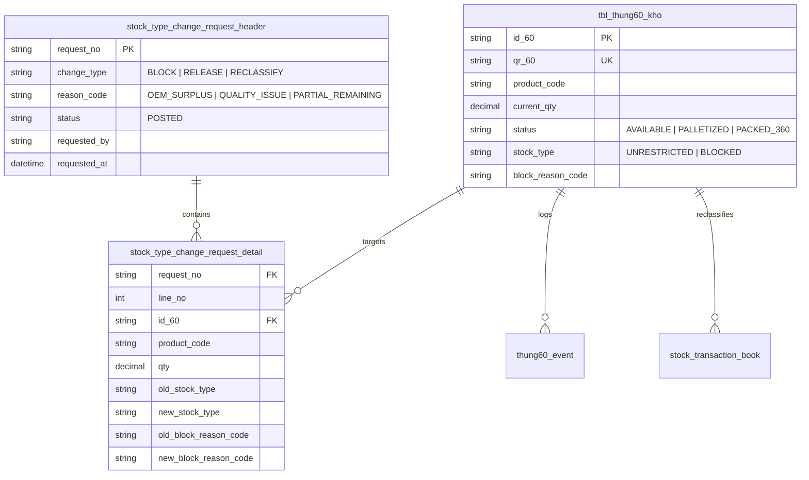

# Phân tích Thiết kế Logic UC13 - Chuyển Stock Type / Khóa Tồn Kho (Stock Blocking)

Tài liệu thiết kế chi tiết nghiệp vụ **UC13 - Chuyển Stock Type / Khóa Tồn (Stock Blocking)** thuộc hệ thống WMS Kho Thành Phẩm.

---

## 1. Business Logic (Logic Nghiệp Vụ)

### 1.1. Mục Tiêu Cốt Lõi
Cho phép Quản lý Kho / Thủ Kho chủ động hoặc tự động khóa tồn kho (`stock_type = 'BLOCKED'`) cho các thùng 60 / kiện 360 phát sinh các tình huống:
1. **Dư đơn OEM hoặc dư kế hoạch sản xuất** (`reason_code = 'OEM_SURPLUS'`).
2. **Có sự cố/vấn đề về chất lượng phát hiện trong kho** (`reason_code = 'QUALITY_ISSUE'`).
3. **Thùng 60 gốc còn thiếu chuẩn sau khi tách xuất lẻ** (`reason_code = 'PARTIAL_REMAINING'`).
4. **Sai lệch dữ liệu kiểm kê / dữ liệu nghi ngờ** (`reason_code = 'DATA_EXCEPTION'`).
5. **Chờ quyết định xử lý của ban quản lý kho** (`reason_code = 'WAITING_DECISION'`).

Thùng 60 bị khóa sang `BLOCKED` sẽ **tự động bị chặn tuyệt đối** khỏi các thuật toán Phân bổ đơn xuất kho (Allocation), Soạn hàng FIFO (Picking), và Xuất bến (Gate Out).

### 1.2. Các Quy Tắc Nghiệp Vụ (Business Rules)

| Mã Rule | Quy Tắc Nghiệp Vụ | Mô Tả & Điều Kiện Áp Dụng |
| :--- | :--- | :--- |
| **BR-UC13-01** | **Điều kiện khóa tồn:** | Chỉ những thùng 60 đang ở trạng thái `AVAILABLE`, `PALLETIZED`, hoặc `PACKED_360` mới được phép đổi sang `BLOCKED`. |
| **BR-UC13-02** | **Chặn khóa hàng đã xuất:** | Thùng 60 ở trạng thái `PICKED`, `STAGED`, `DISPATCHED` tuyệt đối không được khóa tồn nếu chưa hủy phiếu xuất. |
| **BR-UC13-03** | **Tự động gắn mã lý do:** | Khi chuyển `stock_type = 'BLOCKED'`, bắt buộc phải chọn mã lý do `reason_code` (`OEM_SURPLUS`, `QUALITY_ISSUE`, `PARTIAL_REMAINING`, v.v.). |
| **BR-UC13-04** | **Phân biệt Status vs Stock Type:**| `status` phản ánh bước vận hành (VD: `AVAILABLE`); `stock_type` quyết định quyền xuất hàng (`UNRESTRICTED` vs `BLOCKED`). Không gộp 2 cột này làm một. |
| **BR-UC13-05** | **Phê duyệt Release (Giải khóa):** | Chuyển tồn từ `BLOCKED` trở lại `UNRESTRICTED` phải có quyền `StockType.Manage` và ghi nhận nhật ký duyệt `posted_by`. |
| **BR-UC13-06** | **Ghi nhận Event History:** | Mọi thao tác đổi Stock Type bắt buộc phải chèn 1 bản ghi vào bảng `thung60_event` với `event_type = 'STOCK_TYPE_CHANGE'`. |
| **BR-UC13-07** | **Ghi nhận Sổ Cái Reclassification:**| Chuyển stock type làm thay đổi bản chất tồn kho, bắt buộc ghi nhận chứng từ reclassification trong `stock_transaction_book`. |
| **BR-UC13-08** | **Idempotency:** | Thao tác gửi request phải đính kèm Header `X-Request-Id` để ngăn chặn bấm trùng lặp khi mạng Wifi kho bị nghẽn. |

### 1.3. Quy Trình Tương Tác (Interaction Flow)
- **Bước 1 (User):** Thủ kho chọn danh sách thùng 60 (quét QR hoặc chọn từ bảng tồn kho), chọn hành động (`BLOCK` hoặc `RELEASE`) và chọn mã lý do (`reason_code`).
- **Bước 2 (System):** Phân tích và Validate danh sách thùng 60: Kiểm tra sự tồn tại và trạng thái hiện tại (`status`).
- **Bước 3 (System):** Mở SQL Transaction, thực hiện khóa dòng bằng `WITH (UPDLOCK, HOLDLOCK)`.
- **Bước 4 (System):** Cập nhật `stock_type` và `block_reason_code` trong bảng `tbl_thung60_kho`.
- **Bước 5 (System):** Chèn nhật ký sự kiện `thung60_event` và hạch toán Sổ nghiệp vụ `stock_transaction_book`.
- **Bước 6 (System):** Commit Transaction, trả về `request_no` và thông báo thành công cho UI.

---

## 2. Tiêu Chuẩn Thiết Kế Giao Diện (UI/UX Guidelines)

- **Thiết bị đích:** Máy tính bàn (Workstation) và Thiết bị di động PDA quét mã vạch.
- **Trải nghiệm visual:**
  - Badge trạng thái Stock Type: `UNRESTRICTED` tô nền xanh lá (`#bbf7d0`); `BLOCKED` tô nền đỏ tươi (`#fecaca`), chữ đỏ đậm (`#991b1b`).
  - Modal xác nhận Khóa Tồn yêu cầu nhập/chọn Lý Do Khóa (`reason_code`) bằng Dropdown trực quan.
  - Tự động khoá nút `[ Bắt Đầu Khóa Tồn ]` khi đang chờ API phản hồi để tránh double-submit.

---

## 3. Programming Logic (Logic Lập Trình)

### 3.1. Frontend Component (`StockTypeChangeModal.jsx`)
- **State quản lý:** `selectedCartons`, `changeType` (`BLOCK` / `RELEASE`), `reasonCode`, `loading`, `errorMessage`.
- **Luồng xử lý:**
  1. Frontend validate `selectedCartons.length > 0` và `reasonCode !== ''`.
  2. Kích hoạt header `X-Request-Id: REQ-STC-` + `Date.now()`.
  3. Gọi API `POST /api/v1/stock-type-change`.
  4. Nhận kết quả `200 OK`, đóng Modal và làm mới Data Grid tồn kho.

### 3.2. Backend Controller (`StockTypeChangeController.cs`)
- **Endpoint:** `POST /api/v1/stock-type-change`
- **Validation Steps:**
  1. Kiểm tra DTO request `Items.Any()`.
  2. Mở `connection.BeginTransaction()`.
  3. Lặp qua từng `Id60`, đọc dữ liệu bằng SQL Lock:
     ```sql
     SELECT id_60, product_code, current_qty, stock_type, block_reason_code, status 
     FROM tbl_thung60_kho WITH (UPDLOCK, HOLDLOCK)
     WHERE id_60 = @Id60 OR qr_60 = @Id60
     ```
  4. Nếu `status IN ('PICKED', 'STAGED', 'DISPATCHED')` $\rightarrow$ Rollback và trả về `400 Bad Request`.
  5. Thêm bản ghi `stock_type_change_request_header` & `detail`.
  6. UPDATE `tbl_thung60_kho` gán `stock_type = @newStockType`, `block_reason_code = @newReason`.
  7. INSERT `thung60_event` và `stock_transaction_book`.
  8. Commit transaction.

---

## 4. Data Logic (Thiết Kế Dữ Liệu)

### 4.1. Ma Trận Phân Quyền CRUD

| Tên Bảng (Table) | Create | Read | Update | Delete | Mô Tả Ý Nghĩa Trong UC13 |
| :--- | :---: | :---: | :---: | :---: | :--- |
| `stock_type_change_request_header` | **X** | **X** | - | - | Lưu header chứng từ yêu cầu khóa/chuyển stock type. |
| `stock_type_change_request_detail` | **X** | **X** | - | - | Lưu danh sách chi tiết các thùng 60 bị chuyển stock type. |
| `tbl_thung60_kho` | - | **X** | **X** | - | Cập nhật `stock_type` và `block_reason_code`. |
| `thung60_event` | **X** | **X** | - | - | Ghi vết sự kiện `STOCK_TYPE_CHANGE`. |
| `stock_transaction_book` | **X** | **X** | - | - | Ghi nhận chứng từ reclassification sổ nghiệp vụ. |
| `inventory_ledger` | **X** | **X** | - | - | Hạch toán điều chỉnh phân loại sổ cái tồn kho. |

### 4.2. Định Nghĩa Trạng Thái (State Definitions)

| Cột Dữ Liệu | Trạng Thái | Ý Nghĩa Nghiệp Vụ | Quyền Xuất Kho |
| :--- | :--- | :--- | :---: |
| `stock_type` | `UNRESTRICTED` | Hàng tồn tự do, chất lượng đảm bảo. | 🟢 Được xuất |
| `stock_type` | `BLOCKED` | Hàng bị khóa (Dư đơn OEM, lỗi chất lượng, thiếu chuẩn). | 🔴 Bị chặn |
| `block_reason_code` | `OEM_SURPLUS` | Hàng dư thừa sau khi hoàn thành đơn OEM. | - |
| `block_reason_code` | `QUALITY_ISSUE` | Hàng bị sự cố chất lượng trong quá trình lưu kho. | - |
| `block_reason_code` | `PARTIAL_REMAINING` | Thùng gốc còn lại sau khi xuất lẻ không đủ quy cách. | - |

### 4.3. Cập Nhật Sổ Cái Kép (Dual Ledger Logic)
Giao dịch chuyển Stock Type được hạch toán vào Sổ cái Kép dưới dạng **Giao dịch Phân loại lại (Reclassification Transaction)**:
- **`stock_transaction_book`:** Ghi nhận 1 dòng giao dịch loại `STOCK_RECLASSIFY`, lưu trữ `from_stock_type` và `to_stock_type`.
- **`inventory_ledger`:** Hạch toán Nợ/Có làm giảm số lượng tồn kho `UNRESTRICTED` và làm tăng tương ứng số lượng tồn kho `BLOCKED` theo đúng mã hàng `product_code`.

---

## 5. Biểu Đồ Thiết Kế (Diagrams)

### 5.1. Sequence Diagram (Luồng Chuyển Stock Type & Khóa Tồn)



---

### 5.2. Cấu Trúc Phân Tầng Dữ Liệu (Data Layer Architecture)



---

### 5.3. Entity Relationship & State Logic Map (Mô Hình Thực Thể UC13)


