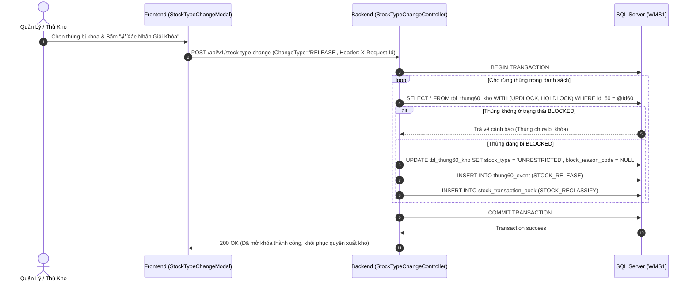
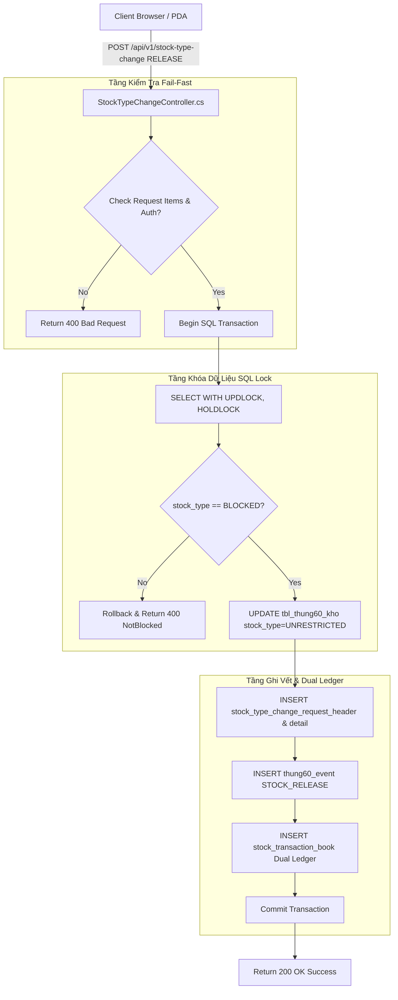
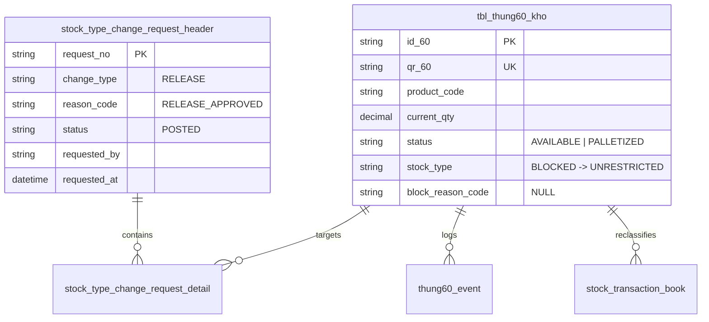

# Phân tích Thiết kế Logic UC14 - Release Tồn Bị Khóa (Stock Release / Unblocking)

Tài liệu thiết kế chi tiết nghiệp vụ **UC14 - Release Tồn Bị Khóa (Stock Release)** thuộc hệ thống WMS Kho Thành Phẩm.

---

## 1. Business Logic (Logic Nghiệp Vụ)

### 1.1. Mục Tiêu Cốt Lõi
Cho phép Quản lý Kho / Trưởng Ca mở khóa tồn kho (`stock_type` từ `'BLOCKED'` chuyển về `'UNRESTRICTED'`) cho các thùng 60 / kiện 360 sau khi đã xử lý xong các vấn đề nguyên nhân:
1. **Đã được Ban Quản Lý phê duyệt giải phóng lô hàng dư OEM** (`reason_code = 'OEM_RELEASE_APPROVED'`).
2. **Đã kiểm định lại chất lượng đạt tiêu chuẩn (IQC/PQC Approved)** (`reason_code = 'QUALITY_PASSED'`).
3. **Đã hoàn tất đóng bổ sung / điều chỉnh thùng lẻ đủ quy cách** (`reason_code = 'REPACK_COMPLETED'`).
4. **Đã đối soát & đính chính dữ liệu sai lệch** (`reason_code = 'DATA_CORRECTED'`).

Ngay sau khi được Release về `UNRESTRICTED`, hàng hóa **lập tức khôi phục quyền xuất kho** và được các thuật toán Phân bổ đơn xuất (Allocation), Soạn hàng FIFO (Picking UC16) tự động đưa vào danh sách gợi ý.

### 1.2. Các Quy Tắc Nghiệp Vụ (Business Rules)

| Mã Rule | Quy Tắc Nghiệp Vụ | Mô Tả & Điều Kiện Áp Dụng |
| :--- | :--- | :--- |
| **BR-UC14-01** | **Điều kiện mở khóa:** | Bắt buộc thùng 60 đang ở trạng thái `stock_type = 'BLOCKED'`. Không thực thi mở khóa với thùng đã là `UNRESTRICTED`. |
| **BR-UC14-02** | **Quyền phê duyệt:** | Chỉ nhân viên có quyền `StockType.Manage` hoặc role `THU_KHO` / `MANAGER` mới được bấm Xác Nhận Release. |
| **BR-UC14-03** | **Xóa/Cập nhật Lý do:** | Khi chuyển về `UNRESTRICTED`, cột `block_reason_code` trên `tbl_thung60_kho` được gán về `NULL` hoặc `'RELEASED'`. |
| **BR-UC14-04** | **Phân biệt Status vs Stock Type:**| `status` duy trì trạng thái vận hành hiện tại (VD: `AVAILABLE`, `PALLETIZED`); `stock_type` được mở khóa về `UNRESTRICTED`. |
| **BR-UC14-05** | **Ghi nhận Event History:** | Bắt buộc chèn 1 bản ghi vào `thung60_event` với `event_type = 'STOCK_RELEASE'`, lưu vết người duyệt (`performed_by`). |
| **BR-UC14-06** | **Sổ Cái Reclassification:** | Ghi nhận chứng từ phân loại lại tồn kho trong `stock_transaction_book` và cập nhật Nợ/Có Sổ cái tồn kho `inventory_ledger`. |
| **BR-UC14-07** | **Idempotency Control:** | Gửi Header `X-Request-Id` để tránh gửi lặp yêu cầu mở khóa khi bấm nút nhiều lần. |

### 1.3. Quy Trình Tương Tác (Interaction Flow)
- **Bước 1 (User):** Thủ kho vào Màn hình Quản lý Tồn kho Bị Khóa, chọn các thùng 60 / kiện 360 cần giải phóng và bấm `[ 🔓 Xác Nhận Mở Khóa Tồn (Release) ]`.
- **Bước 2 (System):** Validate quyền hạn người dùng và kiểm tra điều kiện `stock_type == 'BLOCKED'`.
- **Bước 3 (System):** Mở SQL Transaction, thực hiện khóa dòng bằng `WITH (UPDLOCK, HOLDLOCK)`.
- **Bước 4 (System):** Cập nhật `stock_type = 'UNRESTRICTED'` và `block_reason_code = NULL` trong `tbl_thung60_kho`.
- **Bước 5 (System):** Chèn nhật ký sự kiện `thung60_event` (`STOCK_RELEASE`) và hạch toán Sổ nghiệp vụ `stock_transaction_book`.
- **Bước 6 (System):** Commit Transaction, trả về kết quả thành công và khôi phục quyền xuất kho cho các thùng hàng.

---

## 2. Tiêu Chuẩn Thiết Kế Giao Diện (UI/UX Guidelines)

- **Thiết bị đích:** Desktop Workstation và Thiết bị di động PDA quét mã vạch.
- **Trải nghiệm visual:**
  - Nút bấm Mở Khóa thiết kế màu Xanh Lá Tươi (`#16a34a`), icon `🔓 Unlock`.
  - Hiển thị Toast thông báo: `✅ Đã mở khóa thành công N thùng 60. Hàng đã sẵn sàng để phân bổ xuất kho.`

---

## 3. Programming Logic (Logic Lập Trình)

### 3.1 Frontend Component (`StockTypeChangeModal.jsx`)
- **State quản lý:** `changeType = 'RELEASE'`, `cartonIdsInput`, `loading`, `message`.
- **Payload API Call:**
  ```json
  {
    "changeType": "RELEASE",
    "newStockType": "UNRESTRICTED",
    "reasonCode": "RELEASE_APPROVED",
    "items": [{ "id60": "K07/1/D.555/MT/11/151" }]
  }
  ```

### 3.2 Backend Controller (`StockTypeChangeController.cs`)
- **Endpoint:** `POST /api/v1/stock-type-change`
- **Xử lý Logic Release:**
  1. Lock dữ liệu dòng: `SELECT * FROM tbl_thung60_kho WITH (UPDLOCK, HOLDLOCK) WHERE id_60 = @Id60`.
  2. Verify `stock_type == 'BLOCKED'`. Nếu không phải `BLOCKED` $\rightarrow$ Rollback & trả về lỗi.
  3. Execute SQL UPDATE:
     ```sql
     UPDATE tbl_thung60_kho SET
         stock_type = 'UNRESTRICTED',
         block_reason_code = NULL,
         updated_at = GETDATE()
     WHERE id_60 = @Id60
     ```
  4. Record `thung60_event` (`STOCK_RELEASE`) & `stock_transaction_book` (`STOCK_RECLASSIFY`).

---

## 4. Data Logic (Thiết Kế Dữ Liệu)

### 4.1. Ma Trận Phân Quyền CRUD

| Tên Bảng (Table) | Create | Read | Update | Delete | Mô Tả Ý Nghĩa Trong UC14 |
| :--- | :---: | :---: | :---: | :---: | :--- |
| `stock_type_change_request_header` | **X** | **X** | - | - | Lưu header chứng từ yêu cầu mở khóa tồn (`change_type = 'RELEASE'`). |
| `stock_type_change_request_detail` | **X** | **X** | - | - | Lưu chi tiết danh sách thùng 60 được giải phóng. |
| `tbl_thung60_kho` | - | **X** | **X** | - | Cập nhật `stock_type = 'UNRESTRICTED'`, `block_reason_code = NULL`. |
| `thung60_event` | **X** | **X** | - | - | Ghi vết sự kiện `STOCK_RELEASE`. |
| `stock_transaction_book` | **X** | **X** | - | - | Ghi nhận giao dịch Reclassification mở khóa sổ nghiệp vụ. |
| `inventory_ledger` | **X** | **X** | - | - | Hạch toán giảm tồn `BLOCKED` và tăng tồn `UNRESTRICTED`. |

### 4.2. Định Nghĩa Trạng Thái (State Definitions)

| Cột Dữ Liệu | Trạng Thái Cũ | Trạng Thái Mới | Ý Nghĩa Nghiệp Vụ Sau UC14 |
| :--- | :--- | :--- | :--- |
| `stock_type` | `BLOCKED` | `UNRESTRICTED` | Khôi phục toàn bộ quyền phân bổ và xuất kho FIFO. |
| `block_reason_code` | `QUALITY_ISSUE` / `OEM_SURPLUS` | `NULL` / `RELEASED` | Xóa bỏ nguyên nhân khóa tồn. |

### 4.3. Cập Nhật Sổ Cái Kép (Dual Ledger Logic)
- **`stock_transaction_book`:** Ghi nhận 1 dòng giao dịch loại `STOCK_RECLASSIFY` với `from_stock_type = 'BLOCKED'` và `to_stock_type = 'UNRESTRICTED'`.
- **`inventory_ledger`:** Hạch toán giảm Nợ tồn `BLOCKED` và tăng Có tương ứng cho tồn `UNRESTRICTED` của sản phẩm.

---

## 5. Biểu Đồ Thiết Kế (Diagrams)

### 5.1. Sequence Diagram (Luồng Release Tồn Bị Khóa)



---

### 5.2. Cấu Trúc Phân Tầng Dữ Liệu (Data Layer Architecture)



---

### 5.3. Entity Relationship & State Logic Map (Mô Hình Thực Thể UC14)


