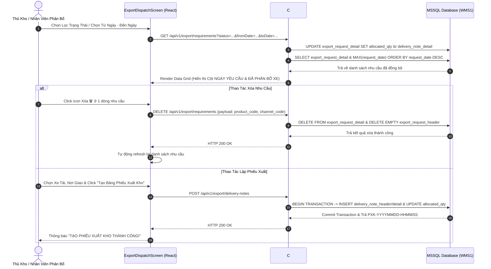
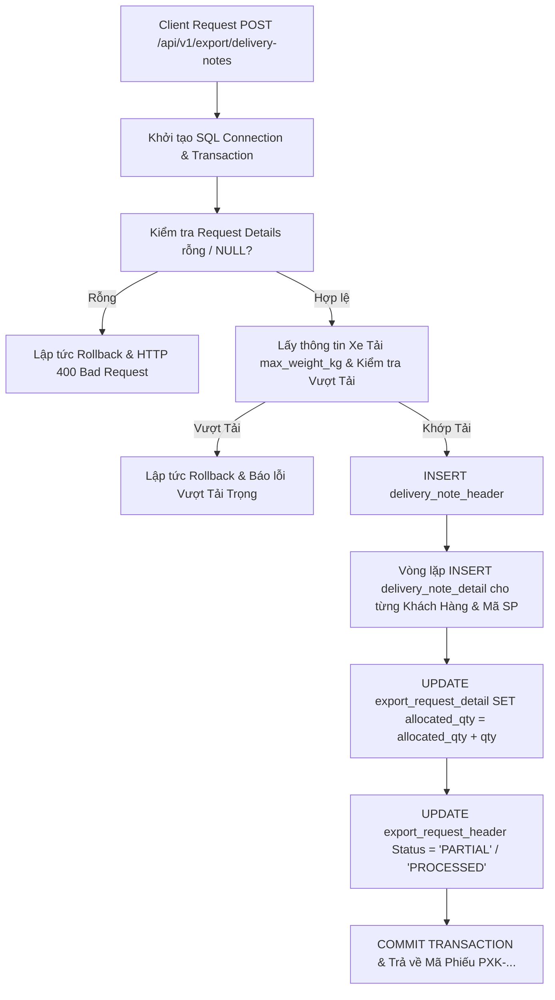
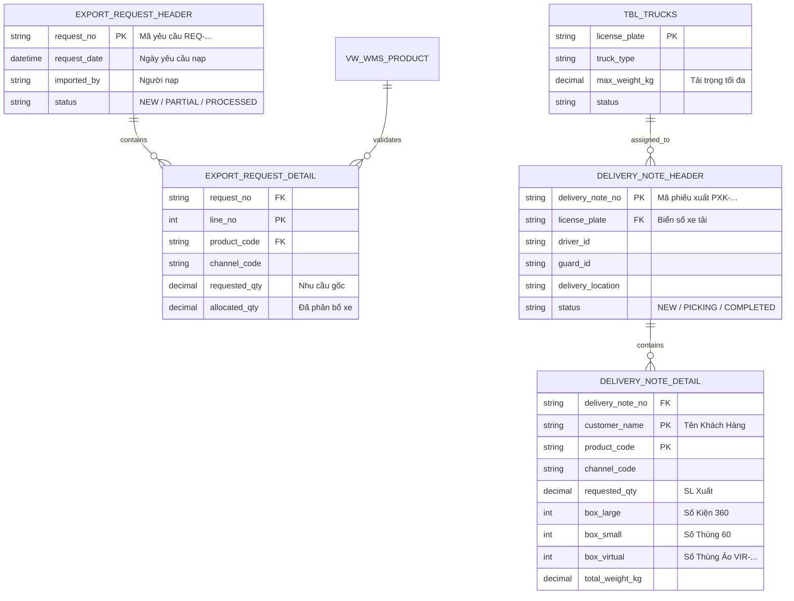

# Phân Tích & Thiết Kế Chuẩn Nghiệp Vụ UC15 - Nhu Cầu Xuất Kho & Phân Bổ Chuyến Xe (Export Requirements & Vehicle Dispatching)

---

## 1. Business Logic (Logic Nghiệp Vụ)

### 1.1. Mục Tiêu Nghiệp Vụ
- Quản lý quy trình tiếp nhận Nhu cầu xuất hàng từ các Kênh phân phối (Paste hàng loạt từ Excel), phân bổ xe tải chở hàng, quy đổi cơ cấu đóng gói (Kiện 360, Thùng 60, Thùng ảo `VIR-...`), và tự động phát hành **Phiếu Xuất Kho chính thức (`PXK-...`)** tách riêng biệt theo từng Khách Hàng.
- Đảm bảo tính toàn vẹn dữ liệu: Tự động trừ lùi nhu cầu còn lại (`total_requested_qty`), ghi nhận số lượng đã phân bổ xe (`already_allocated_qty`), kiểm tra tải trọng xe (`max_weight_kg`), ngăn chặn xuất âm tồn kho khả dụng (`AVAILABLE`), hỗ trợ tra cứu lịch sử nhu cầu theo ngày yêu cầu nạp (`request_date`), lọc trạng thái nhu cầu (`NEW`, `PARTIAL`, `PROCESSED`), và cho phép xóa/hủy nhu cầu an toàn.

### 1.2. Các Quy Tắc Nghiệp Vụ (Business Rules)
- `BR-UC15-01` **Nhập Nhu Cầu Hàng Loạt (Paste Excel All-or-Nothing):**
  - Khối dữ liệu paste từ Excel bao gồm 3 cột: `Mã Sản Phẩm` (ProductCode), `Kênh Bán Hàng` (ChannelCode), `Số Lượng Nhu Cầu` (RequestedQty).
  - Hệ thống kiểm tra đối soát tất cả Mã SP với danh mục Master Data `vw_WMS_Product`. Nếu phát hiện bất kỳ mã SP nào không tồn tại, hệ thống từ chối toàn bộ khối dữ liệu và trả về danh sách chi tiết các mã sai lỗi.
- `BR-UC15-02` **Phân Bổ Xe Tải & Kiểm Trọng Lượng (Truck Allocation & Weight Limits):**
  - Mọi đợt phát hành phiếu xuất bắt buộc phải gắn với một Xe Tải khả dụng (`tbl_trucks`).
  - Hệ thống tự động tính tổng trọng lượng hàng phát hành (Kg) = $\sum (\text{SL Thực Xuất} \times \text{Trọng lượng SP})$. Nếu tổng trọng lượng vượt quá tải trọng xe (`max_weight_kg`), hệ thống cảnh báo đỏ và chặn phát hành phiếu.
- `BR-UC15-03` **Quy Đổi Kiện 360, Thùng 60 & Sinh Thùng Ảo (Box Structure & Virtual Box):**
  - Tự động quy đổi số lượng sản phẩm xuất ra cơ cấu thùng:
    - `BoxLarge`: Số Kiện 360 ($1 \text{ Kiện 360} = 360 \text{ SP}$).
    - `BoxSmall`: Số Thùng 60 ($1 \text{ Thùng 60} = 60 \text{ SP}$).
    - `BoxVirtual`: Số lượng lẻ dưới 60 SP sinh thành **Thùng Ảo** (`VIR-EXPORT-...`).
  - Cho phép người dùng điều chỉnh trực tiếp số lượng từng loại thùng trên lưới dữ liệu.
- `BR-UC15-04` **Tự Động Tách Phiếu Xuất Theo Khách Hàng (Auto-Split Delivery Note per Customer):**
  - Dù nạp chung một chuyến xe tải, hệ thống tự động nhóm các mặt hàng theo từng Khách Hàng (`groupedDetailsByCustomer`) và phát hành các **Phiếu Xuất Kho độc lập (`PXK-YYYYMMDD-HHMMSS`)** cho từng Khách Hàng để hạch toán kế toán và giao nhận độc lập.
- `BR-UC15-05` **Ghi Nhận Số Lượng Đã Phân Bổ Xe & Tự Động Trừ Lùi Nhu Cầu (Auto-Sync Allocation & Deduct):**
  - Khi phát hành phiếu xuất kho thành công, hệ thống tự động cập nhật cộng dồn `allocated_qty` trong `export_request_detail` dựa trên thực tế phát hành phiếu xuất (`delivery_note_detail`).
  - Nhu cầu còn lại = $\text{Nhu cầu gốc} - \text{Đã phân bổ xe}$. Trạng thái chứng từ nạp tự động chuyển từ `NEW` -> `PARTIAL` -> `PROCESSED`.
- `BR-UC15-06` **Tra Cứu Lịch Sử Ngày & Lọc Trạng Thái (Date & Status Filtering):**
  - Hỗ trợ lọc danh sách nhu cầu theo dải ngày nạp (`fromDate` - `toDate`) và bộ lọc trạng thái chip (`🌐 Tất Cả`, `⚡ Chờ Phân Bổ`, `🌗 Phân Bổ 1 Phần`, `✅ Đã Hoàn Tất`).
  - Cột `NGÀY YÊU CẦU ⭐` hiển thị dạng `DD/MM/YYYY` và sắp xếp ưu tiên ngày yêu cầu mới nhất lên trên cùng.
- `BR-UC15-07` **Xóa / Hủy Dòng Nhu Cầu An Toàn (Safe Requirement Deletion):**
  - Cho phép xóa cá nhân từng dòng nhu cầu hoặc xóa hàng loạt các dòng nhu cầu đã chọn. Logic backend xóa sạch dòng chi tiết tương ứng ở bất kỳ trạng thái nào và tự động dọn dẹp các chứng từ Header rỗng.

---

## 2. UI/UX Guidelines (Hướng Dẫn Giao Diện)

### 2.1. Bố Cục Màn Hình (Screen Layout)
- **Top Navigation Bar:** Tiêu đề màn hình Phân Bổ Chuyến Xe, các thẻ Tab (`[ 📋 1. Nhập Nhu Cầu Hàng Loạt ]`, `[ 🚚 2. Phân Bổ Xe & Lập Phiếu Xuất ]`, `[ 🔄 3. Xuất Tạm Kho (UC18) ]`).
- **Thanh Công Cụ Lọc Trạng Thái & Ngày (Filter Toolbar):**
  - Nhóm nút Chip trạng thái: `🌐 Tất Cả`, `⚡ Chờ Phân Bổ (NEW)`, `🌗 Phân Bổ 1 Phần (PARTIAL)`, `✅ Đã Hoàn Tất (PROCESSED)`.
  - Nhóm chọn dải ngày: Input `Từ Ngày`, Input `Đến Ngày`, và Nút `[ 🔄 Xóa Lọc ]`.
- **Tab 2: Phân Bổ Xe & Lập Phiếu Xuất (Sticky Header Control Panel):**
  - Khung chọn Nơi Giao Hàng (`deliveryLocation`), Chọn Xe Tải (`selectedTruck`), Gán nhanh Khách hàng.
  - Bảng Data Grid khóa cố định tên cột khi cuộn:
    - Checkbox chọn dòng.
    - Cột `Khách Hàng ⭐` (Combobox chọn từng dòng).
    - Cột `NGÀY YÊU CẦU ⭐` (Định dạng `DD/MM/YYYY`).
    - Cột `Mã SP` & `Kênh`.
    - Cột `Nhu Cầu Gốc`.
    - Cột `ĐÃ PHÂN BỔ XE ⭐` (Highlight xanh lá/xanh dương đậm).
    - Cột `Nhu Cầu Còn Lại`.
    - Cột `Tồn Kho` (Khả dụng `AVAILABLE`).
    - Ô điều chỉnh cơ cấu thùng (K360 / T60 / Ảo).
    - Ô nhập `SL Xuất ⭐` & `Trọng Lượng ⭐`.
    - Nút Xóa `🗑️`.
  - Nút `[ 🗑️ Xóa Hàng Loạt Nhu Cầu Đã Chọn ]` và Nút `[ 📋 Tạo Bảng Phiếu Xuất Kho ]`.

---

## 3. Programming Logic (Logic Lập Trình)

### 3.1. Frontend React Component Workflow (`ExportDispatchScreen.jsx`)
```javascript
// Gọi API lấy nhu cầu kèm tham số lọc trạng thái & ngày
const fetchRequirements = async (overrideParams = {}) => {
  const params = {
    status: overrideParams.status !== undefined ? overrideParams.status : reqStatusFilter,
    fromDate: overrideParams.fromDate !== undefined ? overrideParams.fromDate : reqFromDate,
    toDate: overrideParams.toDate !== undefined ? overrideParams.toDate : reqToDate
  };
  const res = await outboundApi.getRequirements(params);
  let data = res?.data !== undefined ? res.data : res;
  setRequirements(Array.isArray(data) ? data : []);
};

// Gọi API xóa dòng nhu cầu
const handleDeleteReq = async (product_code, channel_code) => {
  if (!window.confirm(`Bạn có chắc muốn xóa nhu cầu của mã sản phẩm ${product_code}?`)) return;
  await outboundApi.deleteRequirement({ product_code, channel_code });
  fetchRequirements();
};
```

### 3.2. Backend C# .NET 8 Web API (`ExportRequirementsController.cs`)

```csharp
[HttpGet("requirements")]
public async Task<IActionResult> GetRequirements(
    [FromQuery] string? status = null, 
    [FromQuery] string? fromDate = null, 
    [FromQuery] string? toDate = null)
{
    using var connection = await _connectionFactory.CreateConnectionAsync();

    // 1. Tự động đồng bộ allocated_qty từ delivery_note_detail sang export_request_detail
    await connection.ExecuteAsync(@"
        UPDATE d
        SET allocated_qty = ISNULL(dn.total_allocated, 0)
        FROM export_request_detail d
        JOIN (
            SELECT product_code, channel_code, SUM(qty) as total_allocated
            FROM delivery_note_detail
            GROUP BY product_code, channel_code
        ) dn ON d.product_code = dn.product_code AND d.channel_code = dn.channel_code");

    // 2. Truy vấn danh sách nhu cầu theo bộ lọc
    var sql = @"
        SELECT 
            d.product_code, 
            d.channel_code, 
            MAX(h.request_date) as request_date,
            SUM(d.requested_qty) as original_requested_qty,
            SUM(ISNULL(d.allocated_qty, 0)) as already_allocated_qty,
            CASE WHEN SUM(d.requested_qty - ISNULL(d.allocated_qty, 0)) < 0 THEN 0 ELSE SUM(d.requested_qty - ISNULL(d.allocated_qty, 0)) END as total_requested_qty,
            (SELECT ISNULL(SUM(current_qty), 0) FROM tbl_thung60_kho t WHERE t.product_code = d.product_code AND t.status = 'AVAILABLE') as total_stock
        FROM export_request_detail d
        JOIN export_request_header h ON d.request_no = h.request_no
        WHERE (@status IS NULL OR @status = '' OR h.status = @status)
          AND (@fromDate IS NULL OR @fromDate = '' OR CAST(h.request_date AS DATE) >= @fromDate)
          AND (@toDate IS NULL OR @toDate = '' OR CAST(h.request_date AS DATE) <= @toDate)
        GROUP BY d.product_code, d.channel_code
        HAVING SUM(d.requested_qty) > 0
        ORDER BY MAX(h.request_date) DESC, d.product_code ASC
    ";

    var result = await connection.QueryAsync<dynamic>(sql, new { status, fromDate, toDate });
    return Ok(ApiResponse<object>.Success(result));
}

[HttpDelete("requirements")]
public async Task<IActionResult> DeleteRequirement([FromBody] DeleteRequirementRequest request)
{
    string productCode = !string.IsNullOrWhiteSpace(request.ProductCode) ? request.ProductCode : request.Product_Code ?? "";
    string channelCode = !string.IsNullOrWhiteSpace(request.ChannelCode) ? request.ChannelCode : request.Channel_Code ?? "";

    using var connection = await _connectionFactory.CreateConnectionAsync();
    
    // Xóa toàn bộ dòng chi tiết nhu cầu trùng mã SP và kênh
    await connection.ExecuteAsync(@"
        DELETE d 
        FROM export_request_detail d
        JOIN export_request_header h ON d.request_no = h.request_no
        WHERE d.product_code = @productCode AND d.channel_code = @channelCode", new { productCode, channelCode });

    // Dọn dẹp Header rỗng
    await connection.ExecuteAsync(@"
        DELETE h
        FROM export_request_header h
        WHERE NOT EXISTS (
            SELECT 1 FROM export_request_detail d WHERE d.request_no = h.request_no
        )");

    return Ok(CommandResponse.Success("Xóa dòng nhu cầu xuất thành công."));
}
```

---

## 4. Data Logic (Logic Dữ Liệu)

### 4.1. Ma Trận Phân Quyền CRUD

| Bảng Dữ Liệu | Create (C) | Read (R) | Update (U) | Delete (D) | Ý Nghĩa Trong UC15 |
| :--- | :---: | :---: | :---: | :---: | :--- |
| `export_request_header` | **X** | **X** | **X** | **X** | Lưu chứng từ yêu cầu nạp nháp từ Excel & quản lý trạng thái `NEW/PARTIAL/PROCESSED` |
| `export_request_detail` | **X** | **X** | **X** | **X** | Chi tiết mặt hàng nhu cầu, số lượng nạp gốc & số lượng đã phân bổ xe `allocated_qty` |
| `delivery_note_header` | **X** | **X** | **X** | | Lưu Header Phiếu Xuất Kho chính thức (`PXK-...`) gắn với Xe Tải & Nơi Giao |
| `delivery_note_detail` | **X** | **X** | | | Chi tiết hàng xuất, cơ cấu thùng K360/T60/Ảo & Khách hàng |
| `tbl_trucks` | **X** | **X** | **X** | **X** | Quản lý danh mục xe tải & tải trọng `max_weight_kg` |
| `tbl_thung60_kho` | | **X** | **X** | | Đọc tồn kho khả dụng `AVAILABLE` & trừ lùi khi xuất kho |

### 4.2. Mô Hình Trạng Thái & Nguyên Lý Sổ Cái Kép Dual Ledger

```
                    +------------------------------------+
                    |       EXCEL PASTE DATA             |
                    | (Mã SP, Kênh, Số Lượng Nhu Cầu)    |
                    +-----------------+------------------+
                                      |
                                      v
                    +------------------------------------+
                    |    EXPORT_REQUEST (Header/Detail)  |
                    | Status: 'NEW' -> 'PARTIAL'/'PROCESSED' |
                    +-----------------+------------------+
                                      |
                                      v (Phát Hành Phiếu Xuất PXK-...)
                    +------------------------------------+
                    |    DELIVERY_NOTE (Header/Detail)   |
                    |        Status: 'NEW / PICKING'     |
                    +-----------------+------------------+
                                      |
                                      v (Hạch toán Sổ Cái Kép UC16 / UC22.2)
                    +------------------------------------+
                    |    STOCK_TRANSACTION_BOOK          |
                    |      TransactionType: 'PICKING'    |
                    |  DEBIT: STAGING_OUTBOUND           |
                    |  CREDIT: INV_FG                    |
                    +------------------------------------+
```

---

## 5. Diagrams (Biểu Đồ Nghiệp Vụ)

### 5.1. Sequence Diagram (Luồng Phân Bổ Xe, Tra Cứu Lịch Sử & Xóa Nhu Cầu)



### 5.2. Data Layer Architecture (SQL Transaction & Fail-Fast Protection)



### 5.3. Entity Relationship Diagram (ERD UC15 Export & Requirements)


