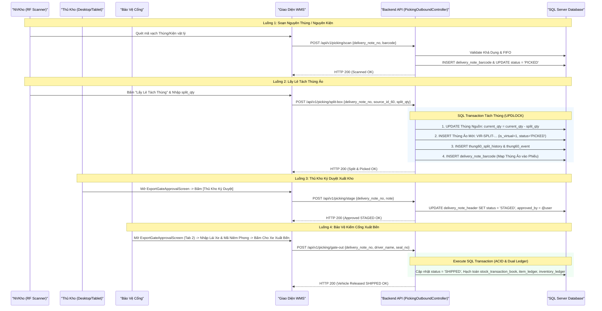
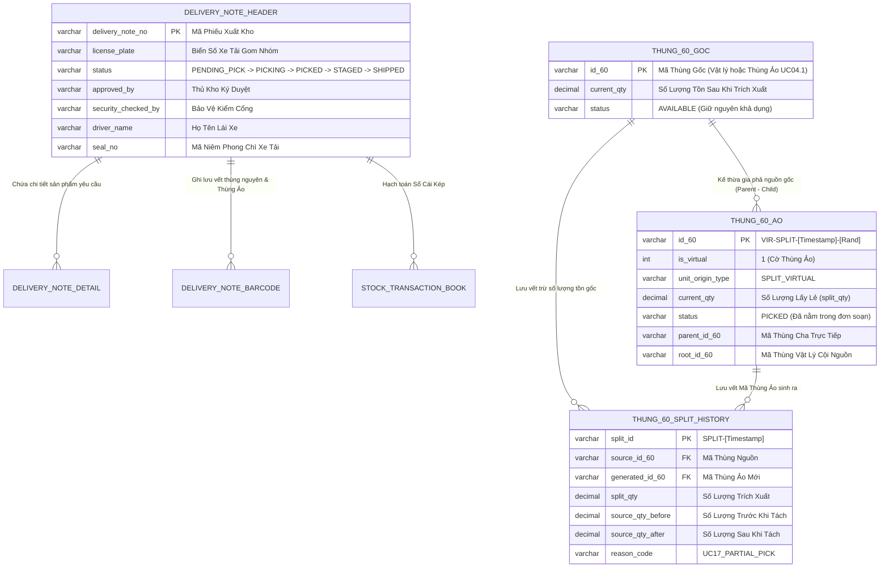

# Phân tích Thiết kế Logic UC16 - Soạn Hàng, Lấy Lẻ Tách Thùng Ảo & Xuất Bến (Consolidated Outbound Picking, Partial Export & Gate Security Release)

Tài liệu này hệ thống hóa toàn bộ luồng nghiệp vụ, logic lập trình, tiêu chuẩn UI/UX, cấu trúc dữ liệu Sổ Cái Kép và các biểu đồ kiến trúc Mermaid cho phân hệ **Soạn Hàng, Lấy Lẻ Tách Thùng Ảo & Xuất Bến (UC16)** (đã gộp toàn bộ nghiệp vụ trích xuất lấy lẻ UC17 cũ vào làm một module thành phần trực thuộc UC16).

---

## 1. Business Logic (Logic Nghiệp Vụ)

**Mục tiêu cốt lõi:**
Đảm bảo hàng hóa vật lý lấy ra khỏi kho bằng thiết bị máy quét RF Scanner / Máy tính bảng khớp 100% với kế hoạch phân bổ (UC15), gợi ý vị trí lấy hàng chuẩn FIFO (hàng cũ lấy trước) phân rã theo Kiện 360 & Thùng 60 kèm Vị Trí Kho (`location_code`), gom nhóm quy trình thao tác theo Chuyến Xe Tải (`license_plate`), tự động tạo Thùng Ảo xuất kho khi lấy lẻ (`VIR-SPLIT-...`), thực hiện Ký Duyệt Xuất Kho của Thủ Kho và Xác Nhận Cho Xe Xuất Bến của Bảo Vệ Cổng.

### Các quy tắc nghiệp vụ (Business Rules):

- `BR-UC16-01` **Nguyên tắc 1 kèm 1 (Tránh trùng lặp):** Một mã vạch vật lý (Thùng 60 hoặc Kiện 360) chỉ được phép quét và gán cho một Phiếu xuất duy nhất. Hệ thống phải chặn ngay lập tức nếu mã vạch này đã nằm trong một Phiếu xuất khác.
- `BR-UC16-02` **Ràng buộc Khả dụng (Availability):** Chỉ những thùng hàng mang trạng thái `AVAILABLE` (hoặc `ALLOCATED`) và Kiện 360 mang trạng thái `COMPLETED` (hoặc `ALLOCATED`) mới được phép quét soạn hàng hoặc trích xuất lấy lẻ.
- `BR-UC16-03` **Định dạng Số nguyên tuyệt đối (Whole Integer Only):** Toàn bộ số lượng yêu cầu, số lượng đã phân bổ xe, số lượng còn lại, số lượng trích xuất lấy lẻ và số lượng thực quét trên tất cả giao diện và API phải là số nguyên (không hiển thị số thập phân như `.0000` hay `.00`).
- `BR-UC16-04` **Ghi nhận thực xuất (Cho phép thừa/thiếu hàng):** Hệ thống không bắt buộc số lượng nhặt phải bằng 100% yêu cầu. Thủ kho có thể hoàn tất soạn hàng bất kỳ lúc nào, kể cả nhặt dư (vượt số lượng) hoặc nhặt thiếu, hệ thống sẽ lấy "Số lượng đã quét" làm "Số lượng thực xuất" để chuyển sang bước Tập kết.
- `BR-UC16-05` **Gom nhóm thao tác theo Chuyến Xe Tải (Truck-Level Dispatch):** Quy trình soạn hàng, tập kết bãi và xuất bến cho phép lọc và thao tác hàng loạt gom theo Biển Số Xe Tải (`license_plate`), giúp quản lý tải trọng và tổng hợp hàng cần lấy cho từng xe.
- `BR-UC16-06` **Gợi ý Vị trí Kho & Thùng hàng theo FIFO (Pack 360 & Box 60 Breakdown):** Khi chọn mặt hàng cần soạn, hệ thống tự động gợi ý danh sách Kiện 360 (`current_pack360_id`) và Thùng 60 đơn lẻ xếp theo thứ tự ưu tiên nhập trước xuất trước (`created_at ASC`) kèm Vị trí kệ kho (`location_code`). Bảng gợi ý là chỉ dẫn đọc vị trí, bắt buộc nhân viên kho phải trực tiếp đến tận vị trí quét mã vạch thực tế (không cho phép chọn nhanh bằng nút bấm).
- `BR-UC16-07` **Phản hồi Trạng thái Quét Trực thời (Real-time Scan Verification):** Trên bảng chỉ dẫn FIFO, dòng thùng/kiện được quét đúng sẽ ngay lập tức đổi nền xanh lá và gắn badge `✅ ĐÃ QUÉT ĐÚNG`. Các thùng chưa quét hiển thị badge `⏳ CHƯA QUÉT`.
- `BR-UC16-08` **Tự động Khởi tạo Thùng Ảo Xuất Kho Khi Lấy Lẻ (Partial Split Box Creation):** Khi trích xuất lấy lẻ từ Thùng gốc (vật lý hoặc thùng ảo sẵn có từ UC04.1), hệ thống tự động sinh ra một Mã Thùng Ảo mới `VIR-SPLIT-[Timestamp]-[Rand]` với `is_virtual = 1`, `unit_origin_type = 'SPLIT_VIRTUAL'` và gán trạng thái `status = 'PICKED'`.
- `BR-UC16-09` **Bảo toàn Trạng thái Thùng Gốc & Gia phả Nguồn gốc (Pedigree Inheritance):** Thùng gốc sau khi trích xuất lấy lẻ bị trừ số lượng tồn kho tương ứng (`current_qty = current_qty - split_qty`), trạng thái giữ nguyên là `AVAILABLE`. Thùng Ảo mới sinh ra kế thừa `parent_id_60` (Thùng cha trực tiếp) và `root_id_60` (Thùng vật lý cội nguồn).
- `BR-UC16-10` **Phân quyền Ký Duyệt Xuất Kho Của Thủ Kho (Storekeeper Approval):** Sau khi nhân viên quét đủ hàng (`PICKED`), phiếu xuất bắt buộc phải trải qua bước Ký Duyệt Xuất Kho do Thủ Kho thực hiện (chuyển trạng thái `PICKED` → `STAGED`), ghi nhận nhật ký `approved_by`, `approved_at` và chữ ký/ghi chú đối soát.
- `BR-UC16-11` **Phân quyền Kiểm Cổng Bảo Vệ (Gate Security Release):** Trước khi xe rời bến xuất kho (`SHIPPED`), lực lượng Bảo Vệ Cổng phải thực hiện kiểm soát tại giao diện riêng `ExportGateApprovalScreen.jsx`: kiểm tra khớp biển số xe, kiểm đếm đủ số thùng/kiện, xác nhận kẹp niêm phong chì (`seal_no`), tên tài xế (`driver_name`) và xác nhận cho xe xuất bến.
- `BR-UC16-12` **Đồng bộ Tồn kho & Sổ Cái Kép (Dual Ledger Sync):** Việc khấu trừ tồn kho vật lý chính thức và ghi nhận sổ cái kép (`stock_transaction_book`, `item_ledger`, `inventory_ledger`) chỉ được thực thi duy nhất ở khâu Xác Nhận Xuất Bến / Kiểm Cổng thành công.

---

### Quy trình tương tác (Interaction Flow):

1. **Bước 1 (Nhận Việc Theo Chuyến Xe):** Nhân viên mở phân hệ Soạn Hàng (UC16). Giao diện hiển thị danh sách phiếu xuất gom nhóm theo các Thẻ Chuyến Xe Tải (`license_plate`). Tab "Đang Soạn" hiển thị các phiếu `NEW`, `PENDING_PICK`, `PICKING`.
2. **Bước 2 (Xem Chỉ Dẫn FIFO & Vị Trí Kho):** Nhân viên hoặc Thủ Kho bấm vào sản phẩm cần lấy, màn hình hiển thị Bảng Gợi Ý Vị Trí Kho & Thùng FIFO (Phân rã Kiện 360 & Thùng 60) với exact vị trí dãy/kệ (`location_code`).
3. **Bước 3 (Thao tác Quét Nguyên Thùng / Nguyên Kiện):** Dùng súng quét RF Scanner quét mã vạch trên thùng/kiện vật lý. Nếu khớp, dòng vị trí FIFO đổi sang xanh `✅ ĐÃ QUÉT ĐÚNG`, tiến độ tăng lên.
4. **Bước 4 (Thao tác Lấy Lẻ Tách Thùng Ảo):**
   - Với dòng số lượng lẻ, bấm nút **"Lấy Lẻ Tách Thùng"**.
   - Modal hiển thị danh sách thùng `AVAILABLE`. Hệ thống tự động điền số lượng lẻ còn thiếu.
   - Bấm **"Xác Nhận Tách & Lấy Lẻ"**: Backend thực hiện SQL Transaction (khóa `UPDLOCK` thùng gốc, trừ tồn gốc, sinh thùng ảo `VIR-SPLIT-...` mang trạng thái `PICKED`, map vào phiếu xuất).
5. **Bước 5 (Hoàn Tất Soạn - PICKED):** Bấm "Hoàn Tất Soạn", phiếu xuất chuyển sang trạng thái `PICKED` (Chờ Thủ Kho duyệt).
6. **Bước 6 (Thủ Kho Ký Duyệt Xuất Kho - STAGED):** Thủ Kho mở phiếu hoặc mở giao diện `ExportGateApprovalScreen.jsx` (Tab 1), đối soát danh sách sản phẩm thực xuất đạt 100%, nhập ghi chú chữ ký và bấm **`[✅ KÝ DUYỆT XÁC NHẬN XUẤT KHO]`**. Phiếu chuyển sang `STAGED`.
7. **Bước 7 (Bảo Vệ Kiểm Cổng Xuất Bến - SHIPPED):** Lực lượng Bảo Vệ mở giao diện `ExportGateApprovalScreen.jsx` (Tab 2), thực hiện checklist kiểm đếm số kiện, đối soát biển số xe, nhập Tên Lái Xe (`driver_name`), Mã Niêm Phong (`seal_no`) và bấm **`[🛡️ BẢO VỆ XÁC NHẬN CHO XE XUẤT BẾN]`**. Hoàn tất xuất bến, tồn kho thực tế chính thức bị khấu trừ.

---

## 2. Tiêu chuẩn Thiết kế Giao diện (UI/UX Guidelines)

- **Thiết bị đích:** Máy quét mã vạch RF Scanner, Máy tính bảng (Tablet xe nâng) và Máy tính Desktop của Thủ Kho / Bảo Vệ.
- **Tối ưu hóa Máy Quét:**
  - Ô Textbox quét mã QR/Barcode luôn giữ trạng thái `Focus` tự động (`barcodeInputRef.current.focus()`).
  - Phản hồi thị giác tức thì: Cảnh báo đỏ rung màn hình khi quét sai, đổi nền xanh lá khi quét đúng.
- **Trải nghiệm Gom nhóm Xe Tải:** Hiển thị Thẻ Chuyến Xe Tải với tổng số phiếu, tổng số lượng SP và nút **`[Tổng Hợp Xe]`** để xem bảng ma trận sản phẩm gom cả chuyến.
- **Trải nghiệm Bảng Gợi Ý FIFO:**
  - Phân chia 2 khu vực: **📦 Kiện Lớn 360 Gợi Ý** và **📦 Thùng 60 Đơn Lẻ Gợi Ý**.
  - Hiển thị nổi bật mã Vị Trí Kho (`location_code`) màu xanh dương pastel (`#e0f2fe`).
  - Highlight nền xanh lá nhạt (`#dcfce7`) kèm Badge **`✅ ĐÃ QUÉT ĐÚNG`** ngay khi mã thùng được quét thực tế.
- **Trải nghiệm Modal Tách Thùng Ảo:**
  - Modal nổi phủ mờ nền, phân biệt bằng màu sắc badge giữa **Thùng Vật Lý** (`#e0f2fe`) và **Thùng Ảo UC04.1** (`#fffbeb`).
  - Điền sẵn số lượng lẻ còn thiếu (`Auto-fill`), bấm 1 chạm xác nhận tách thùng.
- **Trải nghiệm Màn hình Chuyên biệt Ký Duyệt & Kiểm Cổng (`ExportGateApprovalScreen.jsx`):**
  - **Tab Thủ Kho Duyệt:** Bảng thống kê chi tiết yêu cầu vs thực xuất, modal nhập chữ ký xác nhận của Thủ kho.
  - **Tab Bảo Vệ Kiểm Cổng:** Thẻ chỉ số trực quan, checklist 3 bước an toàn cổng (Biển số xe, Kiểm đếm kiện, Kẹp niêm phong chì), ô nhập Tên Tài Xế và Mã Niêm Phong.

---

## 3. Programming Logic (Logic Lập Trình)

### 3.1. Thiết kế Frontend (`PickingScreen.jsx` & `ExportGateApprovalScreen.jsx`)
- **State quản lý:**
  - `notes`, `selectedNote`, `noteDetails`: Danh sách và chi tiết phiếu xuất.
  - `selectedTruckFilter`, `selectedTruckSummary`: Gom nhóm lọc theo chuyến xe tải.
  - `viewFifoModalItem`, `modalFifoData`, `modalScanHistory`: Gợi ý vị trí kho FIFO và trạng thái quét thực tế.
  - `showSplitModal`, `availableBoxes`, `selectedBoxForSplit`, `splitQty`: Modal tách thùng ảo lấy lẻ.
  - `showStorekeeperModal`, `storekeeperNote`: Modal ký duyệt của Thủ Kho.
  - `showGateModal`, `driverName`, `sealNo`, `gateNote`, `checkPlate`, `checkQty`, `checkSeal`: Modal kiểm cổng của Bảo Vệ.
- **Xử lý bất đồng bộ & Khôi phục dữ liệu:**
  - Chuẩn hóa tên trường `qty` / `requested_qty` / `picked_qty` an toàn qua các hàm helper toán học.
  - Hỗ trợ dữ liệu mồi demo (`DEMO_NOTES`, `DEMO_DETAILS`) khi CSDL chưa có bản ghi giúp hiển thị mượt mà.

### 3.2. Backend API (`PickingOutboundController.cs`)
- `GET /api/v1/picking/delivery-notes`: Trả về danh sách phiếu xuất.
- `GET /api/v1/picking/delivery-notes/{id}`: Trả về thông tin header, chi tiết dòng và danh sách mã vạch đã quét.
- `POST /api/v1/picking/scan`: Quét mã vạch nguyên thùng/nguyên kiện, validation 4 tầng fail-fast.
- `GET /api/v1/picking/available-boxes/{productCode}`: Trả về danh sách thùng `status = 'AVAILABLE'` phục vụ tách thùng lẻ.
- `POST /api/v1/picking/split-box`: Xử lý SQL Transaction tách thùng ảo lấy lẻ.
- `GET /api/v1/picking/fifo-suggestions/{product_code}`: Lấy gợi ý FIFO kiện 360 & thùng 60 xếp theo `created_at ASC` kèm `location_code`.
- `GET /api/v1/picking/truck-summary/{license_plate}`: Tổng hợp danh mục sản phẩm cần lấy của toàn bộ chuyến xe tải.
- `POST /api/v1/picking/stage`: Thủ Kho ký duyệt xác nhận xuất kho (`status = 'STAGED'`, `approved_by`, `approved_at`, `approval_note`).
- `POST /api/v1/picking/gate-out`: Bảo vệ cổng xác nhận cho xe xuất bến (`status = 'SHIPPED'`, `security_checked_by`, `security_checked_at`, `driver_name`, `seal_no`, `gate_note`), thực thi SQL Transaction xuất bến, trừ tồn kho vật lý và ghi chép Sổ Cái Kép (Dual Ledger).

---

## 4. Data Logic (Thiết kế Dữ Liệu)

### 4.1. Ma trận phân quyền CRUD hợp nhất

| Bảng dữ liệu | Create | Read | Update | Delete | Ý nghĩa nghiệp vụ trong UC16 |
| --- | :---: | :---: | :---: | :---: | --- |
| `delivery_note_header` | - | X | X | - | **Read:** Tải danh sách phiếu xuất.<br>**Update:** Chuyển trạng thái (`PENDING_PICK` &rarr; `PICKING` &rarr; `PICKED` &rarr; `STAGED` &rarr; `SHIPPED`), ghi nhận `approved_by`, `security_checked_by`, `driver_name`, `seal_no`. |
| `delivery_note_detail` | - | X | - | - | **Read:** Lấy số lượng yêu cầu sản phẩm để tính tiến độ. |
| `delivery_note_barcode` | X | X | - | - | **Create:** Ghi vết thùng nguyên hoặc Thùng Ảo (`VIR-SPLIT-...`) gán vào Phiếu xuất.<br>**Read:** Đổi soát trạng thái `✅ ĐÃ QUÉT ĐÚNG`. |
| `tbl_thung60_kho` | X | X | X | - | **Create:** Tạo Thùng Ảo mới (`VIR-SPLIT-...`).<br>**Read:** Đọc danh sách thùng `AVAILABLE` và gợi ý vị trí kho (`current_location_code`).<br>**Update:** Trừ `current_qty` của thùng gốc khi tách thùng và trừ tồn kho xuất bến (`SHIPPED`). |
| `pack360_header` | - | X | X | - | **Read:** Lấy gợi ý FIFO Kiện 360.<br>**Update:** Trừ tồn kho vật lý (`SHIPPED`) khi xe xuất bến. |
| `thung60_split_history` | X | - | - | - | **Create:** Ghi nhận lưu vết trước/sau khi thực hiện tách thùng lấy lẻ. |
| `thung60_event` | X | - | - | - | **Create:** Ghi nhận sự kiện `SPLIT_OUT` (thùng mẹ) và `SPLIT_IN` (thùng con). |
| `stock_transaction_book` | X | - | - | - | **Create:** Ghi Master Ledger Entry khi xe xuất bến. |
| `item_ledger` | X | - | - | - | **Create:** Ghi nhận Sổ Cái Tổng Hợp (Tổng sản phẩm xuất). |
| `inventory_ledger` | X | - | - | - | **Create:** Ghi nhận Sổ Cái Chi Tiết (Chi tiết mã vạch xuất). |

---

### 4.2. Định nghĩa Trạng thái (State Definitions)

| Trường Dữ Liệu | Kiểu Dữ Liệu | Giá Trị Gán Cứng / Ý Nghĩa |
| --- | --- | --- |
| `status` | NVARCHAR(30) | `NEW` / `PENDING_PICK` &rarr; `PICKING` &rarr; `PICKED` (Chờ Thủ Kho) &rarr; `STAGED` (Chờ Bảo Vệ) &rarr; `SHIPPED` (Đã Xuất Bến). |
| `unit_origin_type` | NVARCHAR(30) | `'SPLIT_VIRTUAL'` (Gắn cờ cho Thùng Ảo sinh ra từ nghiệp vụ tách thùng). |
| `is_virtual` | INT | `1` đối với Thùng Ảo tách lẻ; `0` đối với Thùng vật lý gốc. |
| `approved_by` | NVARCHAR(50) | Username của Thủ Kho thực hiện Ký Duyệt Xuất Kho. |
| `approved_at` | DATETIME | Timestamp thời điểm Thủ Kho bấm nút Ký Duyệt. |
| `security_checked_by` | NVARCHAR(50) | Username của Bảo Vệ Cổng thực hiện kiểm soát xe. |
| `security_checked_at` | DATETIME | Timestamp thời điểm Bảo Vệ mở cổng cho xe xuất bến. |
| `driver_name` | NVARCHAR(100) | Họ tên tài xế / lái xe vận chuyển chuyến hàng. |
| `seal_no` | NVARCHAR(100) | Mã số niêm phong chì kẹp trên cửa xe tải. |

---

### 4.3. Cập nhật Sổ Cái Kép (Dual Ledger Logic)

- **Giai đoạn Tách Thùng Ảo:** Tồn kho tổng không thay đổi (chuyển số lượng từ Thùng nguồn sang Thùng Ảo mang trạng thái `PICKED`).
- **Giai đoạn Xuất Bến (`/gate-out` / `/ship`):** Hạch toán Dual Ledger trong 1 SQL Transaction:
  1. **Master Ledger (`stock_transaction_book`):**
     - `transaction_id`: GUID định danh duy nhất.
     - `transaction_type`: **`OUT_DISPATCH`** / **`GOODS_ISSUE`**.
     - `document_no`: Mã Phiếu xuất (`delivery_note_no`).
     - `posted_by`: Username thực hiện.
     - `posted_at`: `GETDATE()`.
  2. **Item Ledger (`item_ledger`):**
     - Khấu trừ tổng số lượng thực xuất của từng Mã SP: `quantity_change = -SUM(qty)`.
  3. **Inventory Ledger (`inventory_ledger`):**
     - Khấu trừ số lượng của từng mã vạch: `quantity_change = -qty`, `old_stock_type = 'AVAILABLE'`, `new_stock_type = 'DISPATCHED' / 'SHIPPED'`.

---

## 5. Biểu Đồ Thiết Kế (Diagrams)

### 5.1. Sequence Diagram (Biểu Đồ Tuần Tự Toàn Trình UC16)



---

### 5.2. Data Layer Architecture (Kiến Trúc Tầng Dữ Liệu & Lock Transaction)

```mermaid
flowchart TD
    UI_PICK[Giao Diện Soạn Hàng - PickingScreen] -->|POST /scan hoặc /split-box| API_PICK[API Soạn Hàng / Tách Thùng]
    UI_GATE[Giao Diện Kiểm Cổng - ExportGateApprovalScreen] -->|POST /gate-out| API_GATE[API Kiểm Cổng]

    subgraph Database Transaction Boundary (ACID)
        API_PICK -->|BEGIN TRAN /split-box| LOCK_SPLIT{UPDLOCK ROWLOCK Check Thùng Gốc}
        LOCK_SPLIT -->|Valid| UPD_SRC[Trừ SL Thùng Gốc & Sinh Thùng Ảo VIR-SPLIT-... status=PICKED]
        UPD_SRC --> INS_HIST[INSERT thung60_split_history & thung60_event]
        INS_HIST --> INS_BC_MAP[INSERT delivery_note_barcode]
        INS_BC_MAP --> COMMIT_SPLIT[COMMIT TRANSACTION Tách Thùng]

        API_GATE -->|BEGIN TRAN /gate-out| LOCK_GATE{UPDLOCK Check Phiếu STAGED}
        LOCK_GATE -->|Valid| UPD_HDR[Cập nhật delivery_note_header: SHIPPED, approved_by, security_checked_by, seal_no, driver_name]
        UPD_HDR --> UPD_INV[Cập nhật tbl_thung60_kho & pack360_header: status = SHIPPED]
        UPD_INV --> REC_LEDGER[(Hạch toán Dual Ledger: stock_transaction_book, item_ledger, inventory_ledger)]
        REC_LEDGER --> COMMIT_GATE[COMMIT TRANSACTION Xuất Bến]
    end

    COMMIT_SPLIT -->|Thành Công| UI_SPLIT_OK[Phản Hồi UI: Tách Thùng Ảo Thành Công & Tăng Tiến Độ]
    COMMIT_GATE -->|Thành Công| UI_GATE_OK[Phản Hồi UI: Xe Xuất Bến Thành Công & Trừ Tồn Kho Thực Tế]
```

---

### 5.3. Entity Relationship & State Logic Map (Sơ Đồ Thực Thể & Trạng Thái)



---
*Tài liệu hợp nhất UC16 duy nhất bao gồm đầy đủ nghiệp vụ soạn hàng, lấy lẻ tách thùng ảo và xuất bến thực tế dưới kho, tuân thủ 100% tiêu chuẩn _UseCase_Documentation_Template.md.*
