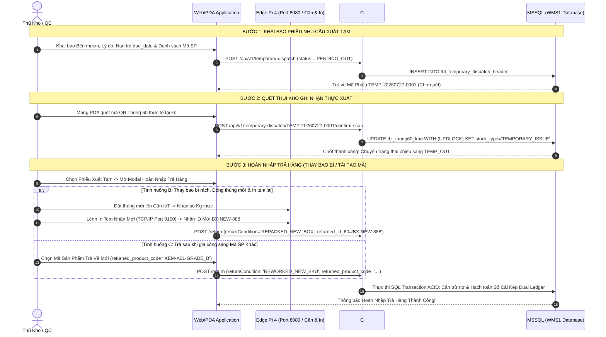
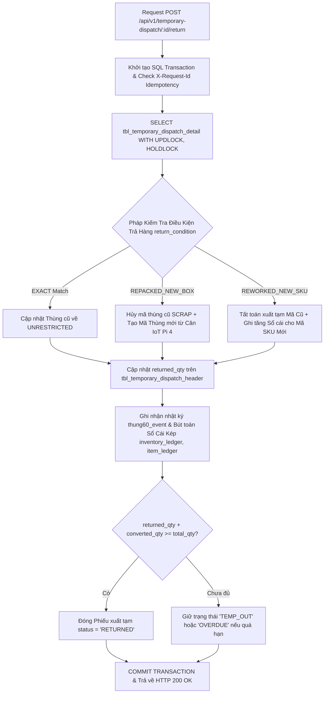
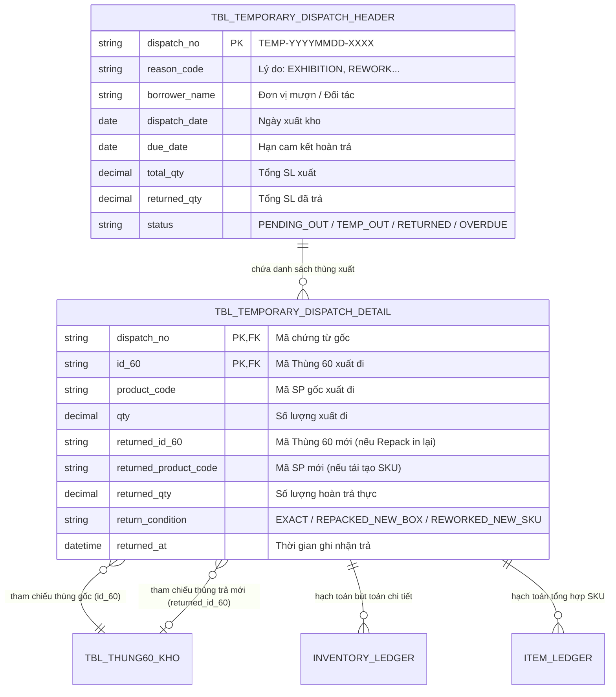

# Phân Tích & Thiết Kế Chuẩn Nghiệp Vụ UC18 - Quản Lý Xuất Tạm Thành Phẩm & Nhập Trả Tạm (Temporary Stock Outbound & Return)

---

## 1. Business Logic (Logic Nghiệp Vụ)

### 1.1. Mục Tiêu Cốt Lõi
Nghiệp vụ **UC18 - Quản Lý Xuất Tạm Thành Phẩm & Nhập Trả Tạm** phục vụ các hoạt động luân chuyển kho phi thương mại (Mượn mẫu triển lãm, hội chợ, gửi mẫu kiểm tra QC bên thứ ba, chuyển xưởng gia công/tái cấu trúc thành phẩm, hoặc thử nghiệm R&D). 

> [!IMPORTANT]
> **NGUYÊN TẮC QUẢN LÝ CHỐT CHẶN CHỨNG TỪ ĐỒNG NHẤT:**
> Toàn bộ vòng đời từ **Khai báo nhu cầu xuất tạm -> Quét xuất kho thực tế -> Hoàn nhập trả hàng** đều được theo dõi dưới **01 Mã Chứng Từ Gốc duy nhất (`dispatch_no`)**. Giao dịch nhập trả hàng không sinh ra phiếu hoàn nhập riêng lẻ rời rạc mà hạch toán đối soát trực tiếp vào dư nợ tồn kho của chứng từ gốc.

### 1.2. Quy Trình Xuất Tạm 2 Bước (Two-Stage Outbound Process)
Trong thực tế vận hành WMS, việc xuất hàng mẫu hoặc đi gia công không xảy ra cùng một lúc mà phân tách rõ ràng theo 2 bước:

- **Bước 1: Khai Báo Phiếu Nhu Cầu Xuất Tạm (Ticket Declaration)**
  - **Người thực hiện:** Kế hoạch sản xuất, QC hoặc Thủ kho.
  - **Thao tác:** Khai báo trên giao diện Web các thông tin hành chính cốt lõi:
    - Đơn vị mượn / Bên nhận (`borrower_name` / `customer_name`).
    - Lý do xuất tạm (`reason_code`: `EXHIBITION_SAMPLE`, `QC_TESTING`, `REWORK_EXTERNAL`, `R_AND_D`).
    - Ngày xuất (`dispatch_date`) & Hạn cam kết hoàn trả (`due_date`).
    - Danh sách nhu cầu: Mã sản phẩm (`product_code`), Số lượng yêu cầu (`requested_qty`).
  - **Trạng thái phiếu:** Tạo thành công ở trạng thái `PENDING_OUT` (Chờ quét thực xuất). Chưa trừ tồn kho thực tế.

- **Bước 2: Tiến Hành Quét Ghi Nhận Số Lượng Thực Xuất (Physical Scanning & Dispatch)**
  - **Người thực hiện:** Thủ kho (nhân viên kho mang máy PDA / Scanner).
  - **Thao tác:** Từ phiếu `PENDING_OUT`, thủ kho mang máy quét xuống kho, tiến hành quét mã vạch QR của từng Thùng 60 / Kiện 360 thực tế (`id_60`).
  - **Kiểm soát logic:** 
    - Hệ thống đối chiếu `product_code` của từng Thùng 60 quét vào với Danh sách nhu cầu đã khai báo ở Bước 1.
    - Chặn đứng ngực tức khắc nếu quét sai mã hàng hoặc quá số lượng khai báo (Fail-fast Validation).
    - Khóa SQL `UPDLOCK, HOLDLOCK`, chuyển trạng thái các thùng đã quét từ `UNRESTRICTED` $\rightarrow$ `TEMPORARY_ISSUE` (giảm tồn khả dụng).
  - **Trạng thái phiếu:** Bấm "Xác Nhận Xuất Tạm" $\rightarrow$ Phiếu chính thức chuyển sang trạng thái `TEMP_OUT` (Đang tạm xuất).

### 1.3. Các Tình Huống Đặc Thù Khi Hoàn Nhập Trả Hàng (Special Return Scenarios)
Khi hoàn nhập trả hàng xuất tạm lại kho, hệ thống không bế tắc ép buộc trả đúng 100% vỏ thùng hay mã cũ, mà linh hoạt giải quyết 3 tình huống thực tế thường gặp tại xưởng:

```
                            +-------------------------------------------+
                            |     HOÀN NHẬP TRẢ HÀNG XUẤT TẠM UC18      |
                            +---------------------+---------------------+
                                                  |
              +-----------------------------------+-----------------------------------+
              | (Tình huống A)                    | (Tình huống B)                    | (Tình huống C)
              v                                   v                                   v
   +---------------------+             +---------------------+             +---------------------+
   | TRẢ TRUY XUẤT NGUYÊN|             | THAY BAO BÌ & IN LẠI|             | XUẤT TÁI TẠO ĐỔI MÃ |
   | BẢN (Exact Match)   |             | MÃ THÙNG 60 MỚI     |             | SẢN PHẨM KHÁC       |
   | (returned_id_60     |             | (returned_id_60     |             | (returned_product_  |
   |  == id_60 gốc)      |             |  != id_60 gốc)      |             |  code != mã gốc)    |
   +---------------------+             +---------------------+             +---------------------+
```

- 🟢 **Tình huống A: Trả Truy Xuất Nguyên Bản (Exact Match Return)**
  - **Bối cảnh:** Hàng mượn đi triển lãm hoặc kiểm nghiệm mang về nguyên thùng nguyên kiện, bao bì không hề hư hỏng, mã QR cũ vẫn tinh tươm.
  - **Xử lý WMS:** Quét đúng mã QR Thùng 60 gốc (`id_60`), hệ thống xác nhận `return_condition = 'EXACT'`.
  - **Hạch toán:** Đổi trạng thái Thùng 60 lại thành `UNRESTRICTED` (hoặc `BLOCKED` nếu cán bộ kiểm kho phát hiện móp méo bên trong), ghi Có giải tỏa nợ chứng từ xuất tạm.

- 🟡 **Tình huống B: Thay Bao Bì, Cân IoT & In Lại Mã Thùng 60 Mới (Repacked Re-label Return)**
  - **Bối cảnh:** Hàng mẫu trưng bày tại sự kiện hoặc test lab khi bóc ra thử nghiệm bị thi đấu, rách nát thùng giấy, bẩn thỉu rách tem QR mã `id_60` cũ.
  - **Xử lý WMS:** 
    1. Thủ kho xếp hàng vào vỏ Thùng 60 mới (hoặc ghép thùng).
    2. Đặt lên **Cân điện tử IoT kết nối Raspberry Pi 4** (Edge Gateway Port 8080) để đo chính xác số kg thực tế $\rightarrow$ Quy đổi ra số lượng thành phẩm hoàn lại.
    3. Phát lệnh **In Tem Nhãn Nhiệt TSPL** qua máy in TCP/IP Port 9100 sinh ra một **Mã Thùng 60 hoàn toàn mới (`id_60_new`)**.
    4. Gán mã thùng mới này vào phiếu xuất tạm như là đối tượng thanh toán bù trừ cho thùng bị rách (`returned_id_60 = id_60_new`, `return_condition = 'REPACKED_NEW_BOX'`).
  - **Hạch toán:** Thùng 60 gốc (`id_60_old`) được chuyển trạng thái `SCRAP / REPLACED` (Đổi bỏ). Thùng mới (`id_60_new`) được đăng ký vào CSDL ở trạng thái `UNRESTRICTED` mang theo vết luân chuyển tích hợp.

- 🟠 **Tình huống C: Xuất Tái Tạo / Gia Công Lại Sang Mã Sản Phẩm Khác (Reworked Reformed SKU)**
  - **Bối cảnh:** Kho mang nguyên lô thành phẩm (Ví dụ: `KEM-A01`) xuất tạm giao cho xưởng phụ hoặc đối tác gia công để đánh tẩy, hàn cắt, cải tiến hoặc phân loại lại thành phẩm hạng B (Ví dụ: `KEM-A01-GRADE_B`) hoặc bộ sản phẩm tổng hợp mới (`KEM-COMBO-01`).
  - **Xử lý WMS:**
    1. Khi nhận hàng về, thủ kho chọn cờ nghiệp vụ **`[ 🔄 Trả Hàng Tái Tạo Đổi Mã SKU ]`**.
    2. Quét thùng hàng mới và chọn Mã Sản Phẩm trả về khác với mã gốc (`returned_product_code != product_code gốc`, `return_condition = 'REWORKED_NEW_SKU'`).
  - **Hạch toán Sổ Cái Kép:** 
    - Chứng từ xuất tạm được cấn trừ cọc tất toán thành công.
    - Sổ cái tổng hợp `item_ledger`: Ghi trừ hoàn tất chỉ tiêu nợ xuất tạm của **Mã Gốc (`product_code_old`)** và ghi tăng tồn kho chính thức cho **Mã Mới Tái Tạo (`product_code_new`)**, lưu rõ lý do hạch toán *Rework SKU Transformation*.

---

## 2. UI/UX Guidelines (Hướng Dẫn Thiết Kế Giao Diện)

### 2.1. Màn Hình Lập Phiếu Khai Báo (Step 1 - Declaration UI)
- **Thiết bị:** Máy tính Desktop hoặc Tablet Web Application.
- **Bố cục Modal Tạo Phiếu:**
  - Khung 1 (Header): Nhập Đơn vị mượn (`borrower_name`), Ngày cam kết trả (`due_date`), Lý do chọn từ Dropdown chuẩn.
  - Khung 2 (Line Items): Bảng danh mục cho phép chọn Mã sản phẩm (`product_code`), số lượng yêu cầu (`requested_qty`), có nút `[ + Thêm Dòng ]` hoặc `[ Paste Từ Excel ]`.
  - Nút Lưu: `[ 📝 Tạo Phiếu Chờ Quét (PENDING_OUT) ]` (Màu vàng nhạt/cam cam) để chuyển tiếp cho Thủ kho mang đi thi công.

### 2.2. Màn Hình Quét Thực Xuất & Hoàn Nhập (Step 2 - Scanning & Return UI)
- **Thiết bị:** PDA Cầm Tay hoặc PC Trạm kết nối Barcode Scanner & Raspberry Pi 4.
- **Tính năng trên Modal Nhập Trả Hàng (`TempReturnModal`):**
  - **Thanh Chọn Loại Hoàn Trả (Return Type Radio Tabs):**
    - `(•) Trả nguyên bản (Exact Match)`
    - `( ) Đóng gói bao bì mới & Cân in lại tem (Repack & Re-print)` $\rightarrow$ *Tự động hiển thị khung kết nối Cân IoT Pi 4 (`GET http://localhost:8080/api/scale/current`) và Nút `[ 🖨️ In Tem Thùng Mới & Trả ]`.*
    - `( ) Trả sau gia công/Tái tạo mã SP khác (Reworked SKU)` $\rightarrow$ *Tự động bung Dropdown chọn Mã SP trả về (`returned_product_code`) để đối soát.*

---

## 3. Programming Logic (Logic Lập Trình Backend)

### 3.1. Controller & REST Endpoints (`TemporaryDispatchController.cs`)
- **`POST /api/v1/temporary-dispatch` (Bước 1 - Tạo phiếu Khai Báo):**
  - Nhận payload khai báo `borrower_name`, `reason_code`, `due_date`, danh sách hàng yêu cầu.
  - Tạo bản ghi trong `tbl_temporary_dispatch_header` với `status = 'PENDING_OUT'`.
- **`POST /api/v1/temporary-dispatch/{dispatchNo}/confirm-scan` (Bước 2 - Quét xuất thực tế):**
  - Nhận danh sách mã `id_60` đã quét tại kho.
  - Kiểm soát Idempotency qua Header `X-Request-Id`.
  - Mở Transaction SQL, áp dụng lock `WITH (UPDLOCK, HOLDLOCK)` trên `tbl_thung60_kho`. Chuyển `stock_type = 'TEMPORARY_ISSUE'` và cập nhật phiếu thành `TEMP_OUT`.
- **`POST /api/v1/temporary-dispatch/{dispatchNo}/return` (Xử lý Hoàn Nhập Trả Hàng):**
  - Payload hỗ trợ 3 tình huống trả hàng:
    ```json
    {
      "returnItems": [
        { "id_60": "BX-001", "returnCondition": "EXACT", "qty": 60 },
        { "id_60": "BX-002", "returned_id_60": "BX-NEW-888", "returnCondition": "REPACKED_NEW_BOX", "qty": 58 },
        { "id_60": "BX-003", "returned_product_code": "KEM-A01-GRADE_B", "returnCondition": "REWORKED_NEW_SKU", "qty": 60 }
      ]
    }
    ```
  - Cập nhật vào `tbl_temporary_dispatch_detail`, tính toán lại `returned_qty` ở Header, tất toán Sổ cái kép tương ứng.

---

## 4. Data Logic (Thiết Kế Dữ Liệu & Sổ Cái Kép)

### 4.1. Ma Trận Phân Quyền CRUD

| Tên Bảng (Table) | Create | Read | Update | Delete | Ý Nghĩa Trong Nghiệp Vụ UC18 |
| :--- | :---: | :---: | :---: | :---: | :--- |
| `tbl_temporary_dispatch_header` | **X** | **X** | **X** | - | Lưu phiếu gốc `dispatch_no`, đối tác mượn, hạn trả `due_date`, trạng thái tổng. |
| `tbl_temporary_dispatch_detail` | **X** | **X** | **X** | - | Lưu chi tiết `id_60` gốc, `returned_id_60` mới (nếu repack) và `returned_product_code` (nếu tái tạo). |
| `tbl_thung60_kho` | **X** | **X** | **X** | - | Khóa tồn kho gốc (`TEMPORARY_ISSUE`), tạo mới thùng 60 nếu là thao tác Repack in tem lại. |
| `thung60_event` | **X** | **X** | - | - | Lưu nhật ký luân chuyển 2 chiều (`TEMP_ISSUE_OUT` & `TEMP_RETURN`). |
| `stock_transaction_book` | **X** | **X** | - | - | Ghi nhận chứng từ Master cho giao dịch xuất và giao dịch hoàn trả. |
| `inventory_ledger` | **X** | **X** | - | - | Hạch toán Sổ cái kép (Carton level) theo mã thùng gốc và mã thùng trả. |
| `item_ledger` | **X** | **X** | - | - | Hạch toán Sổ cái kép (SKU level), giải tỏa nợ mã gốc và tăng tồn mã tái tạo. |

### 4.2. Bảng Hạch Toán Sổ Cái Kép Các Tình Huống Trả Hàng (Dual Ledger Posting Matrix)

| Tình Huống Trả Hàng | Biến Động `tbl_thung60_kho` | Hạch Toán `inventory_ledger` (Sổ Thùng) | Hạch Toán `item_ledger` (Sổ SKU Mặt Hàng) |
| :--- | :--- | :--- | :--- |
| **A. Trả Nguyên Bản (`EXACT`)** | Đổi Thùng cũ `id_60` về `UNRESTRICTED` (Khả dụng) | + CREDIT số lượng thùng cũ `id_60` (Phục hồi tồn kho khả dụng) | + CREDIT số lượng cho đúng `product_code` gốc |
| **B. Đổi Vỏ & In Tem Mới (`REPACKED_NEW_BOX`)** | Thùng cũ `id_60`: Chuyển `REPLACED/SCRAP`. Thùng mới `returned_id_60`: Tạo mới `UNRESTRICTED` | - DEBIT Thùng cũ `id_60` (Hủy mã cũ)<br>+ CREDIT Thùng mới `returned_id_60` (Tăng mã mới) | + CREDIT số lượng cân thực tế vào `product_code` gốc |
| **C. Gia Công Đổi Mã (`REWORKED_NEW_SKU`)** | Thùng xuất tạm được cập nhật trạng thái đã thanh thoán tái chế, ghi nhận tồn sang Mã sản phẩm mới | + CREDIT giải tỏa dư nợ xuất tạm chứng từ gốc cho `id_60` | - DEBIT tất toán chỉ tiêu tạm xuất `product_code_old`<br>+ CREDIT tăng tồn kho cho Mã Mới `returned_product_code` |

---

## 5. Diagrams (Biểu Đồ Nghiệp Vụ)

### 5.1. Sequence Diagram (Quy Trình 2 Bước & Hoàn Trả Linh Hoạt)



### 5.2. Data Layer Architecture (Xử Lý Giao Dịch & Khóa SQL Lock)



### 5.3. Entity Relationship Diagram (ERD UC18 - Quản Lý Hoàn Trả Biến Đổi)


