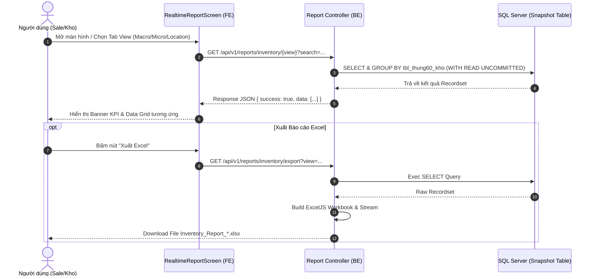
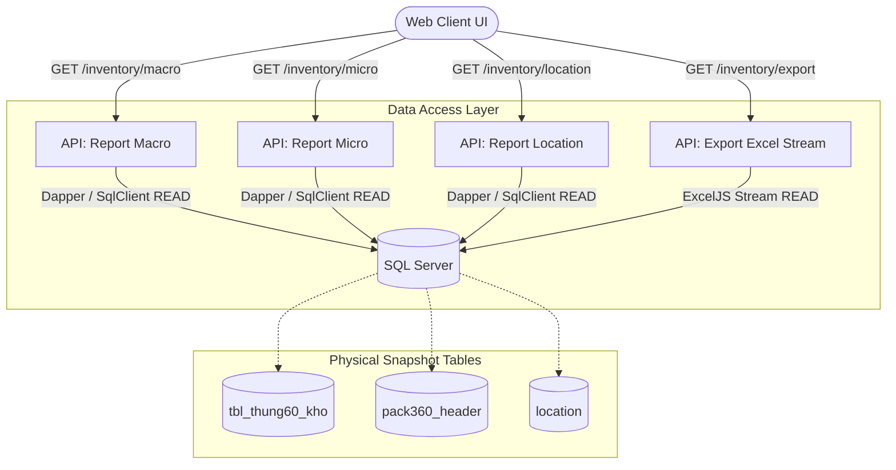
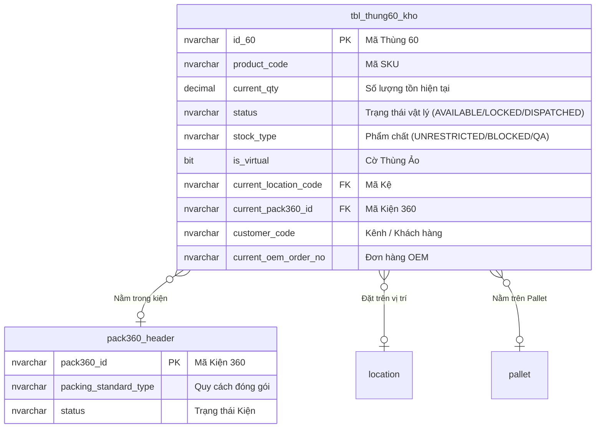

# Phân tích Thiết kế Logic UC22.1 - Báo cáo Tồn kho Tức thời (Real-time Availability)

Tài liệu này định nghĩa thiết kế hệ thống cho **UC22.1**, tập trung vào việc cung cấp **Báo cáo tồn kho theo thời gian thực (Real-time)** cho Bộ phận Sale, Quản lý Kho, và Vận hành. Khác với Báo cáo Sổ cái (Ledger), báo cáo này truy xuất trực tiếp từ Bảng Snapshot Tồn kho (`tbl_thung60_kho`) để đảm bảo tốc độ tối đa và hiển thị chính xác trạng thái vật lý hiện tại của hàng hóa.

---

## 1. Business Logic (Logic Nghiệp Vụ)

### 1.1 Mục tiêu cốt lõi
Cho phép người dùng tra cứu nhanh chóng số lượng hàng hóa đang tồn trong kho tại thời điểm hiện tại, biết được hàng đang nằm ở vị trí/kệ nào, và có đủ điều kiện khả dụng để bán hoặc xuất đi hay không.

### 1.2 Các quy tắc nghiệp vụ (Business Rules)
- `BR-UC22.1-01` **Ba Góc Nhìn Chuyên Biệt (Views):** Báo cáo cung cấp 3 chế độ hiển thị linh hoạt:
  - **Vĩ mô (Macro / SKU Level):** Tổng hợp số lượng tồn kho theo Mã sản phẩm (`product_code`), Kênh phân phối (`customer_code`), Đơn hàng (`current_oem_order_no`), Trạng thái (`status`), và Phân loại phẩm chất (`stock_type`). Tách biệt chi tiết đếm thành 3 loại: Thùng 60 rời, Kiện 360, và Thùng Ảo.
  - **Vi mô (Micro / Carton Level):** Hiển thị chi tiết từng Thùng/Kiện (`package_id`), Loại kiện (`package_type`), Mã sản phẩm (`product_code`), Số lượng (`current_qty`), Vị trí kệ (`current_location_code`), Khách hàng, Đơn hàng và Trạng thái.
  - **Theo Vị trí (Location Level):** Tổng hợp số lượng tồn kho nhóm theo mã Kệ (`current_location_code`), SKU, Khách hàng, Đơn hàng, Trạng thái và Phẩm chất.
- `BR-UC22.1-02` **Tính Khả dụng (Available Inventory):** Hàng hóa chỉ được xác nhận là Khả dụng (Có thể xuất bán) khi:
  - `status = 'AVAILABLE'` (Trạng thái vật lý sẵn sàng) **VÀ**
  - `stock_type = 'UNRESTRICTED'` (Phẩm chất không bị giới hạn / khóa).
- `BR-UC22.1-03` **Loại trừ Hàng đã xuất:** Báo cáo mặc định tự động loại trừ các thùng/kiện có `status = 'DISPATCHED'` (Đã xuất bến).
- `BR-UC22.1-04` **Tích hợp Khóa Tồn Kho (UC13):** Cho phép Quản lý kho kích hoạt Modal chuyển đổi phẩm chất / Khóa tồn kho (`StockTypeChangeModal`) trực tiếp từ màn hình Báo cáo khi phát hiện hàng lỗi hoặc cần phong tỏa.
- `BR-UC22.1-05` **Tính năng Drill-down SKU:** Khi click vào nút/mã SKU ở chế độ Vĩ mô (MACRO), giao diện tự động thiết lập bộ lọc theo `product_code` đó và chuyển sang chế độ **CHI TIẾT THÙNG (MICRO)** hoặc **VỊ TRÍ KỆ (LOCATION)** tương ứng.

### 1.3 Quy trình tương tác (Interaction Flow)
1. **Bước 1 (Actor):** Người dùng truy cập màn hình *"Báo cáo Tồn kho Tức thời (UC22.1)"*.
2. **Bước 2 (System):** Hệ thống nạp dữ liệu tồn kho mặc định ở góc nhìn **Vĩ mô (MACRO)** và hiển thị Banner KPI tổng hợp (Tổng SL tồn, Số Kiện 360, Thùng 60 rời, Thùng ảo).
3. **Bước 3 (Actor):** Người dùng bấm trực tiếp vào tên Mã SKU hoặc nút **"Thùng" / "Kệ"** trên dòng dữ liệu tổng hợp.
4. **Bước 4 (System):** Hệ thống lập tức thiết lập cờ lọc `product_code` theo mã SKU vừa chọn, tự động chuyển tab sang góc nhìn **MICRO (Chi tiết thùng)** hoặc **LOCATION (Kệ lưu trữ)** và hiển thị banner trạng thái *"Đang lọc theo SKU: [Mã SKU] [✕ Xóa lọc]"*.
5. **Bước 5 (Actor):** Người dùng bấm nút **"Xuất Excel"** để tải file `.xlsx` nạp trực tiếp từ backend stream.

---

## 2. Tiêu chuẩn Thiết kế Giao diện (UI/UX Guidelines)

- **Thiết bị đích:** Máy tính để bàn (Desktop Web) & Máy tính bảng PDA.
- **Thanh chuyển góc nhìn (Tab Navigation):**
  - Tab 1: `<BarChart2 /> TỔNG HỢP (MACRO)` - Màu xanh Navy đậm đại diện cho số liệu vĩ mô.
  - Tab 2: `<MapPin /> VỊ TRÍ (LOCATION)` - Đại diện cho sơ đồ kệ kho.
  - Tab 3: `<List /> CHI TIẾT (MICRO)` - Liệt kê mã định danh từng kiện.
- **Thanh Banner KPI (KPI Summary Banner):**
  - Box 1 (Xanh dương): `TỔNG SỐ LƯỢNG TỒN`
  - Box 2 (Xanh lá): `SỐ KIỆN 360`
  - Box 3 (Cam): `THÙNG 60 RỜI`
  - Box 4 (Tím): `THÙNG ẢO`
- **Màu sắc Trạng thái (Status Badges):**
  - `AVAILABLE` / `UNRESTRICTED`: Badge màu Xanh lá (`#dcfce7`, chữ `#15803d`).
  - `LOCKED` / `BLOCKED` / `QA`: Badge màu Đỏ (`#fee2e2`, chữ `#991b1b`).
  - `THÙNG 360`: Badge Xanh dải lụa (`#dbeafe`, chữ `#1e40af`).
- **Phản hồi Trạng thái & Lỗi:**
  - `Loading`: Spinner quay kèm thông báo *"Đang tải dữ liệu báo cáo tồn kho..."*.
  - `Forbidden (HTTP 403)`: Banner màu Vàng cảnh báo *"Không đủ quyền truy cập (Receipt.Read / Reports.Read)"* kèm Trace ID.
  - `Empty State`: Card màu Xám nhạt với Icon BarChart2 thông báo *"Không có bản ghi phù hợp"* (xác nhận dữ liệu rỗng không phải lỗi hệ thống).

---

## 3. Programming Logic (Logic Lập Trình)

### 3.1. Frontend (`RealtimeReportScreen.jsx`)
- **State chính:**
  - `view`: `'macro'` | `'micro'` | `'location'`.
  - `data`: Array chứa các bản ghi báo cáo trả về từ Backend API.
  - `loading` & `error`: Quản lý trạng thái bất đồng bộ và xử lý phân biệt lỗi 403 vs 500.
  - `search`, `productCode`, `status`, `stockType`: Bộ lọc dữ liệu.
- **Luồng xử lý:**
  - Khi `view` hoặc bộ lọc thay đổi, `fetchData()` kích hoạt gọi `reportsApi.getMacroReport`, `getMicroReport`, hoặc `getLocationReport`.
  - Hàm `handleExport` tạo URL tham số động và kích hoạt `window.open('/api/v1/reports/inventory/export?...')` để tải file Excel thực tế.

### 3.2. Backend API (`reports.js`)
- `GET /api/v1/reports/inventory/macro`: Truy vấn tổng hợp SKU, Kênh, Order, Phẩm chất và nhóm loại thùng.
- `GET /api/v1/reports/inventory/micro`: Truy vấn chi tiết theo từng `package_id` (`COALESCE(current_pack360_id, id_60)`).
- `GET /api/v1/reports/inventory/location`: Truy vấn tồn kho nhóm theo mã kệ `current_location_code`.
- `GET /api/v1/reports/inventory/export`: Sử dụng thư viện `exceljs` dựng `Workbook` và ghi dạng `stream` trả về MIME type `application/vnd.openxmlformats-officedocument.spreadsheetml.sheet`.

---

## 4. Data Logic (Thiết kế Dữ Liệu)

### 4.1. Ma trận phân quyền CRUD
Báo cáo UC22.1 là tác vụ tra cứu thời gian thực (Read-only), không làm thay đổi trạng thái tồn kho.

| Bảng Dữ Liệu | Hành động (CRUD) | Mô tả trong bối cảnh UC22.1 |
| :--- | :---: | :--- |
| `tbl_thung60_kho` | **R**ead | Bảng Snapshot chính cung cấp dữ liệu số lượng, trạng thái và vị trí hiện tại. |
| `pack360_header` | **R**ead | JOIN lấy thông tin kiện 360 (nếu thùng nằm trong kiện). |
| `location` | **R**ead | Tra cứu mã kệ và loại vị trí. |

### 4.2. Định nghĩa Trạng thái (State Definitions)
- `status = 'AVAILABLE'`: Hàng hóa vật lý sẵn sàng cho hoạt động xuất kho.
- `stock_type = 'UNRESTRICTED'`: Phẩm chất đạt tiêu chuẩn thương mại.
- `is_virtual = 1`: Cờ đánh dấu Thùng Ảo (Tự động sinh ra khi nhập lẻ hoặc tách kiện).

### 4.3. Cập nhật Sổ Cái Kép (Dual Ledger Logic)
- **Nguyên tắc:** UC22.1 chỉ thực hiện lệnh READ trên Bảng Snapshot (`tbl_thung60_kho`), **KHÔNG** phát sinh bất kỳ bản ghi hạch toán mới nào vào Sổ cái kép (`inventory_ledger`, `item_ledger`, `stock_transaction_book`).

---

## 5. Biểu Đồ Thiết Kế (Diagrams)

### 5.1. Sequence Diagram (Luồng Tương Tác & Truy Xuất Báo Cáo)

### 5.2. Cấu trúc Phân tầng Dữ liệu (Data Layer Architecture)

### 5.3. Entity Relationship & State Logic Map

