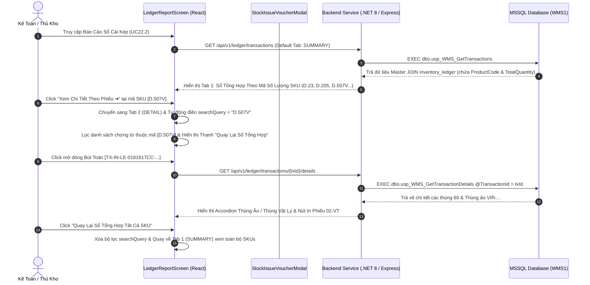
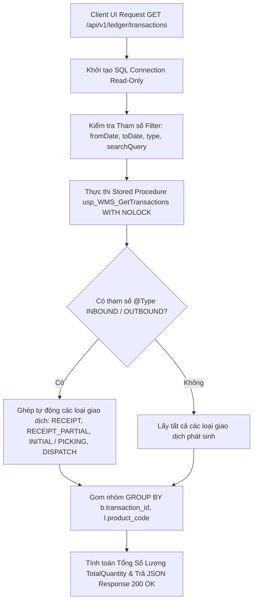
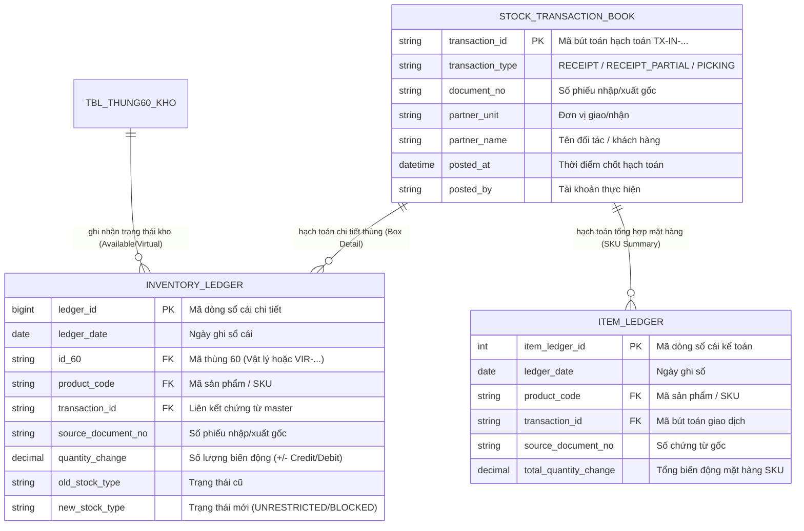

# Phân Tích & Thiết Kế Chuẩn Nghiệp Vụ UC22.2 - Báo Cáo Sổ Cái Kép (Dual Ledger Report)

---

## 1. Business Logic (Logic Nghiệp Vụ)

### 1.1. Mục Tiêu Nghiệp Vụ
- Cung cấp công cụ tra cứu, đối soát và kiểm toán toàn bộ biến động tồn kho (Nhập kho chính thức, Nhập lẻ thùng ảo, Xuất kho Picking, Tồn đầu kỳ, Đổi Stock Type, Xuất tạm) dựa trên nguyên tắc **Sổ Cái Bất Biến (Immutable Dual Ledger)**.
- **Ưu tiên Luồng Nghiệp Vụ:** Hệ thống **MẶC ĐỊNH** tổng hợp và hiển thị biến động theo từng **Mã Sản Phẩm / SKU (`item_ledger`)** trước, giúp kế toán và thủ kho nắm bắt ngay tổng số lượng Nợ/Có/Tồn ròng của từng mã hàng. Sau đó hỗ trợ **Drill-down (Khoan sâu)** xem chi tiết theo đơn vị chứng từ và thùng 60 (`inventory_ledger`).
- Cho phép tra cứu linh hoạt qua các nút lọc nhanh thời gian (Hôm nay, Hôm qua, Trong tuần này, Tất cả) và nút lọc loại giao dịch (Nhập kho, Xuất kho, Tồn đầu kỳ, Đổi loại tồn).
- Hỗ trợ xuất dữ liệu báo cáo ra file Excel/CSV chuẩn ISO và in trực tiếp **Phiếu Xuất Kho chính thức (Mẫu số 02 - VT theo Thông tư 99/2025/TT-BTC)**.

### 1.2. Các Quy Tắc Nghiệp Vụ (Business Rules)
- `BR-UC22.2-01` **Tính Bất Biến Của Sổ Cái (Immutable Ledger):** Toàn bộ dữ liệu Sổ cái Kép là **Chỉ Đọc (Read-only)**. Tuyệt đối không cho phép bất kỳ người dùng hay chương trình nào chỉnh sửa, cập nhật hoặc xóa các bản ghi hạch toán đã được chốt.
- `BR-UC22.2-02` **Ưu Tiên Sổ Tổng Hợp Mã Số Lượng SKU (SKU-First Priority):**
  - **Mặc Định (Tab 1 - `item_ledger`):** Tổng hợp biến động theo từng Mã Sản Phẩm (`product_code`), hiển thị Tổng Nhập Kho (Credit), Tổng Xuất Kho (Debit), Số Dư Tồn Ròng, và Số Lượng Chứng Từ Liên Quan.
  - **Khoan S глубо / Drill-down (Tab 2 - `inventory_ledger`):** Cho phép bấm nút *"Xem Chi Tiết Theo Phiếu ➔"* ở bất kỳ mã SKU nào để lập tức chuyển sang Tab Chi Tiết và lọc ra toàn bộ các chứng từ, số phiếu nhập/xuất và các thùng 60 liên quan đến mã SKU đó.
- `BR-UC22.2-03` **Bộ Lọc Nhanh Thời Gian & Tối Ưu Hiệu Năng (Quick Date Filters & Performance Guard):**
  - **Mặc định (Trong tuần này):** Hệ thống tự động lọc khoảng thời gian từ Thứ 2 đầu tuần đến ngày hiện tại `[Monday, Today]` nhằm ngăn chặn việc tải dữ liệu quá lớn gây treo hệ thống.
  - **Hôm nay:** Tự động điền ngày hiện tại `[Today, Today]`.
  - **Hôm qua:** Tự động điền ngày hôm qua `[Yesterday, Yesterday]`.
  - **Loại bỏ nút "Tất cả thời gian":** Nhằm đảm bảo an toàn tải trọng cho CSDL và hệ thống, không cho phép truy vấn không giới hạn thời gian (Unconstrained All-Time Load).
- `BR-UC22.2-04` **Nút Lọc Nhanh Loại Giao Dịch (Clickable Transaction Type Filter Chips):**
  - `INBOUND`: Nhập kho (bao gồm `RECEIPT` nhập nguyên thùng và `RECEIPT_PARTIAL` nhập lẻ thùng ảo).
  - `OUTBOUND`: Xuất kho (bao gồm `PICKING` và `DISPATCH`).
  - `INITIAL_BALANCE`: Hạch toán tồn kho đầu kỳ.
  - `STOCK_RECLASSIFY`: Chuyển đổi loại tồn kho (`UNRESTRICTED` $\leftrightarrow$ `BLOCKED`).
- `BR-UC22.2-05` **Phân Biệt Thùng Vật Lý & Thùng Ảo (Virtual Box Audit):** Khi xem chi tiết theo chứng từ, hệ thống gắn nhãn phân biệt rõ **`⚡ THÙNG ẢO`** (mã `VIR-...` sinh tự động từ UC04.1 Nhập lẻ) và **`📦 THÙNG VẬT LÝ`** (thùng 60 quét từ nhà máy).
- `BR-UC22.2-06` **In Phiếu Xuất Kho Mẫu 02-VT:** Hỗ trợ xem và in chứng từ xuất kho chính thức theo đúng chuẩn Mẫu 02 - VT (Ban hành theo TT 99/2025/TT-BTC) kèm chữ ký 5 bên (Người lập phiếu, Người nhận hàng, Thủ kho, Kế toán trưởng, Giám đốc) và con dấu Bảo vệ.

---

## 2. UI/UX Guidelines (Hướng Dẫn Giao Diện)

### 2.1. Bố Cục Màn Hình (Screen Layout)
- **Top Header Banner:** Gradient Dark Slate/Indigo, Tiêu đề báo cáo, Nút `[ 🔄 Tải Lại ]` và Nút `[ 📥 Xuất File Excel / CSV ]`.
- **Thẻ Thống Kê Chỉ Số Dashboard (KPI Overview Cards):**
  1. 🏷️ **Mặt Hàng Phát Sinh (SKU):** Đếm tổng số mã sản phẩm phát sinh giao dịch trong kỳ.
  2. 🟢 **Tổng Nhập Kho (Credit):** Tổng số lượng sản phẩm nhập vào kho (màu Xanh Emerald).
  3. 🔴 **Tổng Xuất Kho (Debit):** Tổng số lượng sản phẩm xuất khỏi kho (màu Đỏ).
  4. 🔵 **Số Dư Tồn Ròng Sổ Cái:** Số dư ròng tồn kho hiện tại (Credit - Debit).
- **Thanh Chuyển Tab Ưu Tiên (Priority Navigation Tabs):**
  - `[ 🌟 1. Sổ Tổng Hợp Theo Mã Số Lượng SKU (item_ledger) ]` *(MẶC ĐỊNH)*
  - `[ 📦 2. Sổ Chi Tiết Theo Đơn Vị Phiếu/Thùng (inventory_ledger) ]`
- **Thanh Nút Bấm Lọc Nhanh Thời Gian (Quick Date Filter Chips Bar):** Nút bấm `[ 📅 Hôm Nay ]`, `[ ⏪ Hôm Qua ]`, `[ 📆 Trong Tuần Này ]` *(Bỏ nút Tất cả thời gian để tránh quá tải CSDL)*.
- **Thanh Nút Bấm Loại Giao Dịch (Transaction Type Filter Chips Bar):** Nút bấm `[ 🌐 Tất Cả ]`, `[ 🟢 Nhập Kho (INBOUND) ]`, `[ 🔴 Xuất Kho (OUTBOUND) ]`, `[ 🔵 Tồn Đầu Kỳ ]`, `[ 🟡 Đổi Loại Tồn ]`.
- **Thanh Thông Báo Quay Lại (Navigation Return Bar):** Khi đang ở Tab Chi Tiết hoặc đang lọc mã SKU, hiển thị thanh màu xanh dương kèm nút `[ ⬅️ Quay Lại Sổ Tổng Hợp Tất Cả SKU ]` giúp người dùng hủy lọc và quay về danh sách tổng quan chỉ bằng 1 click.
- **Bảng Dữ Liệu Sticky Header:** Tiêu đề bảng cố định khi cuộn, Accordion dòng chi tiết có nhãn phân biệt Thùng Ảo / Thùng Thật.

---

## 3. Programming Logic (Logic Lập Trình)

### 3.1. Architecture Model (Thin-Backend Fat-Database)
Toàn bộ logic truy vấn, gom nhóm dữ liệu và tối ưu hiệu năng được thực hiện trực tiếp trong Stored Procedure SQL Server. Backend .NET 8 / Express đóng vai trò API Gateway truyền nhận tham số và định dạng JSON.

### 3.2. Stored Procedure SQL Server Master (`usp_WMS_GetTransactions`)

```sql
CREATE OR ALTER PROCEDURE dbo.usp_WMS_GetTransactions
    @Type NVARCHAR(50) = NULL,
    @FromDate DATE = NULL,
    @ToDate DATE = NULL
AS
BEGIN
    SET NOCOUNT ON;

    SELECT 
        b.transaction_id AS TransactionId,
        b.transaction_type AS TransactionType,
        b.document_no AS DocumentNo,
        b.partner_unit AS PartnerUnit,
        b.partner_name AS PartnerName,
        b.posted_by AS PostedBy,
        b.posted_at AS PostedAt,
        ISNULL(l.product_code, N'KHÔNG XÁC ĐỊNH') AS ProductCode,
        ISNULL(SUM(l.quantity_change), 0) AS TotalQuantity
    FROM dbo.stock_transaction_book b
    LEFT JOIN dbo.inventory_ledger l ON b.transaction_id = l.transaction_id
    WHERE 
        (@Type IS NULL OR @Type = '' 
         OR (@Type = 'INBOUND' AND b.transaction_type IN ('RECEIPT', 'RECEIPT_PARTIAL', 'INITIAL_BALANCE'))
         OR (@Type = 'OUTBOUND' AND b.transaction_type IN ('PICKING', 'DISPATCH'))
         OR b.transaction_type = @Type)
        AND (@FromDate IS NULL OR CAST(b.posted_at AS DATE) >= @FromDate)
        AND (@ToDate IS NULL OR CAST(b.posted_at AS DATE) <= @ToDate)
    GROUP BY 
        b.transaction_id, b.transaction_type, b.document_no, b.partner_unit, b.partner_name, b.posted_by, b.posted_at, l.product_code
    ORDER BY b.posted_at DESC;
END;
GO
```

### 3.3. Stored Procedure SQL Server Details (`usp_WMS_GetTransactionDetails`)

```sql
CREATE OR ALTER PROCEDURE dbo.usp_WMS_GetTransactionDetails
    @TransactionId NVARCHAR(50)
AS
BEGIN
    SET NOCOUNT ON;

    SELECT 
        ledger_id AS LedgerId,
        ledger_date AS LedgerDate,
        id_60 AS Id60,
        product_code AS ProductCode,
        transaction_id AS TransactionId,
        source_document_no AS SourceDocumentNo,
        quantity_change AS QuantityChange,
        old_stock_type AS OldStockType,
        new_stock_type AS NewStockType,
        created_at AS CreatedAt
    FROM dbo.inventory_ledger
    WHERE transaction_id = @TransactionId
    ORDER BY created_at ASC;
END;
GO
```

### 3.4. Backend Controller C# .NET 8 (`LedgerController.cs`)
- **File:** `src/Wms.Api/Controllers/LedgerController.cs`
- **Route:** `GET /api/v1/ledger/transactions` và `GET /api/v1/ledger/transactions/{transactionId}/details`
- Thực thi Stored Procedure qua `IStoredProcedureExecutor` và trả về cấu trúc `ApiResponse<T>`.

### 3.5. Frontend React Component (`LedgerReportScreen.jsx`)
- **File:** `frontend/src/components/LedgerReportScreen.jsx`
- Sử dụng `useMemo` tính toán danh sách gom nhóm theo Mã SKU (`skuSummaryList`) cho Tab 1.
- Tích hợp hàm `drillDownToDocumentDetail(productCode)` chuyển sang Tab 2 và lọc theo mã SKU.
- Tích hợp hàm `returnToSummaryTab()` xóa tìm kiếm và quay lại Tab 1.

---

## 4. Data Logic (Logic Dữ Liệu)

### 4.1. Ma Trận Phân Quyền CRUD

| Bảng Dữ Liệu | Create (C) | Read (R) | Update (U) | Delete (D) | Ý Nghĩa Trong UC22.2 |
| :--- | :---: | :---: | :---: | :---: | :--- |
| `stock_transaction_book` | | **X** | | | Truy vấn danh sách chứng từ hạch toán Master |
| `inventory_ledger` | | **X** | | | Truy vấn Sổ cái chi tiết theo Thùng 60 & SKU |
| `item_ledger` | | **X** | | | Truy vấn Sổ cái tổng hợp theo SKU mặt hàng |
| `tbl_thung60_kho` | | **X** | | | Kiểm tra loại thùng (Vật lý / Virtual Box) |

### 4.2. Nguyên Lý Sổ Cái Kép (Dual Ledger Principle)

```
                         +-----------------------------------+
                         |     STOCK_TRANSACTION_BOOK        |
                         | (Chứng Từ Giao Dịch Master Header)|
                         +-----------------+-----------------+
                                           |
                    +----------------------+----------------------+
                    | 1-N                                         | 1-N
                    v                                             v
     +-------------------------------+             +-------------------------------+
     |       INVENTORY_LEDGER        |             |          ITEM_LEDGER          |
     | (Sổ Chi Tiết Thùng 60 & SKU)  |             | (Sổ Tổng Hợp Sản Phẩm SKU)    |
     +-------------------------------+             +-------------------------------+
     | - ledger_id                   |             | - item_ledger_id              |
     | - id_60 (VIR-... / Physical)  |             | - product_code                |
     | - product_code                |             | - total_quantity_change (+/-) |
     | - transaction_id              |             | - transaction_id              |
     | - source_document_no          |             | - source_document_no          |
     | - quantity_change (+/-)       |             +-------------------------------+
     | - old_stock_type / new_type   |
     +-------------------------------+
```

---

## 5. Diagrams (Biểu Đồ Nghiệp Vụ)

### 5.1. Sequence Diagram (Luồng Tra Cứu Sổ Cái Ưu Tiên SKU & Drill-Down Chi Tiết)



### 5.2. Data Layer Architecture (SQL Read-Only Query & Fail-Fast Locking Protection)



### 5.3. Entity Relationship Diagram (ERD UC22.2 Dual Ledger)


