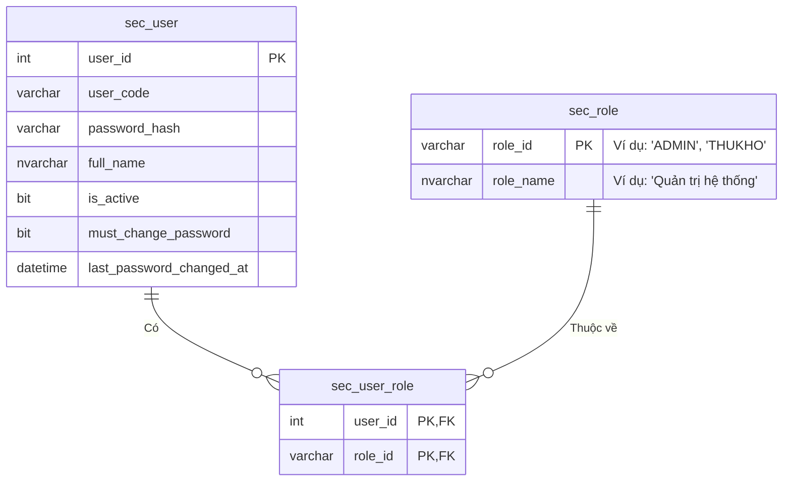
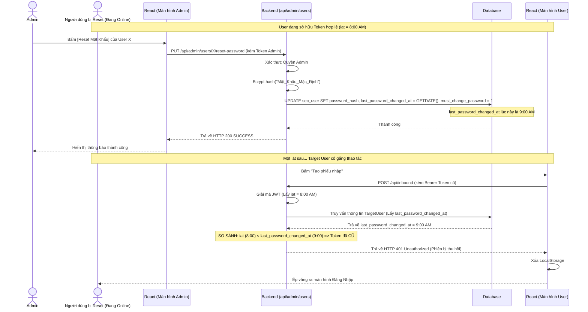
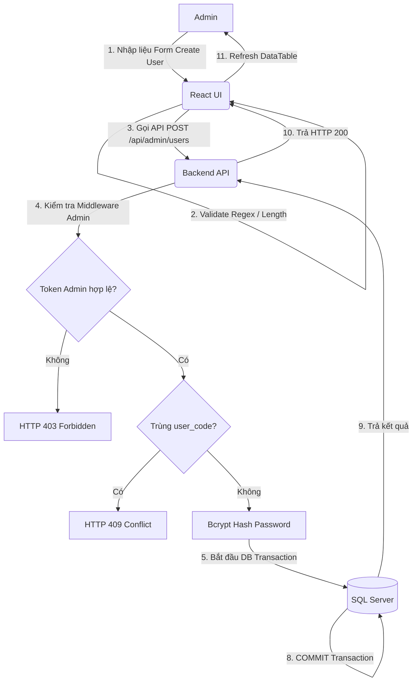

# Phân tích Thiết kế Logic UC23 - Quản trị người dùng

Tài liệu này đi sâu vào phân tích hệ thống ở 3 khía cạnh: Business Logic (Nghiệp vụ), Programming Logic (Lập trình), và Data Logic (Dữ liệu) dành cho nhóm chức năng **Quản trị người dùng (UC23)** của Hệ thống kho thành phẩm WMS (phiên bản 5.0). 

Module này bao gồm 4 chức năng chính:
- **UC23.1 - Tạo tài khoản**
- **UC23.2 - Khóa / mở khóa tài khoản**
- **UC23.3 - Reset mật khẩu**
- **UC23.4 - Gán role / quyền**

---

## 1. Business Logic (Logic Nghiệp Vụ)
Phân hệ quản trị người dùng đóng vai trò nòng cốt trong việc đảm bảo an ninh hệ thống và phân chia trách nhiệm nhân sự.

Các quy tắc nghiệp vụ (Business Rules):

### 1.1. UC23.1 - Tạo tài khoản (Create Account)
- `BR-UC23-01` **Quyền hạn (Authorization):** Chỉ những người dùng thuộc nhóm quyền Quản trị (Admin) mới có chức năng tạo tài khoản mới.
- `BR-UC23-02` **Tính duy nhất (Uniqueness):** `username` (Tên đăng nhập) là duy nhất toàn hệ thống, không phân biệt hoa thường.
- `BR-UC23-03` **Mật khẩu khởi tạo (Initial Password):** Khi tạo mới, tài khoản sẽ được cấp một mật khẩu mặc định (có thể cấu hình). Đồng thời hệ thống BẮT BUỘC bật cờ yêu cầu đổi mật khẩu ở lần đăng nhập đầu tiên (`must_change_password = true`) nhằm đảm bảo tính bảo mật (Zero-trust).
- `BR-UC23-04` **Trạng thái ban đầu:** Mặc định tài khoản vừa tạo sẽ ở trạng thái Hoạt động (`is_active = 1`).

### 1.2. UC23.2 - Khóa / mở khóa tài khoản (Toggle Account Status)
- `BR-UC23-05` **Quy tắc cô lập (Self-protection):** Một Quản trị viên (Admin) không được phép tự khóa tài khoản của chính mình để tránh tình trạng hệ thống không còn admin nào (Lockout-out scenario).
- `BR-UC23-06` **Độc lập trạng thái:** Việc khóa vĩnh viễn (Khóa thủ công bằng cách set `is_active = 0`) hoàn toàn độc lập với cơ chế khóa tạm thời (Khóa tự động do nhập sai mật khẩu 5 lần ở UC01).
- `BR-UC23-07` **Thu hồi phiên (Session Revocation):** Ngay khi một tài khoản bị khóa (`is_active = 0`), mọi Token (phiên làm việc) đang tồn tại của người dùng đó sẽ tự động bị từ chối ở mọi API nghiệp vụ.

### 1.3. UC23.3 - Reset mật khẩu (Reset Password)
- `BR-UC23-08` **Bắt buộc đổi mật khẩu (Force Password Change):** Giống như khi tạo mới, sau khi Admin reset mật khẩu, cờ `must_change_password` sẽ tự động được bật thành `true`.
- `BR-UC23-09` **Force Logout (Thu hồi toàn bộ Token):** Hành động reset mật khẩu sẽ lập tức cập nhật mốc thời gian `last_password_changed_at = GETDATE()`. Điều này kích hoạt cơ chế tự vệ của Backend: Hủy bỏ hiệu lực của toàn bộ JWT token đã phát hành trước đó, ép người dùng bị reset phải đăng nhập lại ngay lập tức.
- `BR-UC23-10` **Reset rào cản (Clear Barriers):** Khi reset mật khẩu, hệ thống sẽ tự động xóa bỏ các trạng thái lỗi trước đó (Cập nhật `failed_attempts = 0` và `lockout_until = NULL`).

### 1.4. UC23.4 - Gán role / quyền (Assign Roles)
- `BR-UC23-11` **Cơ chế phân quyền (RBAC - Role Based Access Control):** Hệ thống áp dụng mô hình phân quyền theo vai trò. Một người dùng có thể đồng thời nắm giữ nhiều Role (Ví dụ: Vừa là Thủ Kho, Vừa là NV KCS).
- `BR-UC23-12` **Cập nhật tức thời:** Mặc dù Roles được mã hóa bên trong chuỗi JWT Token lúc đăng nhập, nhưng hệ thống vẫn kiểm tra quyền real-time (tùy vào độ nhạy cảm của API) bằng cách join trực tiếp trong Database thay vì hoàn toàn tin tưởng Token.

---

## 2. Programming Logic (Logic Lập Trình)

### 2.1. Frontend (React)
- **Giao diện quản lý (User Management Dashboard):** 
  - Sử dụng DataTable hiển thị danh sách người dùng kèm bộ lọc (Filter) theo trạng thái (Active/Locked), Role, và thanh tìm kiếm theo Tên Đăng Nhập/Họ tên.
- **Xử lý UC23.1 (Tạo mới):** Form nhập liệu với Validation (Regex kiểm tra độ dài username, không chứa ký tự đặc biệt). Gọi `POST /api/admin/users`.
- **Xử lý UC23.2 (Khóa/Mở Khóa):** Sử dụng nút Toggle/Switch trên từng hàng của DataTable. Khi click, gọi `PUT /api/admin/users/:id/status`. Hiển thị hộp thoại xác nhận (Confirm Dialog) trước khi thực hiện.
- **Xử lý UC23.3 (Reset Password):** Gọi `PUT /api/admin/users/:id/reset-password`. Nếu thành công, hiển thị Alert thông báo mật khẩu mặc định mới để Admin gửi cho User.
- **Xử lý UC23.4 (Gán Role):** Sử dụng Multi-select Dropdown (hoặc Checkbox Group) trong form chỉnh sửa User. Gọi `PUT /api/admin/users/:id/roles`.

### 2.2. Backend (ASP.NET Core C#)
- **Middleware `requireAdmin`:** Tất cả các endpoints trong bộ UC23 đều phải đi qua Middleware xác thực xem tài khoản thực hiện request có chứa Role `ADMIN` hay không (Trích xuất từ JWT).
- **API `POST /api/admin/users` (Tạo mới):** 
  - Dùng `bcrypt.hash` để mã hóa mật khẩu mặc định (SaltRounds = 10).
  - Sử dụng SQL Transaction để đảm bảo tính toàn vẹn: Vừa tạo bảng `sec_user`, vừa map quyền vào bảng `sec_user_role`.
- **API `PUT /api/admin/users/:id/status` (Khóa/Mở Khóa):**
  - Chặn request nếu `:id` truyền lên trùng với `req.user.user_id` (Không cho tự khóa mình).
- **API `PUT /api/admin/users/:id/reset-password`:**
  - Hash mật khẩu mặc định mới bằng bcrypt.
  - Cập nhật `must_change_password = 1`, `last_password_changed_at = GETDATE()`, `failed_attempts = 0`, `lockout_until = NULL`.
- **API `PUT /api/admin/users/:id/roles` (Gán quyền):**
  - Thực thi trong Transaction: `DELETE` toàn bộ quyền cũ của `user_id` trong `sec_user_role`, sau đó dùng vòng lặp (hoặc Bulk Insert) để `INSERT` danh sách quyền mới.

---

## 3. Data Logic (Logic Dữ Liệu)

Bộ tính năng này tương tác trực tiếp lên cơ sở dữ liệu SQL Server, xoay quanh hạt nhân là bảng `sec_user` và mô hình quan hệ N-N với bảng `sec_role`. Cấu trúc tuân thủ chuẩn naming convention: tiền tố `sec_` cho các bảng bảo mật và cột dùng định dạng `snake_case`.

### 3.1. Các bảng liên quan
- **`sec_user`**: Bảng dữ liệu người dùng chứa thông tin bảo mật và định danh.
- **`sec_role`**: Bảng từ điển định nghĩa các vai trò có trong hệ thống (VD: ADMIN, THUKHO, KCS, NHANVIEN).
- **`sec_user_role`**: Bảng cầu nối (Mapping table) giải quyết quan hệ N-N giữa Users và Roles (Lưu trữ cặp `user_id` và `role_id`).

### 3.2. Cấu trúc câu lệnh SQL (SP & T-SQL)

- **Đọc danh sách User (Read):**
  Sử dụng kỹ thuật `STRING_AGG` để gom nhóm các role của một User vào chung một cột.
  ```sql
  SELECT u.user_id, u.username, u.full_name, u.is_active,
         STRING_AGG(ur.role_id, ', ') AS roles
  FROM sec_user u
  LEFT JOIN sec_user_role ur ON u.user_id = ur.user_id
  GROUP BY u.user_id, u.username, u.full_name, u.is_active
  ```

- **UC23.1 - Thêm mới (Transaction Insert):**
  ```sql
  BEGIN TRAN
      INSERT INTO sec_user (username, password_hash, full_name, must_change_password, is_active, created_at)
      VALUES (@UserCode, @Hash, @FullName, 1, 1, GETDATE());
      
      DECLARE @NewUserID INT = SCOPE_IDENTITY();
      
      -- Insert mảng Roles
      INSERT INTO sec_user_role (user_id, role_id)
      SELECT @NewUserID, role_id FROM @RoleTable; -- @RoleTable là một Table-Valued Parameter
  COMMIT TRAN
  ```

- **UC23.2 - Khóa / Mở Khóa (Update):**
  ```sql
  UPDATE sec_user 
  SET is_active = @NewStatus 
  WHERE user_id = @TargetUserID AND user_id != @AdminUserID; -- Chống tự khóa chính mình
  ```

- **UC23.3 - Reset Mật Khẩu (Update):**
  ```sql
  UPDATE sec_user 
  SET password_hash = @NewHash,
      must_change_password = 1,
      last_password_changed_at = GETDATE(),
      failed_attempts = 0,
      lockout_until = NULL
  WHERE user_id = @TargetUserID;
  ```

- **UC23.4 - Cập nhật Roles (Transaction Delete & Insert):**
  ```sql
  BEGIN TRAN
      -- Xóa trắng role cũ
      DELETE FROM sec_user_role WHERE user_id = @TargetUserID;
      
      -- Thêm role mới
      INSERT INTO sec_user_role (user_id, role_id)
      SELECT @TargetUserID, role_id FROM @RoleTable;
  COMMIT TRAN
  ```

### 3.3. Ma trận Phân quyền & CRUD (CRUD Matrix)
Bảng dưới đây mô tả quyền hạn tác động dữ liệu (Create, Read, Update, Delete) của các Roles trên hệ thống trong phạm vi UC23.

| Bảng (Table) | Admin (Quản trị viên) | User (Người dùng) | System (Hệ thống) |
| :--- | :---: | :---: | :---: |
| `sec_user` | C / R / U | None | R / U |
| `sec_role` | R | None | R |
| `sec_user_role` | C / R / U / D | None | R |

*(Ghi chú: C = Create, R = Read, U = Update, D = Delete. `sec_user_role` được Delete & Insert lại khi Admin cập nhật Roles).*

---

## 4. Biểu Đồ Thiết Kế (Diagrams)

### 4.1. Sơ đồ thực thể ERD liên quan User-Role
Sơ đồ mô phỏng kiến trúc dữ liệu phân quyền RBAC tiêu chuẩn.



### 4.2. Sequence Diagram: Luồng Reset Mật Khẩu & Revoke Token (UC23.3)
Biểu đồ tuần tự mô tả điều kiện bảo mật khi Admin thực hiện Reset mật khẩu của một User đang online.



### 4.3. Data Flow Diagram: Luồng Tạo Tài Khoản (UC23.1 & UC23.4)


