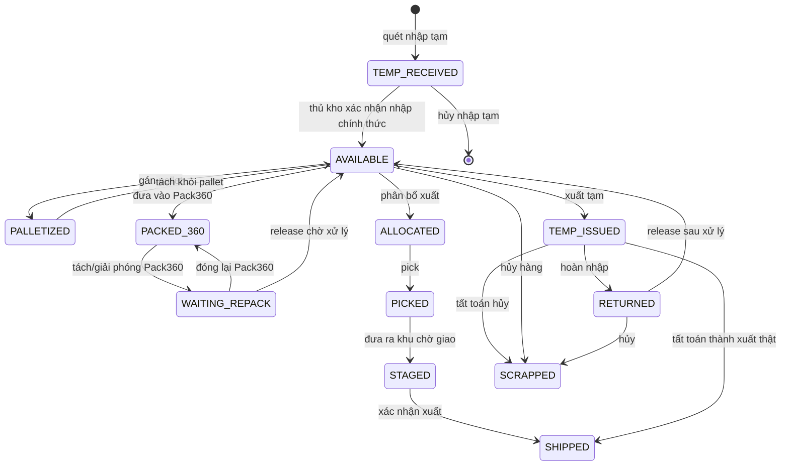
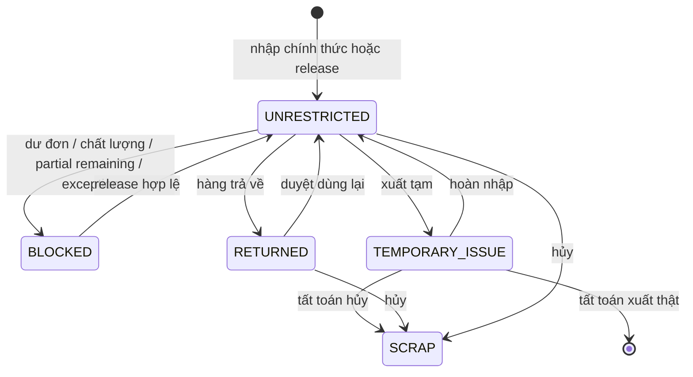
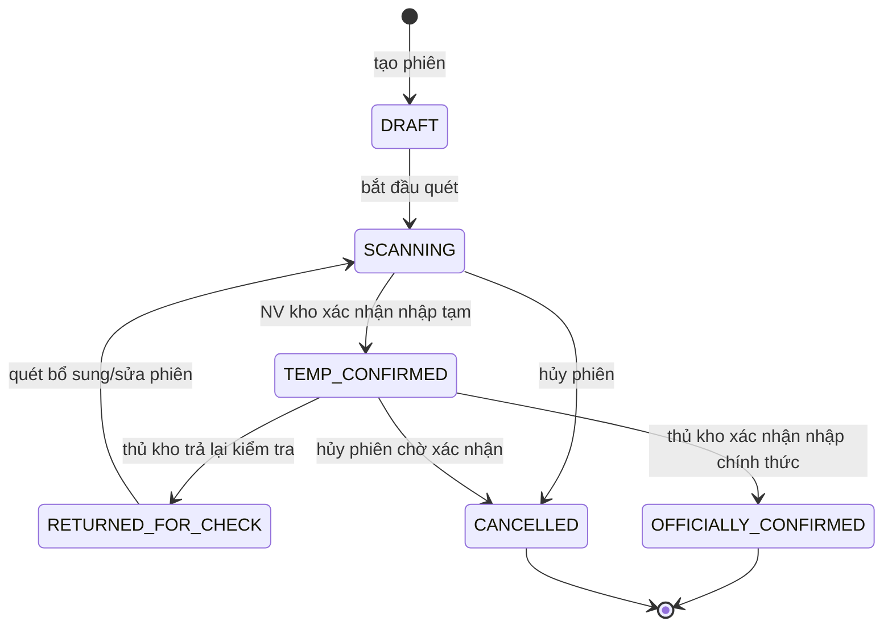
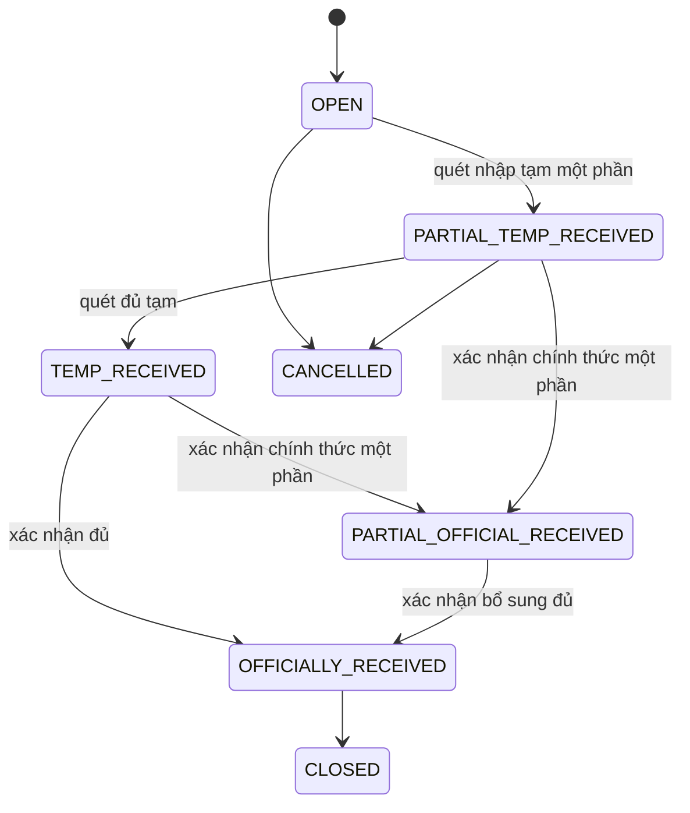
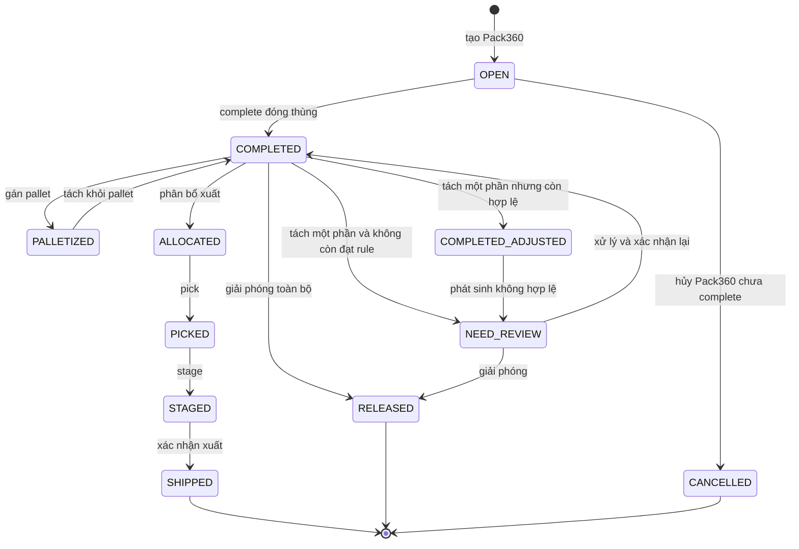
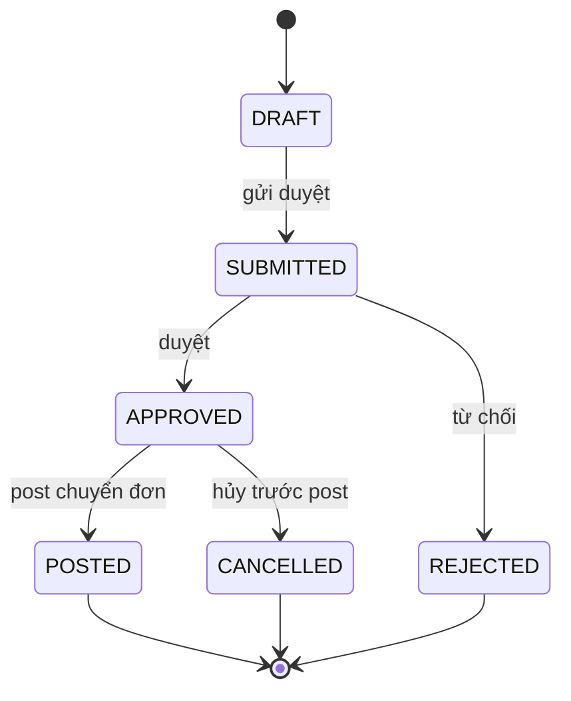
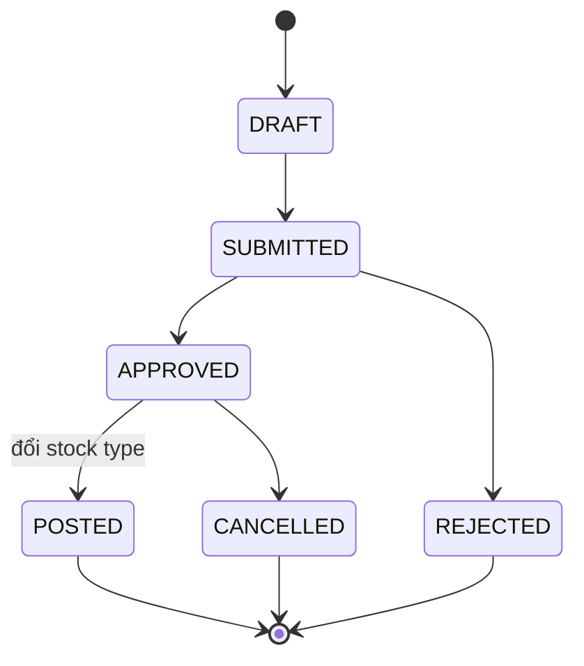
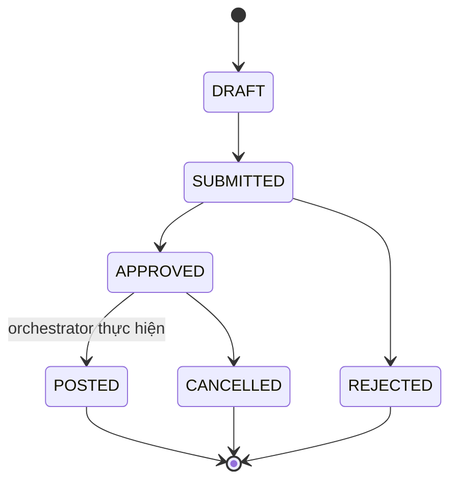
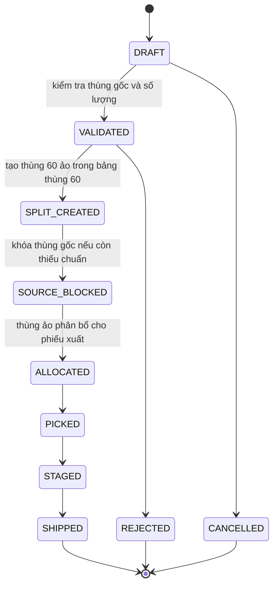
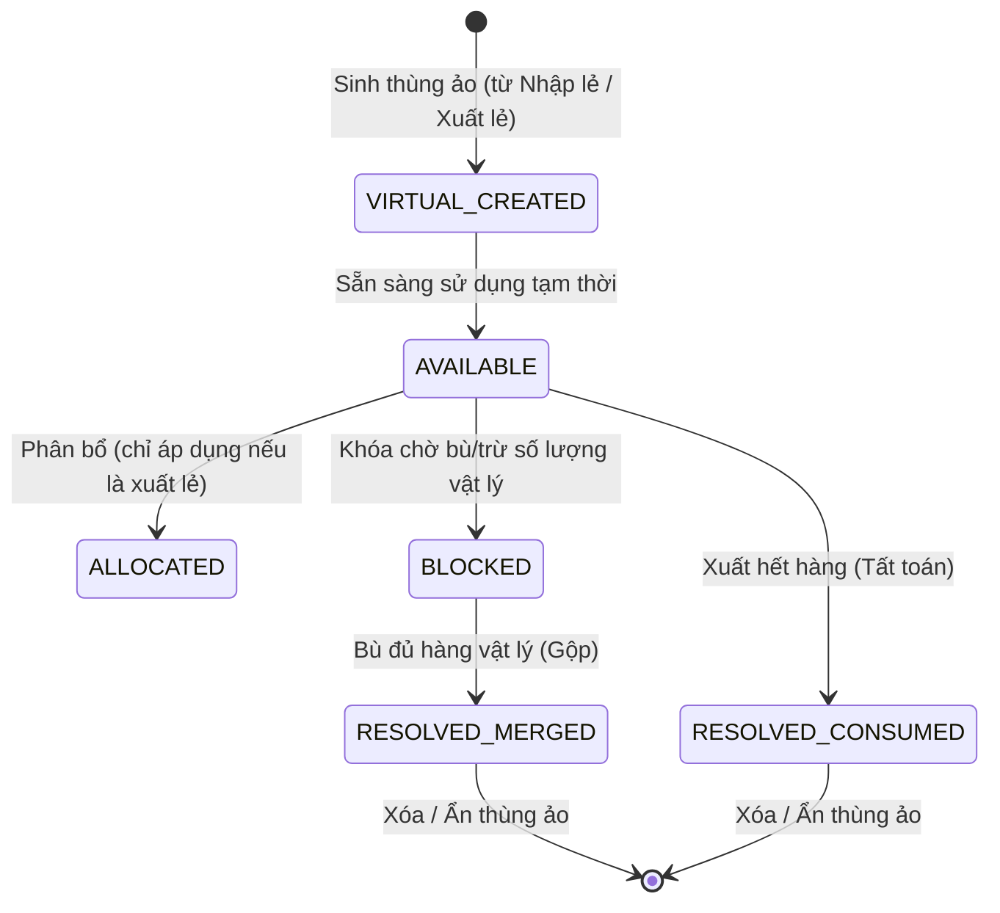

# State Models - Kho thành phẩm sản xuất

## 1. Mục đích

Tài liệu mô tả mô hình trạng thái cho các đối tượng nghiệp vụ chính trong WMS kho thành phẩm.

## 2. State model - Thùng 60

### Ghi chú

- `stock_type` là phân loại tồn, không phải status. Một thùng có thể `status = AVAILABLE` nhưng `stock_type = BLOCKED`, khi đó không được xuất.
- Thùng 60 ảo sinh ra từ xuất lẻ vẫn đi theo state model này, nhưng có `is_virtual = 1`.
- `SHIPPED` và `SCRAPPED` là trạng thái cuối; nếu sai phải xử lý bằng reversal/adjustment.

## 3. State model - Stock type của thùng 60

### Block reason

| Stock type | Reason |
|---|---|
| `BLOCKED` | `OEM_SURPLUS` |
| `BLOCKED` | `QUALITY_ISSUE` |
| `BLOCKED` | `PARTIAL_REMAINING` |
| `BLOCKED` | `PACK360_NEED_REVIEW` |
| `BLOCKED` | `DATA_EXCEPTION` |
| `BLOCKED` | `WAITING_DECISION` |

## 4. State model - Phiên nhập tạm

## 5. State model - Dòng phiếu giao kho sản xuất

## 6. State model - Pack360

## 7. State model - Yêu cầu chuyển đơn OEM

## 8. State model - Yêu cầu chuyển stock type

## 9. State model - Yêu cầu giải phóng/tách/đóng lại Pack360

## 10. State model - Yêu cầu xuất lẻ

## 11. State model - Thùng 60 Ảo (Virtual Box)

### Ràng buộc nghiệp vụ (Business Rules)
- **Thùng ảo sinh ra từ Nhập lẻ (UC04.1)**: Đại diện cho số lượng trên chứng từ nhưng thực tế kho chưa nhận được. Trạng thái kế toán (`stock_type`) mặc định là `UNRESTRICTED` nhưng **tuyệt đối không được phép** đưa vào đóng kiện Pack360 (UC05) cho đến khi bù đủ hàng thực tế.
- **Thùng ảo sinh ra từ Xuất lẻ (UC15/UC10)**: Đại diện cho phần hàng được tách ra từ một Thùng vật lý gốc để đi xuất. Thùng gốc sẽ bị khóa một phần (`BLOCKED - PARTIAL_REMAINING`). Thùng ảo này sẽ luân chuyển qua các bước `ALLOCATED -> PICKED -> STAGED -> SHIPPED` bình thường.
