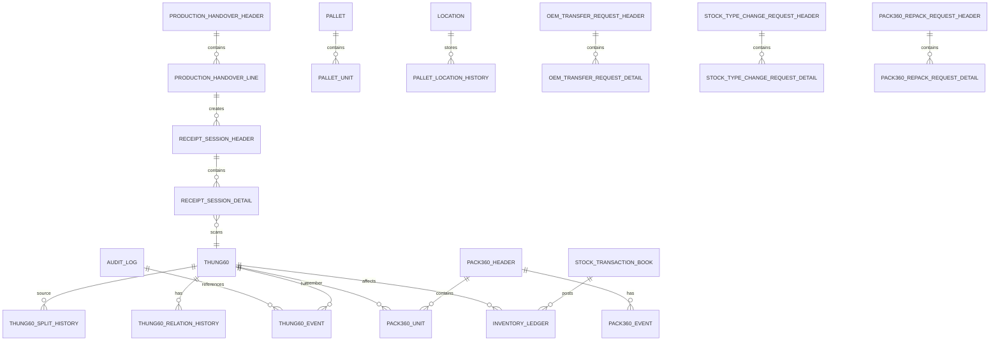

# Conceptual Data Model - Kho thành phẩm sản xuất

## 1. Mục đích

Tài liệu mô tả mô hình dữ liệu khái niệm cho WMS kho thành phẩm. Đối tượng trung tâm là **thùng 60**, bao gồm cả thùng vật lý và thùng 60 ảo sinh ra từ nghiệp vụ xuất lẻ.

## 2. Nguyên tắc thiết kế dữ liệu

| Nguyên tắc | Mô tả |
|---|---|
| Thùng 60 là đơn vị quản lý trung tâm | Mọi vòng đời nhập, pallet, Pack360, xuất, split, block đều truy vết theo thùng 60. |
| Thùng 60 ảo không có bảng riêng | Thùng ảo là bản ghi trong bảng thùng 60 hiện có, đánh dấu `is_virtual = 1`. |
| Current state + Event history | Bảng current cho trạng thái hiện tại; bảng event cho lịch sử thay đổi. |
| Status tách khỏi stock type | Status mô tả bước vận hành; stock type quyết định quyền sử dụng tồn. |
| Ledger không sửa/xóa | Biến động tồn chính thức ghi vào ledger; sai phải reversal/adjustment. |
| Relation có lịch sử | Pack360, pallet, location, parent/child thùng 60 phải có lịch sử hiệu lực. |
| Request trước khi post | Các nghiệp vụ nhạy cảm như chuyển OEM, đổi stock type, tách Pack360, xuất lẻ nên có request/document. |
| Idempotency | Command có `request_id` để chống gửi lặp. |

## 3. Nhóm dữ liệu chính



## 4. Đối tượng dữ liệu khái niệm

### 4.1. Data sản xuất và nhập kho

| Đối tượng | Ý nghĩa |
|---|---|
| `production_handover_header` | Phiếu giao kho từ data sản xuất. |
| `production_handover_line` | Dòng chi tiết phiếu giao kho, chứa mã hàng, số lượng giao, OEM/PO/pack rule nếu có. |
| `receipt_session_header` | Phiên nhập tạm theo một dòng phiếu giao kho. |
| `receipt_session_detail` | Danh sách thùng 60 đã quét trong phiên nhập tạm. |

### 4.2. Thùng 60

| Đối tượng | Ý nghĩa |
|---|---|
| `tbl_thung60_kho` / `thung60` | Current state của thùng 60. Bao gồm thùng vật lý và thùng ảo. |
| `thung60_event` | Sự kiện làm thay đổi trạng thái, stock type, vị trí, Pack360, OEM/PO hoặc dữ liệu thùng. |
| `thung60_split_history` | Lịch sử xuất lẻ/tách số lượng từ thùng 60 gốc để tạo thùng 60 ảo. |
| `thung60_relation_history` | Lịch sử quan hệ cha-con, ví dụ thùng ảo sinh từ thùng gốc. |

### 4.3. Pack360

| Đối tượng | Ý nghĩa |
|---|---|
| `pack360_header` | Header của Pack360. |
| `pack360_unit` | Danh sách thùng 60 bên trong Pack360 hiện tại. |
| `pack360_unit_history` | Lịch sử thùng 60 từng thuộc Pack360 nào. |
| `pack360_event` | Event Pack360: tạo, complete, giải phóng, tách, need review, shipped. |
| `pack360_repack_request_header/detail` | Request giải phóng/tách/đóng lại Pack360. |

### 4.4. Pallet và vị trí

| Đối tượng | Ý nghĩa |
|---|---|
| `pallet` | Đơn vị chứa/lưu chuyển. |
| `pallet_unit` | Quan hệ hiện tại giữa pallet và thùng 60/Pack360. |
| `location` | Vị trí/kệ/bin trong kho. |
| `pallet_location_history` | Lịch sử pallet nằm ở vị trí nào. |

### 4.5. Quản trị tồn trong kho

| Đối tượng | Ý nghĩa |
|---|---|
| `oem_transfer_request_header/detail` | Chứng từ chuyển đơn OEM/PO. |
| `stock_type_change_request_header/detail` | Chứng từ đổi stock type, block hoặc release tồn. |
| `stock_transaction_book` | Sổ nghiệp vụ kho: nhập, xuất, xuất tạm, hoàn nhập, điều chỉnh, split, reclassification. |
| `inventory_ledger` | Sổ cái tồn kho ghi tăng/giảm/reclassification. |
| `audit_log` | Nhật ký thao tác quan trọng. |

## 5. Mô hình thùng 60 vật lý và thùng 60 ảo

Tất cả thùng 60 đều nằm trong cùng bảng `tbl_thung60_kho`.

| Loại thùng | Cách nhận diện | Ví dụ |
|---|---|---|
| Thùng vật lý | `is_virtual = 0`, `unit_origin_type = PHYSICAL` | `60A` |
| Thùng ảo sinh từ xuất lẻ | `is_virtual = 1`, `unit_origin_type = SPLIT_VIRTUAL` | `60A-SPLIT-001` |

Ví dụ nghiệp vụ:

```text
Thùng gốc 60A: current_qty = 60
Xuất lẻ 3 cây
Sinh bản ghi 60A-SPLIT-001: current_qty = 3, is_virtual = 1, parent_id_60 = 60A, root_id_60 = 60A
Cập nhật 60A: current_qty = 57, stock_type = BLOCKED, block_reason_code = PARTIAL_REMAINING
```

## 6. Luồng dữ liệu chính

### 6.1. Nhập kho

```text
production_handover_line
→ receipt_session_header/detail
→ tbl_thung60_kho
→ thung60_event
→ stock_transaction_book
→ inventory_ledger
→ audit_log
```

### 6.2. Đóng Pack360

```text
tbl_thung60_kho
→ pack360_header
→ pack360_unit
→ pack360_unit_history
→ pack360_event
→ thung60_event
→ audit_log
```

### 6.3. Chuyển OEM

```text
oem_transfer_request_header/detail
→ tbl_thung60_kho cập nhật current_oem_order_no/current_po_no/current_pack_rule_code
→ thung60_event
→ inventory_ledger reclassification nếu cần
→ audit_log
```

### 6.4. Chuyển stock type / block / release

```text
stock_type_change_request_header/detail
→ tbl_thung60_kho cập nhật stock_type/block_reason_code
→ thung60_event
→ inventory_ledger reclassification nếu cần
→ audit_log
```

### 6.5. Xuất lẻ

```text
issue line
→ chọn thùng 60 gốc
→ tạo bản ghi thùng 60 mới trong tbl_thung60_kho với is_virtual = 1
→ cập nhật thùng gốc còn lại và BLOCKED nếu thiếu chuẩn
→ thung60_split_history
→ thung60_event
→ stock_transaction_book / inventory_ledger theo cấu hình
→ audit_log
```
