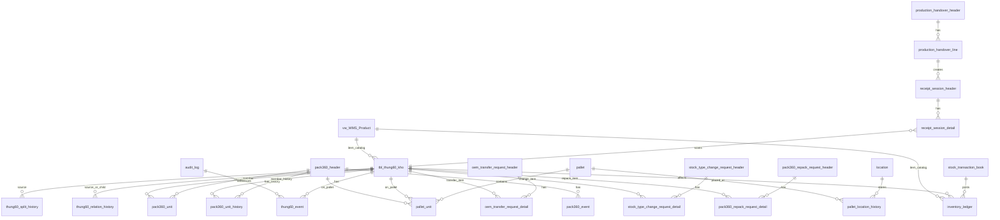
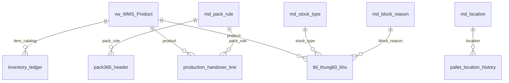

# ERD - Kho thành phẩm sản xuất

## 1. Mục đích

ERD logic cho WMS kho thành phẩm, tập trung vào quản lý thùng 60, Pack360, stock type, ledger, audit và nghiệp vụ xuất lẻ.

## 2. ERD tổng thể dạng Mermaid

## 3. Nhóm bảng master/reference

## 4. Bảng chính đề xuất

### 4.1. `tbl_thung60_kho`

Bảng current state trung tâm. Chứa cả thùng 60 vật lý và thùng 60 ảo.

Key đề xuất:

- PK: `id_60`
- Unique: `qr_60`
- Index: `product_code`, `current_oem_order_no`, `stock_type`, `status`, `current_pack360_id`, `current_pallet_id`, `current_location_code`

### 4.2. `thung60_split_history`

Ghi lịch sử xuất lẻ/tách số lượng từ một thùng 60 gốc để tạo bản ghi thùng 60 mới trong cùng bảng `tbl_thung60_kho`.

Key đề xuất:

- PK: `split_id`
- FK: `source_id_60` → `tbl_thung60_kho.id_60`
- FK: `generated_id_60` → `tbl_thung60_kho.id_60`

### 4.3. `pack360_header`, `pack360_unit`, `pack360_unit_history`

Quản lý Pack360 hiện tại và lịch sử quan hệ thùng 60 trong Pack360.

### 4.4. Request tables

Các bảng request dùng cho nghiệp vụ cần kiểm soát:

- `oem_transfer_request_header/detail`
- `stock_type_change_request_header/detail`
- `pack360_repack_request_header/detail`

### 4.5. Ledger và Audit

- `stock_transaction_book`: sổ nghiệp vụ.
- `inventory_ledger`: sổ cái tồn kho.
- `audit_log`: nhật ký thao tác.

## 5. Ràng buộc dữ liệu quan trọng

| Ràng buộc | Mô tả |
|---|---|
| Unique QR thùng 60 | `qr_60` không được trùng. |
| Một thùng 60 chỉ thuộc một Pack360 active | `pack360_unit.is_current = 1` chỉ có tối đa một dòng cho một `id_60`. |
| Một thùng 60 chỉ thuộc một pallet active | `pallet_unit.is_current = 1` chỉ có tối đa một dòng cho một `id_60` hoặc Pack360. |
| Thùng ảo cùng bảng thùng 60 | `is_virtual = 1` thì phải có `parent_id_60`, `root_id_60`, `unit_origin_type = SPLIT_VIRTUAL`. |
| Thùng gốc sau split | Nếu `current_qty < standard_qty` thì stock type mặc định `BLOCKED`, reason `PARTIAL_REMAINING`. |
| Ledger immutable | Không update/delete ledger đã post. |
| Request idempotent | `request_id` unique theo command type. |

## 6. Gợi ý index

| Bảng | Index |
|---|---|
| `tbl_thung60_kho` | `(qr_60)`, `(product_code, stock_type, status)`, `(current_oem_order_no, current_po_no)`, `(current_pack360_id)`, `(current_pallet_id)`, `(is_virtual, parent_id_60)` |
| `thung60_event` | `(id_60, event_time desc)`, `(event_type, event_time desc)`, `(request_id)` |
| `thung60_split_history` | `(source_id_60)`, `(generated_id_60)`, `(issue_no, issue_line_no)` |
| `pack360_unit` | `(pack360_id, is_current)`, `(id_60, is_current)` |
| `inventory_ledger` | `(product_code, ledger_date)`, `(id_60)`, `(source_document_no)` |
| `audit_log` | `(object_type, object_id, performed_at desc)`, `(performed_by, performed_at desc)` |
