# Sơ đồ Thực thể Liên kết (ERD) - Chi tiết Cấu trúc Dữ liệu
*Phiên bản: Dựa trên schema WMS hiện tại (Phiên bản 5.0) với Sổ cái kép*

Sơ đồ dưới đây mô tả **chi tiết tất cả các trường dữ liệu (fields)** của từng bảng và mối liên hệ (Relationships) giữa chúng.

```mermaid
erDiagram
    %% ==========================================
    %% 1. Phân hệ Inbound (Giao nhận & Quét mã)
    %% ==========================================
    PRODUCTION_HANDOVER_HEADER {
        NVARCHAR(50) handover_no PK
        NVARCHAR(100) production_area
        DATE handover_date
        NVARCHAR(30) status
        NVARCHAR(50) created_by
        DATETIME created_at
    }

    PRODUCTION_HANDOVER_LINE {
        NVARCHAR(50) handover_no PK, FK
        INT handover_line_no PK
        NVARCHAR(50) product_code
        NVARCHAR(255) product_name
        DECIMAL planned_qty
        DECIMAL temp_received_qty
        DECIMAL official_received_qty
        DECIMAL remaining_qty
        NVARCHAR(50) oem_order_no
        NVARCHAR(50) po_no
        NVARCHAR(50) po_line_no
        NVARCHAR(50) customer_code
        NVARCHAR(50) pack_rule_code
        NVARCHAR(30) packing_standard_type
        NVARCHAR(30) status
    }

    RECEIPT_SESSION_HEADER {
        NVARCHAR(50) receipt_session_no PK
        NVARCHAR(50) handover_no FK
        INT handover_line_no FK
        NVARCHAR(50) product_code
        NVARCHAR(50) oem_order_no
        NVARCHAR(50) po_no
        NVARCHAR(50) pack_rule_code
        NVARCHAR(30) status
        DECIMAL scanned_qty
        NVARCHAR(50) temp_confirmed_by
        DATETIME temp_confirmed_at
        NVARCHAR(50) official_confirmed_by
        DATETIME official_confirmed_at
    }

    RECEIPT_SESSION_DETAIL {
        NVARCHAR(50) receipt_session_no PK, FK
        INT line_no PK
        NVARCHAR(50) id_60 FK
        NVARCHAR(255) qr_60
        NVARCHAR(50) product_code
        DECIMAL quantity
        NVARCHAR(30) scan_result
        NVARCHAR(50) error_code
        NVARCHAR(50) scanned_by
        DATETIME scanned_at
        NVARCHAR(100) device_id
        NVARCHAR(100) request_id
    }

    PRODUCTION_HANDOVER_HEADER ||--o{ PRODUCTION_HANDOVER_LINE : "has"
    PRODUCTION_HANDOVER_LINE ||--o{ RECEIPT_SESSION_HEADER : "creates"
    RECEIPT_SESSION_HEADER ||--o{ RECEIPT_SESSION_DETAIL : "contains"
    RECEIPT_SESSION_DETAIL }o--|| TBL_THUNG60_KHO : "scans into"

    %% ==========================================
    %% 2. Phân hệ Core (Thùng 60 & Lịch sử)
    %% ==========================================
    TBL_THUNG60_KHO {
        NVARCHAR(50) id_60 PK
        NVARCHAR(255) qr_60 UK
        NVARCHAR(50) product_code
        NVARCHAR(255) product_name
        DECIMAL standard_qty
        DECIMAL original_qty
        DECIMAL current_qty
        NVARCHAR(20) uom
        NVARCHAR(30) status
        NVARCHAR(30) stock_type
        NVARCHAR(50) block_reason_code
        BIT is_virtual
        NVARCHAR(30) unit_origin_type
        NVARCHAR(50) parent_id_60 FK
        NVARCHAR(50) root_id_60
        NVARCHAR(50) source_split_event_id
        DECIMAL split_qty_total
        BIT is_full_box
        NVARCHAR(50) production_handover_no
        INT production_handover_line_no
        NVARCHAR(50) receipt_session_no
        NVARCHAR(50) official_receipt_no
        NVARCHAR(50) current_oem_order_no
        NVARCHAR(50) current_po_no
        NVARCHAR(50) current_po_line_no
        NVARCHAR(50) current_pack_rule_code
        NVARCHAR(50) customer_code
        NVARCHAR(50) current_pack360_id FK
        NVARCHAR(50) current_pallet_id FK
        NVARCHAR(50) current_location_code FK
        NVARCHAR(50) created_from_issue_no
        INT created_from_issue_line_no
        NVARCHAR(50) last_event_type
        DATETIME last_event_at
        NVARCHAR(50) last_event_by
        DATETIME created_at
        DATETIME updated_at
    }

    THUNG60_SPLIT_HISTORY {
        NVARCHAR(50) split_id PK
        NVARCHAR(50) source_id_60 FK
        NVARCHAR(50) generated_id_60 FK
        NVARCHAR(50) product_code
        DECIMAL split_qty
        DECIMAL source_qty_before
        DECIMAL source_qty_after
        NVARCHAR(50) issue_no
        INT issue_line_no
        NVARCHAR(50) reason_code
        NVARCHAR(50) performed_by
        DATETIME performed_at
        NVARCHAR(100) device_id
        NVARCHAR(100) request_id
    }

    THUNG60_EVENT {
        NVARCHAR(50) event_id PK
        NVARCHAR(50) id_60 FK
        NVARCHAR(50) event_type
        NVARCHAR(30) old_status
        NVARCHAR(30) new_status
        NVARCHAR(30) old_stock_type
        NVARCHAR(30) new_stock_type
        DECIMAL old_qty
        DECIMAL new_qty
        NVARCHAR(50) old_location_code
        NVARCHAR(50) new_location_code
        NVARCHAR(50) source_document_no
        NVARCHAR(100) request_id
        NVARCHAR(50) performed_by
        DATETIME performed_at
        NVARCHAR(MAX) message
    }

    THUNG60_RELATION_HISTORY {
        NVARCHAR(50) relation_id PK
        NVARCHAR(50) parent_id_60 FK
        NVARCHAR(50) child_id_60 FK
        NVARCHAR(50) relation_type
        DATETIME created_at
    }

    TBL_THUNG60_KHO ||--o{ THUNG60_EVENT : "logs"
    TBL_THUNG60_KHO ||--o{ THUNG60_SPLIT_HISTORY : "splits"
    TBL_THUNG60_KHO ||--o{ THUNG60_RELATION_HISTORY : "relates to"

    %% ==========================================
    %% 3. Phân hệ Pack360
    %% ==========================================
    PACK360_HEADER {
        NVARCHAR(50) pack360_id PK
        NVARCHAR(255) pack360_qr UK
        NVARCHAR(30) packing_standard_type
        NVARCHAR(50) pack_rule_code
        NVARCHAR(50) oem_order_no
        NVARCHAR(50) po_no
        NVARCHAR(30) status
        INT target_unit_count
        INT actual_unit_count
        DECIMAL weight
        NVARCHAR(50) created_by
        DATETIME created_at
        NVARCHAR(50) completed_by
        DATETIME completed_at
    }

    PACK360_UNIT {
        NVARCHAR(50) pack360_id PK, FK
        NVARCHAR(50) id_60 PK, FK
        NVARCHAR(50) added_by
        DATETIME added_at
        BIT is_current
    }

    PACK360_UNIT_HISTORY {
        INT history_id PK
        NVARCHAR(50) pack360_id FK
        NVARCHAR(50) id_60 FK
        DATETIME added_at
        DATETIME removed_at
        NVARCHAR(100) reason
    }

    PACK360_EVENT {
        NVARCHAR(50) event_id PK
        NVARCHAR(50) pack360_id FK
        NVARCHAR(50) event_type
        NVARCHAR(50) performed_by
        DATETIME performed_at
        NVARCHAR(100) request_id
    }

    PACK360_HEADER ||--o{ PACK360_UNIT : "contains"
    PACK360_HEADER ||--o{ PACK360_UNIT_HISTORY : "tracks"
    PACK360_HEADER ||--o{ PACK360_EVENT : "logs"
    TBL_THUNG60_KHO ||--o{ PACK360_UNIT : "member"

    %% ==========================================
    %% 4. Phân hệ Lưu trữ (Pallet & Vị trí)
    %% ==========================================
    PALLET {
        NVARCHAR(50) pallet_id PK
        NVARCHAR(50) pallet_type
        NVARCHAR(30) status
    }

    PALLET_UNIT {
        NVARCHAR(50) pallet_id PK, FK
        NVARCHAR(50) unit_id PK
        NVARCHAR(30) unit_type
        BIT is_current
    }

    LOCATION {
        NVARCHAR(50) location_code PK
        NVARCHAR(50) location_type
        NVARCHAR(30) status
    }

    PALLET_LOCATION_HISTORY {
        INT history_id PK
        NVARCHAR(50) pallet_id FK
        NVARCHAR(50) location_code FK
        DATETIME placed_at
        DATETIME removed_at
    }

    PALLET ||--o{ PALLET_UNIT : "contains"
    TBL_THUNG60_KHO ||--o{ PALLET_UNIT : "can be on"
    PACK360_HEADER ||--o{ PALLET_UNIT : "can be on"
    LOCATION ||--o{ PALLET_LOCATION_HISTORY : "stores"
    PALLET ||--o{ PALLET_LOCATION_HISTORY : "placed at"

    %% ==========================================
    %% 5. Phân hệ Control (Các loại Chứng từ Yêu cầu)
    %% ==========================================
    OEM_TRANSFER_REQUEST_HEADER {
        NVARCHAR(50) request_no PK
        NVARCHAR(50) new_oem_order_no
        NVARCHAR(50) new_po_no
        NVARCHAR(30) status
        NVARCHAR(50) requested_by
        DATETIME requested_at
        NVARCHAR(50) approved_by
        DATETIME approved_at
    }

    OEM_TRANSFER_REQUEST_DETAIL {
        NVARCHAR(50) request_no PK, FK
        INT line_no PK
        NVARCHAR(50) id_60 FK
    }

    STOCK_TYPE_CHANGE_REQUEST_HEADER {
        NVARCHAR(50) request_no PK
        NVARCHAR(30) change_type
        NVARCHAR(50) reason_code
        NVARCHAR(30) status
        NVARCHAR(50) requested_by
        DATETIME requested_at
        NVARCHAR(50) approved_by
        DATETIME approved_at
        NVARCHAR(50) posted_by
        DATETIME posted_at
    }

    STOCK_TYPE_CHANGE_REQUEST_DETAIL {
        NVARCHAR(50) request_no PK, FK
        INT line_no PK
        NVARCHAR(50) id_60 FK
        NVARCHAR(50) product_code
        DECIMAL qty
        NVARCHAR(30) old_stock_type
        NVARCHAR(30) new_stock_type
        NVARCHAR(50) old_block_reason_code
        NVARCHAR(50) new_block_reason_code
    }
    
    PACK360_REPACK_REQUEST_HEADER {
        NVARCHAR(50) request_no PK
        NVARCHAR(50) pack360_id FK
        NVARCHAR(30) action_type
        NVARCHAR(30) status
        NVARCHAR(50) requested_by
        DATETIME requested_at
    }

    PACK360_REPACK_REQUEST_DETAIL {
        NVARCHAR(50) request_no PK, FK
        NVARCHAR(50) id_60 PK, FK
    }

    OEM_TRANSFER_REQUEST_HEADER ||--o{ OEM_TRANSFER_REQUEST_DETAIL : "has"
    STOCK_TYPE_CHANGE_REQUEST_HEADER ||--o{ STOCK_TYPE_CHANGE_REQUEST_DETAIL : "has"
    PACK360_REPACK_REQUEST_HEADER ||--o{ PACK360_REPACK_REQUEST_DETAIL : "has"

    %% ==========================================
    %% 6. Phân hệ Kế toán & Audit (Ledger - Dual Ledger)
    %% ==========================================
    STOCK_TRANSACTION_BOOK {
        NVARCHAR(50) transaction_id PK
        NVARCHAR(50) transaction_type
        NVARCHAR(50) document_no
        NVARCHAR(100) partner_unit
        NVARCHAR(100) partner_name
        DATETIME posted_at
        NVARCHAR(50) posted_by
    }

    INVENTORY_LEDGER {
        INT ledger_id PK
        DATE ledger_date
        NVARCHAR(50) id_60 FK
        NVARCHAR(50) product_code
        NVARCHAR(50) transaction_id FK
        NVARCHAR(50) source_document_no
        DECIMAL quantity_change
        NVARCHAR(30) old_stock_type
        NVARCHAR(30) new_stock_type
        DATETIME created_at
    }

    ITEM_LEDGER {
        INT item_ledger_id PK
        DATE ledger_date
        NVARCHAR(50) product_code
        NVARCHAR(50) transaction_id FK
        NVARCHAR(50) source_document_no
        DECIMAL total_quantity_change
        DATETIME created_at
    }

    AUDIT_LOG {
        BIGINT audit_id PK
        NVARCHAR(50) object_type
        NVARCHAR(50) object_id
        NVARCHAR(50) action
        NVARCHAR(MAX) old_value
        NVARCHAR(MAX) new_value
        NVARCHAR(50) performed_by
        DATETIME performed_at
        NVARCHAR(50) ip_address
    }
    
    COMMAND_REQUEST_LOG {
        NVARCHAR(100) request_id PK
        NVARCHAR(50) command_type
        NVARCHAR(30) status
        DATETIME created_at
    }

    VW_WMS_PRODUCT {
        NVARCHAR(50) MFInvtID PK
        NVARCHAR(255) Descr
        NVARCHAR(50) ClassID
        NVARCHAR(50) StkUnit
        NVARCHAR(50) User1
    }

    STOCK_TRANSACTION_BOOK ||--o{ INVENTORY_LEDGER : "posts (Box)"
    STOCK_TRANSACTION_BOOK ||--o{ ITEM_LEDGER : "posts (SKU)"
    VW_WMS_PRODUCT ||--o{ INVENTORY_LEDGER : "item catalog"
    VW_WMS_PRODUCT ||--o{ ITEM_LEDGER : "item catalog"
    TBL_THUNG60_KHO ||--o{ INVENTORY_LEDGER : "affects"
    AUDIT_LOG ||--o{ THUNG60_EVENT : "traces"
```

