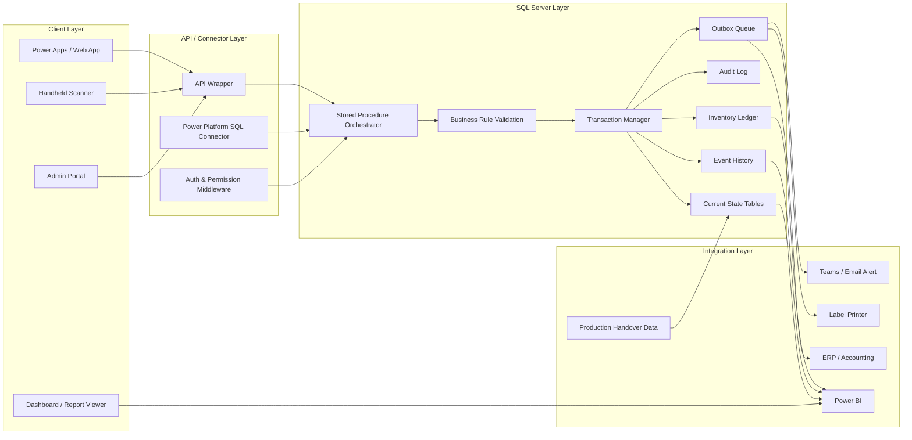
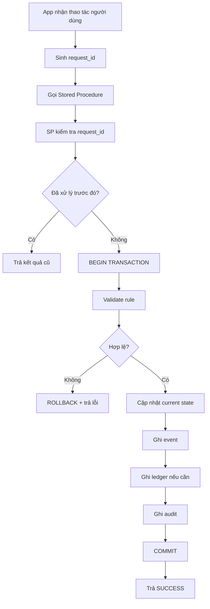

# Component Diagram - SQL Stored Procedure Centric WMS

## 1. Mục tiêu

Tài liệu này mô tả kiến trúc ứng dụng WMS kho thành phẩm theo hướng **SQL Server Stored Procedure là Orchestrator nghiệp vụ**.

App chỉ truyền tham số. Logic nghiệp vụ, cập nhật dữ liệu, transaction, ledger và audit nằm trong Stored Procedure.

## 2. Kiến trúc tổng thể

## 3. Thành phần chính

### 3.1. Client Layer

| Thành phần | Vai trò |
|---|---|
| Power Apps / Web App | Màn hình nhập tạm, đóng Pack360, tồn kho, xuất kho, truy vết |
| Handheld Scanner | Scan QR thùng 60, Pack360, pallet, vị trí |
| Admin Portal | Màn hình thủ kho xác nhận nhập chính thức, duyệt đổi stock type, duyệt chuyển OEM |
| Dashboard / Report Viewer | Xem tồn, báo cáo BLOCKED, ledger, audit, vòng đời thùng 60 |

Client Layer không cập nhật trực tiếp bảng nghiệp vụ.

### 3.2. API / Connector Layer

Có 2 cách triển khai:

| Cách | Mô tả | Khi dùng |
|---|---|---|
| API Wrapper | Web API nhận request, gọi Stored Procedure | Khi cần chuẩn hóa auth, log API, tích hợp nhiều client |
| SQL Connector | Power Apps gọi Stored Procedure thông qua SQL Connector | Khi triển khai nhanh trong nội bộ, ít lớp trung gian |

Dù chọn cách nào, rule vẫn nằm trong Stored Procedure.

### 3.3. SQL Server Stored Procedure Orchestrator

Stored Procedure là lõi xử lý nghiệp vụ.

Nhiệm vụ:

- Nhận tham số từ App/API.
- Validate rule nghiệp vụ.
- Lock dữ liệu cần thiết.
- Kiểm tra `request_id` chống gửi lặp.
- Cập nhật bảng current state.
- Ghi event history.
- Ghi inventory ledger hoặc reclassification ledger.
- Ghi audit log.
- Trả kết quả chuẩn về App.

## 4. Nguyên tắc cập nhật dữ liệu

## 5. Bảng dữ liệu chính

| Nhóm | Bảng / Đối tượng |
|---|---|
| Current state | `tbl_thung60_kho`, `pack360_header`, `pack360_unit`, `pallet_current`, `location_current` |
| Receipt | `production_handover_header`, `production_handover_line`, `receipt_session_header`, `receipt_session_detail` |
| Stock control | `stock_type_change_request_header`, `stock_type_change_request_detail` |
| OEM transfer | `oem_transfer_request_header`, `oem_transfer_request_detail` |
| Pack360 repack | `pack360_repack_request_header`, `pack360_repack_request_detail`, `pack360_unit_history` |
| Partial issue | `thung60_split_history`; thùng 60 ảo vẫn nằm trong `tbl_thung60_kho` |
| Event | `thung60_event`, `pack360_event`, `pallet_event` |
| Ledger | `inventory_ledger`, `stock_transaction_book` |
| Audit | `audit_log`, `request_execution_log` |
| Outbox | `integration_outbox` |

## 6. Điểm kiểm soát kỹ thuật

| Điểm kiểm soát | Thiết kế |
|---|---|
| Gửi lặp | Dùng `request_id` và `request_execution_log` |
| Giao dịch lỗi giữa chừng | Stored Procedure dùng transaction và rollback |
| Hai người thao tác cùng thùng | Lock theo `id_60` hoặc kiểm tra version/current state |
| Audit | Ghi before/after cho nghiệp vụ nhạy cảm |
| Ledger | Chỉ ghi khi nghiệp vụ làm tăng/giảm tồn hoặc đổi phân loại tồn |
| App lỗi sau khi gọi SP | Gọi lại bằng cùng `request_id`, SP trả kết quả cũ |

## 7. Anti-pattern cần tránh

- App update trực tiếp `tbl_thung60_kho`.
- App tự đổi `stock_type`.
- App tự sinh Pack360 hoặc xóa Pack360 không qua SP.
- API service chứa rule nghiệp vụ nhưng Stored Procedure cũng chứa rule, gây trùng logic.
- Không có `request_id` cho thao tác scan hoặc xác nhận.
- Không ghi event/audit khi đổi trạng thái thùng.
