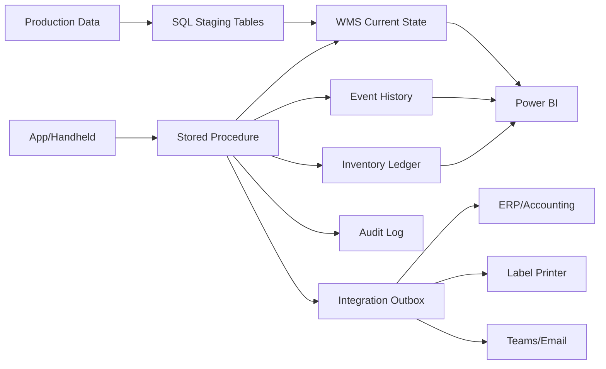

# Integration Specification - WMS kho thành phẩm

## 1. Mục tiêu

Tài liệu này mô tả tích hợp giữa WMS và các hệ thống/thiết bị xung quanh trong kiến trúc **SQL Stored Procedure-centric**.

Logic nghiệp vụ lõi vẫn nằm trong SQL Server Stored Procedure. Các tích hợp bên ngoài chủ yếu cung cấp dữ liệu đầu vào hoặc nhận dữ liệu đầu ra thông qua bảng staging, view, outbox hoặc API.

## 2. Tổng quan tích hợp



## 3. Tích hợp data sản xuất

### Mục đích

Cung cấp phiếu giao kho và dòng chi tiết để nhân viên kho chọn khi nhập tạm.

### Dữ liệu đầu vào

| Đối tượng | Nội dung |
|---|---|
| `production_handover_header` | Phiếu giao kho từ sản xuất |
| `production_handover_line` | Dòng chi tiết: mã hàng, số lượng, OEM/PO, pack rule |

### Nguyên tắc

- Data sản xuất là nguồn để kho chọn phiếu giao kho.
- Nhân viên kho chọn phiếu và dòng chi tiết trước khi scan.
- OEM/PO/pack rule lấy tự động từ dòng chi tiết.
- Không nhập tay OEM/PO khi scan.

## 4. Tích hợp ERP / Kế toán

### Mục đích

Đối chiếu số liệu nhập - xuất - tồn và chứng từ chính thức.

### Cách tích hợp đề xuất

| Cách | Mô tả |
|---|---|
| Outbox table | Stored Procedure ghi sự kiện cần gửi ERP vào `integration_outbox` |
| Batch job | Job định kỳ đẩy dữ liệu sang ERP |
| API | Nếu ERP hỗ trợ API thì đọc outbox và gọi API |

### Sự kiện gửi ERP

- Nhập kho chính thức
- Xuất kho chính thức
- Điều chỉnh tồn
- Reversal
- Stock reclassification nếu ERP cần theo dõi
- Xuất tạm/tất toán nếu có liên quan kế toán

## 5. Tích hợp máy in tem

### Mục đích

In tem Pack360, thùng 60 ảo, pallet hoặc tem vị trí nếu cần.

### Cách xử lý

Stored Procedure không gọi máy in trực tiếp. Stored Procedure ghi yêu cầu in vào bảng outbox:

```text
integration_outbox
- outbox_id
- event_type = PRINT_LABEL
- object_type
- object_code
- payload_json
- status
- created_at
```

Print service hoặc Power Automate đọc outbox và gửi lệnh in.

## 6. Tích hợp handheld scanner

### Nguyên tắc

- Handheld chỉ gửi QR và tham số nghiệp vụ.
- Handheld không xử lý rule lõi.
- Mỗi thao tác scan/xác nhận phải có `request_id`.
- Nếu mất mạng hoặc gửi lại, Stored Procedure xử lý idempotency.

## 7. Tích hợp Power BI / báo cáo

Power BI nên đọc từ view/report table, không đọc trực tiếp bảng giao dịch thô nếu không cần.

View đề xuất:

| View | Mục đích |
|---|---|
| `vw_current_inventory_by_stock_type` | Tồn hiện tại theo stock type |
| `vw_thung60_lifecycle` | Vòng đời thùng 60 |
| `vw_pack360_status` | Trạng thái Pack360 |
| `vw_blocked_stock` | Hàng bị BLOCKED theo lý do |
| `vw_partial_remaining_stock` | Thùng gốc bị xuất lẻ và đang BLOCKED |
| `vw_temp_receipt_pending` | Phiên nhập tạm chờ xác nhận |
| `vw_inventory_ledger` | Sổ cái tồn kho |
| `vw_audit_sensitive_actions` | Audit thao tác nhạy cảm |

## 8. Tích hợp Teams / Email Alert

### Sự kiện nên cảnh báo

- Pack360 OPEN quá lâu.
- Hàng BLOCKED do vấn đề chất lượng.
- Hàng dư đơn OEM đang chờ xử lý.
- Phiên nhập tạm quá thời gian chưa thủ kho xác nhận.
- Xuất tạm quá hạn chưa hoàn nhập/tất toán.
- Lỗi scan lặp nhiều lần.
- Conflict khi 2 người thao tác cùng thùng.

### Cách xử lý

Stored Procedure ghi alert event vào `integration_outbox`, job/Power Automate gửi Teams/Email.

## 9. Nguyên tắc kiểm soát tích hợp

| Nguyên tắc | Mô tả |
|---|---|
| Không gọi external trực tiếp trong transaction nếu không cần | Tránh treo transaction SQL |
| Dùng outbox | Đảm bảo sau khi transaction commit mới gửi thông tin ra ngoài |
| Có retry | Outbox có trạng thái `PENDING`, `SENT`, `FAILED`, `RETRY` |
| Có trace_id | Liên kết request, event, ledger, audit và integration |
| Không bỏ qua lỗi | Lỗi tích hợp phải có log và cảnh báo |
