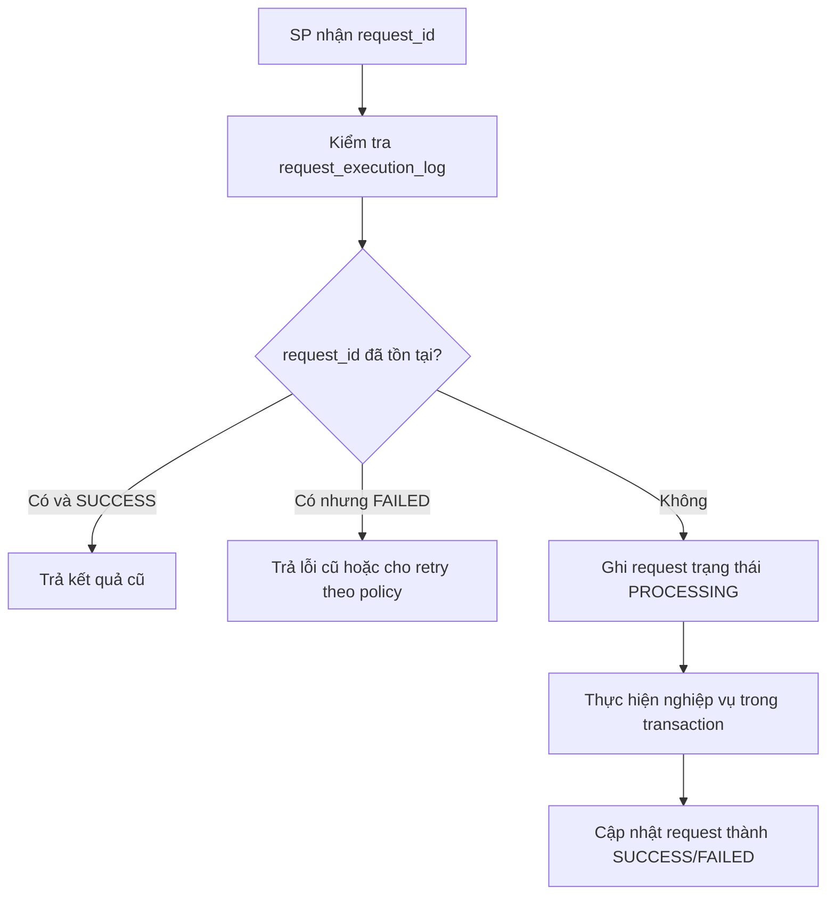

# Orchestrator Command Design - Stored Procedure làm Orchestrator

## 1. Mục tiêu

Tài liệu này mô tả cách thiết kế command nghiệp vụ khi toàn bộ xử lý logic chạy trên **SQL Server Stored Procedure**.

App/API chỉ gọi Stored Procedure với tham số. Stored Procedure thực hiện kiểm tra rule, cập nhật dữ liệu, ghi event, ledger và audit.

## 2. Quy ước command

Mỗi nghiệp vụ quan trọng được chuẩn hóa thành một command. Mỗi command tương ứng với một Stored Procedure hoặc một nhóm Stored Procedure.

Ví dụ:

| Command | Stored Procedure chính |
|---|---|
| Xác nhận nhập tạm | `usp_Receipt_TempConfirm` |
| Xác nhận nhập chính thức | `usp_Receipt_OfficialConfirm` |
| Tạo Pack360 | `usp_Pack360_Create` |
| Thêm thùng 60 vào Pack360 | `usp_Pack360_AddThung60` |
| Complete Pack360 | `usp_Pack360_Complete` |
| Giải phóng Pack360 | `usp_Pack360_Release` |
| Tách thùng khỏi Pack360 | `usp_Pack360_SplitUnits` |
| Chuyển đơn OEM | `usp_OEM_Transfer_Post` |
| Chuyển stock type | `usp_StockType_Change_Post` |
| Release stock type | `usp_StockType_Release_Post` |
| Xuất lẻ | `usp_Outbound_PartialIssue` |
| Xác nhận xuất | `usp_Outbound_ConfirmShip` |

## 3. Input chuẩn cho Stored Procedure

Mọi Stored Procedure nghiệp vụ nên có nhóm tham số chuẩn sau:

```sql
@request_id        NVARCHAR(100),
@user_code         NVARCHAR(100),
@user_email        NVARCHAR(255),
@device_id         NVARCHAR(100) = NULL,
@source_screen     NVARCHAR(100) = NULL,
@note              NVARCHAR(500) = NULL
```

Các tham số nghiệp vụ riêng sẽ bổ sung tùy command.

Ví dụ xuất lẻ:

```sql
@issue_no          NVARCHAR(50),
@issue_line_no     NVARCHAR(50),
@source_id_60      NVARCHAR(100),
@split_qty         DECIMAL(18,3)
```

## 4. Output chuẩn

Stored Procedure phải trả về kết quả thống nhất:

```sql
SELECT
    @status AS status,
    @message AS message,
    @error_code AS error_code,
    @document_no AS document_no,
    @object_code AS object_code,
    @request_id AS request_id,
    @trace_id AS trace_id;
```

## 5. Xử lý idempotency bằng request_id

### Nguyên tắc

Một request nghiệp vụ phải có `request_id` duy nhất. Nếu App gửi lại cùng `request_id`, Stored Procedure không được ghi thêm giao dịch mới.



### Bảng đề xuất

```sql
request_execution_log
- request_id
- command_name
- object_code
- status
- result_message
- error_code
- created_by
- created_at
- completed_at
- trace_id
```

## 6. Khung xử lý Stored Procedure chuẩn

```sql
CREATE OR ALTER PROCEDURE dbo.usp_Template_Command
    @request_id NVARCHAR(100),
    @user_code NVARCHAR(100),
    @user_email NVARCHAR(255),
    @device_id NVARCHAR(100) = NULL,
    @source_screen NVARCHAR(100) = NULL
AS
BEGIN
    SET NOCOUNT ON;
    SET XACT_ABORT ON;

    DECLARE
        @status NVARCHAR(30) = 'FAILED',
        @message NVARCHAR(500) = '',
        @error_code NVARCHAR(100) = NULL,
        @document_no NVARCHAR(100) = NULL,
        @object_code NVARCHAR(100) = NULL,
        @trace_id UNIQUEIDENTIFIER = NEWID();

    BEGIN TRY
        -- 1. Check duplicated request_id
        IF EXISTS (SELECT 1 FROM dbo.request_execution_log WHERE request_id = @request_id AND status = 'SUCCESS')
        BEGIN
            SELECT status, result_message AS message, error_code, document_no, object_code, request_id, trace_id
            FROM dbo.request_execution_log
            WHERE request_id = @request_id;
            RETURN;
        END

        BEGIN TRANSACTION;

        -- 2. Ghi request PROCESSING
        -- 3. Validate quyền và rule nghiệp vụ
        -- 4. Lock object nếu cần
        -- 5. Cập nhật current state
        -- 6. Ghi event
        -- 7. Ghi ledger nếu cần
        -- 8. Ghi audit
        -- 9. Cập nhật request SUCCESS

        COMMIT TRANSACTION;

        SET @status = 'SUCCESS';
        SET @message = N'Xử lý thành công';
    END TRY
    BEGIN CATCH
        IF @@TRANCOUNT > 0 ROLLBACK TRANSACTION;

        SET @status = 'FAILED';
        SET @message = ERROR_MESSAGE();
        SET @error_code = CONCAT('SQL_', ERROR_NUMBER());

        -- Ghi log lỗi nếu cần
    END CATCH

    SELECT
        @status AS status,
        @message AS message,
        @error_code AS error_code,
        @document_no AS document_no,
        @object_code AS object_code,
        @request_id AS request_id,
        CAST(@trace_id AS NVARCHAR(100)) AS trace_id;
END;
```

## 7. Command chính theo nghiệp vụ

### 7.1. Nhập tạm

Stored Procedure:

```sql
usp_Receipt_TempConfirm
```

Nhiệm vụ:

- Nhận phiếu giao kho, dòng chi tiết và danh sách thùng đã scan.
- Kiểm tra thùng cùng mã với dòng phiếu.
- Ghi receipt session.
- Ghi event/audit.
- Chưa ghi ledger tăng tồn.
- Trạng thái thùng chưa được xuất.

### 7.2. Xác nhận nhập chính thức

Stored Procedure:

```sql
usp_Receipt_OfficialConfirm
```

Nhiệm vụ:

- Thủ kho xác nhận phiên nhập tạm.
- Post nhập kho.
- Cập nhật `tbl_thung60_kho`.
- Ghi `inventory_ledger` tăng tồn.
- Ghi audit.

### 7.3. Đóng Pack360

Stored Procedure:

```sql
usp_Pack360_Create
usp_Pack360_AddThung60
usp_Pack360_Complete
```

Rule:

- Hàng truyền thống kiểm tra theo rule chuẩn.
- Hàng OEM/PO kiểm tra theo packing list/rule của đơn, có thể khác mã và khác số lượng.

### 7.4. Giải phóng/tách/đóng lại Pack360

Stored Procedure:

```sql
usp_Pack360_Release
usp_Pack360_SplitUnits
usp_Pack360_Repack
```

Rule:

- Không xóa lịch sử Pack360.
- Chỉ đóng hiệu lực quan hệ cũ.
- Ghi relation history, event và audit.

### 7.5. Chuyển đơn OEM

Stored Procedure:

```sql
usp_OEM_Transfer_RequestCreate
usp_OEM_Transfer_Approve
usp_OEM_Transfer_Post
```

Rule:

- Chỉ chuyển khi hàng chưa xuất, chưa stage, chưa thuộc phiếu xuất active.
- Nếu Pack360 completed, phải chuyển cả Pack360 hoặc tách trước theo rule.

### 7.6. Chuyển stock type / BLOCKED / release

Stored Procedure:

```sql
usp_StockType_Change_RequestCreate
usp_StockType_Change_Approve
usp_StockType_Change_Post
usp_StockType_Release_Post
```

Rule:

- Dư đơn OEM hoặc vấn đề chất lượng trong kho: `stock_type = BLOCKED`.
- `TEMPORARY_ISSUE` chỉ dùng cho xuất tạm.
- Hàng `BLOCKED` không được phân bổ/xuất.

### 7.7. Xuất lẻ từ thùng 60

Stored Procedure:

```sql
usp_Outbound_PartialIssue
```

Rule:

- Tạo bản ghi thùng 60 mới trong `tbl_thung60_kho`, không tạo bảng riêng.
- Bản ghi mới có `is_virtual = 1`.
- Lưu `parent_id_60` và `root_id_60`.
- Thùng gốc cập nhật lại `current_qty`.
- Nếu thùng gốc không còn đủ số lượng chuẩn: `stock_type = BLOCKED`, `block_reason_code = PARTIAL_REMAINING`.
- Ghi split history, event, ledger và audit.
