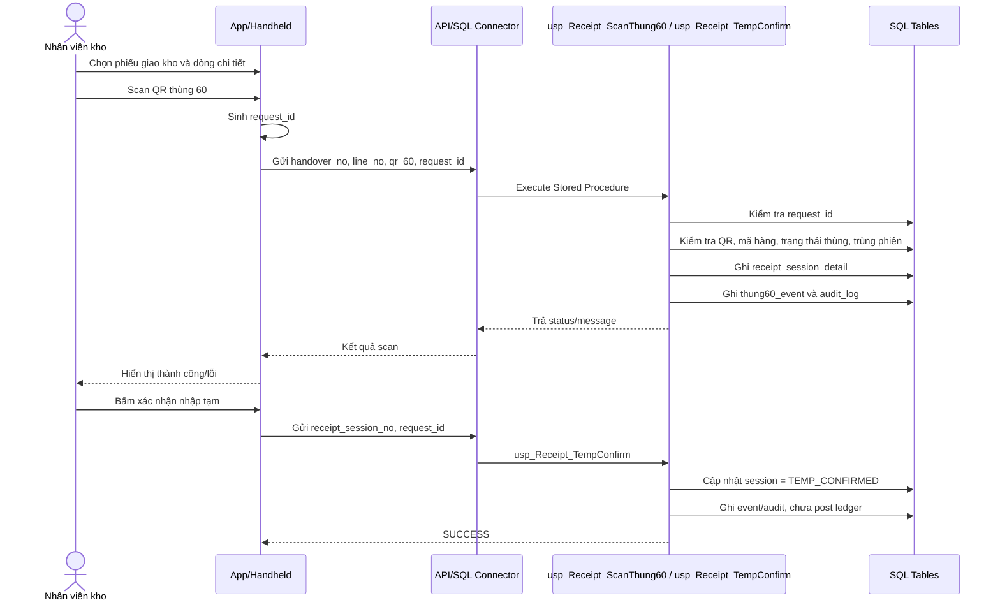
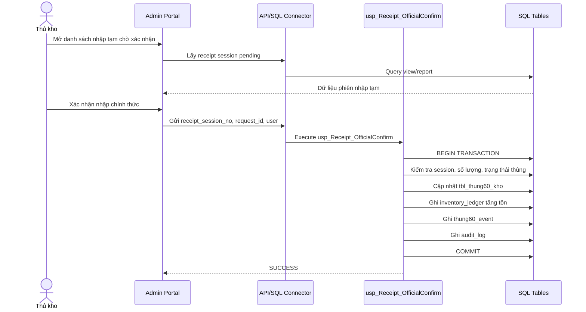
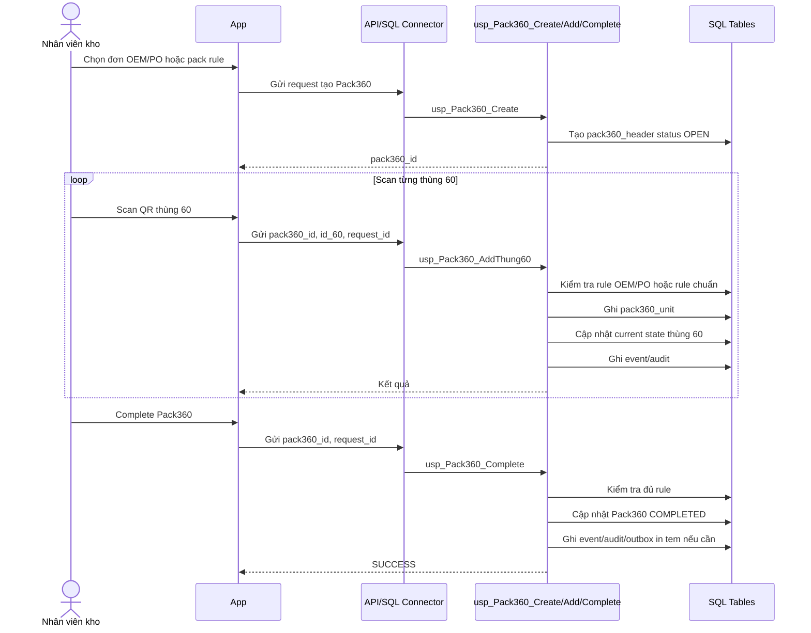
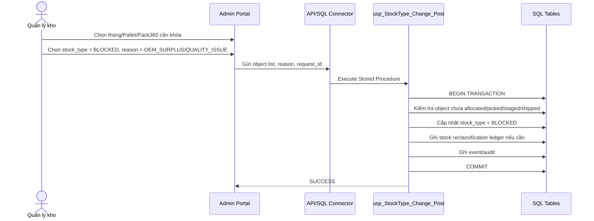
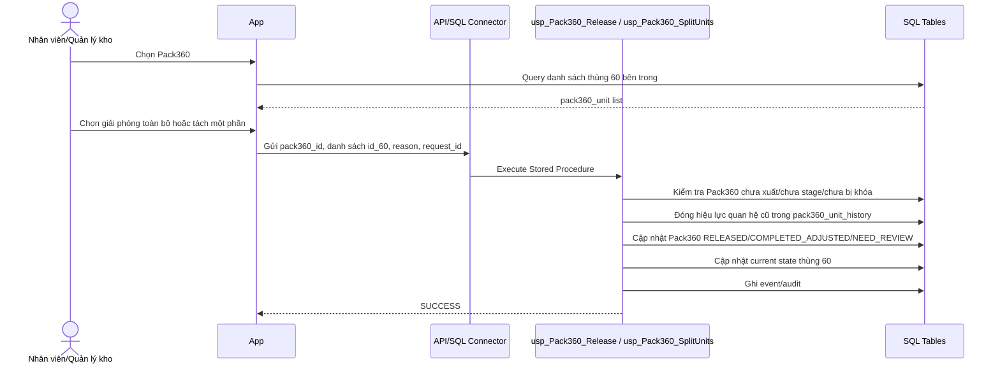
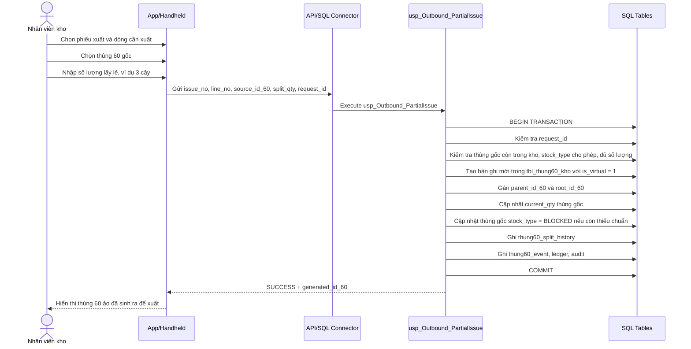
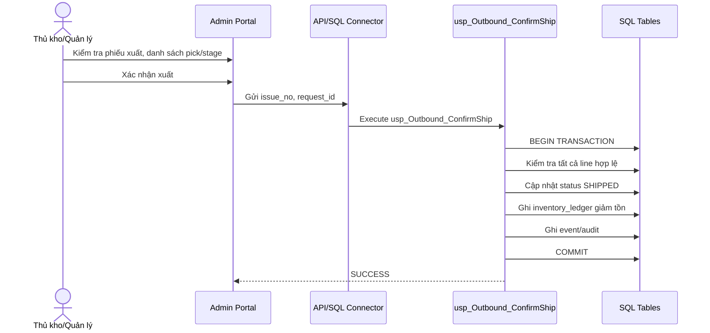

# Sequence Diagrams - App gọi SQL Stored Procedure

## 1. Nguyên tắc chung

Các sequence diagram trong tài liệu này mô tả mô hình:

```text
App / Handheld / Admin Portal → API Wrapper hoặc SQL Connector → SQL Stored Procedure → Data Tables
```

Stored Procedure là nơi xử lý logic nghiệp vụ, transaction, event, ledger và audit.

---

## 2. Nhập tạm thùng 60



---

## 3. Thủ kho xác nhận nhập chính thức



---

## 4. Đóng Pack360 OEM/PO



---

## 5. Chuyển stock type sang BLOCKED



---

## 6. Giải phóng/tách Pack360



---

## 7. Xuất lẻ từ thùng 60



---

## 8. Xác nhận xuất kho


