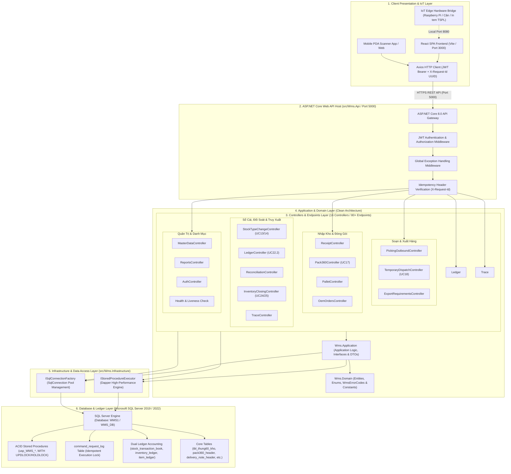

# Component Diagram - Kiến Trúc Thành Phần Hệ Thống WMS (.NET Core 8.0 Web API)

Tài liệu này mô tả sơ đồ thành phần phần mềm (Component Architecture) của hệ thống WMS Kho Thành Phẩm, thể hiện kiến trúc nguyên khối Clean Architecture phát triển 100% trên nền tảng **C# ASP.NET Core Web API 8.0**, giao diện cơ sở Client React SPA và cơ sở dữ liệu Microsoft SQL Server.

> [!IMPORTANT]
> **Khẳng định Kiến Trúc:** Hệ thống WMS Backend hoạt động 100% trên C# .NET Core / ASP.NET Core Web API (Port 5000/5001). Toàn bộ các máy chủ trung gian cũ (Node.js/Express Backend) đã được loại bỏ và thay thế hoàn toàn bởi C# API Server để bảo đảm ACID Transactions, hiệu năng truy vấn Dapper tối đa, và tính đồng nhất công nghệ.

---

## 1. Sơ Đồ Thành Phần Tổng Thể (System Component Diagram)

---

## 2. Chi Tiết Các Tầng Thành Phần (Layer Description)

### 1. Client Presentation & IoT Edge Layer
- **React SPA (Vite):** Giao diện Web hiện đại phục vụ các trạm màn hình lớn trên máy tính bàn (Trạm Nhập, Trạm Đóng gói, Trạm Bảo Vệ) và tối ưu hóa hiển thị cho thiết bị cầm tay PDA máy quét mã vạch.
- **HTTP Client (Axios):** Được thiết lập tiêu chuẩn trong `pickingApi.js` và các service client, tự động chèn JWT Token vào Header `Authorization` và tạo chuỗi UUID duy nhất truyền qua Header `X-Request-Id` trên mọi thao tác gửi/đổi dữ liệu (`POST`, `PUT`, `DELETE`).
- **IoT Edge Bridge (Raspberry Pi 4):** Một daemon độc lập kết nối cục bộ (`http://localhost:8080` hoặc mạng trạm) làm nhiệm vụ đọc số Kg từ cân điện tử (RS232) và gửi lệnh in tem nhãn trực tiếp (TSPL Raw Port 9100) xuống máy in qua mạng TCP/IP.

### 2. API Gateway & Middleware Layer (`src/Wms.Api`)
- **ASP.NET Core Web API 8.0 Host:** Điểm vào duy nhất cho toàn bộ giao tiếp giữa Frontend và Backend.
- **JWT Authentication & Role Policy Handler:** Xác thực danh tính qua JSON Web Token và áp dụng kiểm duyệt theo quyền truy cập (`Picking.Scan`, `Picking.Manage`, `Picking.Ship`, `MasterData.Manage`, `Reports.Read`, `Ledger.Read`).
- **Idempotency Handler Verification:** Tầng trung gian và xử lý controller luôn kiểm tra header `X-Request-Id` trước khi khởi tạo SQL Transaction. Hệ thống tra cứu ID giao dịch trong bảng `command_request_log` (với khóa `WITH (UPDLOCK, HOLDLOCK)`). Nếu yêu cầu trùng lặp bị gửi lại do rớt mạng Wifi/PDA, hệ thống ngay lập tức phản hồi kết quả trước đó mà không thực thi lại giao dịch (Fail-fast Protection & Idempotent Retry).

### 3. Controllers & Endpoints Layer
Được cấu trúc hoá theo nguyên tắc phân tách rõ các luồng nghiệp vụ kho thành phẩm trong 16 bộ Controller:
1. `PickingOutboundController`: Quản lý soạn hàng, quét mã kho bãi, gợi ý FIFO, tập kết và xuất bến (UC16).
2. `TemporaryDispatchController`: Quản lý quy trình Xuất tạm & Nhập trả hàng linh hoạt 2 bước (UC18: `PENDING_OUT` $\to$ `TEMP_OUT`, trả nguyên trạng, trả đổi mã mới, trả theo SKU tái tạo).
3. `ExportRequirementsController`: Tiếp nhận nhu cầu xuất kho, tổng hợp đơn hàng xuất và lập phiếu xuất bến.
4. `ReceiptController`: Nghiệp vụ giao nhận bàn giao từ sản xuất, quét mã Thùng 60 và xác nhận nhập kho chính thức.
5. `Pack360Controller`: Đóng gói và gom Kiện 360, đóng gói lại (Repack), gán đơn hàng OEM (UC17).
6. `PalletController`: Cấu hình Pallet, gom hàng, lên bãi kệ và xuống kệ.
7. `OemOrdersController`: Quản lý và import các đơn hàng sản xuất gia công theo hợp đồng thêu OEM.
8. `StockTypeChangeController`: Xử lý chuyển cờ trạng thái kho (`BLOCK`, `RELEASE`, `RECLASSIFY`) theo quy trình UC13/UC14.
9. `LedgerController`: Truy xuất Sổ Cái Kép (Dual Ledger Transaction - UC22.2).
10. `ReconciliationController`: Đối soát tự động cân bằng giữa Sổ Cái Mặt Hàng (`item_ledger`), Sổ Cái Đơn Vị (`inventory_ledger`) và Tồn kho Vật lý thực tế.
11. `InventoryClosingController`: Chốt kho định kỳ hàng tháng và snapshot tồn kho (UC24, UC25).
12. `TraceController`: Truy xuất ngược lịch sử vòng đời Thùng 60, Kiện 360, chứng từ xuất nhập và dòng chảy tài sản kho.
13. `MasterDataController`: Quản lý danh mục xe tải, tài xế, bảo vệ kiểm cổng và khách hàng.
14. `ReportsController`: Phục vụ báo cáo nhanh vĩ mô (Macro), vi mô (Micro), vị trí bãi kho và kết xuất dữ liệu Excel/CSV.
15. `AuthController`: Quản lý định danh người dùng, cấp phân quyền và reset mật khẩu an toàn.
16. `Health & Liveness Check`: Đảm bảo chẩn đoán trạng thái sống động (Liveness) và mức độ sẵn sàng (Readiness) của hệ thống C# API và SQL Database thông qua MapHealthChecks (`/health`, `/health/live`, `/health/ready`).

### 4. Application, Domain & Infrastructure Layer (Clean Architecture)
- **Domain Layer (`Wms.Domain`):** Chứa định nghĩa chuẩn về thực thể, mã lỗi danh ngữ (`WmsErrorCodes`), hằng số chính (như Trạng thái thùng 60: `AVAILABLE`, `BLOCKED`, `ALLOCATED`, `PICKED`, `STAGED`, `DISPATCHED`, `TEMPORARY_ISSUE`).
- **Application Layer (`Wms.Application`):** Chứa định nghĩa dịch vụ, giao diện Dapper Execution (`IStoredProcedureExecutor`, `ISqlConnectionFactory`), các DTOs và xác thực nghiệp vụ.
- **Infrastructure Layer (`Wms.Infrastructure`):** Triển khai kết nối dữ liệu qua **Dapper High-Performance ORM**, quản lý connection pooling nhằm đảm bảo khả năng mở rộng với hàng nghìn lệnh quét PDA liên tục mà không gây giật lag hoặc quá tải RAM máy chủ.

### 5. Database Layer & Transaction ACID Assurance
- **MSSQL Server Engine:** Cơ sở dữ liệu chính yếu, lưu trữ toàn bộ trạng thái tài sản kho và thực thi các giao dịch cơ sở dữ liệu nguyên khối (Atomic Transaction).
- **Cơ chế Khóa Bi quan (Pessimistic Concurrency Locking):** Mọi thao tác làm thay đổi dữ liệu kho đều áp dụng mệnh đề khóa SQL `WITH (UPDLOCK, HOLDLOCK)`. Điều này ngăn chặn triệt để hiện tượng Deadlock và Race Condition khi nhiều nhân viên thủ kho quét trùng một mã vạch tại cùng một thời điểm chớp nhoáng.
- **Sổ Cái Kép Song Song (Dual Ledger Accounting):** Mọi thay đổi về tồn kho (Nhập kho, Xuất bến, Xuất tạm, Trả hàng, Đổi cờ Stock Type, Tách lẻ, Đóng kiện) đều buộc phải hạch toán song song vào 3 hệ thống bảng trong cùng một SQL Transaction:
  1. `stock_transaction_book`: Nhật ký giao dịch tổng quan theo chứng từ (TxID, Loại GD, Tài khoản thực thi).
  2. `inventory_ledger`: Sổ cái Đơn vị chứa chi tiết mã định danh độc nhất từng Thùng 60 / Kiện 360.
  3. `item_ledger`: Sổ cái Mặt hàng lưu trữ các bút toán Tăng/Giảm (Nợ/Có) số lượng theo mã sản phẩm SKU để sẵn sàng đối soát cân bằng và kết chuyển dữ liệu trực tiếp lên ERP/SAP.
