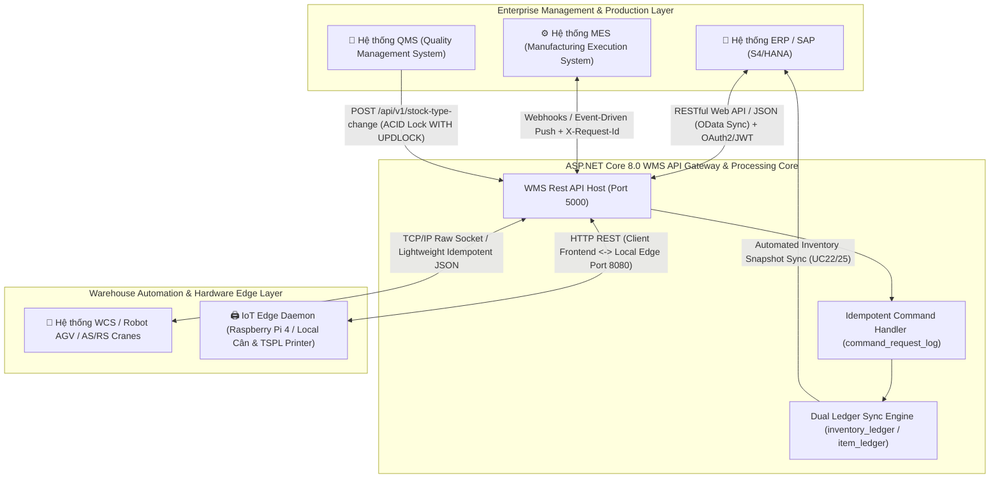

# Integration Specification - Đặc Tả Tích Hợp Hệ Thống WMS (.NET Core 8.0 Ecosystem)

Tài liệu đặc tả kiến trúc và giao thức tích hợp toàn diện (Comprehensive Integration Specifications) giữa phân hệ WMS Kho Thành Phẩm với các hệ thống điều hành xương sống bên ngoài thuộc cấu trúc Smart Factory (ERP/SAP, MES, WCS/Robot AGV, QMS).

> [!NOTE]
> **Khẳng định Nền tảng Tích hợp:** Mọi cổng kết nối API tích hợp bên dưới đều được xử lý và quản trị trực tiếp thông qua cụm **C# ASP.NET Core Web API 8.0** Server (Port 5000/5001) bảo đảm an toàn truyền tin tuyệt đối, xác thực luồng bằng chữ ký bảo mật và hạch toán tức thời qua Sổ Cái Kép (Dual Ledger).

---

## 1. Bản Đồ Tích Hợp Kiến Trúc (Enterprise Integration Architecture Map)



---

## 2. Chi Tiết Giao Thức Tích Hợp & Nguyên Tắc Hạch Toán Kép

### 2.1. Tích Hợp WMS $\leftrightarrow$ ERP / SAP (Quản Trị Doanh Nghiệp & Hạch Toán Kế Toán)
- **Mục tiêu Nghiep vụ:** Đồng bộ hóa danh mục tài sản thô và truyền dữ liệu hạch toán thực tế tức thời sau mỗi chặng dịch chuyển hàng hóa xuất/nhập/chốt kỳ kho.
- **Luồng dữ liệu tích hợp:**
  - **ERP $\rightarrow$ WMS (Inbound Sync):**
    - Đồng bộ danh mục Sản phẩm thành phẩm (Master SKU), Danh bạ Khách hàng (`tbl_customers`), và Đơn Đặt Hàng OEM / Đơn Xuất Kho (`tbl_oem_orders`, `export_request_header`).
    - *Endpoint WMS tra cứu/tiếp nhận:* `POST /api/v1/oem-orders`, `POST /api/v1/master/customers`.
  - **WMS $\rightarrow$ ERP (Outbound Financial & Stock Sync):**
    - Khi giao dịch Xuất bến (`DISPATCHED` - UC16) hoặc Khóa sổ cuối kỳ (UC25 - `PERIOD_END_CLOSING`) hoàn tất thành công tại ASP.NET Core API, hệ thống trích xuất **Sổ Cái Mặt Hàng (`item_ledger`)** để gửi sang ERP/SAP.
    - Việc hạch toán dựa trên Sổ cái Mặt hàng mang lại lợi ích khổng lồ: ERP không cần tiêu tốn RAM để cộng rà quét nghìn dòng Thùng 60 lẻ, mà chỉ cần nhận các con số Nợ/Có tổng hợp theo mã SKU và mã Phiếu giao dịch (`transaction_id`).
- **Giao thức & Bảo mật:** HTTPS RESTful APIs, định dạng payload JSON chuẩn hóa, bảo mật qua hệ thống chữ ký OAuth2 / Bearer JWT Token.

---

### 2.2. Tích Hợp WMS $\leftrightarrow$ MES (Điều Hành Sản Xuất Dây Chuyền Fab)
- **Mục tiêu Nghiệp vụ:** Kết dính mượt mà đầu ra của Dây chuyền Đóng gói Nhà máy với cửa mở Kho Thành Phẩm (Inbound Reception - UC02, UC03, UC04).
- **Luồng dữ liệu tích hợp:**
  - **MES $\rightarrow$ WMS:**
    - Ngay sau khi xưởng hoàn tất đóng đóng Thùng 60 trên băng chuyền, hệ thống MES gửi lệnh thông báo Phiếu Bàn Giao Sản Xuất (Production Handover Ticket).
    - Đồng thời, truyền lệnh gán đợt theo Đơn hàng thêu OEM tương ứng (`POST /api/v1/receipt/map-order`).
  - **WMS $\rightarrow$ MES:**
    - Khi Thủ kho xác nhận quét QR Code bằng PDA tại bàn ra hàng xưởng (`POST /api/v1/receipt/confirm-nhap-kho` hoặc `confirm-nhap-le`), WMS lập tức kích hoạt Webhook phản hồi trạng thái hoàn bỉnh về cho MES để chốt sản lượng ca sản xuất.
- **Cơ chế chịu lỗi & An toàn (Fail-fast Assurance):**
  - Mọi tín hiệu đẩy sang WMS đều buộc phải chèn Header `X-Request-Id`. Nếu mạng Wifi/LAN nhà xưởng nhiễu sóng cọ kẹt khiến MES gửi tin nhắn 2 lần, tầng Idempotency Middleware tại WMS lập tức phát hiện trong bảng `command_request_log` và phản hồi thành công ảo mà **không ghi nợ dư thừa** tồn kho.

---

### 2.3. Tích Hợp WMS $\leftrightarrow$ WCS / Robot AGV (Tự Động Hóa Kho AS/RS)
- **Mục tiêu Nghiệp vụ:** Điều khiển luồng Robot AGV hoặc Cần trục tự động di chuyển Thùng 60, Kiện 360 và Pallet lên xuống vị trí kệ cao tầng bãi kho (Putaway & Letdown).
- **Luồng dữ liệu tích hợp:**
  - **WMS $\rightarrow$ WCS:**
    - Khi Thủ kho khởi xướng lệnh hạ giá Pallet xuống trạm Soạn hàng (`POST /api/v1/pallet/{id}/letdown`) hoặc chuyển tiếp kệ bãi, WMS gửi tọa độ Kệ Nguồn (`CurrentLocationCode`) và Vị Trí Đích (`TargetStagingBin`) qua kết nối Socket hoặc API nhúng.
  - **WCS $\rightarrow$ WMS:**
    - Sau khi Robot AGV thả hàng an toàn xuống bãi nhận, WCS gọi về WMS báo hiệu thành công. Hệ thống WMS kích hoạt cập nhật trường `current_location_code` cho toàn bộ mã tài sản có liên quan, đồng thời ghi lại sự kiện vào bảng lịch sử `thung60_event` và `pack360_event`.
- **Giao thức:** TCP Socket liên tục hoặc Lightweight High-speed REST API với payload JSON tối giản tối đa nhắm tiết kiệm băng thông nội bộ.

---

### 2.4. Tích Hợp WMS $\leftrightarrow$ QMS (Hệ Thống Quản Lý Chất Lượng Cung Ứng)
- **Mục tiêu Nghiệp vụ:** Phong tỏa tức thì (Quarantine) các Thùng 60 hoặc Kiện 360 bị phát hiện nghi ngờ lỗi kỹ thuật thêu may hoặc lệch màu trong quá trình hậu kiểm tra chất lượng.
- **Luồng dữ liệu tích hợp:**
  - **QMS $\rightarrow$ WMS (Emergency Block / Release Action):**
    - Hệ thống QMS phát lệnh yêu cầu sang C# API thông qua endpoint chuyên dụng:
      ```http
      POST /api/v1/stock-type-change
      Content-Type: application/json
      X-Request-Id: QMS-EVT-8822-1144
      Authorization: Bearer <QMS_SERVICE_TOKEN>

      {
        "changeType": "BLOCK",
        "newStockType": "BLOCKED",
        "reasonCode": "QMS_DEFECT_COLOR_MISMATCH",
        "items": [ { "id60": "60001290382" }, { "id60": "60001290383" } ]
      }
      ```
  - **Cơ chế Thực Thi Bảo Vệ ACID tại WMS:**
    - Khi nhận lệnh phong tỏa từ QMS, ASP.NET Core API ngay lập tức thiết lập một khóa Transaction bi quan `WITH (UPDLOCK, HOLDLOCK)` trên từng Thùng 60 trong bảng `tbl_thung60_kho`.
    - Thao tác khóa này ngăn chặn tức thì mọi hành vi quét mã tiếp diễn trên thiết bị PDA: Nếu thủ kho cố tình quét Thùng đang bị QMS khóa để chất lên xe xuất bến (`/api/v1/picking/scan`), Stored Procedure `usp_WMS_UC16_ScanBarcode` lập tức chặn ngắt, phát sinh mã lỗi `409 Conflict (InvalidStateTransition)` và hiển thị cảnh báo "Thùng đang bị Khóa Kiểm Định Chất Lượng" lên trang web / PDA máy quét.
