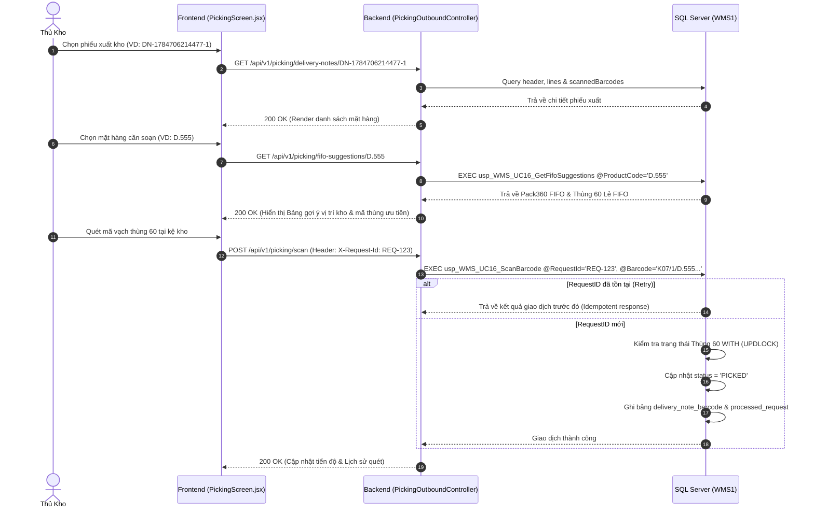
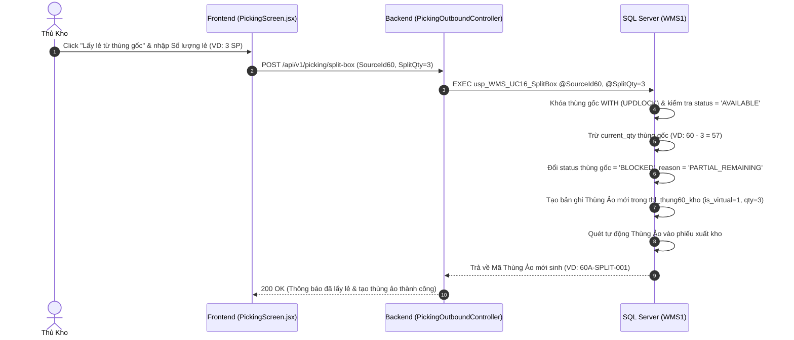
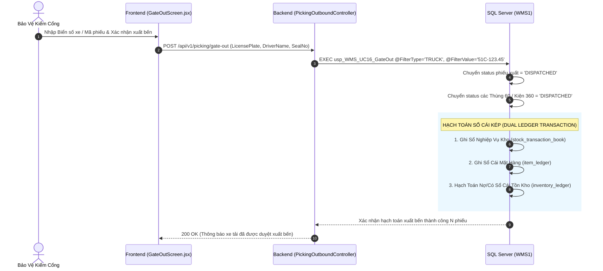
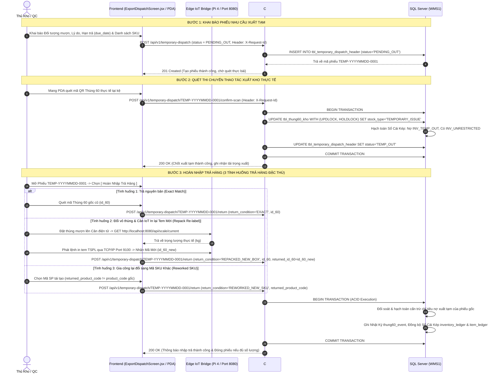
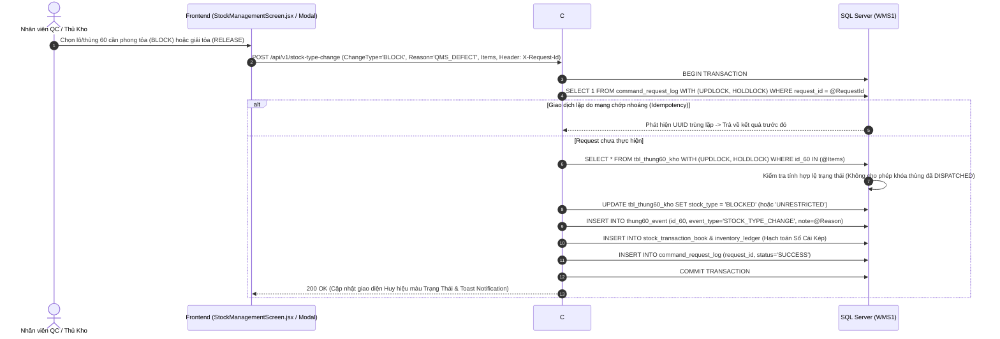
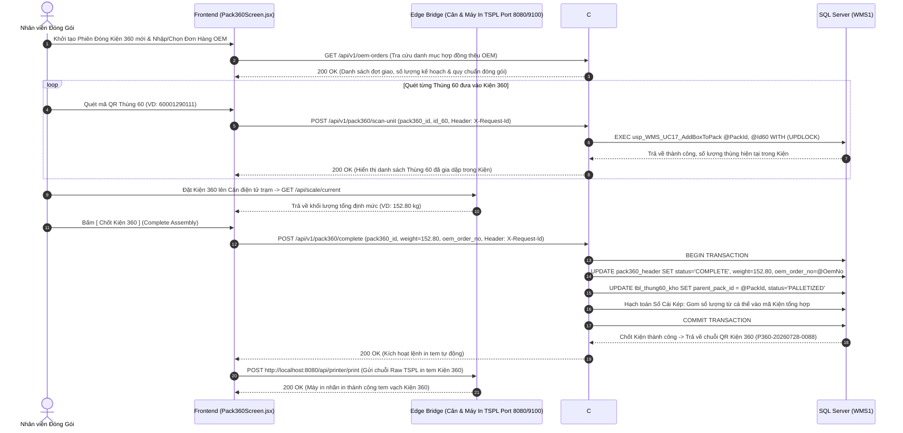

# Sequence Diagrams - Biểu Đồ Tuần Tự Luồng Nghiệp Vụ WMS

Tài liệu này tổng hợp các biểu đồ tuần tự (Sequence Diagram) mô tả chi tiết luồng tương tác giữa Người dùng, Giao diện Frontend, Backend API và Cơ sở dữ liệu SQL Server.

---

## 1. UC16 - Luồng Soạn Hàng & Gợi Ý FIFO (Outbound Picking Flow)

---

## 2. UC16 / UC17 - Luồng Lấy Lẻ Từ Thùng Gốc & Tạo Thùng Ảo (Split Box Flow)

---

## 3. UC16 - Luồng Kiểm Cổng & Hạch Toán Sổ Cái Kép (Unified Gate Out & Dual Ledger Flow)

---

## 4. UC18 - Luồng Xuất Tạm 2 Bước & Hoàn Nhập Trả Hàng Linh Hoạt (Two-Stage Temporary Dispatch & Flexible Return Flow)

---

## 5. UC13 / UC14 - Luồng Chuyển Cờ Trạng Thái Kho & Phong Tỏa QMS (Stock Type Transfer Flow)

---

## 6. UC17 - Luồng Gom Đóng Kiện 360 & Gán Đơn Hàng OEM (Pack360 Assembly & OEM Mapping)

