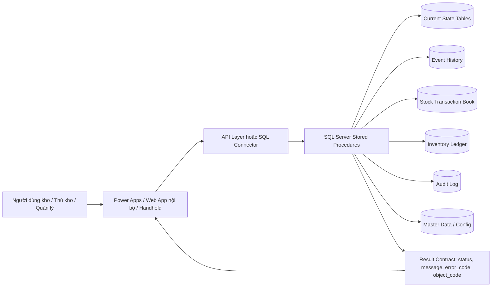
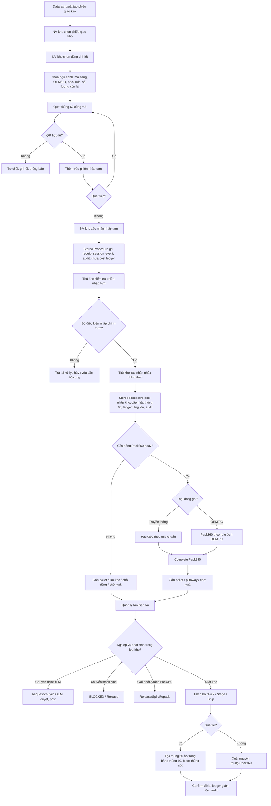

# AI Antigravity Guide - WMS Kho Thành Phẩm

**Dự án:** Hệ thống quản lý kho thành phẩm sản xuất  
**Tên hệ thống:** Finished Goods Warehouse Management System / WMS Kho Thành Phẩm  
**Đối tượng trung tâm:** Thùng 60  
**Phiên bản tài liệu:** 2.0  
**Mục tiêu:** Giúp AI Antigravity hiểu đúng nghiệp vụ, kiến trúc công nghệ, dữ liệu, stored procedure, UI/API và nguyên tắc sinh code cho dự án.

---

## 1. Cách AI Antigravity phải hiểu dự án này

AI Antigravity cần đóng vai trò như một **System Analyst + Solution Architect + Senior Developer** cho hệ thống WMS kho thành phẩm.

Hệ thống này không phải chỉ là app ghi nhận quét QR. Đây là hệ thống kiểm soát vòng đời thùng 60, Pack360, pallet, vị trí, tồn kho, stock type, ledger và audit.

AI phải luôn nhớ:

> **App chỉ truyền tham số. Logic nghiệp vụ chạy trong SQL Server Stored Procedure.**

Không được thiết kế theo hướng UI hoặc Web API tự cập nhật trực tiếp các bảng nghiệp vụ.

---

## 2. Kiến trúc công nghệ mục tiêu



### 2.1. Trách nhiệm từng lớp

| Lớp | Trách nhiệm |
|---|---|
| Power Apps / Web App / Handheld | Hiển thị màn hình, scan QR, nhận input, validate cơ bản, gọi API/SP, hiển thị kết quả |
| API Layer / Connector | Nhận request, xác thực, map tham số, gọi Stored Procedure, trả kết quả chuẩn |
| SQL Server Stored Procedure | Xử lý toàn bộ nghiệp vụ, rule, transaction, event, ledger, audit, rollback |
| Current State Tables | Lưu trạng thái hiện tại của thùng 60, Pack360, pallet, vị trí, tồn kho |
| Event History | Lưu mọi sự kiện thay đổi vòng đời đối tượng |
| Inventory Ledger | Ghi tăng/giảm tồn hoặc phân loại lại tồn |
| Audit Log | Ghi ai làm, lúc nào, trước/sau ra sao |

---

## 3. Nguyên tắc bắt buộc khi sinh code

| Mã nguyên tắc | Nội dung |
|---|---|
| AI-RULE-001 | UI/App không được update trực tiếp bảng nghiệp vụ. |
| AI-RULE-002 | Mọi nghiệp vụ ghi dữ liệu phải gọi Stored Procedure. |
| AI-RULE-003 | Stored Procedure là Orchestrator nghiệp vụ trong SQL Server. |
| AI-RULE-004 | Mỗi command thay đổi dữ liệu phải có `request_id` để chống gửi lặp. |
| AI-RULE-005 | Stored Procedure phải dùng transaction và rollback khi lỗi. |
| AI-RULE-006 | Mọi thay đổi trạng thái, stock type, Pack360, pallet, vị trí phải ghi event history. |
| AI-RULE-007 | Mọi nghiệp vụ tăng/giảm tồn hoặc phân loại lại tồn phải ghi Inventory Ledger. |
| AI-RULE-008 | Mọi nghiệp vụ quan trọng phải ghi Audit Log. |
| AI-RULE-009 | Không xóa dữ liệu nghiệp vụ đã phát sinh; nếu sai phải dùng hủy, reversal, adjustment hoặc exception. |
| AI-RULE-010 | `status` và `stock_type` là hai khái niệm khác nhau, không được gộp. |
| AI-RULE-011 | Dư đơn OEM hoặc vấn đề chất lượng phát hiện trong kho phải dùng `stock_type = BLOCKED`. |
| AI-RULE-012 | `TEMPORARY_ISSUE` chỉ dùng cho nghiệp vụ xuất tạm, không dùng cho dư đơn hoặc lỗi chất lượng. |
| AI-RULE-013 | Thùng 60 ảo không có bảng riêng; là bản ghi mới trong bảng thùng 60 hiện có. |
| AI-RULE-014 | Pack360 đã tạo không được xóa lịch sử; nếu cần thì release, split hoặc repack có event và audit. |

---

## 4. Bối cảnh nghiệp vụ

Kho thành phẩm nhận hàng từ sản xuất/đóng gói. Dữ liệu phiếu giao kho đến từ data sản xuất. Nhân viên kho chọn phiếu giao kho, chọn dòng chi tiết, sau đó quét thùng 60 cùng mã hàng.

Quy trình nhập kho có 2 bước:

1. **Nhập tạm:** nhân viên kho quét và xác nhận nhập tạm.
2. **Nhập chính thức:** thủ kho kiểm tra và xác nhận chính thức trên giao diện quản lý riêng.

Chỉ khi thủ kho xác nhận nhập chính thức, hệ thống mới post ledger tăng tồn và thùng 60 mới thành tồn chính thức.

Kho không thực hiện kiểm soát chất lượng đầu vào. Chất lượng đã được kiểm soát trước khi sản xuất giao kho. Nếu trong quá trình lưu kho phát hiện vấn đề chất lượng, phải dùng nghiệp vụ chuyển `stock_type = BLOCKED`, reason `QUALITY_ISSUE`.

---

## 5. Đối tượng nghiệp vụ cốt lõi

### 5.1. Thùng 60

Thùng 60 là đối tượng trung tâm của hệ thống.

Một thùng 60 cần quản lý:

- mã QR / ID thùng
- mã hàng
- số lượng chuẩn
- số lượng hiện tại
- OEM order / PO nếu có
- pack rule
- trạng thái vận hành
- stock type
- pallet hiện tại
- Pack360 hiện tại
- vị trí hiện tại
- phiếu nhập / phiếu xuất liên quan
- có phải thùng ảo không
- thùng cha / thùng gốc nếu là thùng ảo
- lịch sử event
- audit thao tác

### 5.2. Thùng 60 ảo

Thùng 60 ảo sinh ra khi xuất lẻ từ thùng 60 gốc.

Không tạo bảng riêng cho thùng 60 ảo. Thùng 60 ảo là một bản ghi mới trong bảng thùng 60 hiện có.

Ví dụ:

```text
Thùng gốc: 60A
Số lượng hiện tại: 60 cây
Xuất lẻ: 3 cây
```

Hệ thống tạo bản ghi mới:

```text
id_60 = 60A-SPLIT-001
is_virtual = 1
parent_id_60 = 60A
root_id_60 = 60A
current_qty = 3
created_from_issue_no = phiếu xuất
```

Cập nhật thùng gốc:

```text
id_60 = 60A
current_qty = 57
stock_type = BLOCKED
block_reason_code = PARTIAL_REMAINING
is_full_box = 0
```

### 5.3. Pack360

Pack360 là đơn vị đóng gói/handling unit chứa một hoặc nhiều thùng 60.

Có hai nhóm đóng Pack360:

| Loại Pack360 | Rule |
|---|---|
| Truyền thống | Thường cùng mã hàng, theo số lượng/slot chuẩn |
| OEM/PO | Theo rule đơn OEM/PO; có thể khác mã hàng và số lượng tùy đơn |

Pack360 có thể phát sinh các nghiệp vụ:

- tạo Pack360 OPEN
- thêm thùng 60
- complete Pack360
- giải phóng Pack360
- tách một/vài thùng 60 khỏi Pack360
- đóng lại Pack360 mới

### 5.4. Stock Type

Stock type quyết định tồn có được sử dụng/xuất hay không.

| Stock Type | Khi dùng | Được xuất mặc định? |
|---|---|---|
| `UNRESTRICTED` | Tồn tự do, được sử dụng | Có |
| `BLOCKED` | Dư đơn OEM, vấn đề chất lượng trong kho, chờ quyết định, thùng gốc bị lấy lẻ còn thiếu chuẩn | Không |
| `RETURNED` | Hàng trả về | Tùy phê duyệt |
| `TEMPORARY_ISSUE` | Hàng xuất tạm ra khỏi kho, cần hoàn trả/tất toán | Không |
| `CUSTOMER_OWNED` | Hàng thuộc khách/bên ngoài | Không |
| `SCRAP` | Hàng hủy/phế | Không |

---

## 6. Quy trình end-to-end cần AI hiểu



---

## 7. Danh mục Stored Procedure nghiệp vụ chính

### 7.1. Nhập kho

| Stored Procedure | Mục đích |
|---|---|
| `usp_Receipt_GetProductionHandoverLines` | Lấy phiếu giao kho và dòng chi tiết từ data sản xuất |
| `usp_Receipt_ScanThung60` | Ghi nhận thùng 60 vào phiên nhập tạm |
| `usp_Receipt_TempConfirm` | Nhân viên kho xác nhận nhập tạm |
| `usp_Receipt_ReturnForCheck` | Thủ kho trả lại để kiểm tra |
| `usp_Receipt_CancelTempSession` | Hủy phiên nhập tạm |
| `usp_Receipt_OfficialConfirm` | Thủ kho xác nhận nhập chính thức và post ledger tăng tồn |

### 7.2. Pack360

| Stored Procedure | Mục đích |
|---|---|
| `usp_Pack360_Create` | Tạo Pack360 OPEN |
| `usp_Pack360_AddThung60` | Thêm thùng 60 vào Pack360 |
| `usp_Pack360_Complete` | Hoàn tất Pack360 |
| `usp_Pack360_Release` | Giải phóng toàn bộ Pack360 |
| `usp_Pack360_SplitUnits` | Tách một/vài thùng 60 khỏi Pack360 |
| `usp_Pack360_Repack` | Đóng lại Pack360 mới |

### 7.3. Pallet / Location

| Stored Procedure | Mục đích |
|---|---|
| `usp_Pallet_AttachUnit` | Gán thùng 60 hoặc Pack360 lên pallet |
| `usp_Pallet_DetachUnit` | Tách khỏi pallet |
| `usp_Pallet_PutawayToLocation` | Đưa pallet lên kệ/vị trí |
| `usp_Pallet_MoveLocation` | Chuyển vị trí pallet |

### 7.4. Chuyển đơn OEM

| Stored Procedure | Mục đích |
|---|---|
| `usp_OEM_Transfer_RequestCreate` | Tạo yêu cầu chuyển đơn OEM |
| `usp_OEM_Transfer_Approve` | Duyệt yêu cầu |
| `usp_OEM_Transfer_Post` | Post chuyển đơn, cập nhật OEM/PO/pack rule |

### 7.5. Stock Type

| Stored Procedure | Mục đích |
|---|---|
| `usp_StockType_Change_RequestCreate` | Tạo yêu cầu đổi stock type |
| `usp_StockType_Change_Approve` | Duyệt yêu cầu đổi stock type |
| `usp_StockType_Change_Post` | Post đổi stock type, ghi reclassification ledger |
| `usp_StockType_Block` | Khóa tồn nhanh với lý do cụ thể |
| `usp_StockType_Release` | Release tồn bị khóa |

### 7.6. Xuất kho và xuất lẻ

| Stored Procedure | Mục đích |
|---|---|
| `usp_Outbound_CreateIssue` | Tạo phiếu xuất |
| `usp_Outbound_Allocate` | Phân bổ tồn |
| `usp_Outbound_PickUnit` | Pick nguyên thùng 60/Pack360 |
| `usp_Outbound_PartialIssue` | Xuất lẻ, tạo thùng 60 ảo trong cùng bảng thùng 60 |
| `usp_Outbound_Stage` | Đưa hàng ra staging |
| `usp_Outbound_ConfirmShip` | Xác nhận xuất, ledger giảm tồn |
| `usp_Outbound_CancelIssue` | Hủy phiếu xuất / đảo phân bổ |

### 7.7. Xuất tạm

| Stored Procedure | Mục đích |
|---|---|
| `usp_TempIssue_Create` | Tạo chứng từ xuất tạm |
| `usp_TempIssue_Confirm` | Xác nhận xuất tạm, stock type `TEMPORARY_ISSUE` |
| `usp_TempIssue_Return` | Hoàn nhập hàng xuất tạm |
| `usp_TempIssue_Settle` | Tất toán xuất tạm |

---

## 8. Tham số chuẩn cho Stored Procedure

Mọi stored procedure làm thay đổi dữ liệu phải nhận các tham số chuẩn:

```sql
@request_id NVARCHAR(100),
@user_code NVARCHAR(100),
@user_email NVARCHAR(255),
@device_id NVARCHAR(100) = NULL,
@source_screen NVARCHAR(100) = NULL,
@note NVARCHAR(500) = NULL
```

Mỗi stored procedure phải trả result contract chuẩn:

```sql
SELECT
    @status AS status,
    @message AS message,
    @error_code AS error_code,
    @document_no AS document_no,
    @object_code AS object_code,
    @request_id AS request_id,
    @trace_id AS trace_id;
```

Các giá trị `status` đề xuất:

```text
SUCCESS
FAILED
VALIDATION_FAILED
DUPLICATE_REQUEST
CONFLICT
PERMISSION_DENIED
```

---

## 9. Data model định hướng

### 9.1. Bảng current state chính

| Bảng | Mục đích |
|---|---|
| `tbl_thung60_kho` | Current state của thùng 60, gồm cả thùng 60 vật lý và thùng 60 ảo |
| `pack360_header` | Header Pack360 |
| `pack360_unit` | Danh sách thùng 60 thuộc Pack360 hiện tại |
| `pallet_current` | Current state pallet |
| `location_master` | Master vị trí/kệ/bin |
| `inventory_balance` | Tồn hiện tại theo dimension quản lý |

### 9.2. Field quan trọng trong `tbl_thung60_kho`

```text
id_60
qr_60
product_code
current_qty
standard_qty
uom
status_code
stock_type
block_reason_code
oem_order_no
po_no
pack_rule_code
pack360_id
pallet_id
location_code
is_virtual
parent_id_60
root_id_60
source_split_event_id
created_from_issue_no
created_from_issue_line_no
is_full_box
last_event_type
last_event_at
last_event_by
```

### 9.3. Bảng lịch sử và kiểm soát

| Bảng | Mục đích |
|---|---|
| `thung60_event` | Event vòng đời thùng 60 |
| `pack360_event` | Event Pack360 |
| `inventory_ledger` | Sổ cái tồn kho |
| `stock_transaction_book` | Sổ nghiệp vụ kho |
| `audit_log` | Audit thao tác |
| `thung60_split_history` | Lịch sử xuất lẻ/tách số lượng từ thùng 60 |
| `pack360_relation_history` | Lịch sử quan hệ thùng 60 - Pack360 |

---

## 10. Quy tắc xử lý nghiệp vụ quan trọng

### 10.1. Nhập kho

- Nhân viên kho phải chọn phiếu giao kho từ data sản xuất.
- Nhân viên kho phải chọn dòng chi tiết trước khi quét.
- Một phiên nhập tạm chỉ áp dụng cho một dòng chi tiết.
- Hệ thống tự động lấy OEM/PO/pack rule từ dòng chi tiết.
- Nhập tạm chưa được xem là tồn chính thức.
- Chỉ thủ kho xác nhận nhập chính thức mới được post ledger tăng tồn.

### 10.2. Pack360

- Hàng truyền thống đóng theo rule chuẩn.
- Hàng OEM/PO có thể đóng khác mã hàng và số lượng tùy đơn.
- Một thùng 60 chỉ thuộc một Pack360 active tại một thời điểm.
- Không xóa Pack360 đã tạo; nếu cần thì release/split/repack.

### 10.3. Stock Type

- `BLOCKED` không được phân bổ, pick, stage, xuất.
- Dư đơn dùng `BLOCKED`, reason `OEM_SURPLUS`.
- Vấn đề chất lượng trong kho dùng `BLOCKED`, reason `QUALITY_ISSUE`.
- Thùng gốc bị lấy lẻ dùng `BLOCKED`, reason `PARTIAL_REMAINING`.
- `TEMPORARY_ISSUE` chỉ dành cho xuất tạm.

### 10.4. Xuất lẻ

- Xuất lẻ chỉ dùng khi lấy một phần số lượng từ thùng 60 gốc.
- Hệ thống tạo bản ghi thùng 60 mới trong cùng bảng `tbl_thung60_kho`.
- Bản ghi mới có `is_virtual = 1`, `parent_id_60`, `root_id_60`.
- Thùng gốc cập nhật lại `current_qty` và chuyển `stock_type = BLOCKED` nếu không đủ số lượng chuẩn.
- Phải ghi `thung60_split_history`, event, audit và ledger nếu có biến động tồn.

---

## 11. Mẫu stored procedure pattern

AI khi sinh stored procedure nên dùng pattern sau:

```sql
CREATE OR ALTER PROCEDURE dbo.usp_Sample_Command
    @request_id NVARCHAR(100),
    @user_code NVARCHAR(100),
    @user_email NVARCHAR(255),
    @device_id NVARCHAR(100) = NULL,
    @source_screen NVARCHAR(100) = NULL,
    @note NVARCHAR(500) = NULL
AS
BEGIN
    SET NOCOUNT ON;
    SET XACT_ABORT ON;

    DECLARE @status NVARCHAR(50) = 'SUCCESS';
    DECLARE @message NVARCHAR(500) = N'Thành công';
    DECLARE @error_code NVARCHAR(100) = NULL;
    DECLARE @trace_id UNIQUEIDENTIFIER = NEWID();

    BEGIN TRY
        -- 1. Idempotency check by request_id
        IF EXISTS (SELECT 1 FROM dbo.command_request_log WHERE request_id = @request_id AND status = 'SUCCESS')
        BEGIN
            SELECT 'DUPLICATE_REQUEST' AS status,
                   N'Yêu cầu đã được xử lý trước đó' AS message,
                   NULL AS error_code,
                   NULL AS document_no,
                   NULL AS object_code,
                   @request_id AS request_id,
                   CAST(@trace_id AS NVARCHAR(50)) AS trace_id;
            RETURN;
        END

        BEGIN TRANSACTION;

        -- 2. Validate business rules
        -- 3. Update current state
        -- 4. Write event history
        -- 5. Write ledger if needed
        -- 6. Write audit log
        -- 7. Write command request log

        COMMIT TRANSACTION;
    END TRY
    BEGIN CATCH
        IF @@TRANCOUNT > 0 ROLLBACK TRANSACTION;

        SET @status = 'FAILED';
        SET @message = ERROR_MESSAGE();
        SET @error_code = 'SQL_EXCEPTION';
    END CATCH;

    SELECT @status AS status,
           @message AS message,
           @error_code AS error_code,
           NULL AS document_no,
           NULL AS object_code,
           @request_id AS request_id,
           CAST(@trace_id AS NVARCHAR(50)) AS trace_id;
END;
```

---

## 12. UI/UX guideline cho AI

Khi tạo UI, AI phải ưu tiên vận hành kho thực tế:

- Màn hình scan phải ít thao tác, focus vào ô QR.
- Luôn hiển thị ngữ cảnh đang quét: phiếu, dòng, mã hàng, OEM/PO, số lượng đã quét, còn lại.
- Mọi lỗi phải trả thông báo rõ: sai mã, QR trùng, stock bị khóa, không đủ quyền.
- Các thao tác nguy hiểm phải yêu cầu xác nhận: nhập chính thức, đổi stock type, release stock, split Pack360, xuất lẻ, confirm ship.
- Giao diện thủ kho phải có danh sách chờ xử lý: nhập tạm, blocked stock, Pack360 need review, partial remaining, xuất tạm quá hạn.
- Hồ sơ thùng 60 phải xem được timeline: nhập, pallet, Pack360, chuyển đơn, blocked/release, split, xuất.

---

## 13. Error code chuẩn

| Error Code | Ý nghĩa |
|---|---|
| `QR_NOT_FOUND` | QR không tồn tại |
| `DUPLICATE_QR` | QR đã quét trong phiên |
| `INVALID_STATUS` | Trạng thái không hợp lệ |
| `INVALID_STOCK_TYPE` | Stock type không cho phép thao tác |
| `BLOCKED_STOCK` | Hàng đang bị khóa |
| `DUPLICATE_REQUEST` | Request đã xử lý trước đó |
| `PACK360_RULE_FAILED` | Không đạt rule Pack360 |
| `OEM_RULE_FAILED` | Không đạt rule OEM/PO |
| `PARTIAL_QTY_INVALID` | Số lượng xuất lẻ không hợp lệ |
| `OBJECT_CONFLICT` | Đối tượng đang bị thao tác bởi người khác |
| `PERMISSION_DENIED` | Không đủ quyền |
| `LEDGER_POST_FAILED` | Ghi ledger thất bại |
| `OFFICIAL_CONFIRM_REQUIRED` | Cần thủ kho xác nhận chính thức |

---

## 14. Test case bắt buộc AI phải tạo khi sinh chức năng

| Nhóm test | Test bắt buộc |
|---|---|
| Nhập kho | Quét đúng, quét sai mã, quét trùng, nhập tạm, thủ kho xác nhận, hủy nhập tạm |
| Pack360 | Rule truyền thống, rule OEM/PO khác mã, complete, release, split, repack |
| Stock Type | Block OEM surplus, block quality issue, release, không cho xuất hàng blocked |
| Xuất lẻ | Tạo thùng 60 ảo trong cùng bảng, block thùng gốc, ghi split history |
| Xuất kho | Allocate, pick, stage, confirm ship, ledger giảm tồn |
| Request ID | Gửi lặp không ghi trùng |
| Audit | Mọi thao tác quan trọng có audit |
| Ledger | Nhập chính thức tăng tồn, xuất giảm tồn, stock reclassification nếu cần |

---

## 15. Anti-pattern tuyệt đối tránh

AI không được sinh code theo các hướng sau:

1. UI update trực tiếp `tbl_thung60_kho`.
2. API service tự xử lý rule nghiệp vụ thay vì gọi stored procedure.
3. Quên `request_id` trong command thay đổi dữ liệu.
4. Xóa Pack360 hoặc xóa mapping để “làm sạch dữ liệu”.
5. Tạo bảng riêng cho thùng 60 ảo.
6. Dùng `TEMPORARY_ISSUE` cho hàng dư đơn hoặc lỗi chất lượng.
7. Cho phép xuất hàng `BLOCKED`.
8. Chỉ cập nhật current state mà không ghi event/audit.
9. Ghi ledger trực tiếp từ UI.
10. Sửa chứng từ đã post mà không reversal/adjustment.

---

## 16. Prompt mẫu cho AI Antigravity

### 16.1. Prompt sinh Stored Procedure

```text
Bạn là senior SQL Server developer cho dự án WMS kho thành phẩm.
Hãy sinh stored procedure theo tài liệu AI_Antigravity_Guide.md.
Nguyên tắc bắt buộc:
- App chỉ gọi stored procedure, không update trực tiếp bảng.
- Stored procedure phải có request_id, user_code, user_email, device_id, source_screen.
- Phải dùng transaction, validate rule, ghi current state, event, ledger nếu cần, audit log.
- Phải trả result contract: status, message, error_code, document_no, object_code, request_id, trace_id.
- Không xóa dữ liệu nghiệp vụ; sai thì xử lý bằng trạng thái/event.
Chức năng cần sinh: <mô tả chức năng>.
```

### 16.2. Prompt sinh UI

```text
Bạn là senior Power Apps/Web App designer cho dự án WMS kho thành phẩm.
Hãy thiết kế UI theo tài liệu AI_Antigravity_Guide.md.
UI chỉ gọi API/stored procedure, không update trực tiếp bảng.
Màn hình phải phù hợp thao tác kho: scan-first, ít thao tác, thông báo lỗi rõ, có xác nhận cho nghiệp vụ nguy hiểm.
Chức năng cần thiết kế: <mô tả chức năng>.
```

### 16.3. Prompt sinh test case

```text
Bạn là QA lead cho dự án WMS kho thành phẩm.
Hãy tạo test case cho chức năng <tên chức năng> theo tài liệu AI_Antigravity_Guide.md.
Phải kiểm tra: nghiệp vụ thành công, validation lỗi, request_id gửi lặp, stock type, event history, ledger, audit và phân quyền.
```

---

## 17. Danh mục tài liệu liên quan trong bộ hồ sơ

| File | Mục đích |
|---|---|
| `02_Process_UseCase/Process_Map.md` | Quy trình end-to-end và lưu đồ con |
| `02_Process_UseCase/Use_Case_Catalog.md` | Danh mục use case |
| `03_Business_Rules/Business_Rules.md` | Rule nghiệp vụ |
| `03_Business_Rules/Decision_Tables.md` | Bảng quyết định |
| `03_Business_Rules/State_Models.md` | Mô hình trạng thái |
| `04_Data_Design/Data_Dictionary.md` | Từ điển dữ liệu |
| `04_Data_Design/ERD.md` | ERD logic |
| `05_Application_Design/SQL_Stored_Procedure_Catalog.md` | Danh mục stored procedure |
| `05_Application_Design/API_Specification.md` | API wrapper / contract |
| `06_UI_UX/Screen_Catalog.md` | Danh mục màn hình |
| `06_UI_UX/UI_Rules.md` | Quy tắc UI/UX |
| `08_Test_Acceptance/Test_Cases.md` | Test case |
| `09_Traceability/Requirement_Traceability_Matrix.md` | Ma trận truy vết |

---

## 18. Kết luận cho AI

Nếu phải tóm tắt dự án trong một câu:

> Đây là hệ thống WMS kho thành phẩm lấy thùng 60 làm đối tượng trung tâm, App chỉ gửi tham số, SQL Server Stored Procedure xử lý toàn bộ nghiệp vụ bằng transaction, current state, event history, ledger và audit; mọi nghiệp vụ phải truy vết được, không sửa tay, không xóa lịch sử.
