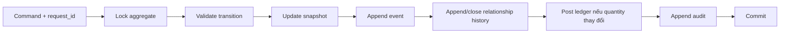

# 08. Kiến nghị chỉnh sửa bản Update

> Phạm vi đánh giá: `Update/WMS`  
> Ngày đánh giá: 2026-07-22  
> Mục tiêu: bảo đảm mọi thay đổi Thùng60, Pack360 và số lượng tồn đều có thể truy vết, đối soát và sử dụng an toàn cho Power BI.

## 1. Kết luận

Bản Update đã cải thiện pipeline receipt, sửa một phần outbound, không còn xóa cứng Pack360 khi cancel và bổ sung API trace/reconciliation. Tuy nhiên chưa đủ điều kiện xác nhận lịch sử vòng đời hoàn chỉnh.

Các thiếu sót nghiêm trọng nhất:

1. Pack360 chưa ghi event cho create/add/complete/cancel/release/detach/repack.
2. Không tạo `pack360_unit_history` khi thêm Thùng60.
3. Cancel/release không đóng `pack360_unit.is_current`.
4. Thùng60 không có event khi vào/ra Pack360.
5. Picking Pack360 vẫn dùng tên cột cũ.
6. Một số event pallet thiếu `request_id` bắt buộc.
7. Trace đơn hàng chỉ đọc trạng thái hiện tại.
8. Reconciliation chỉ tính trạng thái `AVAILABLE` nên có thể sinh chênh lệch giả.
9. API trace và reconciliation chưa có JWT/RBAC.

## 2. Nguyên tắc chỉnh sửa

Mỗi command thay đổi nghiệp vụ phải thực hiện nguyên tử:



- Không hard-delete aggregate nghiệp vụ.
- Không update/delete ledger đã post; sửa bằng reversal.
- Mỗi event phải có actor, request ID và chứng từ nguồn.
- Snapshot, event, membership history, ledger và audit phải cùng commit hoặc rollback.
- Tên cột và trạng thái phải lấy từ canonical schema/catalog.

## 3. Danh sách kiến nghị

### REC-P0-01 — Sửa tên cột Pack360 trong picking

**File:** `Update/WMS/backend/routes/picking.js`

Thay toàn bộ:

```text
pack_no  → pack360_id
qr_code  → pack360_qr
```

Không sử dụng `pack.product_code`, `pack.total_qty` nếu các cột này không tồn tại. Product và quantity của Pack360 phải lấy bằng cách tổng hợp các `pack360_unit` đang active với `tbl_thung60_kho`.

**Nghiệm thu:** scan được Pack360 bằng cả ID và QR; xác định đúng SKU/quantity; toàn bộ transaction rollback nếu scan không hợp lệ.

### REC-P0-02 — Sửa mô hình lịch sử thành viên Pack360

**File:** `Update/WMS/schema.sql`

Đổi `pack360_unit_history` thành mô hình interval:

```sql
CREATE TABLE pack360_unit_history (
    history_id BIGINT IDENTITY PRIMARY KEY,
    pack360_id NVARCHAR(50) NOT NULL,
    id_60 NVARCHAR(50) NOT NULL,
    added_at DATETIME2 NOT NULL,
    added_by NVARCHAR(50) NOT NULL,
    removed_at DATETIME2 NULL,
    removed_by NVARCHAR(50) NULL,
    add_event_id NVARCHAR(50) NOT NULL,
    remove_event_id NVARCHAR(50) NULL,
    reason NVARCHAR(255) NULL,
    request_id NVARCHAR(100) NOT NULL
);
```

Bổ sung filtered unique index để một Thùng60 chỉ có tối đa một membership Pack360 đang hoạt động.

**Nghiệm thu:** truy vấn được Pack360 của một thùng tại bất kỳ thời điểm nào; membership mới có `removed_at = NULL`.

### REC-P0-03 — Ghi lịch sử khi thêm Thùng60 vào Pack360

**File:** `Update/WMS/Stored_Procedures/02_Pack360_SPs.sql`

Trong `usp_Pack360_ScanUnit`, cùng transaction phải:

1. Lock Thùng60 và Pack360 bằng `UPDLOCK, HOLDLOCK`.
2. Insert/update snapshot membership.
3. Insert `pack360_unit_history`.
4. Insert `thung60_event` loại `PACK_INTO_360`.
5. Insert `pack360_event` loại `ADD_UNIT`.
6. Ghi audit và request log.

SP phải nhận `@request_id`, `@source_document_no`, `@device_id`.

### REC-P0-04 — Ghi đầy đủ vòng đời Pack360

Các event bắt buộc:

| Hoạt động | Pack event | Thùng60 event |
|---|---|---|
| Tạo pack | `CREATE_PACK` | Không bắt buộc |
| Thêm thùng | `ADD_UNIT` | `PACK_INTO_360` |
| Complete | `COMPLETE_PACK` | Có thể ghi `PACK_COMPLETED` nếu cần timeline unit |
| Cancel | `CANCEL_PACK` | `CANCEL_PACK_MEMBERSHIP` |
| Release | `RELEASE_PACK` | `RELEASE_FROM_360` |
| Detach | `DETACH_UNIT` | `DETACH_FROM_360` |
| Repack | `REPACK_FROM`/`REPACK_TO` | `REPACK_INTO_360` |
| Palletize | `PALLETIZE_PACK` | Không bắt buộc nếu truy qua pack |
| Depalletize | `DEPALLETIZE_PACK` | Không bắt buộc |
| Pick | `PICK_PACK` | Có thể bung event xuống unit theo policy |
| Stage | `STAGE_PACK` | Có thể bung event xuống unit |
| Ship | `SHIP_PACK` | Bắt buộc ledger theo từng Thùng60 |

Mỗi event Pack360 cần `old_status`, `new_status`, `source_document_no`, actor, request ID, reason/message.

### REC-P0-05 — Đóng membership khi cancel/release/detach

Trong cùng transaction:

```sql
UPDATE pack360_unit
SET is_current = 0
WHERE pack360_id = @pack360_id AND is_current = 1;

UPDATE pack360_unit_history
SET removed_at = SYSUTCDATETIME(),
    removed_by = @user_code,
    remove_event_id = @event_id,
    reason = @reason
WHERE pack360_id = @pack360_id AND removed_at IS NULL;
```

Không được để API trace báo membership active cho Pack360 `CANCELLED`, `RELEASED` hoặc `SHIPPED`.

### REC-P0-06 — Bổ sung `request_id` cho event pallet

**Files:**

- `Update/WMS/Stored_Procedures/10_UC06_Palletizing_SPs.sql`
- `Update/WMS/Stored_Procedures/11_UC06_1_Depalletizing_SPs.sql`

Mọi insert `thung60_event` phải truyền `request_id`. Các SP phải nhận request ID từ API; không tự tạo key mới cho mỗi lần retry.

**Nghiệm thu:** palletize, depalletize và transfer chạy được trên database dựng từ canonical schema; retry cùng request ID không tạo thao tác lần hai.

### REC-P0-07 — Bảo vệ API trace và reconciliation

**Files:**

- `Update/WMS/backend/routes/trace.js`
- `Update/WMS/backend/routes/reconciliation.js`

Áp dụng:

```js
router.use(verifyToken);
```

Phân quyền đề xuất:

- Trace unit/pack/document: kho, supervisor, auditor theo site.
- Trace order: bổ sung giới hạn customer/site.
- Reconciliation: `INVENTORY_CONTROLLER`, `ACCOUNTING`, `IT_ADMIN`.

Không trả raw database error ra client.

### REC-P1-01 — Mở rộng trace Thùng60

Endpoint unit timeline cần hợp nhất:

- Receipt/UC03 scan log.
- `thung60_event`.
- Split lineage nhiều cấp.
- Pack360 membership.
- Pallet membership.
- Pallet/location history.
- Delivery note barcode.
- Inventory ledger và transaction header.
- Audit log.

Kết quả nên là một danh sách timeline chuẩn hóa có `occurred_at`, `event_type`, `object`, `document`, `actor`, `before`, `after` và `request_id`, thay vì trả nhiều mảng rời.

### REC-P1-02 — Trace lịch sử đơn hàng

Endpoint hiện chỉ lọc `current_oem_order_no`. Cần bổ sung bảng/event ownership interval:

```text
id_60
order_no
batch_no
valid_from
valid_to
change_event_id
source_document_no
changed_by
request_id
```

Trace order phải trả cả thùng hiện tại, đã chuyển đơn, đã xuất, receipt/dispatch liên quan và ledger trong thời gian thuộc đơn.

### REC-P1-03 — Sửa reconciliation tồn kho

Không dùng riêng:

```sql
WHERE status = 'AVAILABLE'
```

Tạo status catalog:

```text
object_type
status_code
is_on_hand
is_available
is_allocated
is_terminal
```

Snapshot reconciliation phải tính mọi trạng thái `is_on_hand = 1`, gồm blocked, allocated, picked, staged, palletized và packed nếu hàng vẫn thuộc kho.

Kết quả đối soát cần theo:

- Transaction + product.
- Unit + product.
- Product + order + location + stock type.
- Snapshot so với ledger-derived balance.

### REC-P1-04 — Chuẩn hóa ledger Pack360 shipping

Khi ship Pack360:

- `item_ledger`: tổng theo product.
- `inventory_ledger`: một dòng cho mỗi Thùng60 active trong Pack360.
- Quantity của các dòng unit phải bằng quantity barcode/note theo policy.
- Tổng unit ledger phải bằng item ledger.
- Membership được đóng hoặc giữ immutable với trạng thái shipped theo quy tắc đã duyệt.

Không ghi mã Pack360 vào trường `inventory_ledger.id_60`.

### REC-P1-05 — Chống post trùng

Thêm unique/idempotency rule cho command và posting:

```text
request_id UNIQUE
transaction_type + document_no + posting_sequence UNIQUE
```

Retry phải trả kết quả lần trước, không tạo thêm transaction/event/ledger.

### REC-P1-06 — Chuẩn hóa timestamp

Sử dụng `DATETIME2` và thống nhất UTC trong database. API/Power BI chuyển sang `Asia/Ho_Chi_Minh` khi hiển thị. Event và ledger phải có timestamp đầy đủ, không chỉ `DATE`.

## 4. Thay đổi schema bổ sung

### `pack360_event`

Nên bổ sung:

```text
related_id_60
reason_code
device_id
metadata_json
schema_version
```

### `inventory_ledger`

Nên bổ sung:

```text
posted_at DATETIME2
unit_type
location_from
location_to
order_from
order_to
reversal_of_ledger_id
request_id
```

### `stock_transaction_book`

Nên bổ sung:

```text
document_type
status
request_id
reversal_of_transaction_id
posted_at DATETIME2
```

Ledger đã post phải append-only.

## 5. Migration và dữ liệu cũ

1. Tạo migration version mới, không sửa trực tiếp schema đã deploy.
2. Backup và kiểm tra orphan membership trước migration.
3. Cho phép `removed_at NULL`, sau đó backfill history từ `pack360_unit` hiện tại.
4. Với Pack360 đã release/cancel mà membership vẫn active, đóng history theo timestamp tốt nhất có thể và đánh dấu `BACKFILL_INFERRED`.
5. Backfill event chỉ khi có bằng chứng từ audit/document; không tự tạo lịch sử giả.
6. Chạy reconciliation trước và sau migration; lưu kết quả ký duyệt.

## 6. Bộ kiểm thử bắt buộc

| Test | Kết quả mong đợi |
|---|---|
| Create pack | Có header và `CREATE_PACK` |
| Add unit | Snapshot, active membership, history và hai event cùng commit |
| Add cùng unit đồng thời | Chỉ một request thành công |
| Retry cùng request ID | Không phát sinh dòng mới |
| Complete | Status và event đúng before/after |
| Cancel | Không xóa header; membership đóng; unit giải phóng; có event/audit |
| Release/detach | Pointer, current membership và history khớp nhau |
| Repack | Truy được pack cũ và pack mới |
| Palletize/depalletize | Không lỗi `request_id`; timeline đúng |
| Split outbound | Source + child + split history + events cùng commit |
| Ship Pack360 | Unit ledger bằng item ledger và delivery qty |
| Fault injection | Bất kỳ lỗi nào cũng rollback snapshot/event/history/ledger |
| Trace unit | Có receipt→pack→pallet→location→ship |
| Trace order | Có cả unit đã chuyển hoặc đã ship |
| Reconciliation | Không tạo variance giả bởi trạng thái on-hand |
| Unauthorized trace | Trả 401/403 |

## 7. Thứ tự triển khai

### Sprint 1 — Chặn lỗi dữ liệu

- REC-P0-01 đến REC-P0-07.
- Canonical migration và integration tests Pack360/pallet.

### Sprint 2 — Hoàn thiện trace và ledger

- REC-P1-01 đến REC-P1-05.
- Backfill có kiểm soát và reconciliation.

### Sprint 3 — BI readiness

- Timestamp/canonical reporting views.
- Timeline API hợp nhất.
- Power BI dùng nguồn đã reconciliation, không đọc trực tiếp bảng lỗi.

## 8. Tiêu chí đóng kiến nghị

Chỉ đóng khi:

1. Database sạch chạy được toàn bộ migration.
2. Tất cả SP/route compile và integration test thành công.
3. Không còn mutation Pack360/Thùng60 thiếu event hoặc membership history.
4. Unit ledger bằng item ledger cho mọi transaction post tồn.
5. Snapshot reconcile được với ledger theo status catalog.
6. Trace được theo Thùng60, Pack360, đơn hàng và chứng từ.
7. Retry không tạo dữ liệu trùng.
8. API trace/reconciliation có authentication, authorization và audit.

