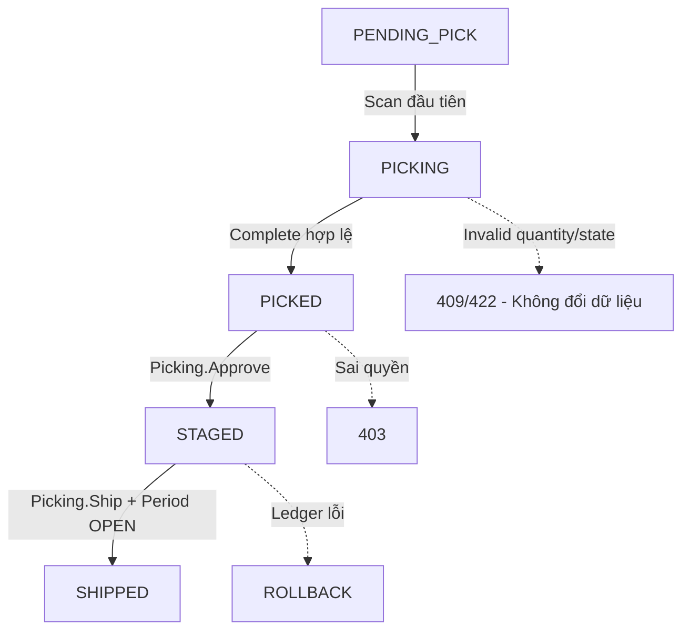
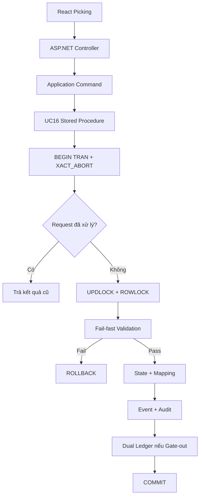
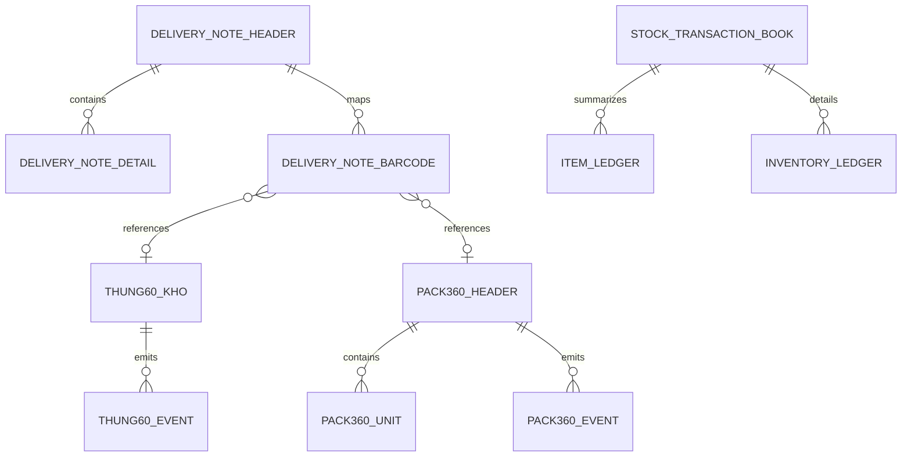

# Yêu cầu Fix UC16 Picking

## 0. Thông tin yêu cầu

| Thuộc tính | Nội dung |
|---|---|
| Mã yêu cầu | `FIX-UC16-2026-07-01` |
| Mức ưu tiên | P0 - Critical |
| Use Case | UC16 - Picking, Partial Split, Stage và Gate-out |
| Phạm vi | React, ASP.NET Core, SQL Server, tests và traceability |
| Backend Node.js | Chỉ dùng làm nguồn đối chiếu, không phải kiến trúc đích |
| Tài liệu nguồn | `02_Process_UseCase/UC16_Picking_Assessment_And_Update_Requirements.md` |
| Chiến lược | Vertical slice, database safety trước UI |

## 1. Business Logic cần chốt trước khi code

Người phụ trách nghiệp vụ phải xác nhận:

1. Có cho phép hoàn tất soạn khi thiếu hàng không?
2. Có cho phép over-picking không?
3. Trạng thái cuối dùng `SHIPPED` hay `DISPATCHED`?
4. Transaction type dùng `OUT_DISPATCH` hay `GOODS_ISSUE`?
5. Pack360 chứa nhiều product được scan như một unit hay phải chặn?
6. Số lượng UC16 có bắt buộc là số nguyên?
7. Stage có chuyển trạng thái unit sang `STAGED` hay chỉ chuyển trạng thái phiếu?

Mặc định an toàn nếu chưa có quyết định:

- Không cho over-picking.
- Không complete khi thiếu.
- Chặn Pack360 chứa nhiều product.
- Số lượng phải là số nguyên dương.
- Trạng thái cuối dùng `SHIPPED`.
- Transaction type dùng `OUT_DISPATCH`.

Không dùng mặc định này để thay thế phê duyệt nghiệp vụ trước production cutover.

## 2. Mục tiêu fix

- Danh sách và chi tiết Picking tải được từ ASP.NET Core.
- Scan, split, complete, stage và gate-out có contract thống nhất.
- Không còn request UC16 gọi port `3001`.
- Không thể scan cùng barcode cho hai phiếu.
- Không thể giả product, actor hoặc số lượng split từ frontend.
- Không thể post ledger hai lần.
- Gate-out ghi đủ event, audit và Dual Ledger trong một transaction.
- Permission được kiểm tra theo capability.

## 3. Phạm vi endpoint đích

| Method | Endpoint | Capability | Trạng thái hiện tại |
|---|---|---|---|
| GET | `/api/v1/picking/delivery-notes` | `Picking.Read` | Có |
| GET | `/api/v1/picking/delivery-notes/{id}` | `Picking.Read` | Có |
| GET | `/api/v1/picking/delivery-notes/{id}/lines/{productCode}/scans` | `Picking.Read` | Thiếu |
| GET | `/api/v1/picking/fifo-suggestions/{productCode}` | `Picking.Read` | Thiếu |
| GET | `/api/v1/picking/available-boxes/{productCode}` | `Picking.Read` | Thiếu |
| GET | `/api/v1/picking/truck-summary/{licensePlate}` | `Picking.Read` | Thiếu |
| POST | `/api/v1/picking/scan` | `Picking.Scan` | Thiếu |
| POST | `/api/v1/picking/split-box` | `Picking.Scan` | Thiếu |
| POST | `/api/v1/picking/complete` | `Picking.Manage` | Thiếu |
| POST | `/api/v1/picking/stage` | `Picking.Approve` | Có nhưng cần sửa |
| POST | `/api/v1/picking/gate-out` | `Picking.Ship` | Có nhưng chưa đủ |
| POST | `/api/v1/picking/trucks/{licensePlate}/complete` | `Picking.Manage` | Thiếu |
| POST | `/api/v1/picking/trucks/{licensePlate}/stage` | `Picking.Approve` | Thiếu |

Không duy trì đồng thời `/notes` và `/delivery-notes` nếu không có compatibility adapter có thời hạn xóa rõ ràng.

## 4. Programming Logic cần fix

### 4.1. Frontend

- Tạo `features/picking/api/pickingApi.js`.
- Chuyển `PickingScreen.jsx` và `ExportGateApprovalScreen.jsx` sang `pickingApi`.
- Xóa `authenticatedFetch`, URL port `3001` và identity lấy từ localStorage trong UC16.
- Chuẩn hóa response `{ status, message, data, errorCode, requestId, traceId }`.
- Không gọi `.json()` trên response đã được Axios parse.
- Không hiển thị demo data khi API lỗi.
- Chống double submit cho scan, split, complete, stage và gate-out.
- Dùng UUID ổn định làm `X-Request-Id`; retry cùng command phải giữ request ID cũ.
- Tách `PickingScreen.jsx` thành page, hooks và component nghiệp vụ.
- Route chi tiết phiếu phải chứa `deliveryNoteNo` để refresh được.

Route đề xuất:

```text
/picking
/picking/:deliveryNoteNo
/picking/:deliveryNoteNo/products/:productCode
/picking/gate
```

### 4.2. ASP.NET Core

- Controller chỉ bind request, gọi Application use case và map HTTP response.
- Không đặt SQL/Dapper transaction trực tiếp trong controller.
- Tạo các application command/query tương ứng với endpoint.
- Actor lấy từ `ICurrentUserService`.
- Request ID lấy từ middleware/header, không tự sinh bằng timestamp trong controller.
- Mỗi endpoint gắn policy cụ thể.
- Business conflict trả `409`; validation trả `400/422`; không trả mọi lỗi thành `500`.
- Không trả `Exception.Message` hoặc SQL detail cho client.

### 4.3. SQL Stored Procedure

Tạo hoặc chuẩn hóa:

```text
usp_WMS_UC16_GetDeliveryNotes
usp_WMS_UC16_GetDeliveryNoteDetail
usp_WMS_UC16_GetFifoSuggestions
usp_WMS_UC16_ScanBarcode
usp_WMS_UC16_SplitBox
usp_WMS_UC16_CompletePicking
usp_WMS_UC16_ApproveStage
usp_WMS_UC16_GateOut
```

Command procedure bắt buộc:

```sql
SET XACT_ABORT ON;
BEGIN TRY
    BEGIN TRAN;
    -- idempotency
    -- fail-fast validation
    -- UPDLOCK, ROWLOCK
    -- state/mapping/event/ledger/audit
    COMMIT;
END TRY
BEGIN CATCH
    IF @@TRANCOUNT > 0 ROLLBACK;
    THROW;
END CATCH;
```

## 5. Data Logic cần fix

### 5.1. CRUD Matrix

| Bảng | C | R | U | D | Yêu cầu |
|---|:---:|:---:|:---:|:---:|---|
| `delivery_note_header` | - | X | X | - | Conditional state transition |
| `delivery_note_detail` | - | X | - | - | Validate product và quantity |
| `delivery_note_barcode` | X | X | - | - | Unique active barcode |
| `tbl_thung60_kho` | X | X | X | - | Lock khi scan/split/ship |
| `pack360_header` | - | X | X | - | Lock và event đầy đủ |
| `pack360_unit` | - | X | - | - | Expand ledger khi ship |
| `thung60_split_history` | X | X | - | - | Pedigree |
| `thung60_event` | X | X | - | - | PICK/STAGE/SHIP/SPLIT |
| `pack360_event` | X | X | - | - | PICK/STAGE/SHIP |
| `stock_transaction_book` | X | X | - | - | Một header/post |
| `item_ledger` | X | X | - | - | Tổng hợp theo product |
| `inventory_ledger` | X | X | - | - | Chi tiết theo `id_60` |
| `audit_log` | X | X | - | - | Actor và command |
| `accounting_periods` | - | X | - | - | Chặn kỳ đóng |
| `processed_request` | X | X | - | - | Idempotency |

### 5.2. Migration bắt buộc

- Thêm unique constraint/index chống barcode active trùng.
- Thêm constraint/index cho request ID nếu chưa có.
- Thêm index cho:
  - `delivery_note_barcode(delivery_note_no, product_code)`.
  - `delivery_note_header(status, license_plate)`.
  - `tbl_thung60_kho(product_code, status, created_at)`.
  - `pack360_unit(pack360_id, is_current)`.
- Migration phải có kiểm tra dữ liệu trùng trước khi tạo unique index.
- Không tự động sửa/xóa dữ liệu trùng; xuất báo cáo để người dùng quyết định.

### 5.3. Quy tắc Scan

Trong cùng transaction:

1. Kiểm tra request ID.
2. Lock phiếu và barcode.
3. Kiểm tra trạng thái phiếu.
4. Xác định chính xác loại unit.
5. Kiểm tra product thuộc phiếu.
6. Kiểm tra expected product.
7. Tính required/picked/incoming.
8. Kiểm tra duplicate barcode.
9. Conditional update trạng thái.
10. Ghi mapping, event và audit.
11. Lưu idempotency result.

Không dùng aggregate `SUM` rồi kiểm tra `recordset.length` để xác định product tồn tại.

### 5.4. Quy tắc Split

- Product phải lấy từ thùng nguồn đã lock.
- Product nguồn phải thuộc phiếu.
- `splitQty` là số nguyên dương nếu business rule yêu cầu.
- `splitQty <= currentQty`.
- `pickedQty + splitQty <= requiredQty`.
- Không để thùng nguồn `AVAILABLE` với `currentQty = 0` nếu state model không cho phép.
- ID thùng ảo và split ID dùng UUID/sequence an toàn.
- Ghi parent/root pedigree, history, event, mapping và request ID trong một transaction.

### 5.5. Quy tắc Complete

- Phiếu phải ở `PENDING_PICK|PICKING`.
- Có ít nhất một barcode hợp lệ.
- Kiểm tra từng product theo business decision đã chốt.
- Dùng conditional update và trả `409` khi state đã thay đổi.

### 5.6. Quy tắc Stage

- Chỉ `Picking.Approve`.
- Phiếu phải `PICKED`.
- Ghi `approved_by`, `approved_at`, note và audit.
- Xử lý cả Thùng 60, thùng ảo và Pack360 theo state model đã chốt.

### 5.7. Quy tắc Gate-out và Dual Ledger

Gate-out phải:

1. Chỉ `Picking.Ship`.
2. Phiếu ở `STAGED`.
3. Kiểm tra biển số, tài xế, seal và checklist bắt buộc.
4. Kiểm tra kỳ kế toán `OPEN`.
5. Kiểm tra request/post chưa xử lý.
6. Lock phiếu và toàn bộ unit.
7. Ghi một `stock_transaction_book`.
8. Ghi `item_ledger` theo product.
9. Ghi `inventory_ledger` theo từng `id_60`.
10. Expand Pack360 qua `pack360_unit`.
11. Ghi `SHIP_60`, `SHIP_PACK` và audit.
12. Chuyển trạng thái phiếu và unit.
13. Commit toàn bộ hoặc rollback toàn bộ.

Invariant:

```text
SUM(item_ledger.quantity_change)
= SUM(inventory_ledger.quantity_change)
= -SUM(delivery_note_barcode.qty)
```

## 6. Security Requirements

| Capability | Actor |
|---|---|
| `Picking.Read` | Nhân viên kho, thủ kho, quản lý |
| `Picking.Scan` | Nhân viên kho được phân công |
| `Picking.Manage` | Nhân viên trưởng ca/thủ kho |
| `Picking.Approve` | Thủ kho |
| `Picking.Ship` | Bảo vệ cổng hoặc vai trò được ủy quyền |

Policy phải kiểm tra permission claim hoặc authorization handler tương đương. Không đăng ký policy chỉ bằng `RequireAuthenticatedUser()`.

## 7. Test bắt buộc

### 7.1. Unit/Application tests

- Validation request.
- Permission mapping.
- HTTP/error mapping.
- State transition.

### 7.2. Integration tests

- Load danh sách và chi tiết.
- Scan đúng barcode.
- Scan sai product.
- Product không thuộc phiếu.
- Barcode đã thuộc phiếu khác.
- Hai scanner cùng scan một barcode: chỉ một thành công.
- Replay cùng request ID: một tác động.
- Over-picking bị chặn.
- Complete khi thiếu/đủ theo rule đã chốt.
- Split sai product, qty âm, qty thập phân, qty vượt tồn.
- Split đồng thời trên một nguồn.
- Stage sai state và sai quyền.
- Gate-out sai quyền.
- Gate-out khi kỳ đóng.
- Gate-out Pack360.
- Lỗi khi ghi ledger gây rollback toàn bộ.
- Gate-out replay không post ledger lần hai.
- Ba lớp ledger cân bằng.

### 7.3. Frontend tests

- Loading, empty, success và error.
- `401`, `403`, `409`, `422`, `500`.
- Scan focus và double submit.
- Refresh route chi tiết.
- Không còn URL `3001`.
- Không còn demo fallback.

## 8. Mermaid Diagrams

### 8.1. Luồng trạng thái



### 8.2. Data Layer Architecture



### 8.3. Entity Relationship



## 9. Thứ tự triển khai

1. Chốt business decisions.
2. Viết migration report dữ liệu trùng.
3. Thêm constraints/index và idempotency.
4. Tạo Stored Procedure Scan.
5. Tạo Stored Procedure Split.
6. Tạo Complete và Stage.
7. Tạo Gate-out và Dual Ledger.
8. Port Application/API ASP.NET Core.
9. Viết integration tests backend.
10. Chuyển frontend sang `pickingApi`.
11. Viết frontend tests.
12. Chạy UAT và đối chiếu ledger.
13. Chỉ sau đó mới cutover khỏi Node.js.

## 10. Quality Gate

Frontend:

```text
npm run lint
npm run format:check
npm run test
npm run build
```

Backend:

```text
dotnet restore Wms.sln
dotnet format Wms.sln --verify-no-changes
dotnet build Wms.sln --no-restore --warnaserror
dotnet test Wms.sln --no-build --no-restore
```

SQL:

- Migration chạy thành công trên database test.
- Stored Procedure test pass.
- Không còn duplicate active barcode.
- Ledger reconciliation bằng 0.

## 11. Definition of Done

UC16 chỉ được đánh dấu `Verified` khi:

- Tất cả endpoint mục 3 tồn tại và có OpenAPI.
- Frontend không gọi Node.js/port `3001`.
- Không còn `authenticatedFetch` trong UC16.
- Không lấy actor từ request body/localStorage.
- Barcode uniqueness và idempotency được enforce tại DB.
- Scan/split/ship có locking và rollback.
- Stage/gate-out kiểm tra đúng capability.
- Gate-out kiểm tra kỳ kế toán.
- Dual Ledger và event đầy đủ cho Thùng 60, thùng ảo và Pack360.
- Test concurrency, replay, permission và rollback pass.
- Lint, format, build và toàn bộ test pass.
- UAT được thủ kho và bảo vệ xác nhận.

## 12. Chỉ dẫn cho AI

Đọc:

1. File này.
2. `02_Process_UseCase/UC16_Picking_Assessment_And_Update_Requirements.md`.
3. `02_Process_UseCase/UC16_Picking.md`.
4. Business rules, schema và Stored Procedure liên quan.

Bắt đầu bằng việc lập báo cáo business decision và truy vấn phát hiện duplicate barcode. Không tự xóa/sửa dữ liệu. Dừng báo cáo trước khi tạo migration hoặc thay đổi schema.
