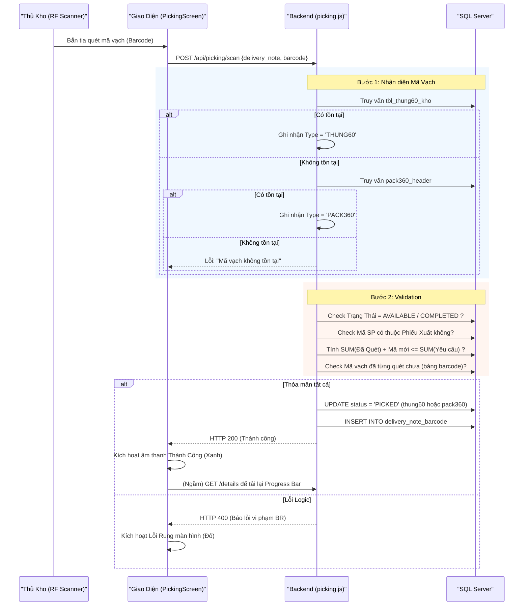
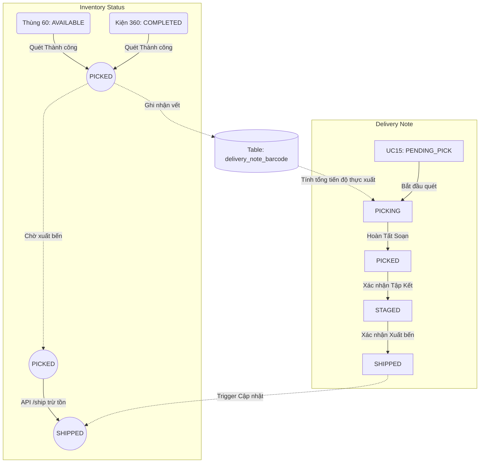
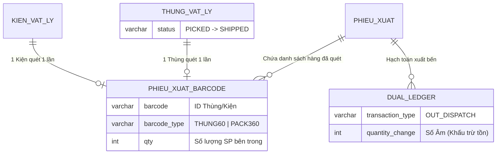

# Phân tích Thiết kế Logic UC16 - Soạn Hàng (Picking)

Tài liệu này hệ thống hóa các luồng nghiệp vụ, logic lập trình, và luồng dữ liệu cho phân hệ **Soạn Hàng (Picking - UC16)**. Module này chịu trách nhiệm chuyển hóa các Phiếu xuất từ trạng thái "Chờ soạn" (Ảo) thành "Hàng đã sẵn sàng để kiểm đếm" (Thực) thông qua việc quét mã vạch vật lý.

---

## 1. Business Logic (Logic Nghiệp Vụ)

**Mục tiêu cốt lõi:**
Đảm bảo hàng hóa vật lý lấy ra khỏi kho (bằng RF Scanner) hoàn toàn khớp với kế hoạch đã phân bổ (UC15), đồng thời quản lý toàn trình các khâu từ Soạn Hàng (Pick) -> Tập Kết ra bãi (Stage) -> Xác Nhận Xuất Bến (Ship).

Các quy tắc nghiệp vụ (Business Rules):

- `BR-UC16-01` **Nguyên tắc 1 kèm 1 (Tránh trùng lặp):** Một mã vạch vật lý (Thùng 60 hoặc Kiện 360) chỉ được phép quét và gán cho một Phiếu xuất duy nhất. Hệ thống phải chặn ngay lập tức nếu mã vạch này đã nằm trong một Phiếu xuất khác.
- `BR-UC16-02` **Ràng buộc Khả dụng (Availability):** Chỉ những thùng hàng mang trạng thái `AVAILABLE` (hoặc `ALLOCATED`) và Kiện 360 mang trạng thái `COMPLETED` (hoặc `ALLOCATED`) mới được phép mang đi Soạn hàng.
- `BR-UC16-03` **Tiến độ đồng bộ (Real-time Progress):** Người soạn hàng cần được biết họ đang nhặt bao nhiêu phần trăm (%) tiến độ của từng mặt hàng.
- `BR-UC16-04` **Ghi nhận thực xuất (Cho phép thừa/thiếu hàng):** Hệ thống không bắt buộc số lượng nhặt phải bằng 100% yêu cầu. Thủ kho có thể hoàn tất soạn hàng bất kỳ lúc nào, kể cả nhặt dư (vượt số lượng) hoặc nhặt thiếu, hệ thống sẽ lấy "Số lượng đã quét" làm "Số lượng thực xuất" để chuyển sang bước Tập kết.
- `BR-UC16-05` **Đồng bộ Tồn kho (Inventory Sync):** Việc khấu trừ tồn kho vật lý (chuyển trạng thái Thùng/Kiện thành `SHIPPED`) chỉ được kích hoạt ở khâu cuối cùng: Xác Nhận Xuất Bến.

Quy trình tương tác (Interaction Flow):
- **Bước 1 (Nhận Việc):** Nhân viên kho mở phân hệ Soạn Hàng & Xuất Bến (UC16) trên máy tính/máy tính bảng gắn xe nâng. Tab "Đang Soạn" hiển thị các phiếu PENDING_PICK/PICKING.
- **Bước 2 (Tiến hành Soạn):** Nhân viên kéo hàng ra khỏi kệ, bấm vào mã SP cần nhặt trên giao diện, dùng súng quét mã vạch (RF Scanner) quét liên tục vào các Thùng 60 hoặc Kiện 360 thực tế.
- **Bước 3 (Kiểm duyệt ngầm):** Hệ thống lập tức chạy fail-fast check (mã có khả dụng không? mã này có nằm trong yêu cầu không? mã này có đúng với sản phẩm đang chọn trên giao diện không?).
- **Bước 4 (Phản hồi UI & Ghi nhận):** Nếu hợp lệ, đẩy thanh Progress Bar lên và ghi lưu vết quét. Nếu sai, hệ thống báo đỏ, phát âm thanh cảnh báo lỗi để nhân viên bỏ lại thùng đó.
- **Bước 5 (Tích hợp Xuất lẻ UC17 - Nếu cần):** Nếu dòng sản phẩm yêu cầu số lượng lẻ không vừa chẵn thùng, nhân viên chọn tính năng "Lấy Lẻ (UC17)" ngay trong màn hình để tách 1 thùng vật lý hoặc thùng ảo có sẵn thành thùng ảo xuất kho theo đúng số lượng còn thiếu.
- **Bước 6 (Chốt Soạn Hàng - PICKED):** Nhân viên bấm "Hoàn Tất Soạn", Phiếu chuyển sang trạng thái PICKED và nằm ở Tab "Chờ Tập Kết".
- **Bước 7 (Tập Kết - STAGED):** Kéo hàng ra bãi chờ. Nhân viên mở phiếu ở Tab "Chờ Tập Kết" và bấm nút Xác Nhận Tập Kết. Phiếu chuyển thành STAGED.
- **Bước 8 (Xuất Bến - SHIPPED):** Xe tải đến lấy hàng. Nhân viên mở phiếu ở Tab "Chờ Xuất Bến" và bấm nút Xác Nhận Xuất Bến. Hoàn tất chu trình. Tồn kho chính thức được trừ.

---

## 2. Programming Logic (Logic Lập Trình)

### 2.1. Thiết kế Frontend (`PickingScreen.jsx`)
- **UI Thiết kế Tối giản cho Máy Quét:** 
  - Layout chia 2 cột. Bảng tiến độ luôn hiển thị để đối chiếu trực quan.
  - Ô Textbox nhập mã QR luôn được giữ trạng thái `Focus` (`barcodeInputRef.current.focus()`). Thủ kho không cần đụng chuột, chỉ cần bấm súng quét.
- **Xử lý State và Phản hồi:** 
  - Phản hồi thị giác: Cảnh báo Đỏ (Lỗi) và Xanh (Thành công). Bảng tiến độ đổi sang màu Xanh khi hoàn tất (100%) mặt hàng đó.
  - Gửi mã QR bất đồng bộ: Khi người dùng quét mã `POST /api/picking/scan` chạy ngầm. Sau khi Thành công, UI gọi lại `fetchDetails` ngầm để làm mới thanh Progress Bar mà không chớp trang.
  - **Modal Lấy Lẻ (UC17):** Giao diện quét mã hỗ trợ thao tác Tách Thùng ngay trực tiếp qua Modal, giúp luồng đi liền mạch.

### 2.2. Thiết kế Backend API (`backend/routes/picking.js`)
- **API 1: Quét Mã (`POST /scan`)**
  - **Xác định loại Mã vạch:** Tự xác định được đó là Thùng 60 hay Kiện 360 bằng cách truy vấn bảng `tbl_thung60_kho`, nếu không có tìm tiếp trong `pack360_header`.
  - **Validation 3 tầng:** 
    1. Kiểm tra tồn tại và khả dụng của mã (BR-UC16-02).
    2. Kiểm tra xem sản phẩm (`product_code`) có nằm trong `delivery_note_detail` hay không.
    3. Kiểm tra xem Tổng số lượng (Đã quét + Mã này) <= Yêu Cầu hay không.
  - **Cập nhật dữ liệu:** Chuyển `status` thành `PICKED`, ghi vết vào `delivery_note_barcode`.
- **API 2: Xác nhận Xuất Bến (`POST /ship`)**
  - **Validation Khóa Kỳ:** Kiểm tra `period_status` trong bảng `accounting_periods`. Nếu kỳ đã đóng (`CLOSED`), chặn luồng và trả về lỗi, nghiêm cấm ghi lùi ngày (Fail-fast).
  - **Thực thi (Transaction):** Trừ tồn kho vật lý (chuyển thành `SHIPPED`) và phân bổ Sổ cái Kép (Dual Ledger).

---

## 3. Data Logic (Thiết kế Dữ Liệu)

Thay vì sinh thêm cột trong các bảng tồn kho chính (`tbl_thung60_kho`), kiến trúc đã tách một bảng mapping riêng biệt (`delivery_note_barcode`) để hệ thống giữ được hiệu năng và tính quy chuẩn (Normalization).

**Bảng `delivery_note_barcode`**
- `delivery_note_no`: Liên kết với `delivery_note_header`.
- `barcode`: ID của thùng 60 hoặc Kiện 360.
- `barcode_type`: Định danh loại hàng (`THUNG60` | `PACK360`).
- `qty`: Lưu lại lượng hàng mà mã vạch này chứa để tính tổng dễ dàng (ví dụ: quét 1 kiện 360 = 360 sp).
- `scanned_at`, `scanned_by`: Truy vết nhân viên kho nào đã thực hiện.

### 3.1. Ma trận phân quyền CRUD

Luồng thao tác Soạn hàng tác động đến nhiều bảng dữ liệu khác nhau, phân định quyền hạn theo Ma trận CRUD (Create - Read - Update - Delete):

| Bảng dữ liệu | Create | Read | Update | Delete | Ý nghĩa nghiệp vụ trong UC16 |
| --- | :---: | :---: | :---: | :---: | --- |
| `delivery_note_header` | - | X | X | - | **Read:** Tải danh sách các phiếu xuất.<br>**Update:** Thay đổi trạng thái Phiếu (`PENDING_PICK` &rarr; `PICKING` &rarr; `PICKED` &rarr; `STAGED` &rarr; `SHIPPED`). |
| `delivery_note_detail` | - | X | - | - | **Read:** Lấy thông tin mặt hàng, số lượng yêu cầu để tính tiến độ % hiển thị lên UI. |
| `delivery_note_barcode` | X | X | - | - | **Create:** Ghi lưu vết mỗi khi máy quét RF bắn thành công một Thùng/Kiện.<br>**Read:** Dùng để tính tổng số lượng `picked_qty` cho từng dòng hàng. |
| `tbl_thung60_kho` | - | X | X | - | **Read:** Kiểm tra tính khả dụng (`AVAILABLE`).<br>**Update:** Khóa thùng (`PICKED`) khi quét. Trừ tồn kho vĩnh viễn (`SHIPPED`) khi xe xuất bến. |
| `pack360_header` | - | X | X | - | **Read:** Kiểm tra tính khả dụng (`COMPLETED`).<br>**Update:** Khóa kiện (`PICKED`) khi quét. Trừ tồn kho vĩnh viễn (`SHIPPED`) khi xe xuất bến. |
| `stock_transaction_book` | X | - | - | - | **Create:** Ghi nhận mã giao dịch chủ (Master ledger entry) cho phiếu xuất bến, móc nối các sổ cái con (`item_ledger`, `inventory_ledger`). |
| `item_ledger` | X | - | - | - | **Create:** Ghi nhận Sổ cái tổng hợp, báo cáo tổng số lượng của từng Product Code đã thực xuất bến. |
| `inventory_ledger` | X | - | - | - | **Create:** Ghi nhận Sổ cái chi tiết, báo cáo từng kiện/thùng vật lý (ID) đã thực xuất bến. |
| `thung60_event` | X | - | - | - | **Create:** Ghi nhận lịch sử vòng đời Thùng 60 (các sự kiện `PICK_60`, `STAGE_60`, `SHIP_60`). |
| `pack360_event` | X | - | - | - | **Create:** Ghi nhận lịch sử vòng đời Kiện 360 (các sự kiện `PICK_PACK`, `STAGE_PACK`, `SHIP_PACK`). |

### 3.2. Sơ đồ Hạch toán Sổ Cái (Ledger Mapping)

Khâu Xác nhận Xuất bến (`/ship`) là khâu nhạy cảm nhất liên quan đến kế toán kho. Hệ thống hạch toán theo mô hình Sổ cái phân cấp (Master-Detail) để đảm bảo toàn vẹn dữ liệu. Dưới đây là chi tiết giá trị (Values) được ghi nhận khi 1 Phiếu xuất được chốt:

#### A. Sổ cái Giao dịch (Master: `stock_transaction_book`)
Đóng vai trò là Header của giao dịch hạch toán, nhóm tất cả các thay đổi tồn kho của Phiếu xuất này về một mã số duy nhất.
- `transaction_id`: Sinh tự động mã định danh duy nhất (UUID).
- `transaction_type`: **`OUT_DISPATCH`** (Định danh loại nghiệp vụ Xuất kho).
- `document_no`: Mã Phiếu xuất (`delivery_note_no`).
- `partner_unit`: Mã khách hàng (`customer_code` từ bảng `delivery_note_header`).
- `partner_name`: Tên khách hàng (Join từ bảng `tbl_dm_khachhang`).
- `posted_by`: Tên/ID tài khoản Thủ kho thực hiện thao tác.
- `posted_at`: Thời điểm hệ thống ghi nhận (Timestamp).

#### B. Sổ cái Tổng hợp (Detail 1: `item_ledger`)
Lưu trữ mức độ thay đổi tồn kho (Stock level) gom nhóm theo từng Mã sản phẩm (`product_code`). Phục vụ việc lên Báo cáo Xuất-Nhập-Tồn (XNT) tổng quan.
- `transaction_id`: Map với UUID của `stock_transaction_book` ở trên.
- `source_document_no`: Mã Phiếu xuất.
- `product_code`: Mã sản phẩm.
- `total_quantity_change`: **Số Âm (`-SUM(qty)`)** (Khấu trừ tổng số lượng thực xuất của từng Mã SP).
- `ledger_date`: Ngày hạch toán (GETDATE()).

#### C. Sổ cái Chi tiết Vật lý (Detail 2: `inventory_ledger`)
Lưu trữ mức độ biến động tồn kho chi tiết đến từng Mã vạch (Thùng 60 / Kiện 360). Phục vụ truy vết định vị lô/date và vòng đời sản phẩm.
- `transaction_id`: Map với UUID của `stock_transaction_book`.
- `source_document_no`: Mã Phiếu xuất.
- `id_60`: Lưu trữ mã vạch cụ thể (`barcode`) của Thùng/Kiện bị xuất đi.
- `product_code`: Mã sản phẩm chứa trong mã vạch đó.
- `quantity_change`: **Số Âm (`-qty`)** (Khấu trừ chính xác số lượng chứa trong mã vạch này).
- `old_stock_type`: **`AVAILABLE`** (Trạng thái tồn kho trước giao dịch).
- `new_stock_type`: **`SHIPPED`** (Trạng thái tồn kho sau giao dịch).

> **Nguyên tắc hạch toán:** Toàn bộ quá trình tạo 3 Record sổ cái này và câu lệnh Cập nhật trạng thái `tbl_thung60_kho`/`pack360_header` thành `SHIPPED` được bọc trong cùng một Database Transaction. Quy tắc **All-or-Nothing** đảm bảo nếu có bất kỳ lỗi rớt mạng hay xung đột dữ liệu nào xảy ra, toàn bộ dữ liệu Sổ cái sẽ bị Rollback để tránh lệch Tồn kho.

### 3.3. Data Layer Architecture (Kiến trúc Tầng Dữ liệu)
Để đảm bảo tính nhất quán của số liệu kho trong môi trường đa người dùng (Multi-user concurrency), Data Layer được thiết kế theo các nguyên tắc sau:
- **Cơ chế Transaction (ACID):** Mọi thao tác làm thay đổi dữ liệu (như Quét mã `Scan`, hay Xác nhận xuất bến `Ship`) đều được bọc trong các `SQL Transaction` (`BEGIN TRAN ... COMMIT`). Điều này đảm bảo tính Toàn vẹn (Atomicity) - nếu có lỗi xảy ra ở bất kỳ bước ghi nào, toàn bộ giao dịch sẽ bị `ROLLBACK`, ngăn chặn hoàn toàn tình trạng sai lệch tồn kho.
- **Cơ chế Khóa (Locking & Concurrency Control):** Khi xử lý trạng thái mã vạch vật lý, hệ thống áp dụng cơ chế khóa mức dòng (ví dụ: `SELECT ... WITH (UPDLOCK, ROWLOCK)`) để ngăn chặn tình trạng Race Condition (hai nhân viên cùng quét một mã vạch tại cùng một thời điểm phần nghìn giây).
- **Nguyên lý Fail-fast Validation:** Hệ thống luôn ưu tiên thực thi các truy vấn `SELECT` để kiểm tra Validation (Trạng thái khả dụng, Số lượng vượt mức, và **Trạng thái Kỳ kế toán chưa bị Khóa**) ngay từ đầu. Chỉ khi vượt qua tất cả các chốt chặn Logic, các lệnh `INSERT`/`UPDATE` nặng về I/O mới được kích hoạt, giúp giảm tải tối đa cho Database Engine.
- **Tách bạch (Decoupling):** Dữ liệu động của Phiếu Xuất (tiến độ quét) được lưu ở bảng trung gian `delivery_note_barcode` chứ không can thiệp vào bảng Tồn kho gốc cho đến khi thực sự xuất bến.

---

## 4. Biểu Đồ Thiết Kế (Diagrams)

### 4.1. Sequence Diagram (Biểu đồ Tuần Tự của Máy Quét)



### 4.2. Data Flow Diagram (Luồng Trạng Thái - State Machine)



### 4.3. Cấu trúc Phân tầng Dữ liệu (Data Layer Architecture)
Biểu đồ mô phỏng cách hệ thống ghi nhận dữ liệu trong quá trình Soạn hàng và đặc biệt là khi Xác nhận xuất bến (Ship).

```mermaid
graph TD
    A[(Giao diện Soạn Hàng UC16)] -->|POST /scan| API1[Backend API - Scan]
    A -->|POST /ship| API2[Backend API - Ship]
    
    API1 -->|Thêm mã vạch vào Phiếu| B[(delivery_note_barcode)]
    API1 -->|Khóa mã vạch (PICKED)| C[(tbl_thung60_kho / pack360_header)]
    
    API2 -->|1. Xác minh Kỳ kế toán (OPEN)| DB[DB Transaction - Ship]
    DB -->|2. Trừ tồn kho vật lý (SHIPPED)| C
    DB -->|3. Phân bổ Sổ Cái Giao Dịch| D[(stock_transaction_book)]
    DB -->|4. Phân bổ Sổ Cái Chi Tiết| E[(inventory_ledger)]
    DB -->|5. Phân bổ Sổ Cái Tổng Hợp| F[(item_ledger)]
    DB -->|6. Ghi Sự Kiện Xuất Bến| G[(thung60_event / pack360_event)]
```

### 4.4. Entity Relationship & Logic Trạng thái (State Logic Map)
Sơ đồ quan hệ thực thể mô tả trạng thái và cấu trúc liên kết khi thao tác Soạn Hàng (Quét mã) và Hạch toán Xuất bến diễn ra.



---
*Tài liệu này bám sát thiết kế tối ưu hệ thống WMS và đảm bảo tiến trình nghiệp vụ thực tế dưới kho.*
